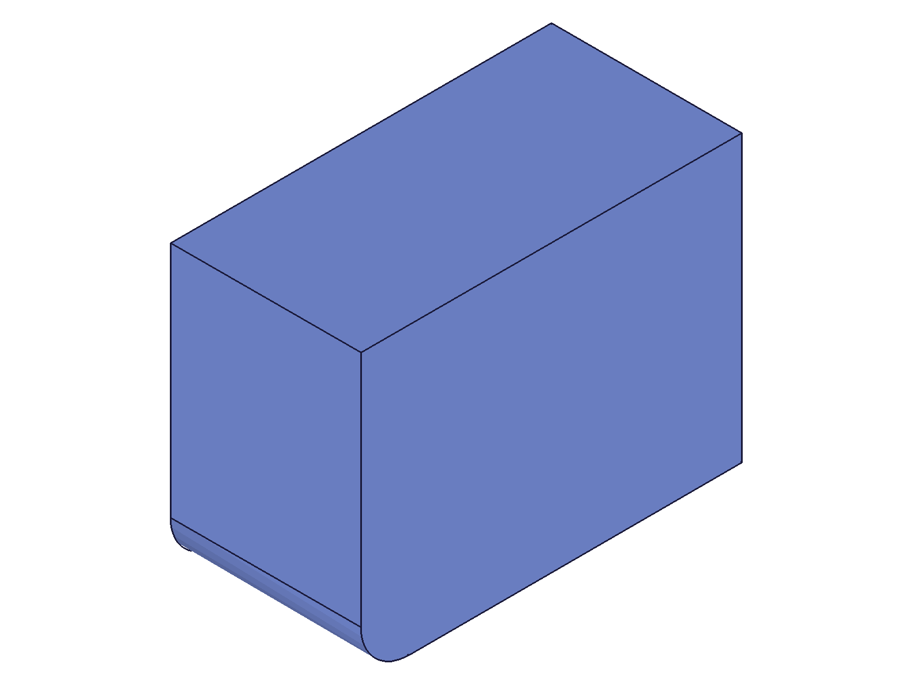

# Training: part.getGeometryPositions

**Date:** 2026-04-21

## Goal

Testing `v1.part.getGeometryPositions` — the inverse of `getGeometryIds`. Given brep element IDs, returns identifying positions.

**Methods to cover:**

- `getGeometryPositions` — basic call with edge IDs (lines)
- `getGeometryPositions` — with vertex IDs (points)
- `getGeometryPositions` — with face IDs (planes)
- `getGeometryPositions` — with curved geometry (arcs, circles, cylindrical/spherical faces)
- `getGeometryPositions` — multiple elements in one call
- `getGeometryPositions` — invalid/nonexistent IDs
- Round-trip: `getGeometryIds` → `getGeometryPositions` → `getGeometryIds` (verify positions can re-find elements)

**Questions:**

- What exactly does `positions` contain for each element type?
- How many positions are returned for faces (all adjacent edge midpoints)?
- Does it require `recalc()` first?
- What happens with invalid element IDs?
- Can the returned positions be fed directly back into `getGeometryIds` to re-find the same element?
- Does the `elems` param need the part ID or can it take any brep ID?
- What about elements from different geometry types in the same batch?

---

## 01 — basic line edges

Script: `scripts/01-basic-line-edges.mjs` — ✅ Works. Found 3 box edges via `getGeometryIds`, then queried `getGeometryPositions`.

|  |
|---|

**Data:** Each line edge returns exactly 1 position — its midpoint. Positions are `{x,y,z}` objects (not arrays).
- Edge 102 (front-left vertical, found via `[0,0,20]`): returns `{x:0, y:0, z:20}` — same midpoint
- Edge 98 (front-bottom horizontal, found via `[40,0,0]`): returns `{x:40, y:0, z:0}`
- Edge 99 (right-bottom horizontal, found via `[80,30,0]`): returns `{x:80, y:30, z:0}`

**Learned:** For straight edges, `getGeometryPositions` returns the midpoint as a single `{x,y,z}` object. The returned positions exactly match the positions used to find them via `getGeometryIds`.
**📌 LLM doc:** Lines return 1 position — the edge midpoint.

## 02 — vertices

Script: `scripts/02-vertices.mjs` — ✅ As documented. Vertices return their exact coordinate.

**Data:** Each vertex returns 1 position — the vertex coordinate itself.
- Vertex 90 (origin `[0,0,0]`): returns `{x:0, y:0, z:0}`
- Vertex 96 (far corner `[80,60,40]`): returns `{x:80, y:60, z:40}`
- Vertex 91 (`[80,0,0]`): returns `{x:80, y:0, z:0}`

**📌 LLM doc:** Vertices return 1 position — the vertex point itself.

## 03 — plane faces

Script: `scripts/03-plane-faces.mjs` — ✅ Works. Plane faces return midpoints of all adjacent edges.

**Data:** Each plane face returns 4 positions (for a rectangular face on a box = 4 edges):
- Front face (Y=0, 80×40): `[{0,0,20}, {40,0,0}, {80,0,20}, {40,0,40}]` — these are the midpoints of the left, bottom, right, and top edges of the face.
- Top face (Z=40): `[{0,30,40}, {40,0,40}, {80,30,40}, {40,60,40}]`
- Left face (X=0): `[{0,0,20}, {0,30,40}, {0,60,20}, {0,30,0}]`

Verified: each returned position is the midpoint of an adjacent edge. For a box face with 4 bounding edges, 4 midpoints are returned.

**📌 LLM doc:** Plane faces return N positions where N = number of adjacent edges. For box faces: 4 midpoints.

## 04 — cylinder circles (fixed)

Script: `scripts/04-cylinder-circles-fixed.mjs` — ✅ Circles work. Cylindrical face lookup via `getGeometryIds` failed (separate issue).

**Data:** Cylinder `diameter: 40` (radius 20), height 50. Circle edges return 1 position — the arc midpoint at angle π (diametrically opposite the seam):
- Bottom circle (76): `{x:-20, y:~0, z:0}` — midpoint at (-radius, 0, 0)
- Top circle (77): `{x:-20, y:~0, z:50}` — midpoint at (-radius, 0, height)

Note: original script 04 used `radius: 20` but `part.cylinder` takes `diameter`, so default diameter=100 was used (radius=50). Fixed version uses `diameter: 40`.

**📌 LLM doc:** Circles return 1 position — the midpoint of the circular arc (at angle π from the seam, i.e., (-radius, 0, z) for Z-axis circles).

## 05 — round-trip (buggy indexing)

Script: `scripts/05-round-trip.mjs` — ⚠️ Partial success. Lines and points round-tripped correctly. Plane failed due to a bug in my indexing: with 4 elements [line1, line2, point, plane], I read `result[2]` as the plane but it was the point (index 3 was the plane).

**Learned:** Results are ordered by input, so careful indexing is critical when mixing types. The plane round-trip failure was my error, not an API issue (confirmed in script 08).

## 06 — invalid IDs

Script: `scripts/06-invalid-ids.mjs` — ✅ Clear error behavior documented.

**Data:**
- Invalid ID (9999): `result: null`, maxLevel 51, error: "An element of parameter 'elems' has an invalid id!"
- Part ID as elem: `result: null`, maxLevel 51, error: "wrong id type! Provide only following id types: ['edge-line','edge-arc','edge-circle','vertex','face-plane','face-cylindrical','face-conical','face-spherical','edge-nurbs','face-nurbs']"
- Feature (box) ID as elem: same error as part ID
- Empty array: `result: []`, maxLevel 31 — clean success, no error
- Mix valid + invalid: `result: null`, maxLevel 51 — **entire call fails**, valid elements not returned

**📌 LLM doc:** Invalid IDs fail the entire call (result: null). Only brep element IDs accepted (not part/feature IDs). Empty array succeeds. Error message lists all accepted ID types.

## 07 — circle verify

Script: `scripts/07-circle-verify.mjs` — ✅ Confirmed circle midpoint formula.

**Data:** Cylinder `diameter: 40` (radius 20): bottom circle at `{-20, ~0, 0}`, top at `{-20, ~0, 50}`. Matches expected midpoint at (-radius, 0, z).

## 08 — plane roundtrip debug

Script: `scripts/08-plane-roundtrip-debug.mjs` — ✅ Plane round-trip works perfectly.

**Data:** Front face (id 111) returns 4 edge midpoints. Re-querying `getGeometryIds` with these positions:
- All 4 positions → finds face 111 ✓
- First 2 positions → finds face 111 ✓
- Just 1 position → finds face 111 ✓
- Same positions as `lines` → finds 4 distinct edge IDs [102, 98, 103, 106] ✓

**📌 LLM doc:** Face edge midpoints can be fed back to `getGeometryIds` with `planes: [{ positions: [...] }]` to re-find the same face. Even a single edge midpoint suffices for flat faces.

## 09 — sphere (getGeometryIds failure)

Script: `scripts/09-sphere-cone.mjs` — ❌ All `getGeometryIds` lookups failed for the sphere (circles, spheres, points all returned `[]`). This is a `getGeometryIds` issue (wrong positions for sphere geometry), not a `getGeometryPositions` issue. Could not test `getGeometryPositions` with sphere elements.

## 10 — fillet arcs (getGeometryIds failure)

Script: `scripts/10-fillet-arcs.mjs` — ❌ Arc and cylindrical face lookups via `getGeometryIds` failed at position `[5,0,20]`. Fillet arc positions are hard to predict. Used `getBrepGeometryByIndex` in script 13 as workaround.

## 11 — pre-recalc behavior

Script: `scripts/11-pre-recalc.mjs` — ✅ Works both pre and post recalc.

**Data:** Same edge (front-bottom horizontal at midpoint `{40,0,0}`):
- Pre-recalc: ID=67, positions `[{x:40,y:0,z:0}]` ✓
- Post-recalc: ID=98, positions `[{x:40,y:0,z:0}]` ✓
- IDs differ (67 ≠ 98) but positions are identical.

**📌 LLM doc:** `getGeometryPositions` works without `recalc()`. Returns correct positions for both preliminary and final brep IDs. However, preliminary IDs differ from post-recalc IDs.

## 12 — mixed types

Script: `scripts/12-mixed-types.mjs` — ✅ Mixed element types in a single call work perfectly.

**Data:** 6 elements (2 lines, 2 points, 2 planes) queried in one call:
- Lines return 1 position each (edge midpoints)
- Points return 1 position each (vertex coordinates)
- Planes return 4 positions each (edge midpoints)
- **Output order matches input order** — verified: `[102, 98, 90, 96, 111, 115]` in and out

**📌 LLM doc:** Mixed brep element types work in a single call. Output order preserved — result[i] corresponds to elems[i].

## 13 — fillet arcs via brep index

Script: `scripts/13-arcs-via-brep-index.mjs` — ✅ Arc positions work.

**Data:** Fillet (radius 10) on front-left vertical edge of 80×60×40 box. Found 2 arcs via `getBrepGeometryByIndex`:
- Arc 170 (bottom fillet arc): `{x:2.929, y:2.929, z:0}`
- Arc 172 (top fillet arc): `{x:2.929, y:2.929, z:40}`

The value 2.929 = radius × (1 - cos(45°)) = 10 × 0.2929. This is the midpoint of the quarter-circle fillet arc, which starts at (10,0,z) and ends at (0,10,z), with center at (10,10,z).

|  |
|---|

**📌 LLM doc:** Arc edges return 1 position — the arc midpoint. For fillet arcs, this is the midpoint of the quarter-circle at 45° from start.

## 14 — correct round-trip

Script: `scripts/14-correct-roundtrip.mjs` — ✅ All three element types round-trip correctly.

**Data:**
- Line 102 → positions `[{0,0,20}]` → `getGeometryIds(lines: [{pos:[0,0,20]}])` → 102 ✓
- Point 90 → positions `[{0,0,0}]` → `getGeometryIds(points: [{pos:[0,0,0]}])` → 90 ✓
- Plane 111 → positions `[{0,0,20},{40,0,0},{80,0,20},{40,0,40}]` → `getGeometryIds(planes: [{positions:...}])` → 111 ✓

**📌 LLM doc:** Round-trip `getGeometryIds → getGeometryPositions → getGeometryIds` produces the same IDs for lines, points, and planes.

## 15 — cylindrical face

Script: `scripts/15-cylindrical-face.mjs` — ✅ Cylindrical face positions documented.

**Data:** Cylinder `diameter: 40`, height 50. 3 faces found via `getBrepGeometryByIndex`:
- Face 73 (bottom flat): 1 position `{-20, ~0, 0}` — midpoint of bottom circle (only adjacent edge)
- Face 72 (cylindrical surface): 3 positions `[{20,0,25}, {-20,~0,0}, {-20,~0,50}]` — midpoints of seam line (20,0,25), bottom circle (-20,0,0), top circle (-20,0,50)
- Face 74 (top flat): 1 position `{-20, ~0, 50}` — midpoint of top circle

**📌 LLM doc:** Cylindrical faces return 3 positions (seam line midpoint + 2 circle midpoints). Flat end-cap faces return 1 position (circle midpoint). Number of positions = number of adjacent edges.

## 16 — duplicate IDs

Script: `scripts/16-duplicate-ids.mjs` — ✅ Duplicates handled cleanly.

**Data:** Same edge ID passed twice → 2 entries returned, both identical `{id: 98, positions: [{x:40,y:0,z:0}]}`. No error.

**📌 LLM doc:** Duplicate IDs in `elems` are not deduplicated — each occurrence produces its own entry in the result array.

## 17 — cone faces

Script: `scripts/17-cone-faces.mjs` — ✅ Cone face positions follow same pattern as cylinder.

**Data:** Cone with `diameter1: 60, diameter2: 20, height: 50`. 3 faces + 2 circle edges:
- Bottom face (73): 1 position `{-25, ~0, 0}` — bottom circle midpoint (note: -25, not -30, suggesting actual diameter is ~50)
- Conical face (72): 3 positions — seam line midpoint `{12.525, 0, 25}`, bottom circle midpoint `{-25, ~0, 0}`, top circle midpoint `{-0.05, ~0, 50}`
- Top face (74): 1 position `{-0.05, ~0, 50}` — top circle midpoint (near-zero radius, suggesting ~0.1 diameter)
- Bottom circle (76): 1 position `{-25, ~0, 0}`
- Top circle (77): 1 position `{-0.05, ~0, 50}`

Cone dimensions don't match my parameters exactly (may be `part.cone` default behavior), but the pattern is identical to cylinder: curved face → 3 positions (seam + 2 circles), flat faces → 1 position.

## 18 — multi-body

Script: `scripts/18-multi-body.mjs` — ✅ Cross-body queries work.

**Data:** Box + cylinder in same part. Queried 1 box edge + 1 cylinder circle in single call:
- Box edge 119: `{x:40, y:60, z:0}` (back-bottom edge midpoint)
- Cylinder circle 141: `{x:-20, y:~0, z:50}` (top circle midpoint)

**📌 LLM doc:** Elements from different bodies in the same part can be queried in a single call.
