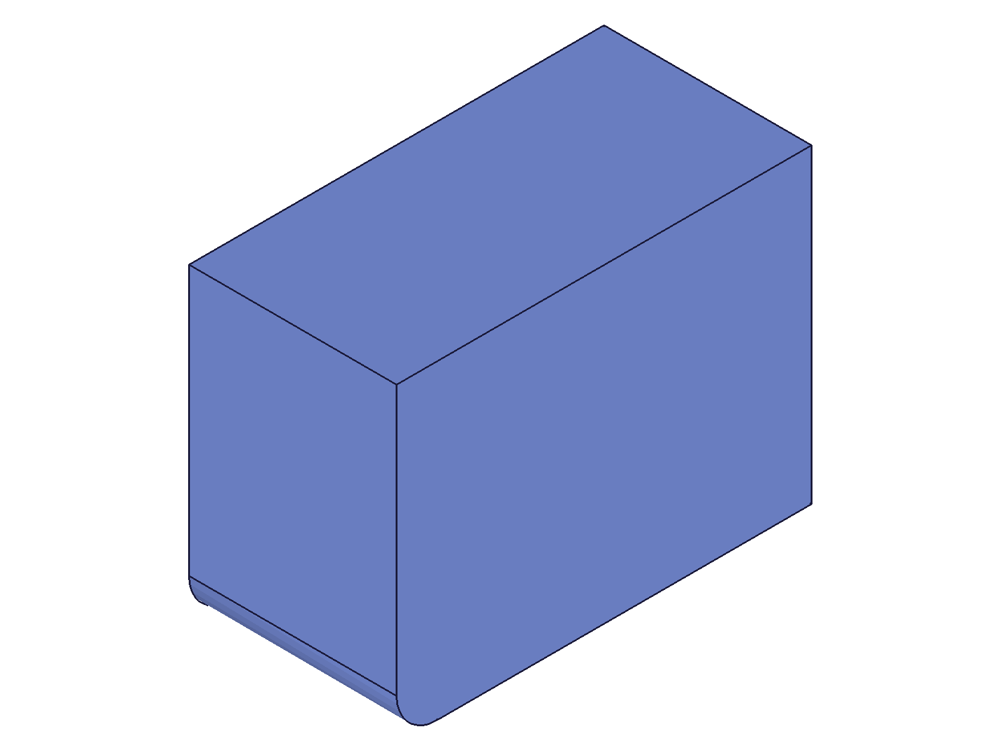

# Training: part.getBrepGeometryIndex

**Date:** 2026-04-21

## Goal

Testing `v1.part.getBrepGeometryIndex` — returns the index of a brep element within its brep container (points, lines, arcs, NURBS curves, faces indexed separately).

**Methods to cover:**

- `getBrepGeometryIndex` — basic usage with edge IDs
- `getBrepGeometryIndex` — with face IDs
- `getBrepGeometryIndex` — with circle/arc IDs
- `getBrepGeometryIndex` — with vertex (point) IDs
- `getBrepGeometryIndex` — `solidIndex` parameter for multi-solid features
- `getBrepGeometryIndex` — using feature ID vs part ID as `id` param

**Questions:**

- What index values are returned for edges of a simple box?
- Are indices 0-based or 1-based?
- Do indices remain stable across recalc?
- What happens with invalid geomId?
- Does `id` accept part ID, feature ID, or solid ID?
- How does `solidIndex` work with multi-solid features?
- Round-trip: can we go getBrepGeometryIndex → getBrepGeometryByIndex and recover the same ID?

---

## 01 — basic edge indexing

Script: `scripts/01-basic-edge-index.mjs` — ✅ 4 box edges indexed successfully.

|  |
|---|

**Data:** Four edges queried: id 102 → index 4, id 103 → index 5, id 98 → index 0, id 106 → index 8. All maxLevel=31 (info). See `files/01-basic-edge-index-edge-indices.json`.

**Learned:** Indices are 0-based. Each edge gets a unique index. maxLevel=31 on success.
**📌 LLM doc:** Indices are 0-based, success returns maxLevel=31.

## 02 — all edges, faces, and vertices

Script: `scripts/02-all-edges-and-faces.mjs` — ✅ All 12 edges, 6 faces, and 8 vertices indexed.

**Data:** (see `files/02-all-edges-and-faces-all-indices.json`)
- Edge indices: [0,2,3,1,8,10,11,9,4,5,7,6] — 12 unique values covering 0–11
- Face indices: [1,3,4,2,0,5] — 6 unique values covering 0–5
- Vertex indices: [0,1,3,2,4,5,7,6] ��� 8 unique values covering 0–7

**Learned:** Each geometry type (lines, planes/faces, points/vertices) has its own independent index space. A box has exactly 12 line indices (0–11), 6 face indices (0–5), and 8 point indices (0–7). Indices are contiguous within each type.
**📌 LLM doc:** Types have independent index spaces. Box: lines 0–11, faces 0–5, points 0–7.

## 03 — round-trip verification

Script: `scripts/03-round-trip.mjs` — ✅ Perfect round-trip for edges and faces.

**Data:** (see `files/03-round-trip-round-trips.json`)
- edge 102 → index 4 → getBrepGeometryByIndex(lineIndex=4) → 102 ✓
- edge 98 → index 0 → getBrepGeometryByIndex(lineIndex=0) �� 98 ✓
- face 111 → index 1 → getBrepGeometryByIndex(faceIndex=1) → 111 ✓

**Learned:** Round-trip `getBrepGeometryIndex` → `getBrepGeometryByIndex` recovers the exact same ID. Must use correct type param: `lineIndex` for edges, `faceIndex` for faces.
**📌 LLM doc:** Round-trip works — use matching type param (lineIndex, faceIndex, arcIndex, pointIndex).

## 04 — id parameter types

Script: `scripts/04-id-types.mjs` — Feature ID works, part ID fails.

**Data:** (see `files/04-id-types-id-type-tests.json`)
- Feature ID (boxId): index 4, maxLevel 31 ✓
- Part ID: null, maxLevel 51 ❌ — error "Not a brep!"
- Invalid geomId (99999): null, maxLevel 51 — warning "ToId() didn't get existing or valid id" + error "Not a brep!"
- Part ID as geomId: null, maxLevel 51 — error "Brep geometry 4 does not currently exist"

**Learned:** The `id` param must be a **feature ID** (e.g., the ID returned from `part.box`), NOT a part ID. The docs say "id of a solid or a feature containing a solid" — part ID is neither. Invalid geomId returns null with maxLevel 51.
**📌 LLM doc:** `id` must be feature ID, not part ID. Invalid geomId → null + maxLevel 51.

## 05 — cylinder geometry indexing

Script: `scripts/05-cylinder-circles.mjs` — ✅ Circles and plane faces indexed.

|  |
|---|

**Data:** (see `files/05-cylinder-circles-cylinder-indices.json`)
- Circle 0 (id 76, bottom) → index 0
- Circle 1 (id 77, top) → index 1
- Plane face 0 (id 73, bottom) → face index 0
- Plane face 1 (id 74, top) → face index 2
- Seam line at [30,0,25] and cylindrical face lookup both returned empty — those positions didn't match geometry

**Learned:** Circles (internally arcs in brep) are indexed in the arc category. The cylinder has 2 arcs (indices 0,1), at least 3 faces (plane indices 0,2 → the cylindrical face is probably index 1). Seam line lookups can fail at certain positions.
**📌 LLM doc:** Circular edges are indexed in the arc index space. Cylindrical face has its own face index.

## 07 — cross-body returns -1

Script: `scripts/07-cross-body-minus1.mjs` — Cross-body returns -1 with no error.

**Data:** (see `files/07-cross-body-minus1-cross-body-tests.json`)
- box1_edge → box1: index 4, maxLevel 31 ✓
- box1_edge → box2: **index -1**, maxLevel 31 — NOT an error!
- box2 edges couldn't be found (separate issue — invalid `xOrigin` param)

**Learned:** When `geomId` doesn't belong to the feature specified by `id`, the API returns **-1** with maxLevel=31 (info, not error). This is a membership check — -1 means "this element is not in this brep container."
**📌 LLM doc:** Returns -1 (not error) when geomId is not in the specified feature's brep. Useful as a membership test.

## 09 — pre-recalc behavior and index stability

Script: `scripts/09-pre-recalc.mjs` — ✅ Indices stable across recalc.

**Data:** (see `files/09-pre-recalc-pre-recalc-test.json`)
- Pre-recalc: edge id 71 → index 4
- Post-recalc: edge id 102 → index 4
- IDs changed (71 → 102), but **index stayed the same (4)**
- Stale pre-recalc ID after recalc: null, maxLevel 51 (error "Not a brep!" — preliminary ID is invalid post-recalc)

**Learned:** Indices are topology-stable across recalc. The same geometric edge keeps the same index regardless of ID reassignment. However, stale pre-recalc IDs become invalid after recalc.
**���� LLM doc:** Indices are stable across recalc — only IDs change, not positions. Stale pre-recalc IDs fail post-recalc.

## 10 — fillet arc indexing

Script: `scripts/10-fillet-arc-find.mjs` — ✅ Arc edges from fillet indexed and round-tripped.

|  |
|---|

**Data:** (see `files/10-fillet-arc-find-fillet-arc-indices.json`)
- Bottom fillet arc (id 170) → arc index 0
- Top fillet arc (id 172) → arc index 1
- Round-trip: arcIndex 0 → id 170 ✓, arcIndex 1 → id 172 ✓
- Fillet also created new straight edges (171, 173) found at [8,0,20] and [0,8,20]

**Learned:** Arc edges from fillets are indexed in the arc index space. Round-trip with `getBrepGeometryByIndex({ arcIndex })` works perfectly. The fillet feature owns these new brep elements.

## 14 — solidIndex edge cases

Script: `scripts/14-solidIndex-simple.mjs` — ✅ solidIndex behavior clarified.

**Data:** (see `files/14-solidIndex-simple-solidindex-simple.json`)
- solidIndex=0: index 4, maxLevel 31 ✓
- solidIndex=1: null, maxLevel 51 — error "Index 1 ausserhalb des Arraybereichs" (out of array range)
- solidIndex omitted: index 4, maxLevel 31 (defaults to 0) ✓
- solidIndex=-1: null, maxLevel 51

**Learned:** `solidIndex` defaults to 0. Out-of-range values (including negative) produce maxLevel 51 errors. Error message is in German: "ausserhalb des Arraybereichs" = "outside array range." For single-solid features, only solidIndex=0 is valid.
**📌 LLM doc:** solidIndex defaults to 0. Out-of-range → error. Only relevant for multi-solid features (e.g., boolean with keepTools).

---

## Coverage Checklist

- [x] API called successfully (scripts 01, 02, 03)
- [x] Every required parameter tested (id: scripts 04; geomId: scripts 01–10)
- [x] Key optional parameter tested (solidIndex: script 14)
- [x] No enum values to test (N/A)
- [x] No update/delete method (query-only API)
- [x] Realistic usage: round-trip with getBrepGeometryByIndex (scripts 03, 10)
- [x] Behavioral claims verified with data + visual evidence

**Gap:** Could not test solidIndex with actual multi-solid feature (boolean keepTools) because post-union geometry lookups failed. The solidIndex behavior with multiple solids per feature remains untested — documented as such.
