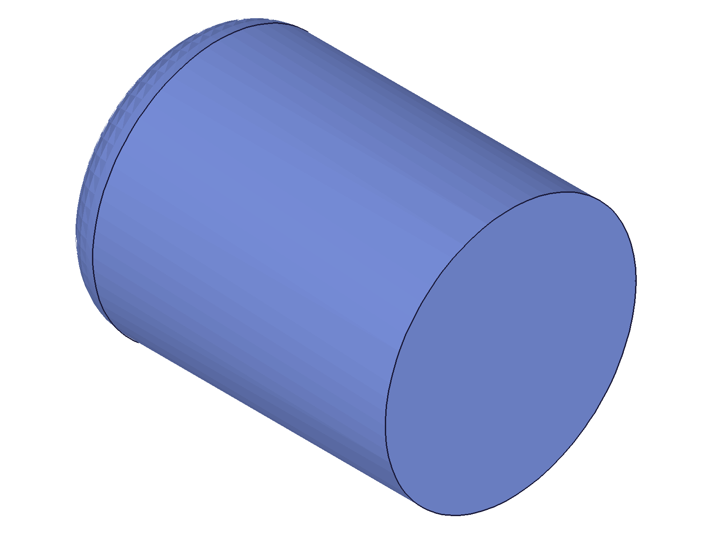
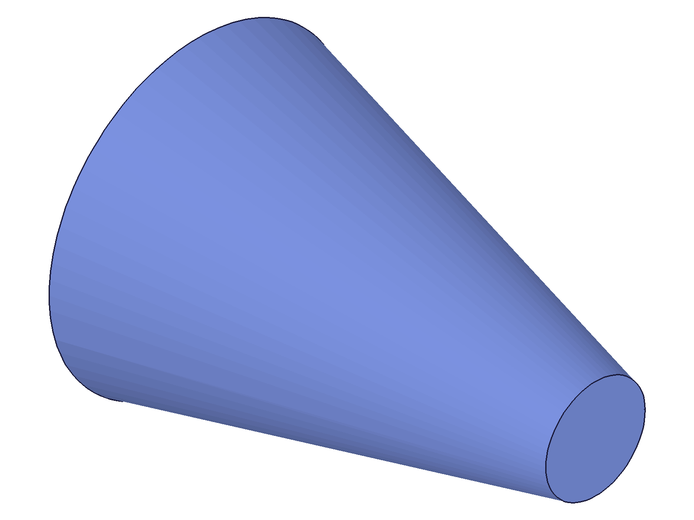
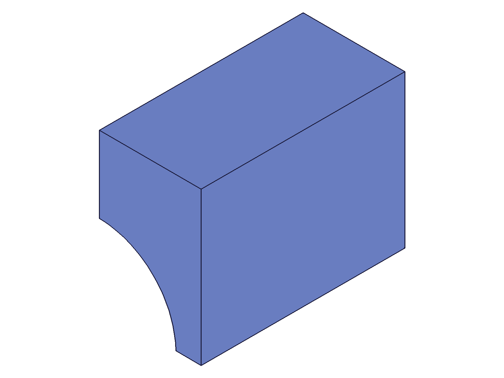
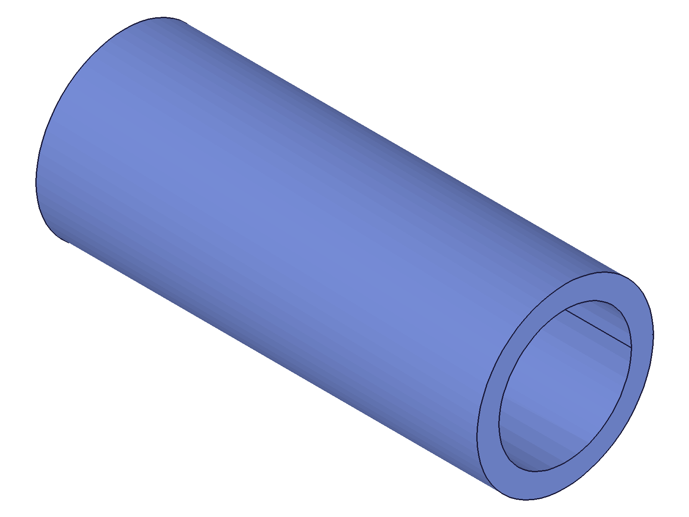

# Training: part.getBrepGeometryByIndex

**Date:** 2026-04-21

## Goal

Testing `v1.part.getBrepGeometryByIndex` — returns a brep element ID given a 0-based index within its type category. The inverse of `getBrepGeometryIndex`.

**Methods to cover:**

- `getBrepGeometryByIndex` — `lineIndex` (straight edges of a box)
- `getBrepGeometryByIndex` — `faceIndex` (faces of a box)
- `getBrepGeometryByIndex` — `pointIndex` (vertices of a box)
- `getBrepGeometryByIndex` — `arcIndex` (circular edges of a cylinder/fillet)
- `getBrepGeometryByIndex` — `nurbsCurveIndex` (if testable — e.g., from a fillet or spline)
- `getBrepGeometryByIndex` — `solidIndex` for multi-solid features
- `getBrepGeometryByIndex` — `id` param: feature ID vs part ID
- Error cases: out-of-range index, wrong type param, negative index, multiple index params at once

**Questions:**

- Does calling with out-of-range index return VOID/null or an error?
- What happens if you pass multiple index params (e.g., lineIndex AND faceIndex)?
- Does `id` accept part IDs or only feature IDs?
- Can we enumerate all brep elements by iterating indices 0..N?
- Does solidIndex work with multi-solid features?
- Does a NURBS curve index exist on any standard geometry?
- Round-trip: getBrepGeometryByIndex → getBrepGeometryIndex → same index?

---

## 01 — basic line index enumeration

Script: `scripts/01-basic-line-index.mjs` — ✅ All 12 box edges enumerated by lineIndex 0–11.

|  |
|---|

**Data:** lineIndex 0–11 all return valid IDs (e.g., 98, 101, 99, ...) with maxLevel=31. lineIndex 12+ returns null with maxLevel=51. See `files/01-basic-line-index-line-indices.json`.

**Learned:** Indices are 0-based and contiguous. Out-of-range returns null + maxLevel=51. A box has exactly 12 line indices.
**📌 LLM doc:** Indices 0-based, contiguous. Out-of-range → null + maxLevel 51.

## 02 — faces and points

Script: `scripts/02-faces-and-points.mjs` — ✅ 6 faces (0–5) and 8 points (0–7) enumerated.

**Data:** faceIndex 0–5 return IDs (110, 111, 114, 112, 113, 115). pointIndex 0–7 return IDs (90, 91, 93, 92, 94, 95, 97, 96). Index beyond range → null + maxLevel=51. See `files/02-faces-and-points-faces-and-points.json`.

**Learned:** Each type has independent index space. Box topology: 12 lines, 6 faces, 8 points — matches Euler formula (V-E+F=2).

## 03 — cylinder arcs

Script: `scripts/03-cylinder-arcs.mjs` — ✅ Cylinder brep: 2 arcs, 3 faces, 1 seam line.

|  |
|---|

**Data:** arcIndex 0→76, 1→77. faceIndex 0→73, 1→72, 2→74. lineIndex 0→75 (seam line). See `files/03-cylinder-arcs-cylinder-brep.json`.

**Learned:** Circular edges go in the arcIndex space. Cylinder has 1 seam line (the generator along the surface), 2 circular edges (top/bottom), and 3 faces (top cap, cylindrical surface, bottom cap).
**📌 LLM doc:** Use arcIndex for circular edges. Cylinder: 2 arcs, 3 faces, 1 seam line.

## 04 — id parameter types

Script: `scripts/04-id-param-types.mjs` — Feature ID works, part ID fails with different error than `getBrepGeometryIndex`.

**Data:** (see `files/04-id-param-types-id-types.json`)
- Feature ID (boxId): result=98, maxLevel=31 ✓
- Part ID: null, maxLevel=51 — error "Index 0 ausserhalb des Arraybereichs" (index out of array range)
- Invalid ID (99999): null, maxLevel=51 — "CCVM::callsf: objId not found"

**Learned:** The `id` param must be a **feature ID**, not a part ID. Unlike `getBrepGeometryIndex` which gives "Not a brep!" for part IDs, `getBrepGeometryByIndex` gives "Index ausserhalb des Arraybereichs" — suggesting the part object has an empty array that the index falls outside of.
**📌 LLM doc:** `id` must be feature ID. Part ID → "Index 0 ausserhalb des Arraybereichs".

## 05 — error cases

Script: `scripts/05-error-cases.mjs` — All 6 error scenarios documented.

**Data:** (see `files/05-error-cases-error-cases.json`)
- **Negative index (-1):** null, maxLevel=51 — C++ conversion warning: "conversion from 'size_t' to 'int', possible loss of data"
- **Huge index (9999):** null, maxLevel=51 — "Line element indexed as 9999 does not exist."
- **No index param:** null, maxLevel=51 — "Only one geometry index parameter should be specified."
- **Multiple index params (lineIndex + faceIndex):** null, maxLevel=51 — "Only one geometry index parameter should be specified."
- **arcIndex on box (no arcs):** null, maxLevel=51 — "Arc/Circle element indexed as 0 does not exist."
- **nurbsCurveIndex on box (no NURBS):** null, maxLevel=51 — "Nurbs curve element indexed as 0 does not exist."

**Learned:** Exactly ONE index param required — zero or more than one gives the same "Only one geometry index parameter should be specified" error. Out-of-range gives type-specific messages ("Line element...", "Arc/Circle element...", "Nurbs curve element..."). Negative indices hit C++ type conversion issues.
**📌 LLM doc:** Exactly one index param required. Error messages are type-specific and descriptive. Negative indices → C++ warning.

## 06 — round-trip verification

Script: `scripts/06-round-trip.mjs` — ✅ Perfect round-trip for all 26 elements (12 lines, 6 faces, 8 points).

**Data:** Every element: getBrepGeometryByIndex(index) → id → getBrepGeometryIndex(id) → same index. All 26 match. See `files/06-round-trip-round-trips.json`.

**Learned:** The two APIs are exact inverses. Round-trip is lossless for all element types.
**📌 LLM doc:** Perfect round-trip with `getBrepGeometryIndex`. Use matching type param.

## 07 — solidIndex parameter

Script: `scripts/07-solidindex.mjs` — ✅ solidIndex=0 works, out-of-range fails.

**Data:** (see `files/07-solidindex-solidindex-tests.json`)
- solidIndex=0: result=98, maxLevel=31 ✓
- solidIndex=1: null, maxLevel=51 — "Index 1 ausserhalb des Arraybereichs"
- solidIndex=-1: null, maxLevel=51 — C++ size_t conversion warning

**Learned:** Defaults to 0. Out-of-range produces German error. Negative values hit same C++ type conversion as negative index params.
**📌 LLM doc:** solidIndex defaults to 0. Only relevant for multi-solid features.

## 08 — pre/post recalc behavior

Script: `scripts/08-pre-recalc.mjs` — ✅ Works both pre- and post-recalc, IDs differ.

**Data:** (see `files/08-pre-recalc-pre-post-recalc.json`)
- Pre-recalc: lineIndex=0 → id 67, faceIndex=0 → id 79
- Post-recalc: lineIndex=0 → id 98, faceIndex=0 → id 110
- Same index returns a valid element in both states, but IDs differ (preliminary vs final)

**Learned:** The API works pre-recalc (returns preliminary IDs) and post-recalc (returns final IDs). Same index, different IDs. Indices are topology-stable — they refer to the same geometric element regardless of recalc state.
**📌 LLM doc:** Works pre- and post-recalc. Pre-recalc IDs are preliminary (different numeric values).

## 09 — enumerate all elements

Script: `scripts/09-enumerate-all.mjs` — ✅ Iteration pattern: increment index from 0 until null.

**Data:** Box enumeration: 12 lines, 6 faces, 8 points, 0 arcs, 0 nurbs. See `files/09-enumerate-all-enumerated-all.json`.

|  |
|---|

**Learned:** You can discover all brep elements by iterating each type from index 0 until the API returns null. This is the canonical enumeration pattern.
**📌 LLM doc:** Enumerate by iterating from 0 until null. Works for all 5 types.

## 10 — fillet feature brep

Script: `scripts/10-fillet-arcs.mjs` — ✅ Fillet on box edge: 2 arcs, 7 faces, 13 lines, 10 points.

|  |
|---|

**Data:** Fillet feature (id 120): arcIndex 0→170, 1→172. Faces 0–6. Lines 0–12. Points 0–9. No NURBS. See `files/10-fillet-arcs-fillet-brep.json`.

**Learned:** Fillet arc edges are in the arcIndex space. The fillet feature owns the full post-fillet brep — all elements are accessible through it, not just the new fillet surfaces. No NURBS even on fillet features.

## 11 — sphere brep

Script: `scripts/11-sphere-nurbs.mjs` — ✅ Sphere: 1 arc, 1 face, 2 points, 0 NURBS.

|  |
|---|

**Data:** arcIndex 0 (seam), faceIndex 0 (spherical surface), pointIndex 0–1 (poles). See `files/11-sphere-nurbs-sphere-brep.json`.

**Learned:** Sphere has minimal brep: 1 circular seam, 1 face, 2 pole vertices.

## 12b — fillet on cylinder

Script: `scripts/12b-nurbs-fillet-fixed.mjs` — ✅ Used `getBrepGeometryByIndex` to get cylinder arc IDs for filleting.

|  |
|---|

**Data:** Fillet on cylinder bottom arc: 1 line, 4 arcs, 4 faces, 3 points. No NURBS. See `files/12b-nurbs-fillet-fixed-cyl-fillet-brep.json`.

**Learned:** `getBrepGeometryByIndex` is useful as an alternative to `getGeometryIds` for obtaining brep element IDs — especially for circular/arc edges where position-based lookup can be unreliable. The original script 12 failed to find the arc via position-based `getGeometryIds`, but script 12b succeeded by using `getBrepGeometryByIndex({ arcIndex: 0 })` directly.
**📌 LLM doc:** Practical advantage: index-based lookup is deterministic. Position-based arc lookups via `getGeometryIds` can fail.

## 13 — cone brep

Script: `scripts/13-cone-geometry.mjs` — ✅ Cone: 1 line, 2 arcs, 3 faces, 2 points.

|  |
|---|

**Data:** See `files/13-cone-geometry-cone-brep.json`. Similar topology to cylinder.

## 14 — boolean subtraction (sphere from box)

Script: `scripts/14-nurbs-boolean.mjs` — ✅ Boolean result: 12 lines, 3 arcs, 7 faces, 10 points, 0 NURBS.

|  |
|---|

**Data:** See `files/14-nurbs-boolean-bool-brep.json`. Sphere-plane intersections produce arcs, not NURBS.

## 16 — two cylinders boolean

Script: `scripts/16-nurbs-two-cylinders.mjs` — ✅ Cylinder-cylinder subtraction: 2 lines, 4 arcs, 4 faces, 4 points, 0 NURBS.

|  |
|---|

**Data:** See `files/16-nurbs-two-cylinders-cyl-bool-brep.json`. Even cylinder-cylinder intersections produce arcs, not NURBS.

**Learned:** NURBS curves could not be generated with any tested geometry (box, cylinder, sphere, cone, fillets, booleans). The kernel appears to represent all intersection curves as arcs for analytic surface combinations. `nurbsCurveIndex` is supported by the API but may only appear with free-form (spline) surfaces.
**📌 LLM doc:** nurbsCurveIndex exists but NURBS edges not produced by standard primitives/booleans. Likely requires spline/loft geometry.

## 17 — full pipeline integration

Script: `scripts/17-full-pipeline.mjs` — ✅ Complete round-trip: index → ID → position → ID → index.

**Data:** (see `files/17-full-pipeline-full-pipeline.json`)
- lineIndex=4 → id=102 → position=(0,0,20) → getGeometryIds → id=102 → getBrepGeometryIndex → index=4 ✓
- faceIndex=2 → id=114 → 4 edge midpoint positions → getGeometryIds → id=114 ✓

**Learned:** IDs from `getBrepGeometryByIndex` are fully compatible with `getGeometryPositions` (via `elems`) and `getGeometryIds`. The complete pipeline works: index-based access → position serialization → position-based re-identification → index verification.
**📌 LLM doc:** Full pipeline interop: getBrepGeometryByIndex → getGeometryPositions → getGeometryIds. IDs are standard brep element IDs.

---

## Coverage Checklist

- [x] API called successfully (scripts 01, 02, 03, 06, 09)
- [x] Every required parameter tested (id: script 04; all 5 index types: scripts 01-03, 05)
- [x] Key optional parameter tested (solidIndex: script 07)
- [x] No enum values to test (N/A)
- [x] No update/delete method (query-only API)
- [x] Realistic usage: full pipeline integration (script 17), fillet workflow (script 12b)
- [x] Behavioral claims verified with data + visual evidence

**Gap:** nurbsCurveIndex supported by the API but never produced a result with any tested geometry. Documented as such — likely requires spline/loft geometry.
