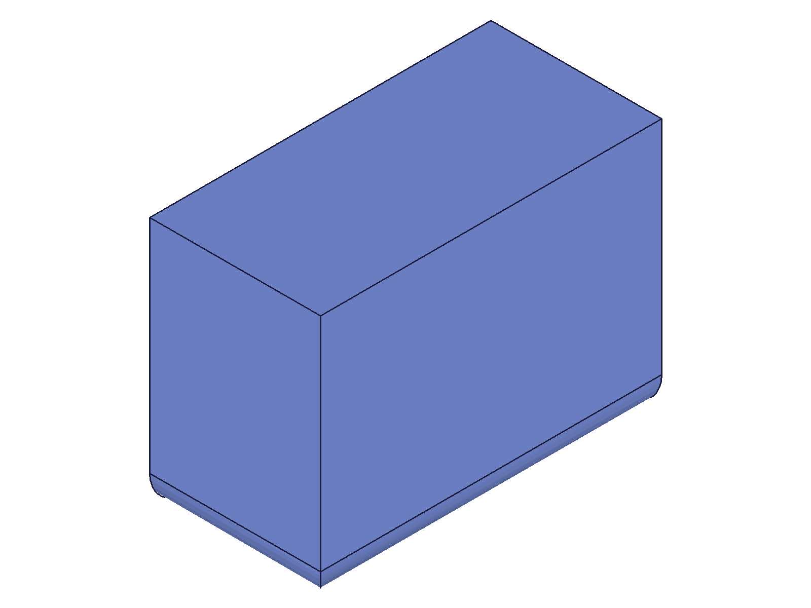
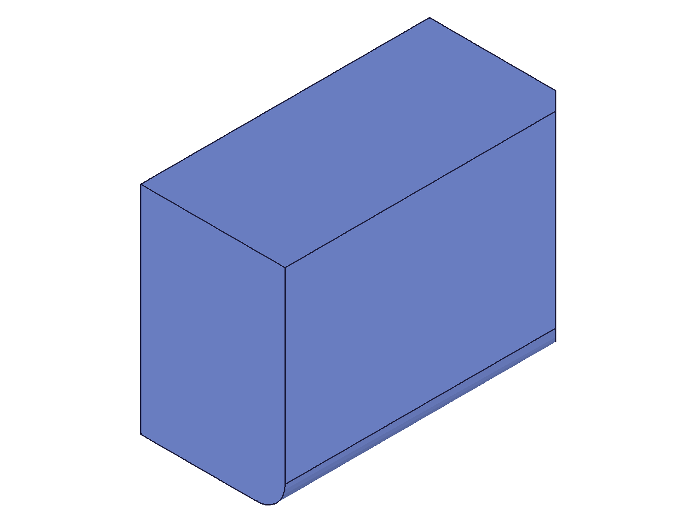
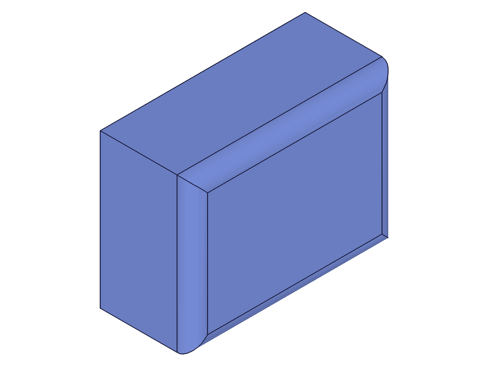
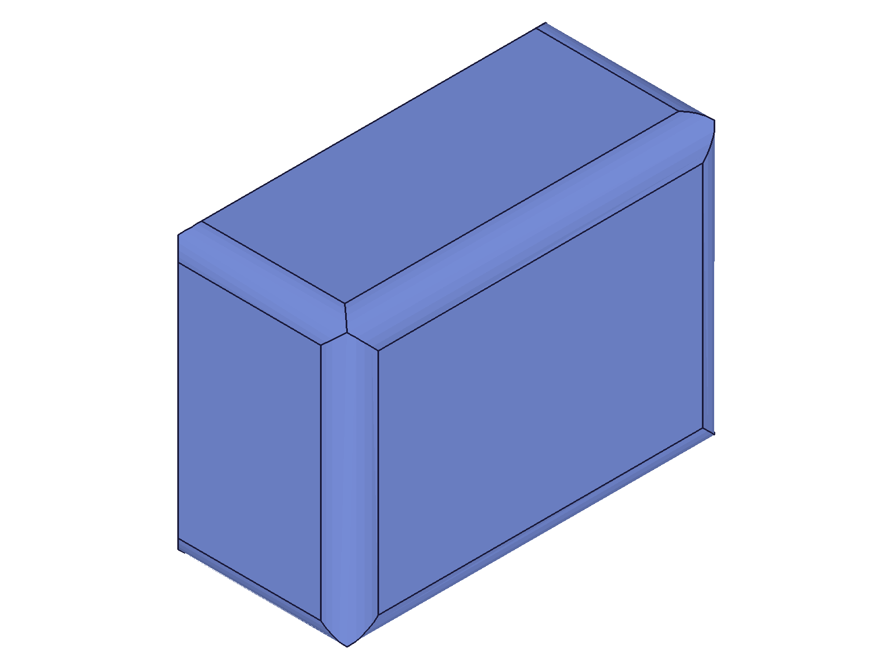
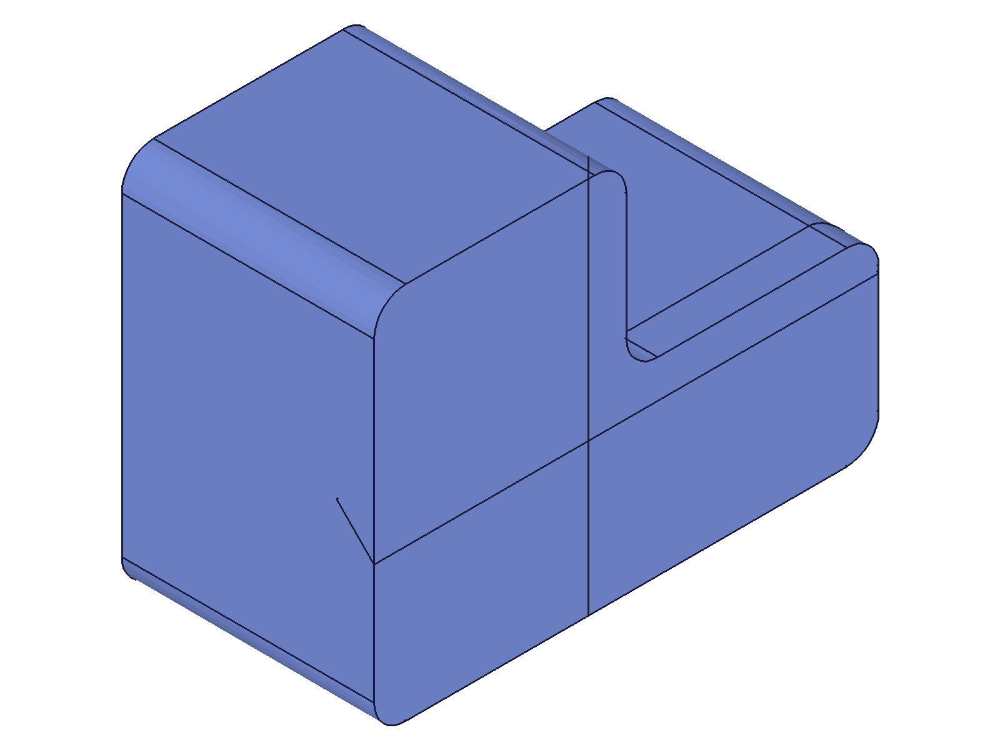

# Training: Brep Geometry Access Pattern — Finding Edge IDs for Chamfer/Fillet

**Date:** 2026-04-21

## Goal

Studying how the four brep geometry APIs (`getGeometryIds`, `getGeometryPositions`, `getBrepGeometryIndex`, `getBrepGeometryByIndex`) work together as a unified workflow for selecting edges for chamfer and fillet operations. Individual APIs are already trained — this is about the access **pattern**.

**Questions to answer:**

- What is the complete end-to-end pattern: create geometry → find edges → apply chamfer/fillet → find new edges → apply another operation?
- Position-based (`getGeometryIds`) vs index-based (`getBrepGeometryByIndex`) — when is each approach preferable? When does one fail where the other succeeds?
- How does topology change after chamfer/fillet affect edge IDs? What's the reliable re-identification workflow?
- Can you enumerate ALL edges of a complex solid and selectively apply chamfer/fillet to subsets?
- What's the round-trip serialization pattern: save edge references as positions or indices, then restore them after topology changes?
- Multi-feature scenario: box + boolean → find edges at the intersection → chamfer those specific edges. How reliable is position-based lookup for boolean result edges?
- What's the most robust pattern for sequential chamfer then fillet (or vice versa) on the same part?
- Does `getBrepGeometryByIndex` on the fillet/chamfer feature give you IDs usable for further operations?

---

## 01 — basic end-to-end fillet

Script: `scripts/01-basic-e2e-fillet.mjs` — Box → recalc → getGeometryIds → fillet → re-query.

|  |
|---|

**Data:** Pre-fillet edges found at [40,0,40] and [0,0,20] → IDs [106, 102]. After fillet + recalc, the same positions return `[[],[]]` (maxLevel 51). Original IDs 106/102 are invalid (getGeometryPositions returns maxLevel 51).

**Learned:** After fillet, the original straight edges no longer exist — they become arc surfaces. Position-based lookup with `lines` type fails because the edge type changed. IDs are completely invalidated after topology change.

**📌 LLM doc:** Filleted edges are removed from the `lines` type — they become arcs. Must re-query with correct type after fillet.

---

## 02 — post-fillet edge access

Script: `scripts/02-post-fillet-edges.mjs` — After fillet, enumerate fillet feature brep, find remaining edges, chain chamfer.

|  |
|---|

**Data:** Fillet feature (1 edge): 13 lines, 2 arcs, 7 faces. Remaining unfilleted edges found by position: [158, 159, 160, 149] (all found, maxLevel 31). Chamfer on unfilleted edge succeeded (id=181). `arcPositions` for pre-chamfer arc IDs returned null — stale after chamfer topology change.

**Learned:** The fillet feature's brep contains ALL edges of the current solid, not just the fillet. Position-based lookup works for edges not affected by the fillet. Arc IDs from the fillet feature become stale after subsequent topology changes (chamfer).

**📌 LLM doc:** Always query IDs after the LAST topology-changing operation. Stale IDs from prior features fail.

---

## 03 — index-based vs position-based

Script: `scripts/03-index-vs-position.mjs` — Compare getBrepGeometryByIndex on latest feature vs getGeometryIds.

**Data:** After fillet on 2 edges: 14 lines, 4 arcs in fillet feature. Position-found bottom edge IDs [160, 162, 161, 163] are ALL found in the fillet feature's index-enumerated set. Index-enumerated edge ID used for chamfer succeeded (✓).

**Learned:** Index-enumerated IDs from the latest feature are valid for further operations and are equivalent to position-based IDs. Both approaches give you the current brep state.

**📌 LLM doc:** Two approaches produce equivalent IDs — use whichever fits the workflow.

---

## 04 — enumerate and classify edges

Script: `scripts/04-enumerate-and-select.mjs` — Enumerate all 12 box edges, classify by z-position, fillet top, chamfer bottom.

|  |
|---|

**Data:** 12 box edges classified: 4 top (z=40), 4 bottom (z=0), 4 vertical (z=20). Fillet all 4 top edges ✓. After recalc, re-found all 4 bottom edges by position (new IDs [240, 243, 241, 242]). Chamfer all 4 bottom edges ✓.

**Learned:** Enumerate → classify by midpoint position → operate on subsets → recalc → re-query is a robust pattern. Works for batch edge selection.

**📌 LLM doc:** Enumeration + classification pattern for selective edge operations.

---

## 05 — boolean subtraction edges

Script: `scripts/05-boolean-edges.mjs` — Find circular edges on a boolean subtraction hole.

**Data:** `circles` lookup at hole center [40,30,40]: FAILED (empty, maxLevel 51). `arcs` lookup at same position: FOUND (id=254, maxLevel 31). Boolean feature has 2 arcs. Fillet on enumerated arc ID succeeded (✓).

**Learned:** Boolean subtraction circular edges are classified as `arcs` (not `circles`) in getGeometryIds. Use `arcs` param, not `circles`, to find hole edges.

**📌 LLM doc:** Critical — boolean hole edges are arcs, not circles.

---

## 06 — circle vs arc distinction

Script: `scripts/06-boolean-circle-vs-arc.mjs` — Systematic test of circles vs arcs on boolean results vs primitives.

**Data:** Boolean hole edges: ALL `circles` queries fail (center, rim+X, rim-X, rim+Y). ALL `arcs` queries succeed from any position (center, rim). Arc positions: [10.6, 10.6, z] — parametric midpoint at ~45° from seam.

Standalone cylinder (script 12 verified): `circles` queries SUCCEED. `arcs` queries FAIL. Cylinder has arcs by index but found via `circles` in getGeometryIds.

**Learned:** The `circles` vs `arcs` distinction in getGeometryIds depends on the edge's origin:
- **Primitive** circular edges (cylinder, cone, sphere) → use `circles`
- **Boolean intersection** circular edges → use `arcs`
- Both are `arcIndex` in getBrepGeometryByIndex

**📌 LLM doc:** Fundamental rule — edge origin determines whether to use `circles` or `arcs` in getGeometryIds.

---

## 07 — round-trip serialization

Script: `scripts/07-roundtrip-serialization.mjs` — Save edge positions → topology change → restore by position.

**Data:** Pre-change vertical IDs: [102, 103, 104, 105]. Saved positions: [0,0,20], [80,0,20], [80,60,20], [0,60,20]. After fillet (topology change), restored IDs: [182, 183, 184, 185] — all found! IDs changed but positions still resolved. Chamfer using restored edges succeeded (✓).

**Learned:** Position-based round-trip works across topology changes. The saved midpoint positions find the correct edges even when edge midpoints shift slightly (edges get shorter from adjacent fillets). `getGeometryIds` uses proximity matching.

**📌 LLM doc:** Position-based serialization pattern for persisting edge references.

---

## 08 — index stability across topology changes

Script: `scripts/08-index-stability.mjs` — Do box indices map to the same geometric positions after fillet?

**Data:** After fillet on 2 top edges: box feature still has 10 lines (lost 2 filleted edges). Fillet feature has 14 lines + 2 arcs (complete brep). Index mapping preserved for bottom edges (indices 0-3, z=0) but NOT for vertical/top edges (indices 4-11).

**Learned:**
- Earlier features have their OWN brep state (possibly outdated — box lost 2 edges).
- Latest feature has the COMPLETE current brep (14 lines vs box's 10).
- Indices on earlier features are NOT reliable after topology changes.
- **Always enumerate on the latest feature** for current topology.

**📌 LLM doc:** Use latest feature ID for getBrepGeometryByIndex — earlier features have stale brep.

---

## 09 — multi-step chain

Script: `scripts/09-multistep-chain.mjs` — Box → fillet top → chamfer bottom → fillet verticals.

|  |
|---|

**Data:** All 3 steps succeeded with position-based lookup between each:
- Step 1: 4 top edges found, fillet ✓
- Step 2: 4 bottom edges found (new IDs), chamfer ✓ 
- Step 3: 4 vertical edges found (new IDs), fillet ✓
Final topology: 28 lines, 0 arcs, 18 faces.

**Learned:** The multi-step pattern is robust: recalc → getGeometryIds → operate → repeat. Position-based lookup reliably finds edges across multiple topology changes.

**📌 LLM doc:** Multi-step sequential pattern works — no special handling needed between operations.

---

## 10 — topology counts across features

Script: `scripts/10-find-fillet-arcs.mjs` — Track arc counts across feature chain.

**Data:** 
- Fillet feature (1 edge): 13 lines, 2 arcs, 7 faces, 10 points
- Chamfer feature (after fillet): 16 lines, 2 arcs (inherited), 8 faces, 12 points
- Fillet2 feature (after fillet+chamfer): 17 lines, 3 arcs (2 inherited + 1 new), 9 faces, 14 points

Arc search by position near estimated fillet midpoints: FAILED (empty, maxLevel 51).

**Learned:** Each subsequent feature inherits arcs from prior features. The latest feature's brep has all arcs from the entire history. Finding fillet arcs by position is unreliable — use `getBrepGeometryByIndex` with `arcIndex` instead.

**📌 LLM doc:** Use index-based enumeration for fillet arcs, not position-based lookup.

---

## 11 — L-shape via boolean union

Script: `scripts/11-extrusion-edges.mjs` — Complex geometry: L-shape from boolean union of 2 boxes.

|  |
|---|

**Data:** L-shape: 18 lines (6 top, 6 bottom, 6 vertical). Fillet all 6 verticals ✓. After recalc, inner corner top edges found by position [60,30,40] and [40,45,40] → IDs [661, 664]. Chamfer inner corners ✓.

**Learned:** The pattern works identically on complex geometry from boolean unions. Enumerate → classify → select → operate is the same workflow regardless of how the geometry was created.

---

## 12 — cylinder edge lookup

Script: `scripts/12-cylinder-edge-lookup.mjs` — Standalone cylinder brep and edge queries.

**Data:** Cylinder brep: 1 line (seam), 2 arcs, 3 faces, 2 points.
- `circles` at center/rim: FOUND (ids 77, 76). `arcs` at same positions: FAILED (empty).
- Seam line at [15, 0, 20] (positive X at midheight). Arc midpoints at [-15, ~0, z] (opposite seam).
- Fillet on arc by index: ✓ (maxLevel 31).

**Learned:** Standalone cylinder circular edges: found via `circles` in getGeometryIds, via `arcIndex` in getBrepGeometryByIndex. Opposite of boolean hole edges (which use `arcs`). Seam vertex at [+radius, 0, z], arc midpoint at [-radius, ~0, z].

**📌 LLM doc:** Already captured in script 06 finding.

---

## 13 — face lookup pattern

Script: `scripts/13-face-lookup-pattern.mjs` — Face lookup for workPlane references.

**Data:** Box has 6 faces, each with 4 positions (edge midpoints). Top face found by center point [40,30,40] → id=115. Also found by 2 edge midpoints → same id=115. Cylindrical face lookup on boolean union boss failed (empty). Boss circle/arc lookup also failed.

**Learned:** Flat face lookup is reliable with either a center point or edge midpoints. Curved face/edge lookup on boolean union results is fragile — may need exact surface points.

---

## Summary of Key Findings

1. **Position-based workflow** (`getGeometryIds`): The primary pattern. Robust for straight edges and flat faces. Less reliable for curved edges (arcs, circles) where edge type depends on origin.

2. **Index-based workflow** (`getBrepGeometryByIndex`): Best for enumeration and discovering all edges of a given type. Deterministic — index 0 always returns a result. Must use the LATEST feature ID for current topology.

3. **Edge type distinction**: `circles` (primitives) vs `arcs` (boolean intersections) in getGeometryIds. Both are `arcIndex` in getBrepGeometryByIndex.

4. **Topology change protocol**: After any fillet/chamfer/boolean: `recalc()` → re-query edges with `getGeometryIds` or enumerate on latest feature. Never cache IDs across topology changes.

5. **Serialization**: Save edge midpoint positions (from `getGeometryPositions`) → restore later with `getGeometryIds`. Works even after topology changes shift edge midpoints.

6. **Multi-step pattern**: `recalc → getGeometryIds → fillet/chamfer → recalc → getGeometryIds → next operation` chains reliably.
