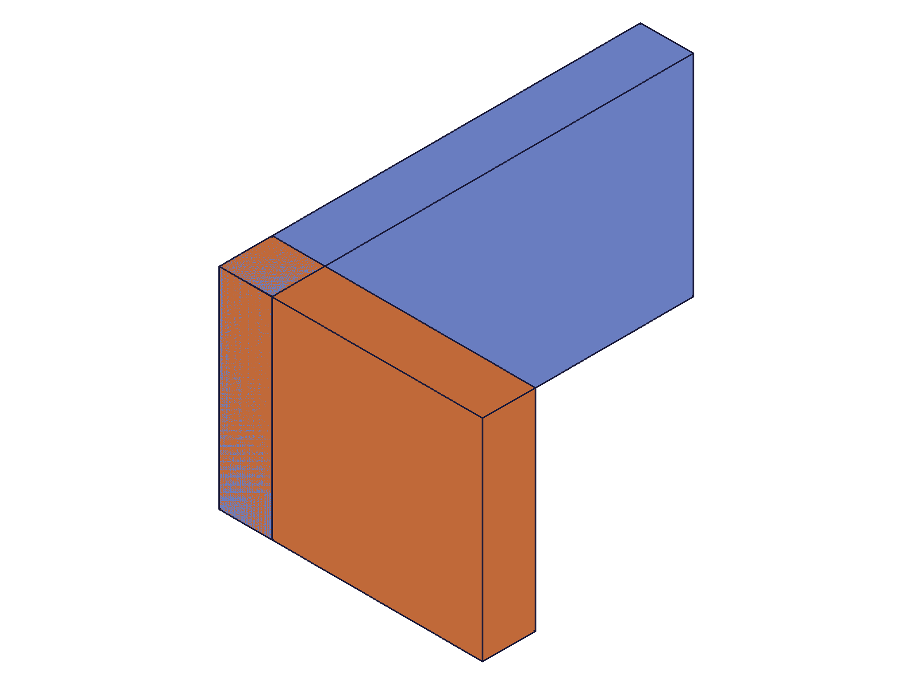
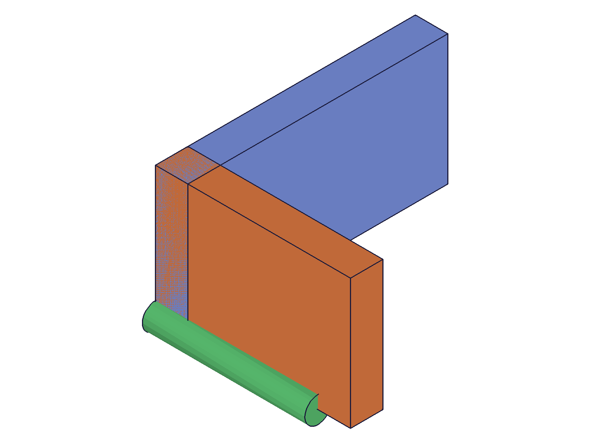

# Training: assembly.partTemplate

**Date:** 2026-04-22

## Goal

Testing `v1.assembly.partTemplate` — creates a part and adds it as a template to the product container for assembly building.

**Methods to cover:**

- `partTemplate()` — no params (default name "Part")
- `partTemplate({ name: 'CustomName' })` — custom naming
- Multiple part templates — how are they stored in PartContainer?
- Context switch: `setCurrentProduct` to move between assembly root and part template
- Building geometry inside a part template (box, work geometry)
- Structure tree inspection — where does the template live, what's its internal structure?
- Default naming with multiple unnamed templates (auto-increment?)
- Edge cases: empty name, duplicate names, special characters

**Questions:**

- Does `partTemplate` automatically switch context to the new part? (structure.currentProduct should change)
- What ID range do part templates get?
- Can you call part.* APIs directly on the returned template ID?
- What happens if you create a partTemplate before assembly.create?
- How does `setCurrentProduct` work to return to the assembly context?

---

## 01 — basic partTemplate

Script: `scripts/01-basic-partTemplate.mjs` — ✅ Creates template successfully.

**Data:** `result: 22`, `maxLevel: 31`, messages: `[]`. Template is a `CC_Part` node under `PartContainer` (ID 8). `structure.currentProduct` stays at 12 (assembly root) — partTemplate does NOT switch context.

**📌 LLM doc:** `partTemplate` does not switch `currentProduct`. Context only switches when you call `part.*({ id: tplId })`.

---

## 02 — context switch and building in template

Script: `scripts/02-context-switch.mjs` — ✅ All part.* APIs work on template ID.

|  |
|---|

**Data:** `part.box({ id: tplId })` returns `result: 70, maxLevel: 31`. After this call, `currentProduct` changed from 12 → 22 (the template). `part.workCSys` also works (result: 107). `setCurrentProduct({ id: asmId })` returns previous product (22) and switches back to assembly (currentProduct: 12).

**Learned:** Calling `part.*` with a template ID implicitly switches `currentProduct` to that template. `setCurrentProduct` returns the ID of the previously current product.
**📌 LLM doc:** Document context-switching behavior — partTemplate creates, part.* switches context.

---

## 03 — multiple templates and naming

Script: `scripts/03-multiple-templates.mjs` — ✅ Multiple templates with auto-naming.

**Data:**
- No params → name "Part"
- Second no params → "Part0" (auto-increment starting at 0)
- Third no params → "Part1"
- Named "Bolt" → "Bolt"
- Named "Nut" → "Nut"
- Duplicate "Bolt" → "Bolt0" (auto-deduplicated, no error)

All in PartContainer: `[22, 68, 114, 160, 206, 252]`. Each template is ~46 IDs apart (internal nodes).

**📌 LLM doc:** Default name is "Part". Auto-increments with numeric suffix. Duplicate names are auto-deduplicated (appends "0", "1", etc.) — no error.

---

## 04 — edge cases

Script: `scripts/04-edge-cases.mjs` — ✅ Validates error cases and name handling.

**Data:**
- **Without assembly.create:** `result: null, maxLevel: 51`. Error: "Assembly building is not initialized!"
- **Empty name:** Allowed — name is literally `""`. No error.
- **Special characters** (`"Part (v2)/test"`): Name preserved verbatim — NOT sanitized. No `originalName` member on part templates (unlike assembly roots).
- **Long name (200 chars):** Accepted with no issues.

**📌 LLM doc:** Requires assembly.create first. Empty name allowed. Special chars preserved. No `originalName` member.

---

## 05 — template internal structure

Script: `scripts/05-template-structure.mjs` — ✅ Full part.* API set works inside templates.

**Data:** Template node: `class: "CC_Part"`, `parent: 8` (PartContainer), `flags: 0`, `expressionSet: 24`, `geometrySet: 28`, 7 children (internal sets). Successfully tested:
- `part.expression` → result: 1 (success)
- `part.getExpression` → `{ expression: "width * 0.5", value: 30 }`
- `part.sketch` → result: 116
- `part.workPlane` → result: 124
- `part.box` → result: 132

All maxLevel: 31. A part template is a fully functional CC_Part.

**📌 LLM doc:** Template is a full CC_Part — all part.* APIs work (expressions, sketches, work geometry, features).

---

## 06 — template to instance flow

Script: `scripts/06-template-to-instance.mjs` — ✅ End-to-end template → instance workflow.

|  |
|---|

**Data:** Template with 2 boxes + WCS built. Switched back via `setCurrentProduct({ id: asmId })`. Created two instances: inst1=150 (origin), inst2=152 (offset [100,0,0]). Both verified via `getInstance`.

**Learned:** Must call `setCurrentProduct({ id: asmId })` before `assembly.instance()` to return to assembly context.

---

## 07 — creating templates while in another template's context

Script: `scripts/07-nested-context.mjs` — ✅ Can create new templates from any context.

**Data:** Created t1 (Part_A), built geometry in it (currentProduct: 22). Created t2 (Part_B) without switching back — succeeds. `currentProduct` stayed at 22 (t1) after creating t2. Then `part.box({ id: t2 })` switched currentProduct to 105 (t2). Both templates in PartContainer: `[22, 105]`.

**📌 LLM doc:** `partTemplate()` can be called from any context (assembly or another template). It never switches context — only `part.*({ id: newTplId })` does.

---

## 08 — getPartTemplate

Script: `scripts/08-getPartTemplate.mjs` — ✅ Query by name and list all.

**Data:**
- By name: `getPartTemplate({ name: 'Nut' })` → returns single ID (68)
- List all: `getPartTemplate()` or `getPartTemplate({})` → returns array `[22, 68, 114]`
- Non-existent: `result: null, maxLevel: 51`, message: `"Part with name = \"NonExistent\" could not be found"`

---

## 09 — realistic end-to-end workflow

Script: `scripts/09-realistic-workflow.mjs` — ✅ Full assembly with two different part templates.

|  |
|---|

**Data:** Created L_Bracket (box base + wall + WCS) and Pin (cylinder + WCS) templates. Switched to assembly context. Retrieved via `getPartTemplate()` → `[22, 150]`. Instantiated 3 times (2 brackets, 1 pin). Assembly children: `[14, 16, 18, 223, 225, 227]` (3 sets + 3 instances). Snapshot confirms all geometry renders correctly.
