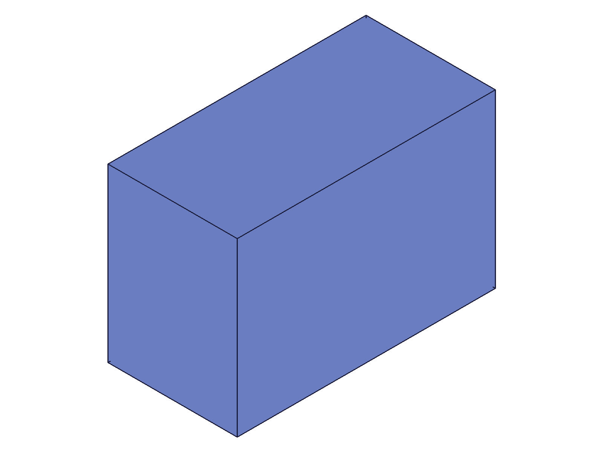

# Training: assembly.assemblyTemplate

**Date:** 2026-04-22

## Goal

Testing `v1.assembly.assemblyTemplate` — creates a sub-assembly template in the AssemblyContainer.

**Methods to cover:**

- `assemblyTemplate` — basic creation (no params, with name)
- `assemblyTemplate` — auto-naming with multiple unnamed calls
- `assemblyTemplate` — duplicate names, empty string, special characters
- `assemblyTemplate` — context switching behavior (does it switch currentProduct?)
- Building geometry inside an assembly template (nesting part templates + instances)
- `getAssemblyTemplate` — retrieve by name and list all (will verify in tandem)
- `deleteTemplate` — on assembly templates (will verify in tandem)

**Questions:**

- Does `assemblyTemplate` switch `currentProduct` like `partTemplate` doesn't?
- Can you nest `partTemplate` calls from within an assembly template context?
- Can you add instances to an assembly template directly?
- What's the structure tree layout for assembly templates vs part templates?
- Does auto-naming follow the same "Assembly", "Assembly0", "Assembly1" pattern?
- Can you create an assembly template inside another assembly template (nested sub-assemblies)?

---

## 01 — basic creation

Script: `scripts/01-basic-creation.mjs` — ✅ Both no-param and named creation work.

**Data:** No-param returns ID 22, maxLevel 31. Named ("SubAsm1") returns ID 32, maxLevel 31. Both are `CC_Assembly` class, parent is AssemblyContainer (10). `currentProduct` stays at 12 (assembly root) — does NOT switch, same as `partTemplate`. Has `originalName` member (unlike `partTemplate`).

**📌 LLM doc:** Does not switch `currentProduct`. Default name "Assembly". Has `originalName` member. Templates stored in AssemblyContainer (10).

## 02 — auto-naming and edge cases

Script: `scripts/02-auto-naming.mjs` — ✅ All naming behaviors match `partTemplate` pattern.

**Data:** Auto-increment: "Assembly", "Assembly0", "Assembly1". Duplicate names: "Motor", "Motor0", "Motor1" — auto-dedup, no error. Empty string: allowed, blank name preserved. Special characters: sanitized in display name (`"Sub (v2)/test"` → `"Sub__v2__test"`), preserved verbatim in `originalName`. See `files/02-auto-naming-assembly-template-names.json`.

**📌 LLM doc:** Name sanitization matches `assembly.create` behavior (spaces, parens, slashes → underscores). `originalName` preserves the raw string.

## 03 — building inside assembly template

Script: `scripts/03-build-inside.mjs` — ✅ Can add part instances to assembly template via `setCurrentProduct` + `instance`.

|  |
|---|

**Data:** Created two part templates (BoxPart, CylPart), created assembly template SubAsm (170), switched context with `setCurrentProduct`, instanced both parts inside. Then instanced the sub-assembly into the root. The snapshot shows assembled geometry. The assembly template (CC_Assembly 170) has children including the two instances (180, 182).

**📌 LLM doc:** Must use `setCurrentProduct` to switch into assembly template before adding instances. `instance()` works with assembly template as `ownerId`.

## 04 — getAssemblyTemplate

Script: `scripts/04-get-assembly-template.mjs` — ✅ Lookup by name and list-all work.

**Data:** `getAssemblyTemplate({ name: 'Alpha' })` returns single ID (22). No params returns array of all IDs `[22,32,42]`. Non-existent name: `result: null`, maxLevel 51, error "Assembly with name = 'Nonexistent' could not be found". Empty string name: `result: null`, maxLevel 51 (error — does NOT match the empty-named template from script 02).

**📌 LLM doc:** Empty-string lookup fails even if an empty-named template exists. Error message includes the searched name.

## 05 — deleteTemplate on assembly templates

Script: `scripts/05-delete-template.mjs` — ✅ `deleteTemplate` works on assembly templates.

**Data:** Single delete: `result: null` (VOID), maxLevel 31 — template removed. Multiple delete: `ids: [t1, t3]` — both removed. Re-delete already-deleted: maxLevel 51, error code 1006 "An element of parameter 'ids' has an invalid id!" with warning "ToId()/TOID() didn't get an existing or valid id."

**📌 LLM doc:** `deleteTemplate` works identically on assembly templates and part templates. Takes `ids` array (not single id). Returns VOID.

## 06 — context switching

Script: `scripts/06-context-switching.mjs` — ✅ Full context switching verified.

**Data:** After `assemblyTemplate()`: currentProduct stays at root (12). `setCurrentProduct(subId)` returns previous product (12). After switch: currentProduct = subId (22). `partTemplate` can be called from any context — always creates in PartContainer. Part instance can be added to assembly template via `instance({ ownerId: subId })`. `setCurrentProduct(asmId)` returns prev (22).

**📌 LLM doc:** `partTemplate` always creates in PartContainer regardless of current context. Context switching is symmetric — works the same as switching to a part template.

## 07 — convertToTemplate

Script: `scripts/07-convert-to-template.mjs` — ✅ Converts root assembly to assembly template.

**Data:** Before: root=12 (CC_AssemblyRoot), no assembly templates. After `convertToTemplate({ name: 'ConvertedSub' })`: old root 12 became CC_Assembly under AssemblyContainer (10) with name "ConvertedSub". New root 107 (CC_AssemblyRoot, name "AssemblyRoot") created. `currentProduct` and `root` both point to new root (107). Returns VOID (null). Part templates unchanged.

**📌 LLM doc:** `convertToTemplate` demotes the current root to an assembly template and creates a fresh root. The old root's instances become children of the new template. Returns VOID.

## 08 — nested sub-assemblies

Script: `scripts/08-nested-sub-assemblies.mjs` — ✅ Assembly templates can be instanced inside other assembly templates.

|  |
|---|

**Data:** SubA and SubB both live in AssemblyContainer (10) as siblings. SubB was instanced inside SubA, then SubA was instanced in root. Snapshot shows two boxes (one from SubA's direct instance, one from the nested SubB instance at [50,0,0]).

**📌 LLM doc:** Nested sub-assemblies work: instance one assembly template inside another. All assembly templates live in the flat AssemblyContainer — nesting is via instances, not container hierarchy.

## 09 — error: no assembly exists

Script: `scripts/09-no-assembly-error.mjs` — ✅ Same error as `partTemplate`.

**Data:** `result: null`, maxLevel 51. Error: "Assembly building is not initialized!" — identical to `partTemplate` behavior.

**📌 LLM doc:** Requires `assembly.create` first, same as `partTemplate`.

## 10 — ID spacing

Script: `scripts/10-id-spacing.mjs` — ✅ Assembly templates consume ~10 IDs each.

**Data:** Assembly templates: 22, 32, 42, 52, 62 — gap of 10. Part templates: 72, 118, 164 — gap of 46. Assembly templates are much lighter (~10 internal nodes vs ~46 for parts).

**📌 LLM doc:** Each assembly template consumes ~10 IDs (vs ~46 for part templates). Internal nodes: ExpressionSet, ConstraintSet, GeometrySet, plus a few more.

---

## Coverage Checklist

- [x] API called successfully (scripts 01, 02)
- [x] Required parameters tested (none required — all optional)
- [x] Key optional parameters exercised (name: default, custom, empty, special chars, duplicates)
- [x] Corresponding get/delete methods tested (04, 05)
- [x] Realistic usage combining with prerequisites (03, 06, 08)
- [x] Behavioral claims verified with data AND visual evidence
- [x] Context switching behavior documented (01, 06)
- [x] Error cases tested (09)
- [x] convertToTemplate tested (07)
- [x] Nested sub-assemblies tested (08)
