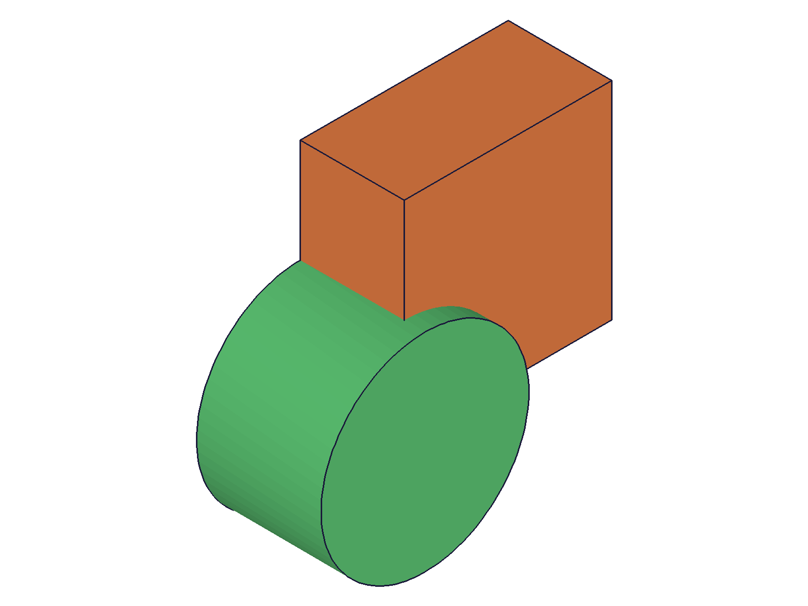

# Training: assembly.getPartTemplate

**Date:** 2026-04-22

## Goal

Testing `v1.assembly.getPartTemplate` — the query API for finding part templates by name or listing all.

**Methods to cover:**

- `getPartTemplate()` — no params, returns all part template IDs
- `getPartTemplate({})` — empty object, same as no params?
- `getPartTemplate({ name })` — lookup by name, returns single ID
- Edge cases: empty-string name, duplicate names, after deletion, no assembly, no templates

**Questions:**

- Does `getPartTemplate({ name: '' })` find an empty-named template?
- With duplicate names (auto-deduplicated "Part", "Part0"), does name lookup find the first? The deduplicated one?
- What happens after `deleteTemplate`? Does `getPartTemplate` reflect the deletion?
- What does it return when no templates exist at all?
- Is the returned array ordered? By creation order? By ID?
- Does `getPartTemplate` work without an assembly (before `assembly.create`)?
- What's the return shape difference: single ID vs array?

---

## 01 — list all variants

Script: `scripts/01-basic-all.mjs` — ✅ All three "list all" invocations return identical `[22, 68, 114]`.

**Data:** `getPartTemplate()`, `getPartTemplate({})`, and `getPartTemplate({ name: undefined })` all return the same array. maxLevel=31 for all.

**Learned:** No params, empty object, and explicit `undefined` name are equivalent — all return the full array.

## 02 — name lookup and case sensitivity

Script: `scripts/02-by-name.mjs` — ✅ Exact name match works. Case-insensitive and partial match both fail.

**Data:** `Alpha` → 22 (found), `alpha` → null/error, `ALPHA` → null/error, `Alp` → null/error. All failures at maxLevel=51.

**Learned:** Name lookup is **case-sensitive** and **exact match only**. No fuzzy/partial matching.
**📌 LLM doc:** Case sensitivity and exact match requirement.

## 03 — empty-string name

Script: `scripts/03-empty-name.mjs` — ✅ `getPartTemplate({ name: '' })` finds the empty-named template.

**Data:** Created empty-name template (id=22), then `getPartTemplate({ name: '' })` returned 22 with maxLevel=31.

**Learned:** Unlike `getAssemblyTemplate` (which fails on empty name per prior training), `getPartTemplate` **succeeds** with empty string. This is a behavioral asymmetry between the two getter APIs.
**📌 LLM doc:** Empty-string name works (unlike getAssemblyTemplate).

## 04 — duplicate/deduplicated names

Script: `scripts/04-duplicate-names.mjs` — ✅ Deduplicated names are individually addressable.

**Data:** Three `partTemplate({ name: 'Bolt' })` calls created "Bolt" (22), "Bolt0" (68), "Bolt1" (114). `getPartTemplate({ name: 'Bolt' })` → 22, `Bolt0` → 68, `Bolt1` → 114.

**Learned:** Name deduplication creates distinct names. `getPartTemplate` finds each by its actual (deduplicated) name, not the requested name.

## 05 — after deleteTemplate

Script: `scripts/05-after-delete.mjs` — ✅ Deletion immediately reflected in getPartTemplate results.

**Data:** Before: `[22, 68, 114]`. Deleted id=68. After: `[22, 114]`. Name lookup for "Remove" → null/error. "Keep" and "AlsoKeep" still found.

**Learned:** `getPartTemplate` is a live query — deleted templates disappear immediately from both listing and name lookup.

## 06 — no assembly context

Script: `scripts/06-no-assembly.mjs` — ✅ Works without `assembly.create` — returns empty array, no crash.

**Data:** `getPartTemplate()` → `[]` with maxLevel=31. `getPartTemplate({ name: 'Anything' })` → null with maxLevel=51.

**Learned:** No assembly required for listing. Returns empty array gracefully. Name lookup still returns proper error. This is different from `partTemplate()` which errors without assembly.
**📌 LLM doc:** No assembly required — graceful empty result.

## 07 — no templates exist

Script: `scripts/07-no-templates.mjs` — ✅ Same behavior as no assembly: empty array for listing.

**Data:** Assembly created but no templates. `getPartTemplate()` → `[]` maxLevel=31. Name lookup → null maxLevel=51.

**Learned:** Consistent behavior whether assembly exists or not — empty PartContainer → empty array.

## 08 — return type analysis

Script: `scripts/08-return-type.mjs` — ✅ Listing always returns array; name lookup returns single number.

**Data:** With 1 template: `getPartTemplate()` → `[22]` (isArray=true). `getPartTemplate({ name: 'Only' })` → `22` (type=number, isArray=false). With 2 templates: `[22, 68]` (isArray=true).

**Learned:** **Critical type difference:** no-name → always `Array<id>` (even with 1 item), with-name → single `id` (number) or `null`. Never returns single ID wrapped in array.
**📌 LLM doc:** Return type depends on call mode — array vs single number.

## 09 — special character names

Script: `scripts/09-special-chars.mjs` — ✅ Special characters findable by exact match.

**Data:** "My Part (v2)" → 22, "bolt/nut" → 68, "hello world" → 114. All found successfully.

**Learned:** Part template names are preserved verbatim (no sanitization), and `getPartTemplate` matches them exactly. Consistent with partTemplate's no-sanitization behavior.

## 10 — cross-contamination with assembly templates

Script: `scripts/10-cross-contamination.mjs` — ✅ No cross-contamination between containers.

**Data:** `getPartTemplate()` → `[22, 68]` (part templates only). `getAssemblyTemplate()` → `[114]` (assembly template only). Cross-lookups both fail with null/error.

**Learned:** `getPartTemplate` and `getAssemblyTemplate` are strictly scoped to their respective containers (PartContainer vs AssemblyContainer). No leakage.
**📌 LLM doc:** Scoped to PartContainer only.

## 11 — ordering

Script: `scripts/11-ordering.mjs` — ✅ Results ordered by creation order (which equals ID order).

**Data:** Created Zeta(22), Alpha(68), Mu(114), Beta(160). `getPartTemplate()` → `[22, 68, 114, 160]`. Matches creation order. Stable across repeated calls.

**Learned:** Array is ordered by creation order (ascending ID). Not alphabetical.

## 12 — realistic workflow

Script: `scripts/12-realistic-workflow.mjs` — ✅ Full workflow: create → find by name → build → instance → verify.

|  |
|---|

**Data:** Found templates by name (Bracket=22, Shaft=68, Housing=114), built geometry, created instances. `getPartTemplate()` still returns all 3 templates after instancing.

**Learned:** `getPartTemplate` is the idiomatic way to look up templates by name in a workflow. Templates persist in the listing even after being instanced.

## Coverage Checklist

- [x] API called successfully
- [x] Every required parameter tested (none — all optional)
- [x] Key optional parameters exercised (name with various values)
- [x] N/A for enum values
- [x] N/A for update/delete (this is a query API; tested interaction with deleteTemplate)
- [x] Realistic usage combining getPartTemplate with prerequisites
- [x] Behavioral claims verified with filewrite data
