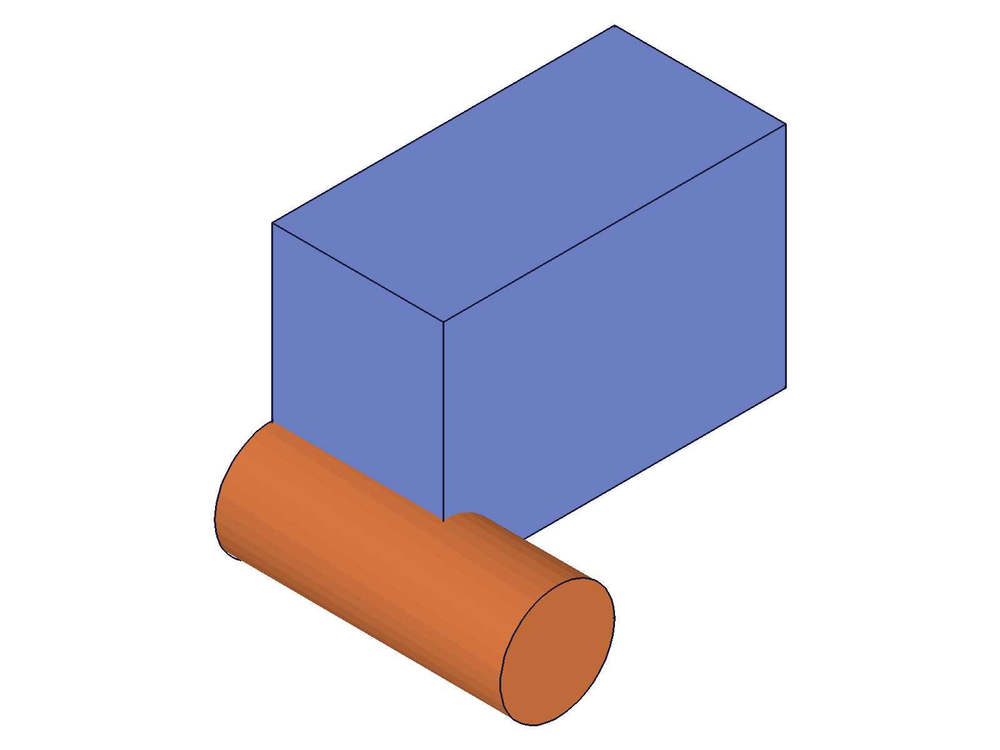

# Training: Template vs Instance Paradigm

**Date:** 2026-04-27

## Goal

Studying the template/instance paradigm in ClassCAD assemblies. Templates (part and assembly) are definitions stored in containers; instances are positioned references in the assembly tree. This task explores the relationship between them — how they share geometry, how edits propagate, and what the structure tree reveals about this architecture.

**Questions to answer:**

- How does the structure tree represent templates vs instances? What node types appear?
- Do instances share geometry data with their template, or do they get independent copies?
- When you modify a template (add/remove features), do existing instances reflect the change?
- Can you modify geometry on a per-instance basis, or is all geometry inherited from the template?
- What happens to instances when the template is modified after instantiation?
- How does `setCurrentProduct` interact with the template/instance boundary?
- What does the `graphic` data look like for instances vs templates — are mesh IDs shared?
- Can instances be nested (instance of assembly template containing instances of part templates)?
- How do instance IDs relate to template IDs in the structure tree?
- What information does `getInstance` reveal about the template/instance relationship?

---

## 01 — basic structure tree

Script: `scripts/01-basic-structure.mjs` — created assembly with two part templates (BoxPart, CylPart) and three instances. Dumped full structure tree.

|  |
|---|

**Data:** Structure tree (55KB JSON, `files/01-basic-structure-structure-full.json`). Key findings from parsing:

- Templates live under **PartContainer (8)** as `CC_Part` nodes with full feature trees (expressions, geometry sets, features)
- Instances are **`CC_ProductReference`** nodes — children of the AssemblyRoot
- Instances have **no children** (leaf nodes for part instances)
- The critical link: `productId` member (type: "id") points from instance → template. inst1.productId=22, inst2.productId=22 (same template), inst3.productId=113 (different template)
- Instance members: `partName` (empty), `productId`, `isDirty` (1), `localPath` (empty), `ownPart` (0), `productRefsET` (empty for root-level)

**📌 LLM doc:** Structure tree representation — `CC_ProductReference` with `productId` linking to template, `ownPart=0` means shared geometry.

## 02 — template edit propagation

Script: `scripts/02-template-edit-propagation.mjs` — created template with box, instantiated twice, then added a cylinder to the template.

|  |  |
|---|---|

**Data:** Structure comparison before/after (`files/02-template-edit-propagation-structure-before.json`, `files/02-template-edit-propagation-structure-after.json`). After adding cylinder to template, the snapshot shows both box+cylinder — edit propagated to all instances immediately. Instance `productId` stayed the same (22) — the reference didn't change, only the template's content did.

**📌 LLM doc:** Template edits propagate immediately to all instances — no explicit refresh or recalc needed.

## 03 — getInstance exploration

Script: `scripts/03-getInstance-exploration.mjs` — tested `getInstance` API behavior.

- `getInstance({ ownerId: asmId, name: 'Bolt_1' })` → single numeric ID (170)
- `getInstance({ ownerId: asmId })` (no name) → array of ALL instance IDs ([170, 172, 174])
- `getInstance({ ownerId: asmId, name: 'NonExistent' })` → empty array `[]`, maxLevel 31 (no error!)
- `getInstance({ ownerId: partTemplateId })` → error 1001: "wrong id type! Provide only following id types: ['assembly', 'instance']"

**📌 LLM doc:** `getInstance` behavior: name→single ID, no name→array, not-found→empty array (no error). Only accepts assembly or instance IDs as owner, NOT part template IDs.

## 04 — nested assembly templates (expanded tree)

Script: `scripts/04-nested-assembly.mjs` — created assembly template (Gearbox) containing part instances, then instanced the Gearbox twice in root.

**Data:** Structure tree (`files/04-nested-assembly-nested-structure.json`). Critical discovery:

**Two node classes for instances:**
- `CC_ProductReference` — template-level instances (in the assembly template) AND root-level instances
- `CC_ProductReferenceET` — **expanded tree** instances (auto-generated when an assembly template is instanced)

When Gearbox (template) has instances [178, 180, 182], and Gearbox is instanced as gbox1:
- gbox1 (CC_ProductReference, id 184) has children [185, 186, 187]
- These children are CC_ProductReferenceET nodes — mirrors of the template's instances
- They have a `productRef` member pointing back to the template's CC_ProductReference (185→178)
- The template's CC_ProductReference has `productRefsET` array listing all expanded copies ([185, 190])

**Bidirectional link:** template instance ←→ expanded tree instances.

`getInstance({ ownerId: assemblyInstance })` works — returns the expanded tree children.
`getInstance({ ownerId: assemblyTemplate })` also works — returns the template's own instances.

**📌 LLM doc:** CC_ProductReferenceET, expanded tree, bidirectional productRef/productRefsET links, getInstance on assembly instances vs templates.

## 05 — per-instance operations

Script: `scripts/05-per-instance-operations.mjs` — tested which operations work per-instance.

- **`setAppearance(instance)`** → error 51: "target has wrong type. It must be an operation id." **Cannot set color per-instance.**
- **`setObjectName(instance)`** → success (maxLevel 31). **Names are per-instance.**
- **`setUserData/getUserData(instance)`** → success. **User data is per-instance and independent.** Setting "steel" on inst1 and "aluminum" on inst2 works without interference.

**📌 LLM doc:** Appearance is template-level only. Names and user data are per-instance.

## 06 — mass properties and context switching

Script: `scripts/06-mass-and-context.mjs` — tested mass properties at different levels and `setCurrentProduct` behavior.

**Mass properties:**
- Assembly: cog=(60,15,10), volume=48000 — aggregated over all instances
- Instance 1 (at origin): cog=(20,15,10), volume=24000
- Instance 2 (at x=80): cog=(100,15,10), volume=24000 — includes transformation offset
- Template: cog=(20,15,10), volume=24000 — same as instance at origin

Mass properties at the assembly level aggregate correctly. Instance mass properties include their transformation.

**Context switching:**
- `setCurrentProduct(templateId)` → switches to template, returns previous product ID
- `setCurrentProduct(instanceId)` → switches to the **template** that the instance references (productId), not the instance itself. Result: previous ID. After: currentProduct = template ID.

**📌 LLM doc:** `setCurrentProduct` on instance navigates to the instance's template. Mass properties aggregate through hierarchy, include instance transformations.

## 07 — add instance to assembly instance (bidirectional sync)

Script: `scripts/07-add-to-instance.mjs` — tested the API doc claim about editing through instances.

Created sub-assembly template with one widget, instanced twice. Then added Widget2 to sub1 (an instance, not the template).

**Result:**
- Before: sub1=[126], sub2=[129], template=[123]
- After add to sub1: sub1=[126, 162], sub2=[129, 164], template=[123, 160]

**All three got the new child with different IDs.** Adding to an instance propagates to the template AND all other instances of that template.

**📌 LLM doc:** Critical: adding to an assembly instance propagates to template + all sibling instances. The instance/template boundary is NOT a one-way relationship — it's bidirectional sync.

## 08 — deleteInstance propagation

Script: `scripts/08-deleteInstance-propagation.mjs` — tested whether deleting from an instance propagates.

Created sub-assembly with 3 widgets, instanced twice. Deleted the W2 equivalent from s1.

**Result:**
- Before: s1=[122,123,124], s2=[127,128,129], template=[115,117,119]
- After delete from s1: s1=[122,124], s2=[127,129], template=[115,119]

**Deletion also propagates bidirectionally** — removing from an instance removes from template + all other instances.

**📌 LLM doc:** Deletion from expanded-tree instances propagates to template + all sibling instances. Same bidirectional sync as addition.

## 09 — isLocal transformation flag

Script: `scripts/09-isLocal-transform.mjs` — tested global vs local transformation on sub-assembly instances.

Sub-assembly placed at x=100. Added pegs with:
- `isLocal: false` at x=120 → peg at global x=120
- `isLocal: true` at x=20 → peg at global x=120 (local 20 + owner 100)
- `isLocal: true` at x=0 → peg at global x=100 (local origin = owner position)

Snapshot shows cylinders (auto-scaled, hard to distinguish). The `isLocal` flag determines coordinate system for the transformation parameter.

## 10 — batch creation and ident

Script: `scripts/10-batch-and-ident.mjs` — tested array form of `instance()` and `ident` parameter.

- **Batch creation works:** `instance([{...}, {...}, {...}])` → returns array of IDs `[107, 109, 111]`
- **`ident` creates an `IdentToIdMap` node** as a child of the assembly root, with a `map` member containing string→id pairs for each ident

## 11 — graphic data (CLI limitation)

Script: `scripts/11-graphic-data-sharing.mjs` — `requestVisualisation` returns maxLevel 51 in CLI context. **Cannot test graphic data sharing via API in this environment.** The harness renderer handles mesh data internally.

## 12 — save/load preservation

Script: `scripts/12-save-load-preservation.mjs` — saved assembly to OFB, cleared, loaded back.

**IDs are perfectly preserved:** asmId=12, tpl=22, inst1=113, inst2=115 — all the same after save/clear/load. Template references (productId=22 for both instances) are intact. The template/instance paradigm survives serialization completely.

**📌 LLM doc:** OFB save/load preserves IDs and template/instance relationships exactly.

## 13 — direct instance editing (rejected)

Script: `scripts/13-instance-direct-edit.mjs` — attempted `part.box`, `part.cylinder`, `part.entityInjection`, `part.sketch` with instance ID.

**ALL rejected:**
- `part.box(instanceId)` → error: "The provided id for the part is not a part id."
- `part.cylinder(instanceId)` → same error
- `part.entityInjection(instanceId)` → same error
- `part.sketch(instanceId)` → error: "wrong id type! Provide only following id types: ['part']"

**Instances cannot have their own geometry.** All geometry lives in the template. To modify what an instance shows, you must edit the template (and the change affects all instances).

**📌 LLM doc:** Geometry is exclusively template-level. Part APIs reject instance IDs. No per-instance geometry overrides.

## 14 — edge cases

Script: `scripts/14-edge-cases.mjs` — tested various edge cases.

- **Empty template instance:** works fine, no error
- **4x4 matrix transformation:** works fine
- **Self-referencing assembly:** properly rejected — "An assembly can not be placed into itself"
- **Duplicate instance names:** allowed. Both created successfully. `getInstance({ name })` returns only the FIRST match.
- **Auto-naming:** without `name` param, instance gets the template's name (e.g., "MatrixPart")

**📌 LLM doc:** Self-reference blocked. Duplicate names allowed but getInstance only finds first. Auto-naming uses template name.
