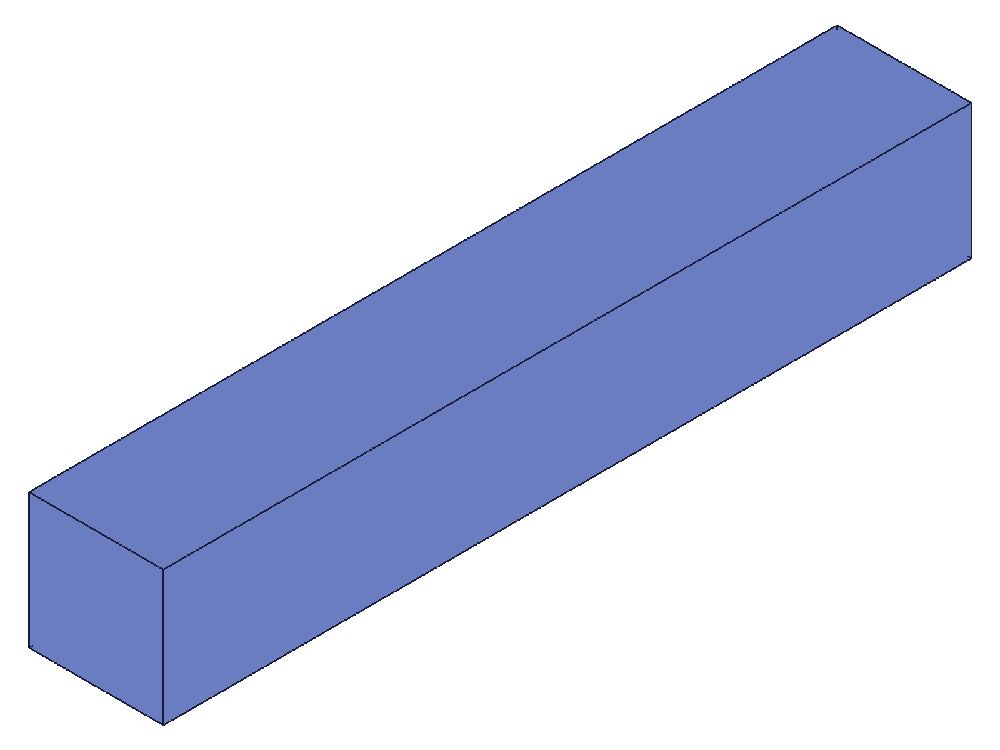
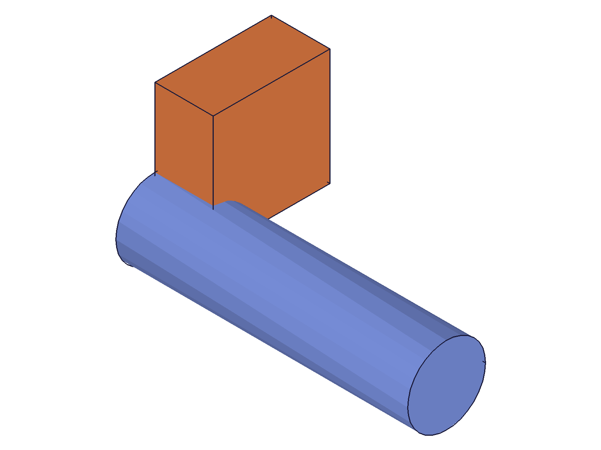
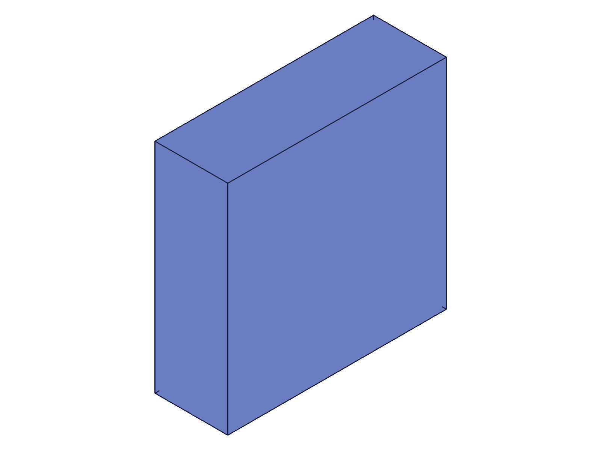
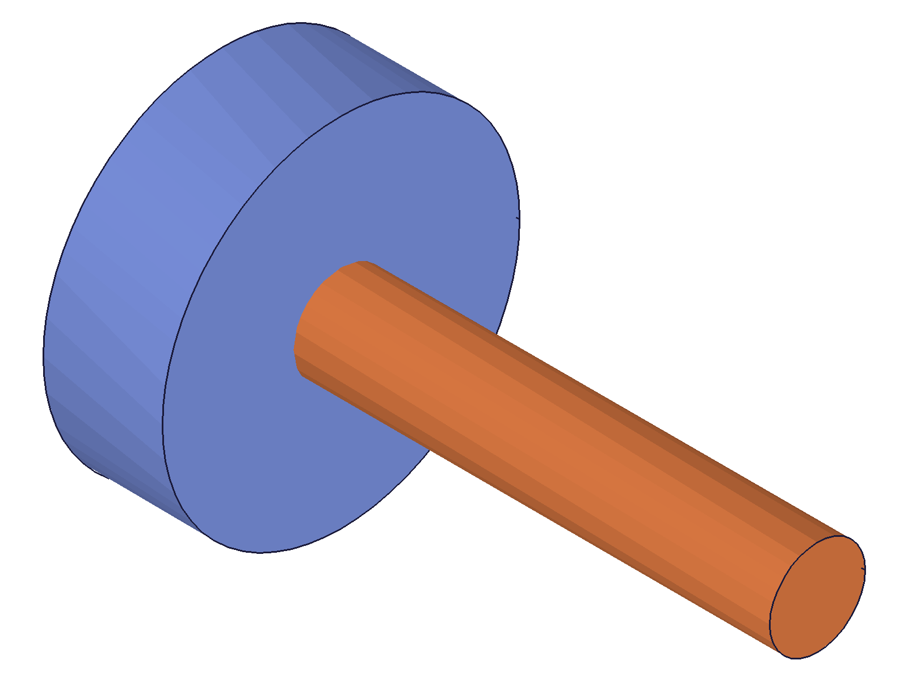
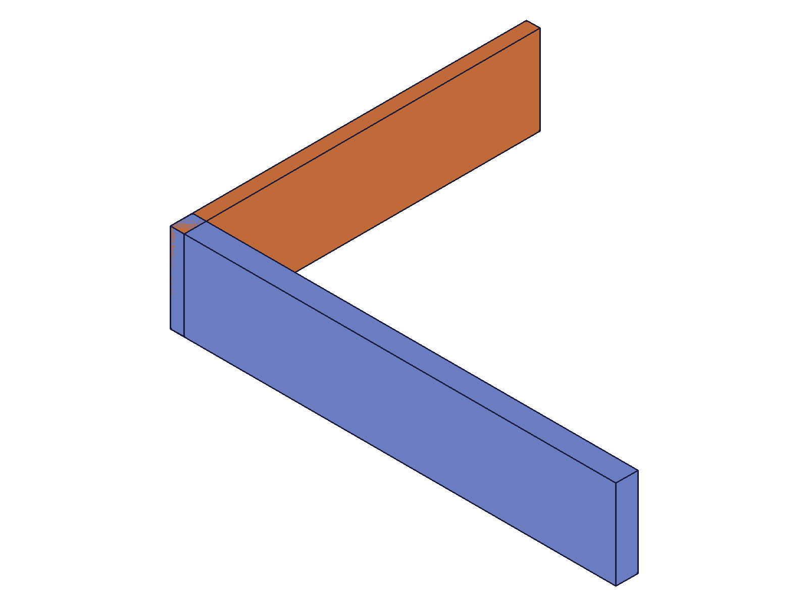

# Training: Api study of `assembly.instance`

**Date:** 2026-04-27

## Goal

Focused API study of `assembly.instance` — testing every parameter, return value format, error case, and interaction mode.

**Methods to cover:**

- `instance` — required params: `productId`, `ownerId`
- `instance` — optional params: `transformation` (3-point and 4x4), `name`, `ident`, `isLocal`
- `instance` — batch form (array of param objects)
- `instance` — return value: `id|VOID|Array<id|VOID>`

**Questions:**

- What error when `productId` is invalid (wrong type, nonexistent)?
- What error when `ownerId` is invalid (part template, nonexistent)?
- What error on missing required params?
- Does omitting `transformation` default to identity/origin?
- Can `productId` accept string identifiers, or only numeric IDs?
- Return value shape: raw number or wrapped?
- Behavior when `ownerId` is an expanded-tree instance vs root assembly?
- What does `isLocal: true` actually mean for the transformation coordinates?

---

## 01 — basic happy path

Script: `scripts/01-basic-happy-path.mjs` — ✅ basic instance creation with minimal params, named, and transformed.

|  |
|---|

**Data:** Return value is a raw number (instance ID). `typeof result === 'number'`. maxLevel: 31 (info). Messages array empty. Three instances created at IDs 105, 107, 109.

**📌 LLM doc:** Return value is a numeric ID. maxLevel 31 on success (not 0).

## 02 — error cases

Script: `scripts/02-error-cases.mjs` — tested all error conditions.

**Data** (`files/02-error-cases-error-cases.json`):
- Missing `productId` → null, maxLevel 51: "The parameter \"productId\" must be provided in the api call!"
- Missing `ownerId` → null, maxLevel 51: "The parameter \"ownerId\" must be provided in the api call!"
- Invalid `productId` (9999) → null, maxLevel 51: "ToId()/TOID() didn't get an existing or valid id."
- `ownerId` = part template → null, maxLevel 51: "wrong id type! Provide only following id types: [\"assembly\",\"instance\"]"
- Self-reference (asm into itself) → null, maxLevel 51: "An assembly can not be placed into itself"
- Empty params → same as missing productId

**📌 LLM doc:** Error messages are descriptive. ownerId only accepts assembly or instance types. Self-reference blocked.

## 03 — transformation formats

Script: `scripts/03-transformation-formats.mjs` — ✅ both 3-point and 4x4 formats work.

|  |
|---|

**Data:** All 5 instances created successfully (IDs 115-123). Default (no transform) places at origin. 3-point format: `[origin, xDir, yDir]` — rotation encoded in direction vectors. 4x4 matrix: standard homogeneous matrix with translation in last column.

**📌 LLM doc:** Both formats work. Default is origin/identity. Direction vectors define orientation.

## 04 — isLocal flag

Script: `scripts/04-isLocal-flag.mjs` — verified `isLocal` coordinate semantics via mass-property COGs.

**Data** (`files/04-isLocal-flag-cog-positions.json`):
- Global peg (isLocal=false, x=120): COG x≈120 ✓
- Local peg (isLocal=true, x=20): COG x≈120 (local 20 + owner at 100 = global 120) ✓
- Local origin peg (isLocal=true, x=0): COG x≈100 (local origin = owner position) ✓
- Default peg (no isLocal, x=50): COG x≈50 (global) ✓

**📌 LLM doc:** `isLocal: true` makes transformation relative to owner's coordinate system. Default is `false` (global coordinates). Critical for sub-assembly placement.

## 05 — batch creation and ident

Script: `scripts/05-batch-and-ident.mjs` — tested array form and `ident` parameter.

**Data** (`files/05-batch-and-ident-batch-result.json`, `files/05-batch-and-ident-mixed-batch.json`):
- Batch: `instance([{...}, {...}, {...}])` → returns `[105, 107, 109]` (array of IDs)
- `ident` parameter: creates instance successfully, but `getInstance({ name: ident })` does NOT find it — ident is not the same as name
- **Mixed batch (one invalid entry): ENTIRE batch fails.** Returns null, maxLevel 51. Not partial success.

**📌 LLM doc:** Batch is all-or-nothing — one bad entry fails the whole array. Ident is separate from name; use `setIdent` for post-hoc lookups.

## 06 — owner types and propagation

Script: `scripts/06-owner-types.mjs` — tested adding to instance (ownerId=instance).

**Data** (`files/06-owner-types-propagation.json`):
- Before: sub1=[183], sub2=[186], template=[180]
- After adding Nut to sub1 (an instance): sub1=[183, 190], sub2=[186, 192], template=[180, 188]
- Adding to any instance propagates to the template AND all sibling instances, each with unique IDs.

|  |
|---|

**📌 LLM doc:** Adding instance to an assembly instance triggers bidirectional sync — template + all sibling instances get the new child.

## 07 — naming behavior

Script: `scripts/07-naming-behavior.mjs` — auto-naming, duplicates, special chars.

**Data** (`files/07-naming-behavior-naming.json`):
- Auto-naming sequence: first="Gadget" (template name), then "Gadget0", "Gadget1", etc.
- Duplicate names: both created successfully (IDs 111, 113). `getInstance` returns FIRST match only.
- Special chars in name ("Part-001 (Rev.A)"): works fine.
- Empty string name: works fine (instance created).

**📌 LLM doc:** Auto-naming: first gets template name, subsequent get name+index. Duplicates allowed but ambiguous for lookup.

## 08 — string identifiers

Script: `scripts/08-string-identifier.mjs` — ✅ all string forms work.

**Data** (`files/08-string-identifier-string-ids.json`):
- `productId: 'MySpecialPart'` (template name as string) → works
- `productId: String(tplId)` (numeric ID as string "22") → works
- `ownerId: 'StringIdAsm'` (assembly name as string) → works

**📌 LLM doc:** Both `productId` and `ownerId` accept template/assembly names as strings, not just numeric IDs.

## 09 — getInstance

Script: `scripts/09-getInstance.mjs` — comprehensive `getInstance` testing.

**Data** (`files/09-getInstance-getInstance-results.json`):
- No name → array of all instance IDs: [105, 107, 109]
- With name → single ID (not array): 107
- Nonexistent name → empty array `[]`, maxLevel 31 (NOT an error)
- Batch form works: `[{ownerId, name:'A'}, {ownerId, name:'C'}]` → `[105, 109]`
- Invalid ownerId type → error 51: "wrong id type! Provide only following id types: [\"assembly\",\"instance\"]"
- Missing ownerId → error 51

**📌 LLM doc:** Name→single ID, no name→array of all. Nonexistent returns `[]` not error. Only assembly/instance as owner.

## 10 — deleteInstance

Script: `scripts/10-deleteInstance.mjs` — deletion behavior.

**Data** (`files/10-deleteInstance-deleteInstance-results.json`):
- Single delete: result=null (VOID), maxLevel 31 ✓
- Multiple: `{ ids: [i1, i4] }` → both removed
- Re-delete already-deleted → error 51: "ToId()/TOID() didn't get an existing or valid id."
- Empty `ids: []` → null, maxLevel 31 (no-op, no error)
- Wrong type (part template) → error 51: "wrong id type! Provide only following id types: [\"instance\"]"

|  |
|---|

**📌 LLM doc:** Returns VOID on success. Multiple deletion in one call. Empty array is harmless no-op.

## 11 — assembly template instancing

Script: `scripts/11-assembly-template-instance.mjs` — ✅ nested assembly creation.

|  |
|---|

**Data** (`files/11-assembly-template-instance-nested-structure.json`):
- Assembly template with 2 internal instances → instanced twice in root
- gb1 children: [167, 168], gb2 children: [171, 172] (expanded-tree nodes)
- Template children: [162, 164] (the original instances)
- Each assembly instance gets its own expanded-tree children (different IDs)

**📌 LLM doc:** Instancing assembly templates creates expanded-tree children (CC_ProductReferenceET) — mirrors of the template's instances.

## 12 — transformation edge cases

Script: `scripts/12-transform-edge-cases.mjs` — matrix validation.

**Data** (`files/12-transform-edge-cases-edge-cases.json`, `files/12-transform-edge-cases-scaled-mass.json`):
- **Non-orthogonal matrix:** SUCCEEDS but with maxLevel 51 warning: "Transformationmatrix of this object has been set to be uniformed scaled and orthogonal" — auto-corrected
- **Scaled 2x matrix:** SUCCEEDS, maxLevel 31. Volume=1000 confirms **scaling ignored** (10³ cube unchanged)
- **Non-unit direction vectors (5,0,0):** SUCCEEDS, maxLevel 31 — normalized automatically
- **Left-handed matrix (det=-1):** REJECTED, error 51: "The provided matrix is left-handed. This is not yet supported"

**📌 LLM doc:** Scaling silently ignored. Non-orthogonal auto-corrected. Non-unit normalized. Left-handed rejected.

## 13 — ident as lookup mechanism

Script: `scripts/13-ident-lookup.mjs` — ident strings as first-class identifiers.

**Data** (`files/13-ident-lookup-ident-lookup.json`):
- `productId: 'tpl_piece'` (ident set via `setIdent`) → WORKS, resolved to template
- `deleteInstance({ ids: ['piece_alpha'] })` → WORKS, deleted instance by ident
- `ownerId: 'root_asm'` (ident set on assembly) → WORKS, resolved to assembly
- Ident is a true string identifier usable anywhere `string | real | id` is accepted

**📌 LLM doc:** `ident` (set at creation or via `setIdent`) creates stable string identifiers that work in ANY id parameter — more reliable than names which can duplicate.

## 14 — realistic workflow

Script: `scripts/14-realistic-workflow.mjs` — ✅ complete shelf assembly.

|  |
|---|

**Data** (`files/14-realistic-workflow-workflow-result.json`):
- 5 instances total (2 brackets + 3 shelves via batch)
- Assembly volume: 34400 (verified: 2×5×20×100 + 3×80×20×3 = 20000+14400 = 34400) ✓
- COG at x=40, y=10, z≈48.5 — reasonable for asymmetric vertical distribution

Realistic usage combining templates, single + batch instancing, and mass property verification works cleanly.
