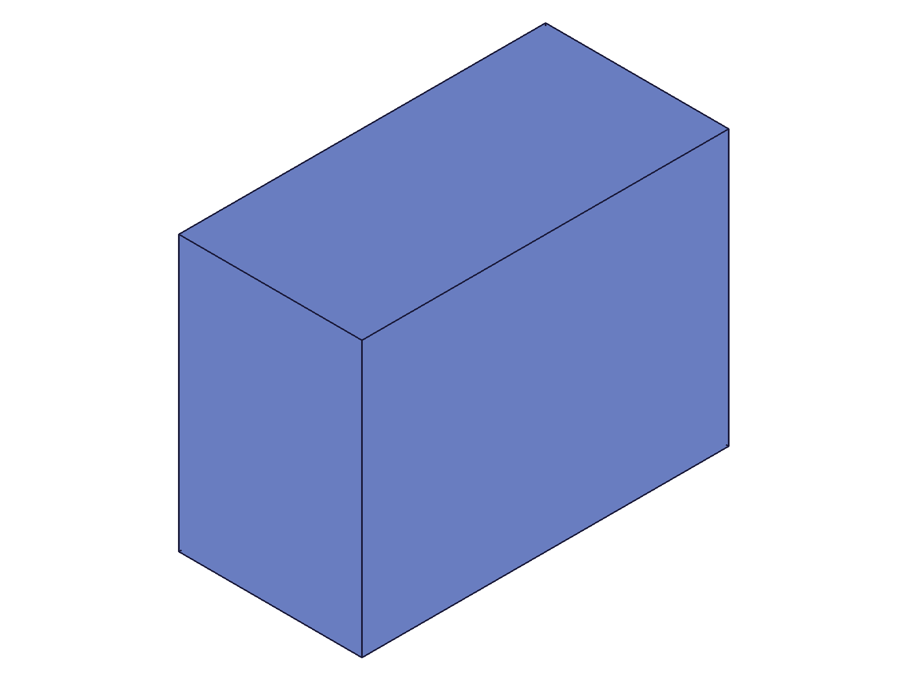

# Training: Api study of `assembly.getInstance`

**Date:** 2026-04-27

## Goal

Verify and extend the existing LLM doc for `assembly.getInstance`. Testing every parameter, return value shape, edge cases, and batch form.

**Methods to cover:**

- `getInstance` — required param: `ownerId`
- `getInstance` — optional param: `name` (filter by instance name)
- `getInstance` — return: single ID (with name), array (without name), VOID on error
- `getInstance` — batch form (array of param objects)

**Questions:**

- What returns when `name` doesn't exist? Empty array or VOID?
- What is the return type for a single match — raw number or wrapped?
- Does batch form return array of arrays?
- Can `ownerId` be an instance (expanded tree lookup)?
- What happens with duplicate-named instances?
- What about `ownerId` pointing to a part template?
- Are results ordered in any predictable way?

---

## 01 — basic happy path (get all + get by name)

Script: `scripts/01-basic-get-all.mjs` — ✅ both modes work as documented.

|  |
|---|

**Data** (`files/01-basic-get-all-basic-results.json`):
- Get all (no name): returns array `[105, 107, 109]`. `typeof` → object, `Array.isArray` → true. maxLevel: 31.
- Get by name ("Beta"): returns raw number `107`. `typeof` → number. maxLevel: 31.
- Messages: empty array `[]` in both cases.

**Learned:** Return type depends on the call mode — array for "get all", single number for "get by name".

## 02 — error cases and not-found

Script: `scripts/02-not-found.mjs` — tested name-not-found, invalid owner types.

**Data** (`files/02-not-found-edge-cases.json`):
- Name not found: returns `[]` (empty array), maxLevel 31, no messages. NOT an error.
- Part template as owner: null, maxLevel 51. Error: "wrong id type! Provide only following id types: [\"assembly\",\"instance\"]"
- Nonexistent ID (99999): null, maxLevel 51. Error: "invalid id!"
- Second `assembly.create` returned VOID (only one root allowed), so "empty asm" case was testing VOID as owner.

**📌 LLM doc:** Not-found is graceful (empty array, no error). Part template rejection confirmed.

## 03 — empty assembly (no instances)

Script: `scripts/03-empty-assembly.mjs` — ✅ empty assembly returns `[]`, not an error.

**Data** (`files/03-empty-assembly-empty-vs-populated.json`):
- Before any instances: result `[]`, maxLevel 31, messages `[]`.
- After adding one instance: result `[105]`, maxLevel 31.

**📌 LLM doc:** Clarify that empty assembly returns empty array, not null/VOID.

## 04 — batch form and duplicate names

Script: `scripts/04-batch-and-duplicates.mjs` — ✅ batch returns mixed array.

**Data** (`files/04-batch-and-duplicates-batch-dup.json`):
- Batch query `[{name:'Alpha'}, {name:'Omega'}, {name:'NoSuch'}]` → result `[105, 111, []]`. Each entry is either a numeric ID (found) or `[]` (not found).
- Batch maxLevel: 31 (no error even for not-found entries).
- Duplicate name "Dup" (IDs 107, 109): getInstance returns 107 (first created). Confirmed.
- Get all: returns `[105, 107, 109, 111]` — matches creation order exactly.

**📌 LLM doc:** Batch returns per-entry results (ID or `[]`). Results are in creation order.

## 05 — instance as owner (expanded tree)

Script: `scripts/05-instance-as-owner.mjs` — ✅ works on assembly instances.

|  |
|---|

**Data** (`files/05-instance-as-owner-instance-owner.json`):
- Sub-assembly template child ID: 115. Sub-assembly instance in root: 117.
- `getInstance({ ownerId: subInst })` → `[118]`. The expanded-tree child has a DIFFERENT ID (118) than the template's child (115).
- `getInstance({ ownerId: subInst, name: 'Child1' })` → 118.
- Root children: `[117]` — only direct children, not recursive.

**📌 LLM doc:** Instance as owner returns expanded-tree children with unique IDs. Direct children only, not recursive.

## 06 — assembly template as owner

Script: `scripts/06-template-as-owner.mjs` — ✅ assembly template accepted as valid owner.

**Data** (`files/06-template-as-owner-template-owner.json`):
- `getInstance({ ownerId: asmTplId })` → `[115, 117]`. Works.
- `getInstance({ ownerId: asmTplId, name: 'C2' })` → 117. Works.
- maxLevel 31 for both.

**Learned:** "assembly" ID type includes both root assemblies AND assembly templates. Only "part" type templates are rejected.
