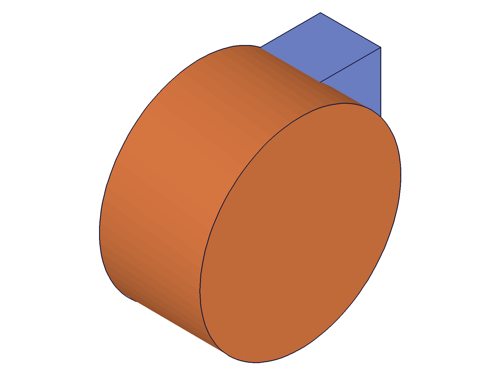

# Training: assembly.deleteInstance

**Date:** 2026-04-27

## Goal

Testing `v1.assembly.deleteInstance` — delete instances from assemblies.

**Methods to cover:**

- `deleteInstance` — basic single-instance deletion
- `deleteInstance` — multi-instance deletion (array)
- `deleteInstance` — empty array (no-op case)
- `deleteInstance` — error: re-delete already-deleted instance
- `deleteInstance` — error: non-instance IDs (part template, assembly)
- `deleteInstance` — ident strings in `ids` array
- `deleteInstance` — verify getInstance reflects deletion
- `deleteInstance` — bidirectional propagation (expanded-tree deletion)
- `deleteInstance` — snapshot verification: geometry disappears after deletion

**Questions:**

- Does deleting an instance immediately remove its geometry from snapshots?
- Does getInstance correctly reflect deletions?
- What's the exact error when re-deleting?
- Does bidirectional propagation from expanded-tree instances really work as documented?
- Can you mix numeric IDs and ident strings in the same `ids` array?

---

## 01 — basic single-instance deletion

Script: `scripts/01-basic-delete.mjs` — ✅ basic delete works as documented.

**Data:** Created 2 instances [105, 107]. Deleted inst1 (105). getInstance returned [107] after. result=null, maxLevel=31.

|  |  |
|---|---|

Snapshots look identical due to auto-scaling (same template, same shape). Data confirms deletion.

## 02 — multi-instance deletion

Script: `scripts/02-multi-delete.mjs` — ✅ multi-delete works. Deleted [inst1, inst3], only inst2 survived.

**Data:** Created 3 instances [105, 107, 109]. After deleting [105, 109], getInstance returned [107]. result=null, maxLevel=31.

## 03 — empty array

Script: `scripts/03-empty-array.mjs` — ✅ empty array is a harmless no-op. result=null, maxLevel=31. Instance still exists after.

## 04 — re-delete already-deleted instance

Script: `scripts/04-re-delete.mjs` — ✅ error as expected. First delete succeeds (maxLevel 31), second returns maxLevel 51.

**Data:** Error messages: WARNING "ToId()/TOID() didn't get an existing or valid id." + ERROR code 1006 "An element of parameter \"ids\" has an invalid id!" (see `files/04-re-delete-re-delete-response.json`)

📌 LLM doc: exact error messages for re-delete.

## 05 — wrong ID types

Script: `scripts/05-wrong-id-types.mjs` — ✅ all three error cases return maxLevel 51.

**Data:**
- Part template ID → "wrong id type! Provide only following id types: [\"instance\"]" (code 1001)
- Assembly ID → same "wrong id type" error (code 1001)
- Nonexistent ID (99999) → "ToId()/TOID() didn't get an existing or valid id." + "An element of parameter \"ids\" has an invalid id!" (code 1006)

📌 LLM doc: assembly ID also rejected (not just part template).

## 06 — ident strings

Script: `scripts/06-ident-strings.mjs` — ✅ ident strings work. Deleted by ident 'my_block_a', maxLevel 31. inst2 survived.

## 07 — mixed numeric IDs and ident strings

Script: `scripts/07-mixed-ids-idents.mjs` — ✅ mixing numeric ID + ident string in same call works. Deleted [inst1, 'block_b'], only inst3 survived. maxLevel 31.

📌 LLM doc: mixed numeric IDs and ident strings work in same `ids` array.

## 08 — delete all instances

Script: `scripts/08-delete-all.mjs` — ✅ deleting all instances at once works. getInstance returns empty array []. Assembly remains valid.

## 09 — partial failure (valid + invalid ID)

Script: `scripts/09-partial-failure.mjs` — ⚠️ **all-or-nothing behavior!** Passing [inst1, 99999] fails the ENTIRE call. Neither instance is deleted.

**Data:** maxLevel=51. After call, instances still [105, 107]. inst1 NOT deleted despite being a valid ID. Error: same "ToId()/TOID()" + "invalid id" pair as re-delete.

📌 LLM doc: CRITICAL — all-or-nothing. If any ID in the array is invalid, nothing is deleted. Validate IDs before calling.

## 10 — bidirectional propagation (expanded-tree → template)

Script: `scripts/10-bidir-propagation.mjs` — ✅ confirmed! Deleting an expanded-tree child propagates to template and all sibling instances.

**Data:**
- Before: template children [115, 117], inst1 expanded [120, 121], inst2 expanded [124, 125]
- Deleted expanded-tree child 120 from inst1
- After: template children [117], inst1 expanded [121], inst2 expanded [125]
- Each scope lost exactly 1 child. Different IDs but same logical position.

📌 LLM doc: bidirectional propagation verified — deletion from expanded tree propagates to template + all sibling instances.

## 11 — delete from template directly

Script: `scripts/11-delete-from-template.mjs` — ✅ confirmed! Deleting a child from the template directly also propagates to all instances.

**Data:**
- Before: template [115, 117], inst1 [120, 121], inst2 [124, 125]
- Deleted template child 115
- After: template [117], inst1 [121], inst2 [125]
- Propagation works in both directions.

📌 LLM doc: template → instances propagation also works.

## 12 — visual verification with different shapes

Script: `scripts/12-visual-verify.mjs` — ⚠️ snapshots do NOT reflect instance deletion.

|  |  |
|---|---|

**Data:** getInstance confirms deletion (only [170] remains). But both snapshots show box + cylinder. Template geometry persists in rendering regardless of instance deletion.

📌 LLM doc: snapshots unreliable for verifying instance deletion. Templates have their own geometry. Use getInstance for verification.

## 13 — delete by name string

Script: `scripts/13-delete-by-name.mjs` — ✅ name strings (not just idents) work in the `ids` array. Passed 'MyBlock' (instance name), deletion succeeded. maxLevel 31.

📌 LLM doc: name strings also resolved — the `ids` array accepts numeric IDs, ident strings, AND name strings.

## 14 — delete and re-add

Script: `scripts/14-delete-top-level-instance.mjs` — ✅ assembly remains fully usable after deletion. Created inst3 after deleting inst1. Final list [inst2, inst3].

## 15 — graphic data verification

Script: `scripts/15-graphic-verify.mjs` — getInstance returns no graphic data (null). Snapshots before/after deletion look identical (same as script 12). Confirmed: renderer shows template geometry, not instance geometry.

## 16 — delete sub-assembly instance

Script: `scripts/16-delete-sub-instance.mjs` — ✅ works. Deleted sub-assembly instance from root. Template children remain intact ([115]).

## 17 — duplicate IDs in array

Script: `scripts/17-duplicate-ids.mjs` — ⚠️ **partial success with error!** Passed [inst1, inst1]. maxLevel=51 BUT inst1 WAS deleted.

**Data:** Error: "ToId()/TOID() didn't get an existing or valid id." + "[Evaluation error in AssemblyBuilder.RemoveInstance:[CCVM::callsf: objId not found]]". inst1 was deleted (not in getInstance after), inst2 survived.

This DIFFERS from script 09: in 09, the invalid ID (99999) fails pre-validation → nothing deleted. In 17, both IDs pass pre-validation (both refer to existing inst1), first processes successfully, second fails at execution → first deletion sticks.

📌 LLM doc: CRITICAL nuance — pre-validation failure = total rollback. Execution-time failure (e.g., duplicate) = partial success. Avoid duplicate IDs.

## 18 — missing/null ids parameter

Script: `scripts/18-no-param.mjs` — ✅ both error correctly.

**Data:**
- Missing `ids`: error 1004 "The parameter \"ids\" must be provided in the api call!"
- null `ids`: error 1001 "Set the parameter \"ids\" = VOID is not allowed in this situation!"

---

## Coverage Checklist

- [x] API called successfully (01)
- [x] Required parameter `ids` tested (01-18)
- [x] Numeric IDs, ident strings, name strings all work (01, 06, 07, 13)
- [x] Empty array, missing param, null param edge cases (03, 18)
- [x] Error: re-delete, wrong type, nonexistent (04, 05)
- [x] All-or-nothing behavior with mixed valid/invalid (09)
- [x] Duplicate ID behavior (17)
- [x] Bidirectional propagation — expanded tree → template + siblings (10)
- [x] Template → instances propagation (11)
- [x] Delete sub-assembly instance (16)
- [x] Assembly usable after deletion (14)
- [x] Visual verification — snapshots show template geometry (12, 15)
