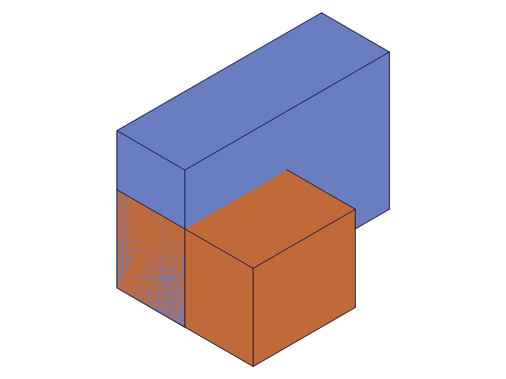
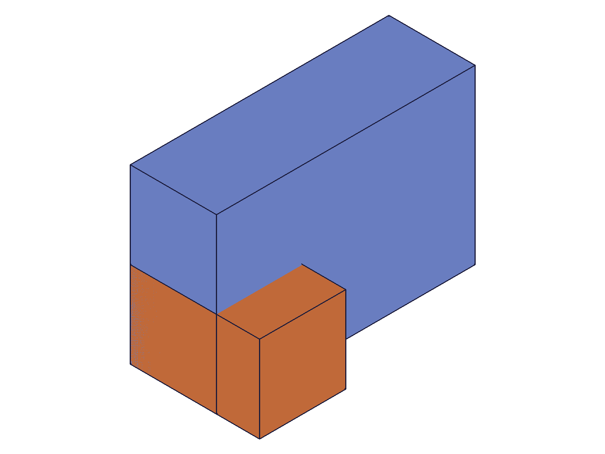
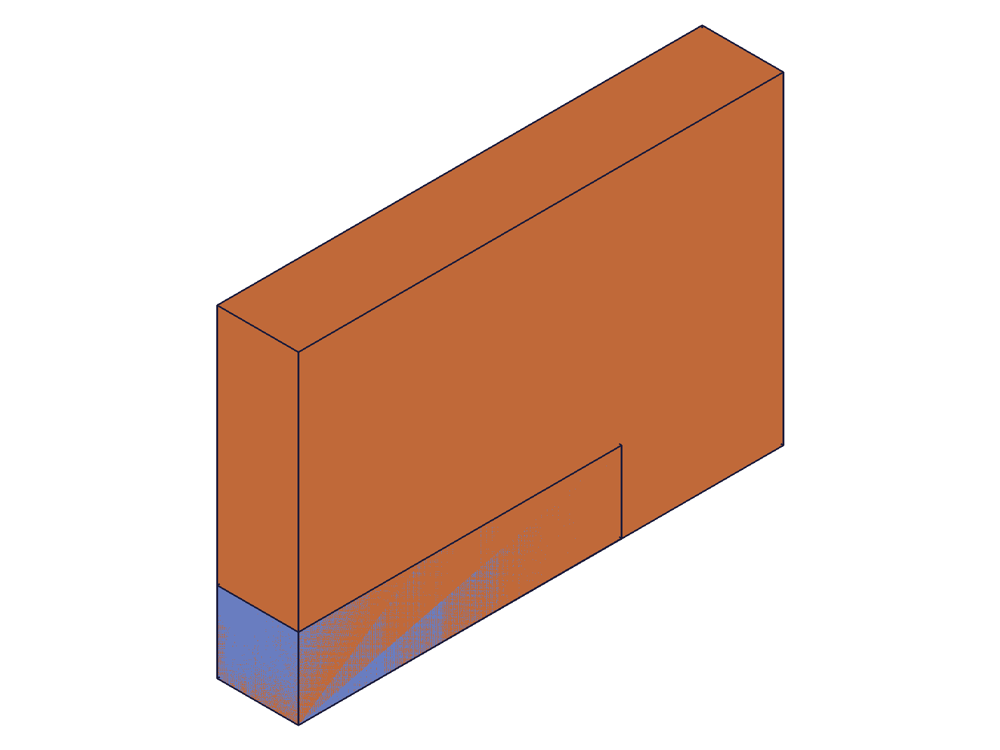
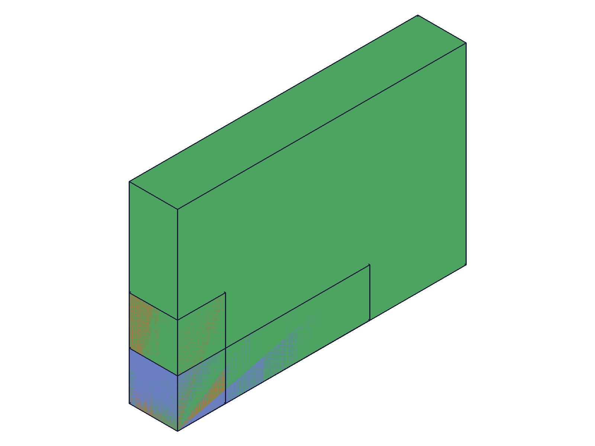
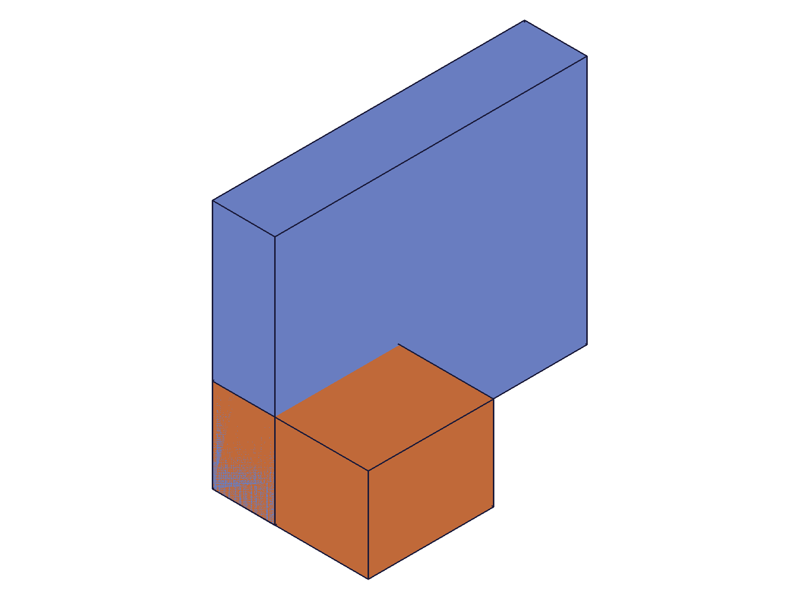

# Training: assembly.fastened

**Date:** 2026-04-27

## Goal

Testing `v1.assembly.fastened` — the fastened constraint that rigidly locks two instances together via their work coordinate systems.

**Methods to cover:**

- `fastened` — basic creation with mate1+mate2, each referencing instance path and csys
- `fastened` params: id, name, mate1 (path, csys, flip, reorient), mate2 (path, csys, flip, reorient)
- `fastened` offset params: xOffset, yOffset, zOffset
- `fastened` rotation params: xRotation, yRotation, zRotation (radians + "deg" string)
- `fastened` useCurrentTransform flag
- Batch creation (array of params)
- Error cases: invalid mate paths, missing csys, self-referencing

**Questions:**

- How does the mate path work? Single instance ID vs full path for nested assemblies?
- What does flip do? How does reorient interact with it?
- Does fastened override transformation set on `instance()`?
- What happens with offsets + rotations together?
- What's the return value — constraint ID?
- Does `useCurrentTransform` compute offsets from current positions?

---

## 01 — basic fastened constraint

Script: `scripts/01-basic-fastened.mjs` — ✅ Creates a fastened constraint between two instances with WCS at origin. Returns constraint ID (270), maxLevel 31.

|  |  |
|---|---|

**Data:** `result: 270`, `messages: []`, `maxLevel: 31`. Both WCS at origin, so constraint aligns them at same position — no visible change.

**Learned:** `fastened` returns a numeric constraint ID. maxLevel 31 (info) on success. Both mate1 and mate2 require `path` (array with instance ID) and `csys` (WCS ID from the template).

## 02 — offsets

Script: `scripts/02-offsets.mjs` — ✅ xOffset/yOffset/zOffset position mate2 relative to mate1's coordinate system. Negative offsets work.

|  |  |
|---|---|

**Data:** First constraint (xOffset=20, zOffset=10): result=212 maxLevel=31. Negative offset (xOffset=-20, yOffset=10): result=276 maxLevel=31. Both succeed.

**Learned:** Offsets position the mate2 csys relative to mate1 csys. Zero offsets are default. Multiple fastened constraints can reference the same mate1 instance.

## 03 — rotations

Script: `scripts/03-rotations.mjs` — ✅ All rotation formats work: radians (`Math.PI/2`), degree strings (`'45deg'`), and combined x+z rotation.

|  |  |
|---|---|

**Data:** rad90 result=212, deg45 result=276, combo result=340 — all maxLevel 31. See `files/03-rotations-rotation-results.json`.

**Learned:** `xRotation`/`yRotation`/`zRotation` accept both `real` (radians) and `string` (e.g., `'45deg'`, `'90deg'`). Multiple rotations combine. Rotations are of mate2 around mate1's axes.
**📌 LLM doc:** Document dual rotation syntax (radians + deg string).

## 04 — flip and reorient

Script: `scripts/04-flip-reorient.mjs` — ✅ All 6 flip values (`Z`, `-Z`, `X`, `-X`, `Y`, `-Y`) and all 4 reorient values (`'0'`, `'90'`, `'180'`, `'270'`) accepted successfully.

|  |  |
|---|---|

**Data:** All 10 constraints returned numeric IDs with maxLevel 31. See `files/04-flip-reorient-flip-results.json` and `files/04-flip-reorient-reorient-results.json`.

**Learned:** `flip` defines the main axis alignment of the mate. Default is `'Z'`. `reorient` rotates around the main axis in 90° steps. Both are strings, not numbers.
**📌 LLM doc:** Document flip/reorient values and defaults.

## 05 — useCurrentTransform

Script: `scripts/05-useCurrentTransform.mjs` — ✅ With `useCurrentTransform: true`, the constraint calculates offsets/rotations to preserve the instance's current position.

**Data:** Instance created at transformation `[[50, 30, 25], ...]`. After fastened with `useCurrentTransform: true`, `getFastened` returns `xOffset: 50, yOffset: 30, zOffset: 25, all rotations: 0`.

**Learned:** `useCurrentTransform` reverse-computes the constraint parameters from the instances' current transforms. Useful for "lock where they are" workflows. Also confirmed `getFastened` return structure: `{ id, name, mate1: { path, csys, flip, reorient }, mate2: {...}, xOffset, yOffset, zOffset, xRotation, yRotation, zRotation }`.
**📌 LLM doc:** Document useCurrentTransform behavior and getFastened return structure.

## 06 — batch creation

Script: `scripts/06-batch.mjs` — ✅ Array of param objects creates multiple constraints at once.

**Data:** `result: [200, 204, 208, 212]` — array of 4 constraint IDs. maxLevel 31.

**Learned:** Batch creation via `fastened([{...}, {...}])` returns array of IDs. Same pattern as `instance` batch.
**📌 LLM doc:** Document batch syntax.

## 07 — error cases

Script: `scripts/07-errors.mjs` — ✅ All 6 error scenarios return `null` with maxLevel 51.

**Error catalog:**

| Scenario | Error message | Code |
|---|---|---|
| Missing mate2 | `"mate2" must be provided in the api call!` | 1004 |
| Bad path ID | `An element of parameter "path" has an invalid id!` | 1006 |
| Bad csys ID | `An element of parameter "csys" has an invalid id!` | 1006 |
| Self-constraint | `mate1 and mate2 cannot be used in this combination... same rigid set` | 1014 |
| Missing id | `"id" must be provided to create CC_FastenedConstraint` | 1004 |
| Template in path | `"path" has a wrong id type! Provide only following id types: ["instance"]` | 1001 |

**📌 LLM doc:** Document error messages and common mistakes.

## 08 — duplicate names

Script: `scripts/08-duplicate-names.mjs` — ✅ Duplicate constraint names are allowed.

**Data:** Two constraints named "SameName" (IDs 123 and 127). `getFastened({ name: 'SameName' })` returns the first (ID 123). Default name is "Fastened".

**Learned:** No uniqueness enforcement on constraint names. `getFastened` returns first match. Omitting `name` uses "Fastened" as default.
**📌 LLM doc:** Document duplicate name behavior.

## 09 — nested path (failed — script bug)

Script: `scripts/09-nested-path.mjs` — ❌ Script bug: accessed `.id` on numeric values from `getInstance`. See script 10 for fix.

## 10 — nested path (fixed)

Script: `scripts/10-nested-path-fix.mjs` — Mixed results. Key findings about mate path semantics.

**Results:**

| Path format | Result |
|---|---|
| `[subAsmInst, etChild]` (parent + child) | ❌ Error: "Mate path must contain either a single instance from expanded tree or one or more instances from templates." |
| `[etChild]` (ET child directly) | ✅ Returns 214, maxLevel 31 |
| `[subAsmInst]` (sub-assembly only) | ❌ Error: csys not found on mate path |

**Learned:** For constraining parts inside sub-assemblies, use the expanded tree child ID (CC_ProductReferenceET) directly as `path: [etChildId]`. Do NOT use nested multi-element paths with ET children. The docs say "full mate path" but for ET instances, a single-element path is correct.
**📌 LLM doc:** Critical — document path semantics for sub-assemblies.

## 11 — constraint overrides transformation

Script: `scripts/11-overrides-transform.mjs` — ✅ Fastened constraint overrides the instance's initial `transformation` param.

|  |  |
|---|---|

**Data:** Instance created at `[[100, 100, 100], ...]`, then constrained with `xOffset: 25, zOffset: 10`. `getFastened` confirms offsets are 25/0/10. Also `fastenedOrigin` on the same assembly succeeds (ID 332, maxLevel 31).

**Learned:** Fastened constraint repositions the instance — the constraint solver overrides the initial transformation. `fastenedOrigin` and `fastened` can coexist in the same assembly.
**📌 LLM doc:** Document that constraint overrides instance transformation.
