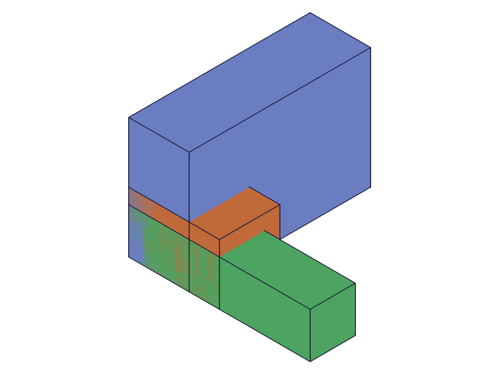

# Training: assembly.updateFastened

**Date:** 2026-04-27

## Goal

Testing `v1.assembly.updateFastened` — updates an existing fastened constraint's params (offsets, rotations, mates, name, useCurrentTransform). Also testing `v1.assembly.getFastened` for verification.

**Methods to cover:**

- `updateFastened` — basic: change xOffset on existing constraint
- `updateFastened` — update rotations (radians + deg string)
- `updateFastened` — update mate1/mate2 (csys, flip, reorient)
- `updateFastened` — update name
- `updateFastened` — useCurrentTransform flag
- `updateFastened` — multiple params at once
- `updateFastened` — batch (array of params)
- `updateFastened` — partial update (unset params preserved)
- `updateFastened` — error cases (invalid ID, etc.)
- `getFastened` — retrieve by name, verify full return structure

**Questions:**

- Does `updateFastened` take the constraint ID or the assembly ID?
- What does it return — the same constraint ID, or VOID?
- Does partial update truly preserve unset params?
- Can you change mates to different instances after creation?
- Does `useCurrentTransform` recompute offsets/rotations from current transform?
- Can you update a batch of constraints at once?

---

## 01 — basic offset update

Script: `scripts/01-basic-update-offset.mjs` — ✅ `updateFastened` takes the constraint ID, returns the same constraint ID, and preserves unset params.

|  |  |
|---|---|

**Data:** Created with xOffset=10, yOffset=0, zOffset=5. After `updateFastened({ id: cId, xOffset: 50 })`: result=212, maxLevel=31. `getFastened` confirms xOffset=50, yOffset=0, zOffset=5. Unset params preserved. See `files/01-basic-update-offset-before-update.json` and `files/01-basic-update-offset-after-update.json`.

**Learned:** `updateFastened` takes the constraint ID (returned by `fastened`), not the assembly ID. Returns the same constraint ID on success. maxLevel 31. Partial update: only the params you pass are changed.
**📌 LLM doc:** Document that `id` param is the constraint ID. Returns same constraint ID. Partial update preserves unset params.

## 02 — rotation updates

Script: `scripts/02-update-rotations.mjs` — ✅ All rotation formats work: radians, degree strings, and combined multi-axis.

**Data:**
- `zRotation: Math.PI/4` → getFastened shows zRotation=0.785 ✅
- `zRotation: '90deg'` → getFastened shows zRotation=1.571 ✅
- `xRotation: '45deg', yRotation: Math.PI/6` → getFastened shows x=0.785, y=0.524, z=1.571 (z preserved from prior update) ✅

See `files/02-update-rotations-after-combo-rotation.json`.

**Learned:** Rotation updates accept radians and `'Ndeg'` string syntax. When updating only x+y rotations, z is preserved — partial update confirmed again. Values stored internally as radians regardless of input format.
**📌 LLM doc:** Document rotation update syntax and that values are stored as radians.

## 03 — name update

Script: `scripts/03-update-name.mjs` — ✅ Name update changes the constraint's name. Old name becomes unfindable via `getFastened`.

**Data:** Renamed from "OriginalName" to "RenamedConstraint". `getFastened({ name: 'OriginalName' })` → null, maxLevel 51. `getFastened({ name: 'RenamedConstraint' })` → id=212 ✅. See `files/03-update-name-name-lookup.json`.

**Learned:** Name update works. After renaming, `getFastened` with the old name returns VOID/error. The new name is immediately queryable.
**📌 LLM doc:** Document name update and that old name is no longer found.

## 04 — flip and reorient update

Script: `scripts/04-update-flip-reorient.mjs` — ✅ Flip and reorient can be updated independently on each mate. Updates to one mate don't affect the other.

**Data:**
- Initial: mate1 flip="Z" reorient="0", mate2 flip="Z" reorient="0"
- After `mate1: { flip: '-Z' }`: mate1 flip="-Z", reorient="0" preserved ✅
- After `mate2: { flip: 'X', reorient: '90' }`: mate2 flip="X", reorient="90" ✅, mate1 unchanged
- After `mate1: { reorient: '180' }`: mate1 flip="-Z" preserved, reorient="180" ✅

Snapshots all look similar due to auto-scaling, but data from `getFastened` confirms all changes. See `files/04-update-flip-reorient-*.json`.

**Learned:** Mate sub-properties (flip, reorient) can be updated independently. Setting only `flip` in a mate update preserves the mate's other properties (path, csys, reorient). Updates to mate1 don't affect mate2.
**📌 LLM doc:** Document that mate sub-properties update independently — partial mate updates preserve unset sub-properties.

## 05 — csys update

Script: `scripts/05-update-mate-csys.mjs` — ✅ Can change which WCS a mate references after constraint creation.

**Data:** Base template has wcsA (origin 0,0,0) and wcsB (origin 60,40,20). Created with wcsA (ID 107). After `updateFastened({ id: cId, mate1: { csys: wcsB } })`: result=220, maxLevel=31. getFastened confirms mate1.csys=115 (wcsB). See `files/05-update-mate-csys-after-wcsB.json`.

**Learned:** You can change the WCS reference in a mate after creation. The constraint solver repositions the constrained instance based on the new WCS.
**📌 LLM doc:** Document csys update capability.

## 06 — useCurrentTransform

Script: `scripts/06-useCurrentTransform.mjs` — ✅ `useCurrentTransform: true` recomputes offsets/rotations from current instance positions. When combined with explicit offsets, the offsets are ignored.

**Data:**
- Created with xOffset=10, yOffset=5, zOffset=3. After `updateFastened({ id: cId, useCurrentTransform: true })`: offsets remain 10/5/3 (instance was already at constrained position, so recomputed values match).
- After `updateFastened({ id: cId, useCurrentTransform: true, xOffset: 999, yOffset: 888 })`: offsets still 10/5/3 — explicit offsets were **ignored**. See `files/06-useCurrentTransform-useCurrentTransform-with-offsets.json`.

**Learned:** `useCurrentTransform: true` overrides any explicit offset/rotation values. It recalculates the offsets from the instances' current transforms. If the instance is already at the constrained position, the values stay the same.
**📌 LLM doc:** Document that useCurrentTransform ignores explicit offsets/rotations when true.

## 07 — multi-param update

Script: `scripts/07-multi-param-update.mjs` — ✅ Multiple params (name, offsets, rotation, mate flip) updated in a single call.

**Data:** `updateFastened({ id, name: 'MultiUpdated', xOffset: 40, yOffset: -10, zOffset: 15, zRotation: '30deg', mate1: { flip: '-Z' } })` → result=212, maxLevel=31. getFastened confirms all values: name="MultiUpdated", x=40, y=-10, z=15, zRotation=0.524, mate1.flip="-Z". See `files/07-multi-param-update-after-multi-update.json`.

**Learned:** All param types (name, offsets, rotations, mate sub-properties) can be combined in a single update call.

## 08 — batch update

Script: `scripts/08-batch-update.mjs` — ✅ Array of update params updates multiple constraints at once.

**Data:** `updateFastened([{ id: c1, xOffset: 100, name: 'C1_updated' }, { id: c2, xOffset: 200, zRotation: '45deg', name: 'C2_updated' }])` → result=[287, 291], maxLevel=31. Both constraints verified via getFastened. See `files/08-batch-update-batch-verify.json`.

**Learned:** Batch update via array returns array of constraint IDs. Same pattern as batch create.
**📌 LLM doc:** Document batch update syntax.

## 09 — partial preservation (comprehensive)

Script: `scripts/09-partial-preservation.mjs` — ✅ All 12 non-updated fields preserved when only xOffset is changed.

**Data:** Created constraint with: name="Full", all 3 offsets nonzero, all 3 rotations nonzero (via deg strings), mate1 flip="-Z" reorient="90", mate2 flip="X" reorient="180". Updated only xOffset (10→99). Preservation check — all 12 fields preserved: name ✅, yOffset ✅, zOffset ✅, xRotation ✅, yRotation ✅, zRotation ✅, mate1.flip ✅, mate1.reorient ✅, mate2.flip ✅, mate2.reorient ✅, mate1.csys ✅, mate2.csys ✅. See `files/09-partial-preservation-preservation-check.json`.

**Learned:** Definitive proof: `updateFastened` preserves every unset param. This matches the docs ("If optional parameters are not set, the constraint will keep the existing values").
**📌 LLM doc:** Confirm partial update preservation.

## 10 — error cases

Script: `scripts/10-error-cases.mjs` — ✅ All 6 error scenarios return null with maxLevel 51. Original constraint undamaged after errors.

**Error catalog:**

| Scenario | Error message | Code |
|---|---|---|
| Invalid constraint ID | `The provided constraint id does not exist.` | 1006 |
| Missing id param | `"id" must be provided for update.` | 1004 |
| Invalid csys | `An element of parameter "csys" has an invalid id!` | 1006 |
| Invalid flip | `Type "INVALID" is not supported to use as flip type.` | 1013 |
| Invalid reorient | `Type "45" is not supported to use as reorient type.` | 1013 |
| Assembly ID (wrong type) | `The provided id for the constraint is not a constraint or relation.` | 1007 |

After all 6 errors, the original constraint verified intact (xOffset still 30). See `files/10-error-cases-error-catalog.json`.

**Learned:** Failed updates don't corrupt existing constraints. Error messages are descriptive. Common mistake: passing assembly ID instead of constraint ID.
**📌 LLM doc:** Document error messages and that failed updates are safe.

## 11 — update mate path (swap instance)

Script: `scripts/11-update-mate-path.mjs` — ✅ Can change which instance a mate points to after creation.

|  |  |
|---|---|

**Data:** Created with mate2 path=[297] (inst2=Block 20x20x30). After `updateFastened({ id: cId, mate2: { path: [inst3], csys: wcs3 } })`: result=305, maxLevel=31. getFastened confirms mate2.path=[299] (inst3=Tall 15x15x60). See `files/11-update-mate-path-after-path-change.json`.

**Learned:** You can retarget a constraint to a completely different instance. Must also provide the csys for the new instance's template. The constraint solver repositions the new target instance.
**📌 LLM doc:** Document instance retargeting via path update.

## 12 — reset to zero

Script: `scripts/12-reset-to-zero.mjs` — ✅ All offsets, rotations, flip, and reorient can be reset to defaults.

**Data:**
- Created with xOffset=50, yOffset=25, zOffset=10, zRotation='45deg'. After resetting all to 0: confirmed x=0, y=0, z=0, zRot=0. ✅
- Set flip="-X", reorient="270". Then reset to flip="Z", reorient="0". Confirmed. ✅

See `files/12-reset-to-zero-after-reset.json` and `files/12-reset-to-zero-after-flip-reset.json`.

**Learned:** Zero is a valid value for offsets/rotations, and default flip/reorient values ("Z"/"0") can be explicitly set. No special "reset" API needed.

## 13 — getFastened detail

Script: `scripts/13-getFastened-detail.mjs` — ✅ Comprehensive `getFastened` testing.

**Data:**
- Lookup by name: `getFastened({ id: asmId, name: 'First' })` → result with id=212 ✅
- Non-existent name: result=null, maxLevel=51, error: `There couldn't be found a constraint with name "NonExistent" on product or product reference with id $12`
- Instance ID instead of assembly: result=null, maxLevel=51, error: `The provided product or product reference id is not a Assembly.`
- Full return keys: `[id, mate1, mate2, name, xOffset, xRotation, yOffset, yRotation, zOffset, zRotation]`
- Mate keys: `[csys, flip, path, reorient]`

See `files/13-getFastened-detail-get-nonexistent.json` and `files/13-getFastened-detail-get-via-instance.json`.

**Learned:** `getFastened` requires the assembly ID (not instance ID). Returns the full constraint state. Non-existent names return null with descriptive error.
**📌 LLM doc:** Document getFastened return structure, errors, and that it requires assembly ID.
