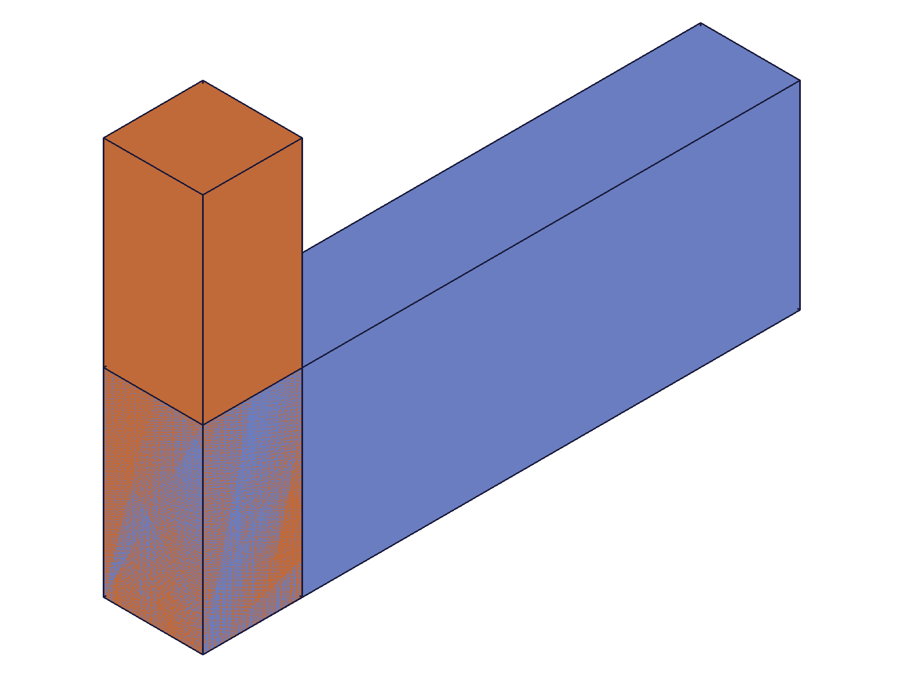
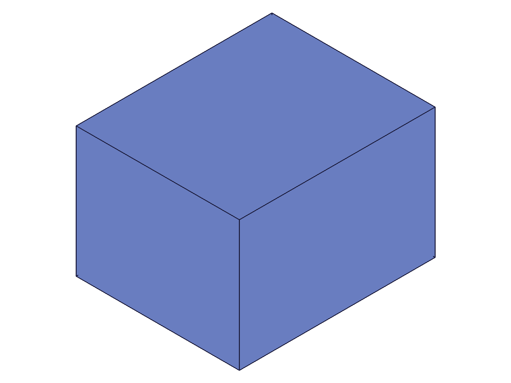
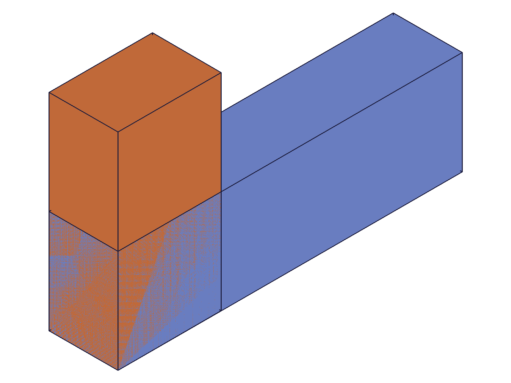
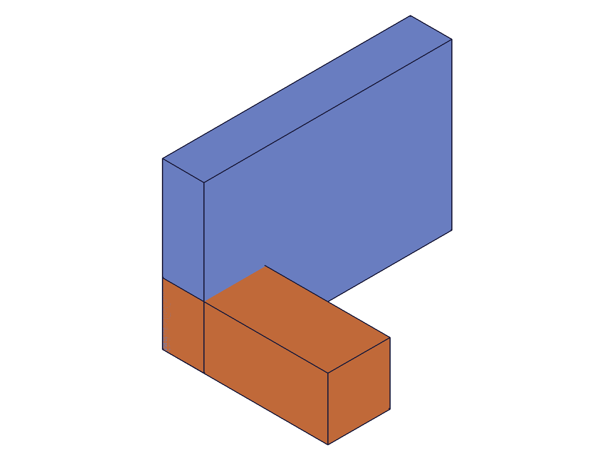

# Training: assembly.fastenedOrigin

**Date:** 2026-04-29

## Goal

Testing `v1.assembly.fastenedOrigin` — a constraint that locks an instance to the assembly origin using a single mate (unlike `fastened` which uses two mates).

**Methods to cover:**

- `fastenedOrigin` — basic creation with default params
- `fastenedOrigin` params: `id`, `name`, `mate1` (path, csys, flip, reorient), offsets (x/y/z), rotations (x/y/z), `useCurrentTransform`
- Rotation via radians and degree-string syntax (`'45deg'`)
- `flip` variants: X, -X, Y, -Y, Z, -Z
- `reorient` variants: 0, 90, 180, 270
- Batch creation (array of params)
- `useCurrentTransform` flag behavior
- Error cases (missing params, invalid IDs, etc.)

**Questions:**

- How does fastenedOrigin differ from fastened in practice? (Single mate → positions relative to global origin?)
- What does the constraint solver do with the instance position?
- Can multiple fastenedOrigin constraints reference the same instance?
- How do flip/reorient interact with offsets/rotations?
- Does useCurrentTransform reverse-compute offsets from current instance position?

---

## 01 — basic fastenedOrigin

Script: `scripts/01-basic.mjs` — ✅ basic creation works. Instance placed at [100,50,30] then constrained to origin.

|  |  |
|---|---|

**Data:** result=148 (constraint ID), maxLevel=31 (info), empty messages. Before/after snapshots look identical due to auto-scaling on single body (only position changed, not shape).

**Learned:** `fastenedOrigin` returns a numeric constraint ID. maxLevel 31 on success. The constraint overrides the instance's initial `transformation`.

## 02 — offsets (x/y/z)

Script: `scripts/02-offsets.mjs` — ✅ all five offset combinations succeed (maxLevel 31).

**Data:** No offset → ID 127, xOffset=50 → 131, yOffset=50 → 135, zOffset=50 → 139, all three → 143. All maxLevel 31. See `files/02-offsets-offset-results.json`.

**Learned:** Offsets are independent (x, y, z can be set individually or combined). No restrictions on values.

## 03 — rotations (radians)

Script: `scripts/03-rotations-radians.mjs` — ✅ all four rotation variants succeed.

|  |
|---|

**Data:** no rotation → 162, xRot π/2 → 166, yRot π/2 → 170, zRot π/2 → 174. All maxLevel 31. See `files/03-rotations-radians-rotation-results.json`.

**Learned:** Rotation params accept radians (numeric). Each axis rotated independently. L-shaped template visible at different orientations in snapshot confirms visual rotation.

## 04 — degree string syntax

Script: `scripts/04-degree-strings.mjs` — ✅ degree strings work: `'45deg'`, `'90deg'`, `'180deg'`.

**Data:** 0deg → 135, 45deg → 139, 90deg → 143, 180deg → 147. All maxLevel 31.

**Learned:** Rotation params accept string format `'Ndeg'` (e.g., `'45deg'`). Server converts internally to radians. getFastenedOrigin returns the radian equivalent (e.g., `'30deg'` → `0.5235987755982988`).

📌 LLM doc: Document degree string syntax for rotation params.

## 05 — flip variants

Script: `scripts/05-flip.mjs` — ✅ all 6 flip values accepted: `Z`, `-Z`, `X`, `-X`, `Y`, `-Y`.

|  |
|---|

**Data:** All 6 return constraint IDs with maxLevel 31 (119, 125, 131, 137, 143, 149). See `files/05-flip-flip-results.json`.

**Learned:** All flip values are valid. Flip controls which WCS axis aligns with the global main axis, affecting instance orientation. Snapshot shows single-body overlaps (hard to distinguish visually with identical box shapes), but data confirms all succeed.

## 06 — reorient variants

Script: `scripts/06-reorient.mjs` — ✅ all 4 reorient values: `'0'`, `'90'`, `'180'`, `'270'`.

|  |
|---|

**Data:** All 4 return constraint IDs with maxLevel 31 (156, 162, 168, 174). See `files/06-reorient-reorient-results.json`. Two-body L-shape template visible at different orientations.

**Learned:** Reorient values are STRINGS (`'0'`, `'90'`, `'180'`, `'270'`). They rotate around the main axis (defined by flip) in 90° steps.

📌 LLM doc: reorient values must be strings, not numbers.

## 07 — useCurrentTransform

Script: `scripts/07-use-current-transform.mjs` — ✅ useCurrentTransform reverse-computes offsets from current position.

**Data:** Instance at transformation `[[80,40,25],[1,0,0],[0,1,0]]`, WCS at `[20,15,10]`. With `useCurrentTransform: 1`, constraint created (ID 148, maxLevel 31). getFastenedOrigin returned: `xOffset: 80, yOffset: 40, zOffset: 25` — matches the instance transformation origin, NOT the WCS position in global space.

**Learned:** `useCurrentTransform` (pass `1` for TRUE) locks the instance at its current position by computing the offsets. The computed offsets equal the instance transformation origin, confirming that offsets define instance origin position (WCS position within template is irrelevant for positioning). `useCurrentTransform` also computes rotations (all 0 in this test since orientation was identity).

📌 LLM doc: Critical finding — WCS position does not affect instance positioning. Offsets define instance origin position.

## 08 — batch creation

Script: `scripts/08-batch.mjs` — ✅ batch creation works with array of param objects.

|  |
|---|

**Data:** `fastenedOrigin([{...}, {...}, {...}])` returns `[123, 127, 131]` (array of IDs). `Array.isArray(r.result) = true`. maxLevel 31.

**Learned:** Batch creation works identically to `fastened` — pass array, get array back.

## 09 — getFastenedOrigin

Script: `scripts/09-get-fastened-origin.mjs` — ✅ get works with assembly ID, ❌ fails with instance ID and nonexistent name.

**Data:**
- Get with assembly ID: returns full constraint object with id, name, mate1 (csys, flip, path, reorient), offsets, rotations. `zRotation: '30deg'` returned as `0.5235987755982988` (radians). maxLevel 31.
- Get with instance ID: returns `null`, maxLevel 51.
- Get with nonexistent name: returns `null`, maxLevel 51. Error: "There couldn't be found a constraint with name 'NoSuchConstraint'...".

**Learned:** `getFastenedOrigin({ id, name })` requires the assembly or product ID (not instance ID). Returns the constraint as a structured object with all params. Degree strings are converted to radians in the return value.

📌 LLM doc: getFastenedOrigin requires assembly ID, not instance ID. Returns radians for rotation values.

## 10 — error cases

Script: `scripts/10-errors.mjs` — ✅ all 7 error scenarios return descriptive errors.

**Data:** See `files/10-errors-error-results.json`. All return `null` result, maxLevel 51:
- Missing mate1: `"mate1" must be provided` (code 1004)
- Missing id: `"id" must be provided to create CC_FastenedOriginConstraint` (code 1004)
- Invalid path ID: `ToId()/TOID() didn't get an existing or valid id.` (code 1006)
- Template in path: `"path" has a wrong id type! ["instance"]` (code 1001)
- Invalid csys: `ToId()/TOID() didn't get an existing or valid id.` (code 1006)
- Missing csys: `"csys" must be provided` (code 1004)
- Missing path: `"path" must be provided` (code 1004)

**Learned:** Error messages are consistent with `fastened`. All required params (id, mate1, mate1.path, mate1.csys) produce clear error messages when missing.

📌 LLM doc: Document common errors table.

## 11 — offset semantics (WCS position vs instance position)

Script: `scripts/11-offset-semantics.mjs` — ✅ confirmed WCS position does NOT affect instance positioning.

**Data:** Mass properties (center of gravity) for 30x20x15 boxes:
- WCS at [0,0,0], no offset: CoG [15, 10, 7.5] → instance origin at [0,0,0] ✓
- WCS at [0,0,0], xOffset=50: CoG [65, 10, 7.5] → instance origin at [50,0,0] ✓
- WCS at [15,10,7.5], no offset: CoG [15, 10, 7.5] → instance origin at [0,0,0] ✓
- WCS at [15,10,7.5], xOffset=50: CoG [65, 10, 7.5] → instance origin at [50,0,0] ✓

Instances 1&3 and 2&4 have identical positions despite different WCS positions. The WCS position within the template has zero effect on the instance's global position.

**Learned:** In `fastenedOrigin`, the WCS is used for ORIENTATION only (axis alignment via flip/reorient). The offsets directly set the instance origin position in global space. This differs from `fastened` where WCS positions define alignment points.

📌 LLM doc: Critical difference from fastened — WCS position irrelevant for positioning.

## 12 — multiple constraints on same instance + duplicate names

Script: `scripts/12-duplicate-on-instance.mjs` — ✅ multiple fastenedOrigin on same instance allowed. Duplicate names allowed.

**Data:** First FO on inst: ID 119, maxLevel 31. Second FO on same inst: ID 123, maxLevel 31. No error. Duplicate name ('FO_first' used twice on different instances): ID 129, maxLevel 31.

**Learned:** Unlike `fastened` (which blocks self-referencing), `fastenedOrigin` allows multiple constraints on the same instance — each succeeds independently. Duplicate constraint names are also allowed (consistent with `fastened`).

📌 LLM doc: Multiple fastenedOrigin on same instance allowed.

## 13 — mixed with fastened

Script: `scripts/13-with-fastened.mjs` — ✅ fastenedOrigin + fastened coexist without conflict.

|  |
|---|

**Data:** fastenedOrigin on Base: ID 212, maxLevel 31. fastened (Base→Tower): ID 216, maxLevel 31. Visual shows base (blue) with tower (orange) sitting on top.

**Learned:** Common pattern: fastenedOrigin locks one instance at the origin, then fastened constraints position other instances relative to it.

## 14 — sub-assembly (expanded tree)

Script: `scripts/14-sub-assembly.mjs` — ❌ fastenedOrigin with sub-assembly instance fails when using part WCS not reachable from path.

**Data:** fastenedOrigin with `path: [subAsmInst], csys: partWcs` → maxLevel 51: "The provided csys with id = $107 for mate1 does not exist on the given mate path of mate1." The WCS belongs to the part template, but the path points to the sub-assembly instance. ET children are returned as an array of numeric IDs `[128, 129]`.

**Learned:** The `csys` must be reachable from the instance in `path`. For sub-assembly instances, you can't use a WCS from a child part template — you need to use an ET child path instead.

## 15 — WCS orientation effect

Script: `scripts/15-wcs-orientation.mjs` — ✅ non-identity WCS orientation works.

**Data:** Both identity WCS (ID 127) and 45°-rotated WCS (ID 133) succeed with maxLevel 31. The rotated WCS should have rotated the instance to align the WCS axes with global axes.

**Learned:** The WCS orientation (xDirection, yDirection) defines how the instance is rotated during constraint solving. A rotated WCS causes the instance to counter-rotate so the WCS axes align with global axes.

## 16 — rotation center verification

Script: `scripts/16-rotation-center.mjs` — ✅ confirmed transformation model: rotation first, then offset.

**Data:** Mass properties for 60x10x10 bar:
- center-rot (WCS center, no offset, zRot=45°): CoG [17.68, 24.75, 5.0]
- corner-rot (WCS corner, yOffset=80, zRot=45°): CoG [17.68, 104.75, 5.0]
- no-rot (yOffset=-40): CoG [30, -35, 5]

**Verification:** center-rot: bar center [30,5,5] rotated 45° → [cos45*30-sin45*5, sin45*30+cos45*5, 5] = [17.68, 24.75, 5] ✓. corner-rot: same rotation result + yOffset=80 → [17.68, 24.75+80, 5] = [17.68, 104.75, 5] ✓.

**Learned:** The transformation order is: (1) place instance at global origin, (2) apply rotation around global origin, (3) apply offset translation. The WCS position does not affect any of these steps — both center and corner WCS produce identical pre-offset rotated positions.

📌 LLM doc: Document transformation order (rotate then translate).

## 17 — sub-assembly with ET child path

Script: `scripts/17-sub-asm-with-wcs.mjs` — ✅ ET child single-element path works, ❌ multi-element path fails.

**Data:**
- `path: [etChildId]` with part's WCS: result=132, maxLevel=31 ✓
- `path: [subAsmInst, subInst]` (multi-element): result=null, maxLevel=51. Error: "Mate path is not correct. The last element in the mate path is not a direct child of the assembly."

**Learned:** For sub-assembly instances, use single-element path with the ET child ID (`CC_ProductReferenceET`). Do NOT use multi-element paths — the same rule as `fastened`.

📌 LLM doc: ET child path semantics identical to fastened.
