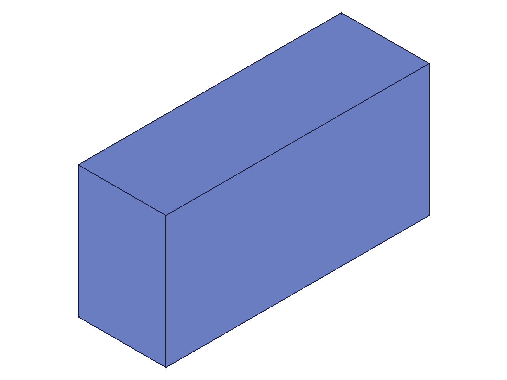
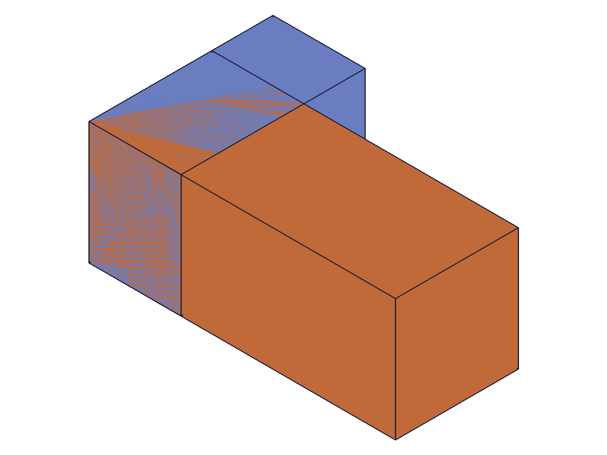

# Training: assembly.updateFastenedOrigin

**Date:** 2026-04-29

## Goal

Testing `v1.assembly.updateFastenedOrigin` — updating an existing fastenedOrigin constraint after creation.

**Methods to cover:**

- `updateFastenedOrigin` — update offsets (xOffset, yOffset, zOffset)
- `updateFastenedOrigin` — update rotations (xRotation, yRotation, zRotation) with radians and degree strings
- `updateFastenedOrigin` — update mate1 (flip, reorient, csys, path)
- `updateFastenedOrigin` — rename constraint
- `updateFastenedOrigin` — useCurrentTransform
- `updateFastenedOrigin` — partial update behavior (unset params preserved)
- `updateFastenedOrigin` — batch update (array of params)
- `updateFastenedOrigin` — error cases (wrong ID types, invalid values)

**Questions:**

- Does partial update work the same as `updateFastened`? (only changed params modified, rest preserved)
- Does `id` take the constraint ID (like updateFastened) or the assembly ID?
- Can mate1 sub-properties be updated independently (just flip without changing path/csys)?
- What happens with `useCurrentTransform` combined with explicit offsets?
- Does renaming affect `getFastenedOrigin` lookup?
- How does batch update work?

---

## 01 — basic offset update

Script: `scripts/01-basic-update-offsets.mjs` — ✅ as documented. `updateFastenedOrigin` takes the constraint ID (not assembly ID), returns the same constraint ID, maxLevel 31 on success. Partial update confirmed: updating only `xOffset` preserves `yOffset` and `zOffset` at 0.

**Data:** Before: offsets `0, 0, 0`. After `xOffset: 60`: offsets `60, 0, 0`. See `files/01-basic-update-offsets-before-state.json` and `files/01-basic-update-offsets-after-state.json`.

|  |  |
|---|---|

📌 LLM doc: `id` is the constraint ID (like `updateFastened`), not the assembly ID. Returns same constraint ID.

## 02 — rotation updates (radians + degree strings)

Script: `scripts/02-update-rotations.mjs` — ✅ both radians and degree strings work for rotation updates. Multi-axis rotation in a single call works.

**Data:**
- Radian update `zRotation: π/4` → stored as `0.7853981633974483` ✓
- Degree string `zRotation: '90deg'` → stored as `1.5707963267948966` ✓
- Multi-axis `xRotation: '45deg', yRotation: '30deg', zRotation: 0` → all stored as radians ✓

See `files/02-update-rotations-after-radian-rotation.json`, `files/02-update-rotations-after-degree-rotation.json`, `files/02-update-rotations-after-multi-rotation.json`.

|  |  |  |
|---|---|---|

📌 LLM doc: Degree strings work in updates (same as creation). Setting `zRotation: 0` resets it.

## 03 — mate1 sub-property updates

Script: `scripts/03-update-mate1.mjs` — ✅ mate1 sub-properties update independently. Updating just `flip` preserves path, csys, and reorient. Updating just `reorient` preserves the previously-updated flip. Updating just `csys` works (changed from 107 to 115).

**Data:**
- After flip-only update: `flip: '-Z'`, path preserved ✓, reorient preserved at `'0'` ✓
- After reorient-only update: `reorient: '90'`, flip preserved at `'-Z'` ✓
- After csys-only update: csys changed from 107 → 115 ✓

See `files/03-update-mate1-before-mate-update.json` through `files/03-update-mate1-after-csys-update.json`.

|  |  |  |  |
|---|---|---|---|

📌 LLM doc: Mate1 sub-properties update independently — no need to re-supply the entire mate1 object.

## 04 — rename

Script: `scripts/04-rename.mjs` — ✅ rename works. Old name becomes unfindable (`getFastenedOrigin` returns null, maxLevel 51). New name works. Other params (xOffset=25) preserved through rename.

**Data:** Old name lookup after rename: `result: null, maxLevel: 51`. New name lookup: `id: 119, name: 'RenamedFO', xOffset: 25`. See `files/04-rename-rename-verification.json`.

📌 LLM doc: Rename makes old name unfindable. All other params preserved.

## 05 — useCurrentTransform

Script: `scripts/05-use-current-transform.mjs` — ✅ `useCurrentTransform: 1` recomputes offsets from the instance's current position. When combined with explicit offsets, UCT wins — explicit offsets are ignored.

**Data:**
- Manually set offsets to `80, 40, 25`. Then `useCurrentTransform: 1` → offsets stay `80, 40, 25` (recomputed from current position, which matches).
- UCT + explicit `xOffset: 999, yOffset: 999` → offsets remain `80, 40, 25` (UCT overrides explicit values).

See `files/05-use-current-transform-after-uct.json` and `files/05-use-current-transform-uct-vs-explicit.json`.

|  |  |  |
|---|---|---|

📌 LLM doc: `useCurrentTransform: 1` overrides explicit offsets/rotations. Pass `1` not `true`.

## 06 — comprehensive partial update

Script: `scripts/06-partial-update.mjs` — ✅ all 10+ properties preserved when updating only xOffset. Created constraint with: offsets `10/20/30`, rotations `15deg/25deg/35deg`, flip `-X`, reorient `90`. Updated only `xOffset: 99`. Every other property verified preserved.

**Data:** All checks pass: yOffset ✓, zOffset ✓, xRotation ✓, yRotation ✓, zRotation ✓, mate1.flip ✓, mate1.reorient ✓, mate1.csys ✓, name ✓. See `files/06-partial-update-full-initial-state.json` and `files/06-partial-update-after-partial-update.json`.

📌 LLM doc: Partial updates are fully reliable — only changed params are modified.

## 07 — batch update

Script: `scripts/07-batch-update.mjs` — ✅ batch update works. Array param returns array of constraint IDs. Both constraints updated independently.

**Data:** `updateFastenedOrigin([{id: fo1, xOffset: 100, zRotation: '45deg'}, {id: fo2, yOffset: -30, name: 'FO2_Renamed'}])` → result `[121, 125]`, maxLevel 31. Verified: fo1 xOffset=100, zRotation≈0.785; fo2 yOffset=-30, name='FO2_Renamed'. See `files/07-batch-update-batch-verification.json`.

|  |  |
|---|---|

📌 LLM doc: Batch update works with array of param objects.

## 08 — error cases

Script: `scripts/08-errors.mjs` — ✅ all error cases produce expected messages at maxLevel 51. Constraint remains intact after all errors (failed updates are safe).

**Data:**
- Assembly ID instead of constraint ID: "The provided id for the constraint is not a constraint or relation." (code 1007)
- Nonexistent ID: "ToId()/TOID() didn't get an existing or valid id." (code 1006)
- Missing id: `"id" must be provided for update.` (code 1004)
- Invalid flip: `Type "INVALID" is not supported to use as flip type.` (code 1013)
- Invalid reorient: `Type "45" is not supported to use as reorient type.` (code 1013)
- Nonexistent csys: "ToId()/TOID() didn't get an existing or valid id." (code 1006)

Constraint intact after all errors ✓. See `files/08-errors-error-results.json`.

📌 LLM doc: Same error patterns as `updateFastened`. Failed updates don't corrupt.

## 09 — retarget to different instance

Script: `scripts/09-retarget-instance.mjs` — ✅ retarget works. Changed mate1.path from `[204]` (inst1/SmallBlock) to `[206]` (inst2/TallBlock) and mate1.csys from 107 to 198 in a single update call. Constraint ID preserved (212).

**Data:** Before: `path: [204], csys: 107`. After: `path: [206], csys: 198`. See `files/09-retarget-instance-before-retarget.json` and `files/09-retarget-instance-after-retarget.json`.

|  |  |
|---|---|

📌 LLM doc: Retargeting to a different instance works — must provide both path and csys for the new instance.

---

## Coverage Checklist

- [x] API called successfully
- [x] Required parameter tested (id = constraint ID)
- [x] Key optional parameters exercised: offsets (3), rotations (3, radians + degree strings), mate1 sub-properties (flip, reorient, csys, path), name, useCurrentTransform
- [x] Partial update verified comprehensively (10+ properties)
- [x] Batch update tested
- [x] Error cases tested (6 scenarios)
- [x] Retarget to different instance tested
- [x] Behavioral claims verified with data AND visual evidence

**Answers to questions:**
1. Partial update works identically to `updateFastened` — fully reliable.
2. `id` takes the **constraint ID** (like `updateFastened`), not the assembly ID.
3. Yes, mate1 sub-properties update independently.
4. `useCurrentTransform` overrides explicit offsets when both are passed.
5. Yes, rename makes old name unfindable via `getFastenedOrigin`.
6. Batch update: pass array of param objects, returns array of constraint IDs.
