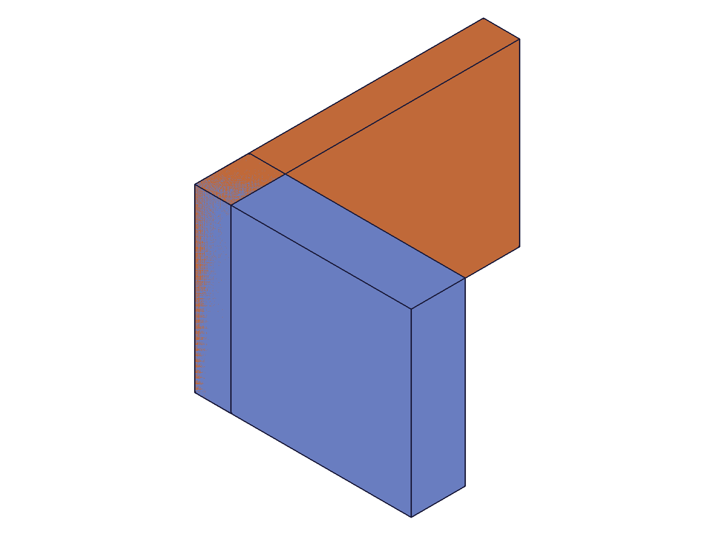
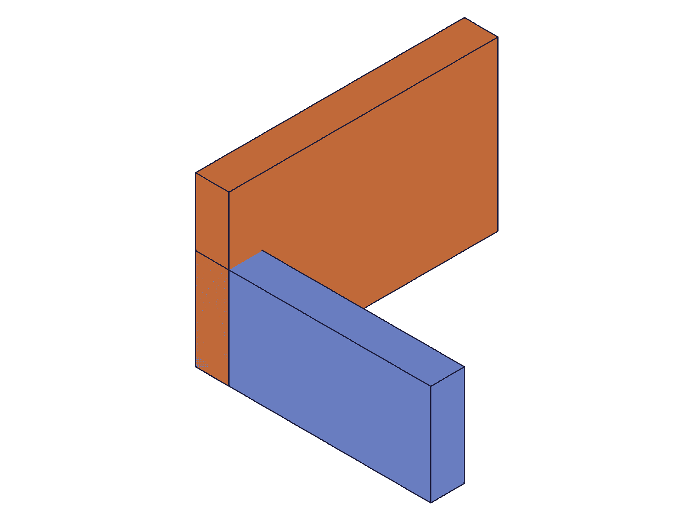
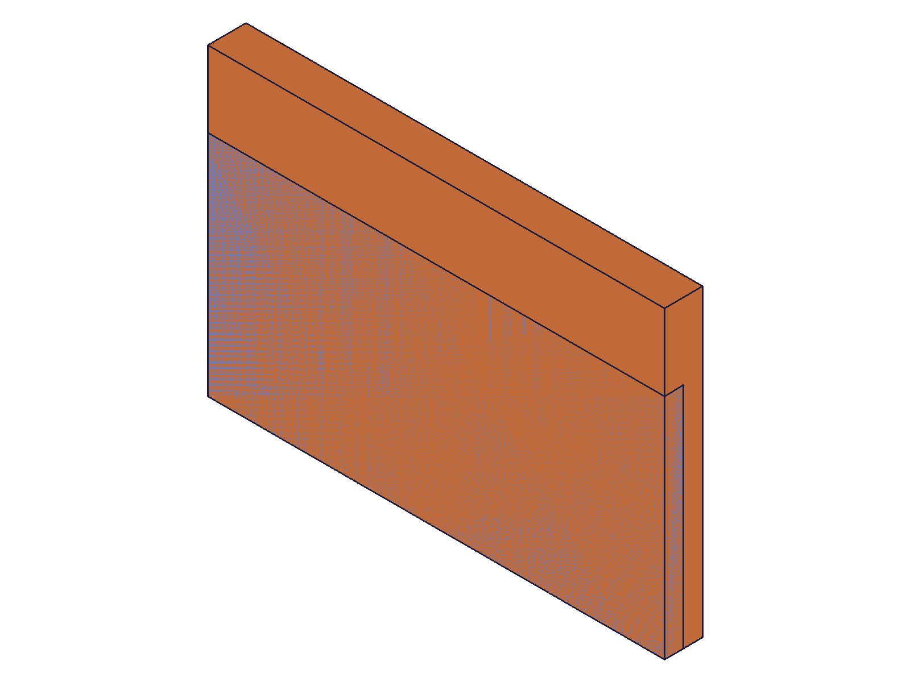

# Training: assembly.revolute

**Date:** 2026-04-29

## Goal

Testing `v1.assembly.revolute`, `v1.assembly.updateRevolute`, and `v1.assembly.getRevolute`.

**Methods to cover:**

- `revolute` — create a revolute (hinge) constraint between two instances
- `revolute` params: id, name, mate1 (path, csys, flip, reorient), mate2 (path, csys, flip, reorient), zOffset, zRotationLimits (min, max)
- `updateRevolute` — change flip, reorient, zOffset, zRotationLimits, mates after creation
- `getRevolute` — retrieve constraint by name

**Questions:**

- How does revolute differ from fastened? (1 DOF rotation around Z vs 0 DOF)
- Does flip on mate1 vs mate2 change the rotation axis?
- Does zOffset move the bodies apart along the rotation axis?
- Do zRotationLimits actually constrain the rotation range? What happens at the limits?
- Can zRotationLimits use degree expressions (`'45deg'`)?
- What does getRevolute return — does it include current rotation angle?
- Error behavior: missing mates, invalid limits, self-constraint?
- Batch creation support?

---

## 01 — basic revolute

Script: `scripts/01-basic-revolute.mjs` — ✅ Revolute constraint created successfully. Returns numeric constraint ID (270), maxLevel 31.

|  |  |
|---|---|

**Data:** result=270, maxLevel=31, messages=[]. Before/after snapshots identical because both WCS origins at [0,0,0] — constraint aligned them at the same position they started in.

**Learned:** Basic revolute follows same pattern as fastened. Returns constraint ID on success. maxLevel 31 = info (success).

---

## 02 — getRevolute

Script: `scripts/02-getRevolute.mjs` — ✅ getRevolute returns full constraint data.

**Data:** getRevolute returns `{ id, name, mate1: { csys, flip, path, reorient }, mate2: {...}, zOffset, zRotationLimits: { min, max } }`. Default flip='Z', reorient='0', zOffset=0, zRotationLimits={ min: null, max: null }. Querying with wrong name returns null + maxLevel 51 error.

**📌 LLM doc:** getRevolute return structure — includes all constraint params. zRotationLimits defaults to { min: null, max: null } (no limits). Does NOT include current rotation angle.

---

## 03 — zOffset

Script: `scripts/03-zOffset.mjs` — ✅ zOffset values stored correctly.

|  |  |  |
|---|---|---|

**Data:** zOffset=0, 30, -20 all stored correctly in getRevolute responses. Snapshots look identical due to auto-scaling. Offset moves mate2 along the constraint's Z axis (rotation axis) relative to mate1.

**Learned:** zOffset works for positive and negative values. Visual confirmation unreliable with auto-scaling — data verification is essential.

---

## 04 — flip variations

Script: `scripts/04-flip-variations.mjs` — ✅ All 6 flip values accepted on mate2.

|  |  |  |
|---|---|---|

**Data:** All 6 flips (Z, -Z, X, -X, Y, -Y) create constraints successfully. Snapshots show identical orientations because the default WCS axes are standard. Script used `deleteConstraint({ id: ... })` which silently failed — see script 10/11 for details.

**📌 LLM doc:** flip determines which WCS axis becomes the rotation axis. All 6 values valid.

---

## 05 — zRotationLimits

Script: `scripts/05-zRotationLimits.mjs` — ✅ Degree expressions work. Partial limits FAIL.

**Data:**
- `'-90deg'` → stored as -1.5707963267948966 (radians). Degree expressions work.
- `Math.PI/4` radians → stored as 0.7853981633974483. Raw radians work.
- No limits → `{ max: null, min: null }` (default).
- **Min-only limit (no max) → FAILS** (result=null, maxLevel=51, error: `"max" must be provided`).

**📌 LLM doc:** zRotationLimits requires BOTH min and max if provided. Partial limits (min-only or max-only) error. Accepts radians (number) or degree expressions (string like `'45deg'`). Stored internally as radians.

---

## 06 — updateRevolute

Script: `scripts/06-updateRevolute.mjs` — ✅ All properties updatable.

**Data:**
- Name update: ✓ (verified via getRevolute)
- zOffset update: ✓ (changed to 25, verified)
- zRotationLimits: ✓ (set -180deg/270deg, stored as -π/4.712rad)
- mate2 flip: ✓ (changed to -Z, verified)
- Remove limits (null): ✓ (restored to { min: null, max: null })
- updateRevolute returns same constraint ID on success. maxLevel 31.

**📌 LLM doc:** All revolute params updatable via updateRevolute. Pass null/VOID to zRotationLimits to remove limits. Returns constraint ID.

---

## 07 — reorient

Script: `scripts/07-reorient.mjs` — ✅ All 4 reorient values work. Invalid value '45' rejected.

**Data:** Reorient values '0', '90', '180', '270' all succeed. Invalid value '45' → error code 1013: "Type \"45\" is not supported to use as reorient type." Reorient values are strings, not numbers.

**📌 LLM doc:** reorient accepts only '0', '90', '180', '270' (strings). Error code 1013 for invalid values.

---

## 08 — errors

Script: `scripts/08-errors.mjs` — ✅ All 8 error cases return null + maxLevel 51.

**Error catalog:**
| Case | Error message | Code |
|---|---|---|
| Missing mate2 | `[Evaluation error in AbstractAPI.PrepareAPIParams]` | 0 |
| Missing mate1 | (similar internal error) | — |
| Self-constraint | `mate1 and mate2 cannot be used in this combination... same rigid set` | 1014 |
| Invalid path ID | `"path" has an invalid id!` | — |
| Invalid csys ID | `"csys" has an invalid id!` | — |
| Template in path | `"path" has a wrong id type! ["instance"]` | 1001 |
| Missing id | `"id" must be provided to create CC_RevoluteConstraint` | 1004 |
| Partial limits (min-only) | `"max" must be provided` | 1004 |

**📌 LLM doc:** Error catalog matches fastened pattern closely. Missing mate produces an internal evaluation error (less helpful).

---

## 09 — batch creation

Script: `scripts/09-batch.mjs` — ✅ Batch creation works.

**Data:** `revolute([{...}, {...}])` returns `[222, 226]` — array of constraint IDs. Both retrievable individually via getRevolute. maxLevel 31.

**📌 LLM doc:** Batch creation supported. Pass array of param objects, returns array of IDs.

---

## 10 — deleteConstraint investigation (WRONG syntax)

Script: `scripts/10-delete-investigate.mjs` — ❌ `deleteConstraint({ id: constraintId })` FAILS.

**Data:** deleteConstraint returns null + maxLevel 51 + error: `"ids" must be provided` (code 1004). The parameter is `ids` (plural array), not `id` (singular). This is why scripts 04 and 07 had stale constraints — all deletes silently failed.

**📌 LLM doc:** CRITICAL — deleteConstraint uses `ids: [array]`, NOT `id`. Common mistake.

---

## 11 — deleteConstraint fix (CORRECT syntax)

Script: `scripts/11-delete-fix.mjs` — ✅ `deleteConstraint({ ids: [constraintId] })` works.

**Data:**
- Single delete: maxLevel 31 (success), getRevolute returns null after delete
- Recreate with different flip: new constraint has correct flip, correct ID
- Multi-delete: `deleteConstraint({ ids: [c2, c3] })` works — both constraints removed

**📌 LLM doc:** Always use `{ ids: [constraintId] }` for deleteConstraint. Supports deleting multiple constraints at once.

---

## 12 — realistic hinge workflow

Script: `scripts/12-realistic-hinge.mjs` — ✅ Door-hinge scenario with two revolute constraints.

|  |  |
|---|---|

**Data:** Frame anchored with fastenedOrigin. Door attached via two revolute constraints (top and bottom hinges) at different WCS locations. Both constraints succeed (IDs 232, 294). Top hinge has zRotationLimits 0-120deg. Multiple revolute constraints on same instance pair: ALLOWED.

**📌 LLM doc:** Multiple revolute constraints can exist between the same two instances (different WCS points). Useful for hinge pairs.

---

## 13 — mate1 flip and reorient

Script: `scripts/13-mate1-flip.mjs` — ✅ Flip and reorient work on mate1, not just mate2.

**Data:**
- mate1 flip=X: stored correctly
- Both mates custom flips (X/-X): stored correctly
- Both mates custom reorients (180/90): stored correctly
- deleteConstraint with `ids: [...]` works correctly throughout

**Learned:** Flip and reorient are fully independent on each mate. Can have mate1 flip='X' and mate2 flip='-X'.
