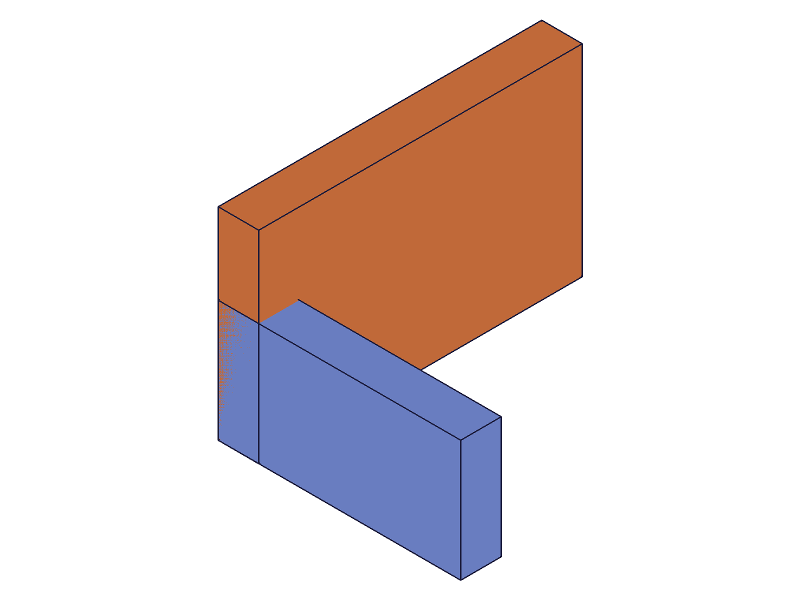
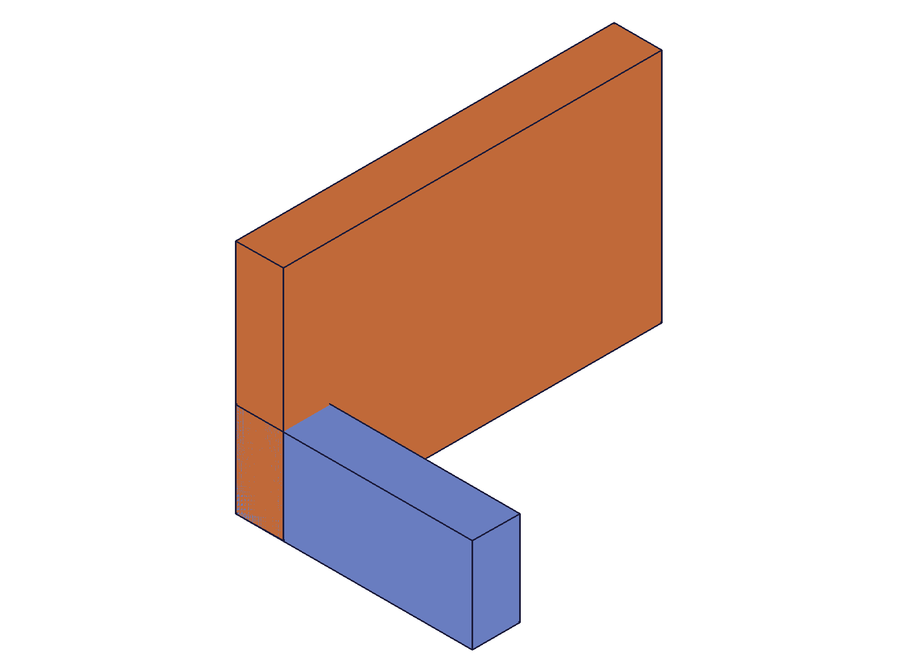
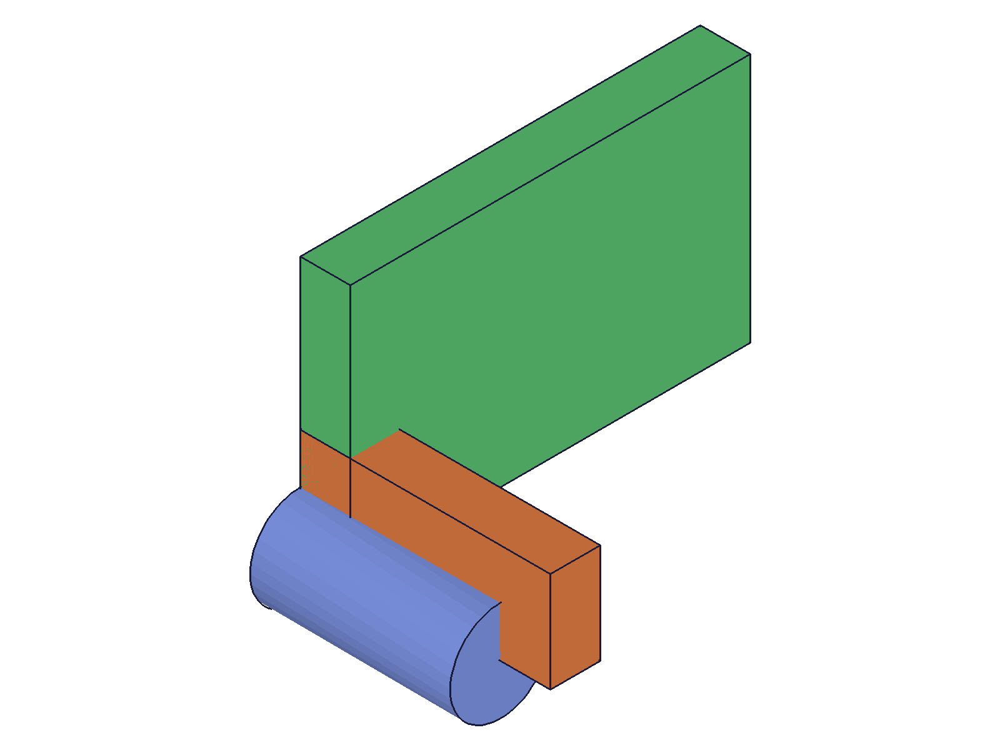

# Training: assembly.updateRevolute

**Date:** 2026-04-29

## Goal

Dedicated study of `v1.assembly.updateRevolute` — updating revolute (hinge) constraints after creation.

**Methods to cover:**

- `updateRevolute` — param: id (constraint ID, required)
- `updateRevolute` params: name, zOffset, zRotationLimits (min/max), mate1 (path, csys, flip, reorient), mate2 (path, csys, flip, reorient)
- Partial update behavior — does changing one param preserve the rest?
- Removing zRotationLimits with null/VOID
- Update mate path (retarget to different instance)
- Update mate csys (change WCS reference)
- Batch update (array of param objects)
- Error cases: assembly ID vs constraint ID, invalid values, nonexistent IDs

**Questions:**

- Does partial update reliably preserve unset params?
- Can you retarget a revolute constraint to a different instance via mate path update?
- Can you change the csys without changing the path?
- Does batch update work (array of params)?
- What error do you get passing assembly ID instead of constraint ID?
- Are failed updates safe (non-destructive)?

---

## 01 — basic update (name, zOffset, zRotationLimits)

Script: `scripts/01-basic-update.mjs` — ✅ All three property updates work correctly.

|  |
|---|

**Data:** updateRevolute returns same constraint ID (212) on success, maxLevel 31. Name update: verified via getRevolute with new name; old name returns null + maxLevel 51. zOffset update: changed to 15, verified. zRotationLimits: `-45deg/90deg` stored as radians (-0.785/1.571). Each sequential update preserved prior changes (name stayed "Renamed" after zOffset update, both stayed after limits update — see `files/01-basic-update-after-all-updates.json`).

**📌 LLM doc:** Basic update pattern — pass constraint ID + any params to change. Returns constraint ID. Old name becomes unfindable after rename.

---

## 02 — partial update preservation

Script: `scripts/02-partial-update.mjs` — ✅ Partial updates reliably preserve all unset params.

**Data:** Created constraint with non-default values (mate1 flip=X reorient=90, mate2 flip=-Z reorient=180, zOffset=10, limits=-30deg/60deg). Updated name only → verified all 11 fields preserved: mate1Flip, mate1Reorient, mate2Flip, mate2Reorient, zOffset, limitsMin, limitsMax, mate1Path, mate1Csys, mate2Path, mate2Csys — all `true`. Updated mate2 flip only to 'Y' → mate2 reorient (180), mate1 flip (X), zOffset (10) all preserved.

**📌 LLM doc:** Partial update is fully reliable. Mate sub-properties update independently — setting only `flip` preserves path, csys, and reorient.

---

## 03 — removing rotation limits

Script: `scripts/03-remove-limits.mjs` — ✅ `null` removes limits. `undefined` preserves. `{}` errors.

**Data:**
- `zRotationLimits: null` → removes both limits: `{ max: null, min: null }` ✓
- `zRotationLimits: undefined` → treated as "not provided", limits preserved entirely ✓
- `zRotationLimits: {}` → FAILS (result=null, maxLevel=51). Limits preserved after failed update.

**📌 LLM doc:** Use `null` to remove limits. `undefined` (omitting param) preserves. Empty object `{}` errors — requires at least one of min/max.

---

## 04 — update csys (same instance, different WCS)

Script: `scripts/04-update-csys.mjs` — ✅ Csys update works without changing path.

|  |  |
|---|---|

**Data:** Updated mate1 csys from WcsA (ID 107, origin [10,10,10]) to WcsB (ID 115, origin [70,40,10]). Path preserved: `[212]` unchanged. Snapshots look identical due to auto-scaling, but data confirms csys ID changed (see `files/04-update-csys-csys-change.json`).

**📌 LLM doc:** Can update csys alone without providing path. The mate's instance stays the same.

---

## 05 — retarget to different instance

Script: `scripts/05-retarget-instance.mjs` — ✅ Can retarget a revolute constraint to a completely different instance (different template).

|  |  |
|---|---|

**Data:** Originally between inst1-inst2 (box templates). Updated mate2 to inst3 (cylinder template) with its own WCS. Result: constraint ID preserved (291), maxLevel 31. mate2.path changed from [279] to [281], csys from 198 to 271. Snapshots look identical due to WCS origins at [0,0,0] — data is ground truth. No error messages.

**📌 LLM doc:** Retargeting works — update mate path and csys together to point at a different instance. Must provide csys from the new instance's template.

---

## 06 — error cases

Script: `scripts/06-errors.mjs` — ✅ All error cases handled. Failed updates are non-destructive.

**Error catalog:**
| Case | Error message | Code |
|---|---|---|
| Assembly ID instead of constraint ID | `The provided id for the constraint is not a constraint or relation.` | 1007 |
| Nonexistent constraint ID | `ToId()/TOID() didn't get an existing or valid id.` | 1006 |
| Missing id | `"id" must be provided for update.` | 1004 |
| Invalid flip value | `Type "INVALID" is not supported to use as flip type.` | 1013 |
| Invalid reorient value | `Type "45" is not supported to use as reorient type.` | 1013 |
| Partial limits (min-only) | **SUCCEEDED** (result=212, maxLevel=31) — see script 08 |
| Invalid csys ID | `ToId()/TOID() didn't get an existing or valid id.` | 1006 |

**Constraint survived all errors:** name, mate1.flip, mate2.flip, zOffset all intact after 7 error attempts. Failed updates are safe.

**📌 LLM doc:** Error catalog. Key difference: `id` here is constraint ID not assembly ID (code 1007 if wrong). Partial limits succeed on update (unlike create).

---

## 07 — batch update

Script: `scripts/07-batch-update.mjs` — ✅ Batch update works.

**Data:** `updateRevolute([{ id: c1, name: 'BatchRenamed1', zOffset: 5 }, { id: c2, name: 'BatchRenamed2', zRotationLimits: { min: '-60deg', max: '60deg' } }])` → returns `[305, 309]` (array of constraint IDs). Both updates verified via getRevolute. maxLevel 31.

**📌 LLM doc:** Batch update supported. Pass array of param objects, returns array of constraint IDs.

---

## 08 — partial limits detail (SURPRISING)

Script: `scripts/08-partial-limits-detail.mjs` — ✅ Partial limits ALLOWED on update (differs from create!).

**Data:**
- **Case 1 (no existing limits, set min-only):** min set to -π/2, max stays null → `{ max: null, min: -1.571 }`. SUCCESS.
- **Case 2 (existing limits, update max-only):** max changed to π, min preserved. SUCCESS.
- **Case 2 (existing limits, update min-only):** min changed to -2π/3, max preserved. SUCCESS.

**📌 LLM doc:** CRITICAL difference from `revolute` (create): `updateRevolute` allows partial zRotationLimits. You can set/change min alone or max alone — the other value is preserved. On create, partial limits error with "max must be provided".

---

## 09 — individual limit removal

Script: `scripts/09-individual-limit-remove.mjs` — ✅ Can remove individual limits by setting to null.

**Data:**
- `{ max: null }` → removes max only, min preserved: `{ max: null, min: -1.571 }`
- `{ min: null }` → removes min only, max preserved: `{ max: 2.094, min: null }`
- `zRotationLimits: null` → removes both: `{ max: null, min: null }`

**📌 LLM doc:** Individual limit removal works. Set `{ max: null }` or `{ min: null }` to remove just one limit. Use `zRotationLimits: null` to remove both.

---
