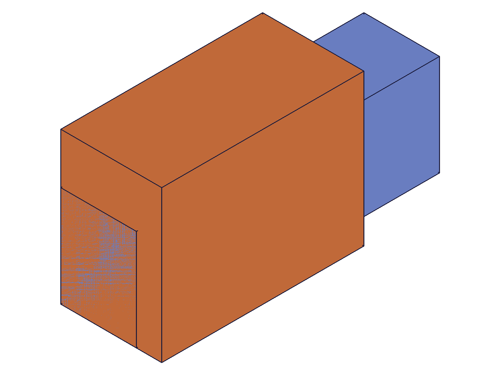
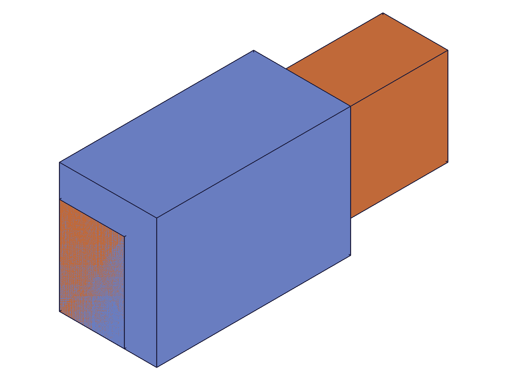

# Training: assembly.getRevolute

**Date:** 2026-04-29

## Goal

Dedicated study of `v1.assembly.getRevolute` — retrieves a revolute constraint by name from an assembly or instance.

**Methods to cover:**

- `getRevolute` — basic retrieval by name, return value structure
- `getRevolute` — verify all returned fields: id, name, mate1 (path, csys, flip, reorient), mate2 (path, csys, flip, reorient), zOffset, zRotationLimits (min, max)
- `getRevolute` — zRotationLimits values returned as radians (even when created with degree strings)
- `getRevolute` — flip and reorient values
- `getRevolute` — error: name not found
- `getRevolute` — error: wrong ID types (instance ID, constraint ID, part template ID)
- `getRevolute` — duplicate names (first match behavior?)
- `getRevolute` — retrieval after updateRevolute
- `getRevolute` — batch retrieval (array param)
- `getRevolute` — sub-assembly scope
- `getRevolute` — instance ID of sub-assembly
- `getRevolute` — missing params

**Questions:**

- What exact fields are returned in the result object?
- Are default values (flip='Z', reorient='0', zOffset=0, zRotationLimits={min:null,max:null}) included or omitted?
- Does it work with instance IDs or only assembly IDs?
- How does it behave with batch input?
- After update, does get reflect the new values?
- What ID types are accepted? (assembly, instance, part template, constraint?)

---

## 01 — basic retrieval

Script: `scripts/01-basic-get.mjs` — ✅ Returns full constraint state with all fields.

|  |
|---|

**Data:** Result keys: `id, mate1, mate2, name, zOffset, zRotationLimits`. mate1 keys: `csys, flip, path, reorient`. mate2 keys: `csys, flip, path, reorient`. maxLevel 31 (success). All fields present — no omissions.

**📌 LLM doc:** Return structure — 6 top-level keys. Both mates have 4 sub-keys each. All fields always present.

---

## 02 — defaults check

Script: `scripts/02-defaults-check.mjs` — ✅ All defaults explicitly present in response.

**Data:** Default name "Revolute". mate1.flip="Z" (string), mate1.reorient="0" (string), mate2.flip="Z" (string), mate2.reorient="0" (string), zOffset=0 (number), zRotationLimits={ max: null, min: null }. `typeof null === 'object'` for limit values. All 6 top-level keys and all 4 mate sub-keys present — nothing omitted even at defaults.

**📌 LLM doc:** All defaults explicit: flip="Z", reorient="0" (strings), zOffset=0 (number), limits={min:null, max:null}.

---

## 03 — degree strings stored as radians

Script: `scripts/03-degree-strings.mjs` — ✅ Degree strings converted to radians.

**Data:** Created with `'-45deg'`/`'90deg'`. getRevolute returns: min=-0.7853981633974483, max=1.5707963267948966. Both `typeof === 'number'`. Exact match with -π/4 and π/2. zOffset=15 also correct.

**📌 LLM doc:** zRotationLimits always returned as radians (numbers), even when created with degree strings.

---

## 04 — name not found

Script: `scripts/04-name-not-found.mjs` — ✅ Three not-found scenarios all return null + maxLevel 51.

**Data:**
- Non-existent name: null, maxLevel 51, code 0, message: "There couldn't be found a constraint with name \"DOES_NOT_EXIST\" on product..."
- Empty string name: null, maxLevel 51, same error pattern
- FastenedOrigin name via getRevolute: null, maxLevel 51 — constraint type mismatch, getRevolute only finds revolute constraints

**📌 LLM doc:** getRevolute is type-specific — only finds revolute constraints. Other constraint types with same name invisible.

---

## 05 — wrong ID types

Script: `scripts/05-wrong-id-types.mjs` — ✅ Consistent with getFastenedOrigin pattern.

**Data:**
- **Assembly ID:** ✓ (maxLevel 31)
- **Part instance ID:** null, code 0, "The provided product or product reference id is not a Assembly."
- **Constraint ID:** null, code 1001, "wrong id type! Provide only following id types: [\"assembly\",\"instance\"]"
- **Part template ID:** null, code 1001, same message

**📌 LLM doc:** Accepted ID types: assembly and instance. Part instance IDs fail ("not a Assembly") — only sub-assembly instances work (see script 09). Constraint and template IDs rejected at type level (code 1001).

---

## 06 — duplicate names

Script: `scripts/06-duplicate-names.mjs` — ✅ First match wins.

**Data:** Two constraints named "SameName" — first (id=309, zOffset=10), second (id=313, zOffset=99). getRevolute returns id=309, zOffset=10. matchesFirst=true.

**📌 LLM doc:** First match wins for duplicate names. Consistent with getFastenedOrigin behavior.

---

## 07 — after update

Script: `scripts/07-after-update.mjs` — ✅ Get reflects all updated values. Renamed constraint only findable by new name.

**Data:**
- Before: name="Rev_Update", zOffset=10, mate2.flip="Z", limits={min:null,max:null}
- After updateRevolute (name, zOffset, limits, mate2 flip): name="Rev_Updated", zOffset=42, mate2.flip="-Z", limits={min:-1.5708, max:3.1416}
- Old name "Rev_Update" → null, maxLevel 51

**📌 LLM doc:** Get always reflects current state. Rename makes old name unfindable.

---

## 08 — batch retrieval

Script: `scripts/08-batch-get.mjs` — ✅ Array param returns array of results.

**Data:**
- `getRevolute([{id, name:'Rev_A'}, {id, name:'Rev_B'}])` returns array of 2 full constraint objects. maxLevel 31.
- Mixed batch (one valid, one invalid name): returns `[{...fullObject...}, null]`. maxLevel 51 (error from the invalid one).

**📌 LLM doc:** Batch retrieval supported. Array in → array out. Invalid entries return null in their slot (not rejected wholesale). maxLevel reflects worst case.

---

## 09 — sub-assembly scope

Script: `scripts/09-sub-assembly.mjs` — ✅ Constraints scoped to creating assembly. Instance ID resolves through.

|  |
|---|

**Data:**
- From sub-assembly template ID: ✓ (maxLevel 31, zOffset=42)
- From root assembly ID: null (maxLevel 51) — constraint lives on sub-assembly, not root
- From sub-assembly **instance** ID: ✓ (maxLevel 31, zOffset=42) — resolves through to template

**📌 LLM doc:** Constraints scoped to the assembly where created. Sub-assembly instance IDs work — resolve to the template. Root assembly cannot see sub-assembly constraints.

---

## 10 — missing params

Script: `scripts/10-missing-params.mjs` — ✅ Both id and name required.

**Data:**
- No name: code 1004, "The parameter \"name\" must be provided"
- No id: code 1004, "The parameter \"id\" must be provided"
- Empty object: same as no id

---

## Coverage Checklist

- [x] API called successfully (scripts 01-03, 06-09)
- [x] Both required params tested (id, name) — script 10
- [x] All return value fields verified (id, name, mate1.path, mate1.csys, mate1.flip, mate1.reorient, mate2.*, zOffset, zRotationLimits)
- [x] Default values checked (all present, all explicit) — script 02
- [x] Error cases: name not found, wrong ID types, missing params — scripts 04, 05, 10
- [x] Duplicate names (first match wins) — script 06
- [x] After update reflects current state — script 07
- [x] Batch retrieval (array param → array result, mixed valid/invalid) — script 08
- [x] Sub-assembly scope (scoped to creating assembly) — script 09
- [x] Sub-assembly instance IDs work — script 09
- [x] Degree strings stored as radians — script 03
- [x] Cross-constraint-type name isolation (fastenedOrigin name invisible to getRevolute) — script 04
