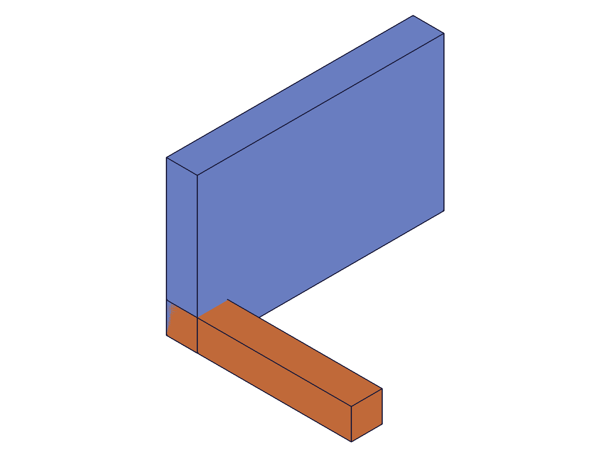
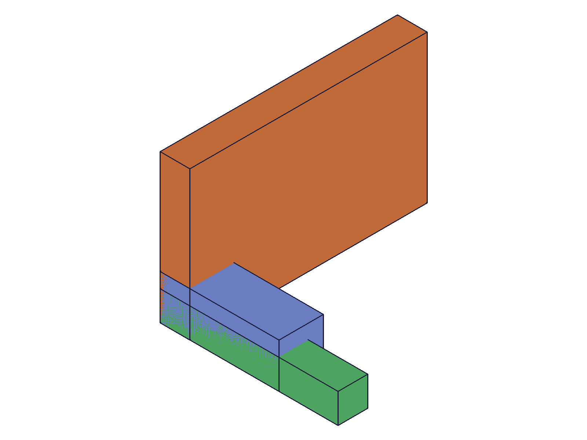

# Training: assembly.cylindrical / updateCylindrical / getCylindrical

**Date:** 2026-04-29

## Goal

Testing `v1.assembly.cylindrical`, `v1.assembly.updateCylindrical`, and `v1.assembly.getCylindrical` — the cylindrical constraint family (2 DOF: rotation + translation along Z axis).

**Methods to cover:**

- `cylindrical` — basic creation with mate1/mate2
- `cylindrical` params: name, zOffsetLimits (min/max), zRotationLimits (min/max), flip, reorient
- `cylindrical` — batch creation (array param)
- `updateCylindrical` — change name, limits, mates, flip, reorient
- `updateCylindrical` — partial limit updates (min-only, max-only)
- `updateCylindrical` — remove limits (null)
- `getCylindrical` — retrieve by name
- `getCylindrical` — nonexistent name, wrong ID types
- `getCylindrical` — batch retrieval

**Questions:**

- Does cylindrical have a zOffset param like revolute, or only zOffsetLimits?
- Can zOffsetLimits and zRotationLimits be partially specified on create (min-only/max-only)?
- Does updateCylindrical allow partial limit updates like updateRevolute does?
- What default values does getCylindrical return for unset limits?
- Does deleteConstraint work the same way (ids array)?

---

## 01 — basic cylindrical creation

Script: `scripts/01-basic-cylindrical.mjs` — ✅ basic cylindrical constraint created successfully.

|  |
|---|

**Data:** result=216 (constraint ID), maxLevel=31 (info). Messages array empty. Constraint links Base plate (blue) to Rod (orange) via WCS origins, allowing rotation + translation along Z.

**📌 LLM doc:** Basic creation works exactly like revolute — mate1/mate2 with path + csys required. Returns numeric constraint ID.

---

## 02 — zOffsetLimits

Script: `scripts/02-z-offset-limits.mjs` — ✅ zOffsetLimits accepted with both min and max.

|  |
|---|

**Data:** zOffsetLimits `{min: -20, max: 30}` stored correctly (see `files/02-z-offset-limits-offset-limits-get.json`). Default zRotationLimits when not set: `{min: null, max: null}`.

**Surprising:** Partial zOffsetLimits (min-only) **succeeded** — returned ID 220, maxLevel 31. This differs from zRotationLimits which requires both.

---

## 02b — partial zOffsetLimits verification

Script: `scripts/02b-verify-partial-offset.mjs` — ✅ partial offsets confirmed.

**Data:** min-only → `{max: null, min: -10}`. max-only → `{max: 30, min: null}`. Empty object `{}` errors: "The object "zOffsetLimits" is empty!" (maxLevel 51). See `files/02b-verify-partial-offset-partial-offset-verify.json`.

**📌 LLM doc:** zOffsetLimits allows partial spec on create (min-only or max-only). zRotationLimits does NOT — asymmetric behavior between the two limit types. Empty `{}` always errors.

---

## 03 — zRotationLimits

Script: `scripts/03-z-rotation-limits.mjs` — ✅ rotation limits work with radians and degree expressions.

|  |
|---|

**Data:** Radians `{min: -π/4, max: π/2}` → stored as `{min: -0.785, max: 1.571}`. Degrees `{min: '-90deg', max: '120deg'}` → stored as `{min: -1.571, max: 2.094}`. Both limits together stored correctly: offsets `{min: -15, max: 25}` + rotations `{min: -1.047, max: 1.047}`.

**Partial zRotationLimits (min-only) fails** as expected: maxLevel 51, code 1004, "max must be provided". Same behavior as revolute.

**📌 LLM doc:** Degree expressions stored as radians internally. zRotationLimits requires both min and max on create.

---

## 04 — flip and reorient

Script: `scripts/04-flip-reorient.mjs` — ✅ all flip and reorient values accepted.

|  |  |  |
|---|---|---|

**Data:** All 6 flip values (Z, -Z, X, -X, Y, -Y) and 4 reorient values (0, 90, 180, 270) accepted. Verified via getCylindrical (see `files/04-flip-reorient-flip-reorient-summary.json`). Mate1 defaults to flip="Z", reorient="0" unless overridden.

Invalid flip `"INVALID"` → maxLevel 51, "Type "INVALID" is not supported to use as flip type."
Invalid reorient `"45"` → maxLevel 51, "Type "45" is not supported to use as reorient type."

**📌 LLM doc:** Flip/reorient behavior identical to revolute. Reorient values are strings, not numbers.

---

## 05 — batch creation

Script: `scripts/05-batch-creation.mjs` — ✅ batch creation returns array of IDs.

|  |
|---|

**Data:** Result `[309, 313]` — array of constraint IDs. maxLevel 31. Each constraint stored its own limits correctly (see `files/05-batch-creation-batch-get.json`).

---

## 06 — error cases

Script: `scripts/06-same-instance-error.mjs` — ✅ all expected errors confirmed.

**Data:**
- Same instance both mates: null, maxLevel 51, code 1014 ("same rigid set")
- Missing mate2: null, maxLevel 51, "[Evaluation error in AbstractAPI.PrepareAPIParams]"
- Missing mate1: null, maxLevel 51, code 1004 ("mate1 must be provided")
- Missing id: null, maxLevel 51, code 1004 ("id must be provided to create CC_CylindricalConstraint")
- Template ID in path: null, maxLevel 51, code 1001 ("wrong id type! ["instance"]")

See `files/06-same-instance-error-error-cases.json`.

**📌 LLM doc:** Error messages match revolute patterns. Note the CC_CylindricalConstraint class name in the missing-id error.

---

## 07 — updateCylindrical limits progression

Script: `scripts/07-update-limits.mjs` — ✅ comprehensive limit update/removal chain verified.

|  |
|---|

**Data:** Full progression (see `files/07-update-limits-update-limits-progression.json`):
1. Baseline: `{min: null, max: null}` for both limit types
2. Add offset limits: `{min: -20, max: 40}` — ✅
3. Add rotation limits: `{min: -0.785, max: 1.571}` — ✅, offset preserved
4. Partial rotation update (max only): min preserved at -0.785, max updated to π — ✅
5. Partial offset update (min only): min updated to -50, max preserved at 40 — ✅
6. Remove rotation (null): `{min: null, max: null}` — ✅
7. Remove offset (null): `{min: null, max: null}` — ✅
8. Remove just min from rotation: `{min: null, max: 1.047}` — ✅

**📌 LLM doc:** updateCylindrical allows partial limit updates (unlike create for zRotationLimits). `null` removes both limits. `{min: null}` removes just min. Same semantics as updateRevolute.

---

## 08 — updateCylindrical name and mates

Script: `scripts/08-update-name-mates.mjs` — ✅ all update scenarios verified.

**Data:**
- Rename: old name → null (maxLevel 51), new name → found (ID 309)
- Flip update: mate2.flip → "-Z", path preserved `[297]`
- Reorient update: mate1.reorient → "180", flip preserved "Z"
- Retarget: mate2.path → `[299]` (inst3), csys → 289
- Assembly ID error: null, maxLevel 51, "not a constraint or relation"

See `files/08-update-name-mates-update-name-mates.json`.

**📌 LLM doc:** Mate sub-properties update independently. Retargeting works. Assembly ID in update errors with code 1007.

---

## 09 — batch update

Script: `scripts/09-update-batch.mjs` — ✅ batch update returns array of IDs.

**Data:** Result `[309, 313]`, maxLevel 31. Both constraints updated independently: Cyl1 got offset limits, Cyl2 got rotation limits. See `files/09-update-batch-batch-update.json`.

---

## 10 — getCylindrical comprehensive

Script: `scripts/10-get-cylindrical.mjs` — ✅ all fields returned, error cases verified.

**Data:** Full get result for a constraint created with non-default flip/reorient (see `files/10-get-cylindrical-get-full.json`):
- All fields present: id, name, mate1, mate2, zOffsetLimits, zRotationLimits
- Flip="Y"/"-Z", reorient="90"/"270" preserved exactly
- zRotationLimits stored as radians (type=number), even when created with degree strings
- zOffsetLimits.min type = number

**ID acceptance rules:**
- Assembly ID: ✅
- Part instance ID: ❌ "not a Assembly"
- Constraint ID: ❌ code 1001, "wrong id type! ["assembly","instance"]"
- Part template ID: ❌ code 1001, same
- Missing name: ❌ code 1004

**Batch get:** Returns array. Invalid entries return null in their slot. maxLevel reflects worst case (51 if any fails).

**📌 LLM doc:** Return value structure and ID acceptance rules identical to getRevolute.

---

## 11 — deleteConstraint

Script: `scripts/11-delete-constraint.mjs` — ✅ deletion verified.

**Data:**
- `deleteConstraint({ ids: [c1] })`: result=null, maxLevel 31 — success
- After delete: getCylindrical returns null (maxLevel 51)
- `deleteConstraint({ id: c2 })` (wrong param): maxLevel 51, "ids must be provided"
- Batch delete `{ ids: [c2, c3] }`: both removed, maxLevel 31

See `files/11-delete-constraint-delete-results.json`.

**📌 LLM doc:** Same deleteConstraint pattern as all other constraint types. `ids` (plural array), not `id`.

---

## 12 — duplicate names and cross-type lookup

Script: `scripts/12-duplicate-names.mjs` — ✅ duplicate names allowed, first-match-wins confirmed.

**Data:**
- Two cylindrical constraints with name "DupName": getCylindrical returns first one (c1=309)
- Cross-type: revolute created first with name "SharedName", then cylindrical c3=321
  - getCylindrical("SharedName"): **returns undefined** — failed to find the cylindrical
  - getRevolute("SharedName"): returns 317 (the revolute)

**📌 LLM doc:** When a non-cylindrical constraint with the same name was created first, getCylindrical fails to find the cylindrical one. The server finds the first constraint by name regardless of type, then fails if it's the wrong type.

---

## 13 — cross-type name ordering verification

Script: `scripts/13-cross-type-name-order.mjs` — ✅ creation order determines get behavior.

**Data:** Reversed order (cylindrical first, revolute second):
- getCylindrical("TestOrder"): returns 309 (the cylindrical) ✅
- getRevolute("TestOrder"): returns undefined — fails because first match is cylindrical

This confirms: **all get* methods find the FIRST constraint by name regardless of type**. If that first match isn't the target type, the query fails rather than continuing to search.

**📌 LLM doc:** Critical gotcha — avoid sharing constraint names across different types. First-match-wins by creation order, not by constraint type.

---

## Answers to Initial Questions

1. **zOffset vs zOffsetLimits?** Cylindrical has `zOffsetLimits` (min/max range), NOT `zOffset` (fixed value). This is the key difference from revolute.
2. **Partial limits on create?** zOffsetLimits: YES (min-only or max-only). zRotationLimits: NO (both required). Asymmetric.
3. **Partial limits on update?** YES for both types. updateCylindrical allows partial limits just like updateRevolute.
4. **Default values?** `{min: null, max: null}` for both zOffsetLimits and zRotationLimits.
5. **deleteConstraint?** Identical: `deleteConstraint({ ids: [id1, id2] })`.
