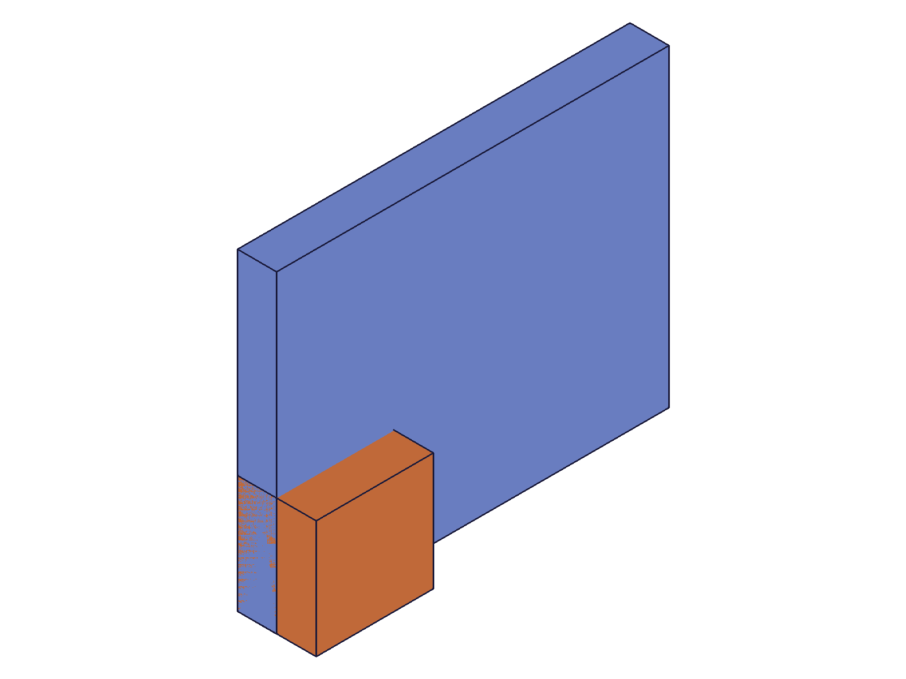
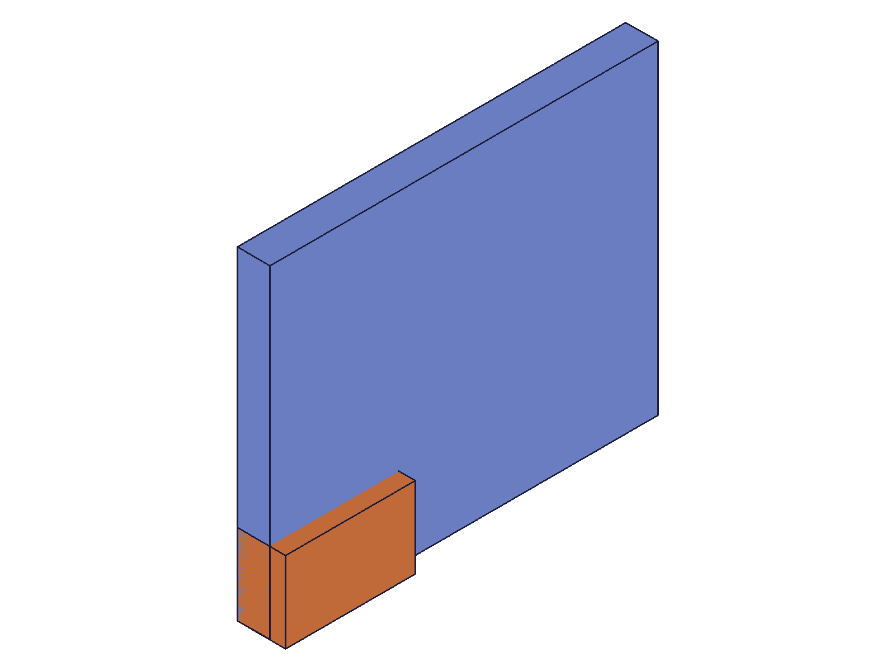

# Training: assembly.planar / updatePlanar / getPlanar

**Date:** 2026-04-29

## Goal

Testing `v1.assembly.planar`, `v1.assembly.updatePlanar`, and `v1.assembly.getPlanar`.

**Methods to cover:**

- `planar` — create constraint with mate1/mate2 pattern (path + csys + flip + reorient)
- `planar` params: id, name, mate1, mate2, zOffset, xOffsetLimits, yOffsetLimits, zRotationLimits
- `updatePlanar` — update zOffset, limits, mates, name after creation
- `getPlanar` — retrieve constraint by name, verify returned structure

**Questions:**

- How does the planar constraint differ from revolute/cylindrical? (3 DOF: X/Y translation + Z rotation)
- Does `zOffset` behave like revolute's fixed offset or cylindrical's limits?
- Are `xOffsetLimits` and `yOffsetLimits` partial-allowed on create (like cylindrical's zOffsetLimits)?
- Does `zRotationLimits` require both min and max on create (like revolute/cylindrical)?
- What does `getPlanar` return for unset limits?
- Can you update limits to null to remove them?
- What happens with flip/reorient on both mates?

---

## 01 — basic planar

Script: `scripts/01-basic-planar.mjs` — ✅ basic planar constraint created. Returns numeric constraint ID (212), maxLevel 31.

|  |
|---|

**Data:** `result: 212`, `maxLevel: 31`, empty messages array. Block (orange) positioned at base plate's WCS origin, aligned along the Z plane.

**📌 LLM doc:** Basic creation works with minimal params (id, mate1, mate2). Returns constraint ID.

## 02 — zOffset

Script: `scripts/02-zOffset.mjs` — ✅ `zOffset: 25` lifts block 25mm above mate1's Z plane.

|  |
|---|

**Data:** `result: 212`, `maxLevel: 31`. Visually the block is elevated relative to script 01 — confirms zOffset is a fixed offset along Z (like revolute), not a range (like cylindrical's zOffsetLimits).

**📌 LLM doc:** zOffset is a fixed offset value (not limits), behaves like revolute's zOffset.

## 03 — xOffsetLimits and yOffsetLimits

Script: `scripts/03-xOffset-yOffset-limits.mjs` — ✅ all three variations succeed.

**Data:**
- Full xOffsetLimits `{min: -20, max: 40}` + yOffsetLimits `{min: -10, max: 30}`: result 212, maxLevel 31
- Partial xOffsetLimits `{min: -10}` (min-only): result 216, maxLevel 31 ✅
- Partial yOffsetLimits `{max: 50}` (max-only): result 220, maxLevel 31 ✅

**Learned:** Both xOffsetLimits and yOffsetLimits allow partial specs on create (min-only or max-only). This matches cylindrical's zOffsetLimits behavior.

**📌 LLM doc:** Partial xOffsetLimits/yOffsetLimits allowed on create. Key difference from zRotationLimits.

## 04 — zRotationLimits

Script: `scripts/04-zRotationLimits.mjs` — ✅ degree strings and radians both work. Partial fails.

**Data:**
- Degree strings `{min: '-90deg', max: '90deg'}`: result 212, maxLevel 31
- Radians `{min: -π/4, max: π/2}`: result 216, maxLevel 31
- Partial min-only `{min: '-45deg'}`: result null, maxLevel 51, code 1004 "max must be provided"

**Learned:** zRotationLimits requires both min and max on create — consistent with revolute and cylindrical behavior.

**📌 LLM doc:** Partial zRotationLimits NOT allowed on create. Both min and max required.

## 05 — getPlanar

Script: `scripts/05-getPlanar.mjs` — ✅ retrieves all params correctly.

**Data:** getPlanar returns `{id, name, mate1, mate2, zOffset, xOffsetLimits, yOffsetLimits, zRotationLimits}`. Limits stored in radians for zRotationLimits (-45deg → -0.785..., 135deg → 2.356...). flip/reorient values persist exactly as set. Not-found returns null + maxLevel 51, code 0.

See `files/05-getPlanar-getPlanar-result.json` for full structure.

**📌 LLM doc:** getPlanar returns the full constraint definition. zRotationLimits stored as radians. Not-found → null + maxLevel 51.

## 06 — updatePlanar

Script: `scripts/06-updatePlanar.mjs` — ✅ all properties updatable.

**Data:**
- zOffset=30: ✅ maxLevel 31
- name='UpdatedPlanar': ✅ maxLevel 31
- xOffsetLimits {min:-30, max:30}: ✅ maxLevel 31
- yOffsetLimits {min:0, max:50}: ✅ maxLevel 31
- zRotationLimits {min:'-90deg', max:'90deg'}: ✅ maxLevel 31
- **Partial zRotationLimits {max:'180deg'}**: ✅ maxLevel 31 (allowed on update!)
- xOffsetLimits=null: ✅ clears to `{min:null, max:null}`
- zRotationLimits=null: ✅ clears to `{min:null, max:null}`

Final state verified via getPlanar: yOffsetLimits persisted `{min:0, max:50}`, xOffsetLimits/zRotationLimits cleared to `{min:null, max:null}`, zOffset=30, name='UpdatedPlanar'.

**Learned:** Partial zRotationLimits IS allowed on update (unlike create). Setting limits to null clears them. All params including name, mates, flip, reorient are updatable.

**📌 LLM doc:** Partial zRotationLimits allowed on update. Pass null to clear limits.

## 07 — flip and reorient

Script: `scripts/07-flip-reorient.mjs` — ✅ all valid values succeed, invalid values error.

**Data:**
- All 6 flip values succeed: Z, -Z, X, -X, Y, -Y (maxLevel 31 each)
- All 4 reorient values succeed: '0', '90', '180', '270' (maxLevel 31 each)
- Invalid flip 'INVALID': null, maxLevel 51, code 1013
- Invalid reorient '45': null, maxLevel 51, code 1013

**📌 LLM doc:** Same flip/reorient behavior as other kinematic constraints. Reorient values are strings.

## 08 — error cases

Script: `scripts/08-error-cases.mjs` — ✅ all expected errors confirmed.

**Data:**
| Case | Result | maxLevel | Code | Message |
|---|---|---|---|---|
| Self-constraint | null | 51 | 1014 | same rigid set |
| Missing mate2 | null | 51 | 0 | PrepareAPIParams |
| Missing id | null | 51 | 1004 | "id" must be provided to create CC_PlanarConstraint |
| Template in path | null | 51 | 1001 | wrong id type, provide "instance" |
| Empty xOffsetLimits {} | null | 51 | 1003 | object is empty |

**📌 LLM doc:** Error messages match the pattern from revolute/cylindrical. Note CC_PlanarConstraint in the missing-id error.

## 09 — batch create

Script: `scripts/09-batch-create.mjs` — ✅ batch creation works.

**Data:** Array input → array result `[305, 309]`, maxLevel 31. Each constraint created independently.

**📌 LLM doc:** Batch creation supported via array param.

## 10 — all params combined

Script: `scripts/10-all-params-combined.mjs` — ✅ all params persist correctly through create/get cycle.

|  |
|---|

**Data:** Full round-trip verified: zOffset=20, xOffsetLimits={min:-50,max:50}, yOffsetLimits={min:-30,max:30}, zRotationLimits={min:-π,max:π} (from '-180deg'/'180deg'), mate1.flip='Z' reorient='0', mate2.flip='-Z' reorient='90'. The mate2 flip '-Z' + reorient '90' produces a visually rotated block alignment.
