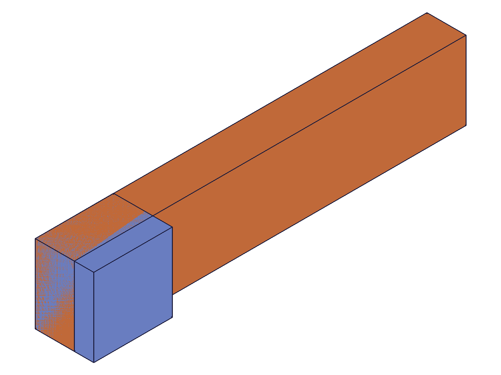
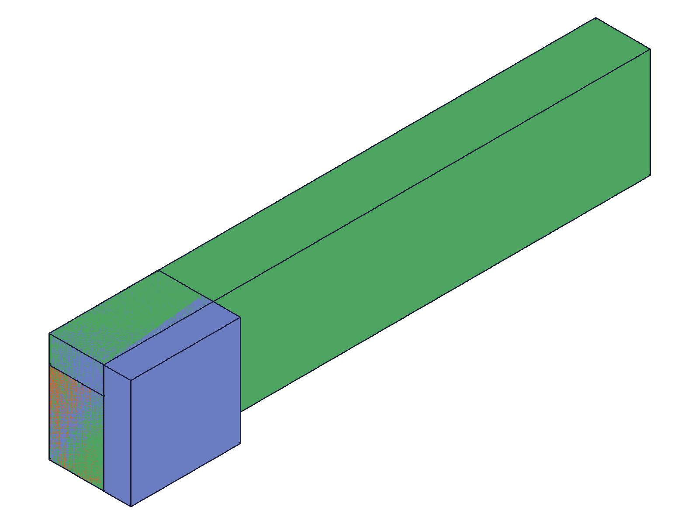
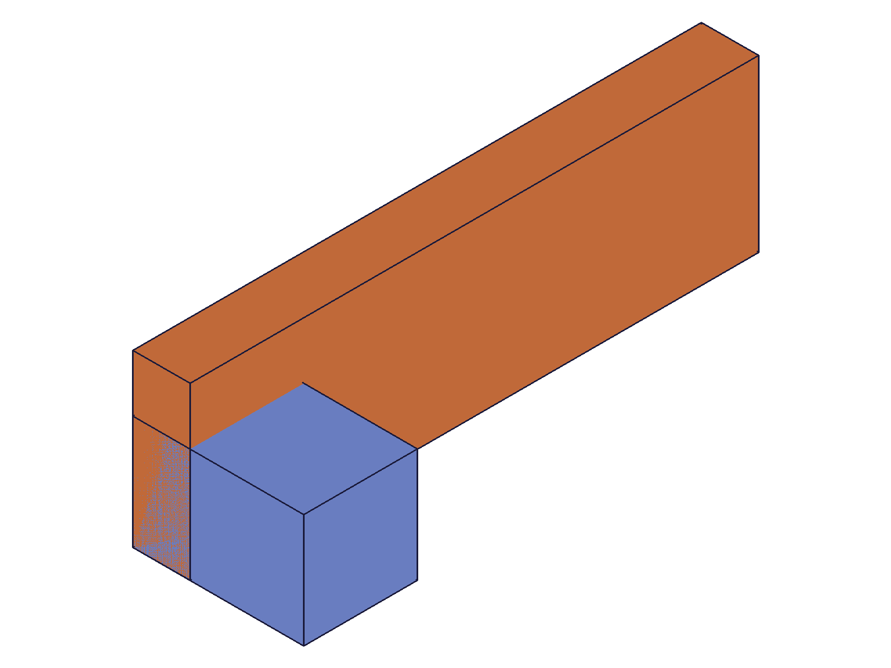

# Training: assembly.slider / updateSlider / getSlider

**Date:** 2026-04-29

## Goal

Testing `v1.assembly.slider`, `v1.assembly.updateSlider`, and `v1.assembly.getSlider`.

**Methods to cover:**

- `slider` — basic creation with mate1/mate2
- `slider` params: name, xOffset, yOffset, zOffsetLimits (min/max/partial)
- `slider` — flip and reorient options on mates
- `slider` — batch creation (array param)
- `slider` — error cases: same instance, missing params, invalid values
- `updateSlider` — update name, mates, offsets, limits
- `updateSlider` — partial updates (change one param, keep rest)
- `getSlider` — retrieve by name from assembly or instance
- `getSlider` — not-found case
- `deleteConstraint` — delete a slider constraint

**Questions:**

- How does slider differ from cylindrical? (1 DOF translation only, no rotation?)
- Does xOffset/yOffset fix the transverse position while Z slides freely?
- Can zOffsetLimits be partial on create (min-only or max-only)?
- What happens with empty `{}` for zOffsetLimits?
- Does the constraint actually restrict motion to 1 DOF (translation along Z)?

---

## 01 — basic slider creation

Script: `scripts/01-basic-slider.mjs` — ✅ Slider created successfully. Result: constraint ID 216, maxLevel 31.

|  |
|---|

**Data:** `result: 216`, `maxLevel: 31`, `messages: []`. Rail (orange, 100×20×10) and carriage (blue, 20×20×15) constrained together. Carriage sits at one end of the rail along the Z axis.

## 02 — xOffset and yOffset

Script: `scripts/02-x-y-offsets.mjs` — ✅ Both positive and negative offsets accepted.

|  |  |
|---|---|

**Data:** Positive offsets (xOffset: 30, yOffset: 15) → result 216, maxLevel 31. Negative offsets (xOffset: -20, yOffset: -10) → result 371, maxLevel 31. Both succeed. xOffset and yOffset fix the transverse position relative to the mate WCS axes — the constrained instance is displaced in X and Y while free to slide along Z.

**📌 LLM doc:** xOffset and yOffset are fixed transverse displacements (mm), not limits. They set constant offsets perpendicular to the slide axis.

## 03 — zOffsetLimits variants

Script: `scripts/03-z-offset-limits.mjs` — ✅ Full, min-only, and max-only all succeed. Empty `{}` errors.

**Data:**
- Full `{ min: -30, max: 40 }` → result 216, maxLevel 31
- Min-only `{ min: -20 }` → result 313, maxLevel 31 (partial allowed on create)
- Max-only `{ max: 50 }` → result 410, maxLevel 31 (partial allowed on create)
- Empty `{}` → null, maxLevel 51, code 1003: `"The object "zOffsetLimits" is empty!"`

**📌 LLM doc:** zOffsetLimits allows partial specs on create (min-only or max-only). Empty `{}` errors with code 1003.

## 04 — flip and reorient

Script: `scripts/04-flip-reorient.mjs` — ✅ Valid flip/reorient values work; invalid values error with code 1013.

**Data:**
- `flip: 'X'` → result 216, maxLevel 31
- `flip: '-Z'` → result 371, maxLevel 31
- `reorient: '90'` → result 555, maxLevel 31
- `flip: 'INVALID'` → null, maxLevel 51, code 1013: `"Type \"INVALID\" is not supported to use as flip type."`
- `reorient: '45'` → null, maxLevel 51, code 1013: `"Type \"45\" is not supported to use as reorient type."`

**📌 LLM doc:** Same flip/reorient rules as other kinematic constraints. Valid flip: X, -X, Y, -Y, Z, -Z. Valid reorient: '0', '90', '180', '270' (strings, not numbers).

## 05 — batch creation

Script: `scripts/05-batch-creation.mjs` — ✅ Array param returns array of IDs.

**Data:** `result: [309, 313]`, `maxLevel: 31`. Batch creation works identically to other kinematic constraints.

## 06 — error cases

Script: `scripts/06-same-instance-error.mjs` — ✅ All expected errors triggered.

**Data:**
- Same instance in both mates → null, code 1014: "same rigid set"
- Missing mate2 → null, code 0: evaluation error
- Missing assembly id → null, code 1004: `"id" must be provided to create CC_SliderConstraint`
- Template ID in path → null, code 1001: `"path" has a wrong id type! Provide only following id types: ["instance"]`

**📌 LLM doc:** Error codes match the pattern from other kinematic constraints.

## 07 — getSlider

Script: `scripts/07-get-slider.mjs` — ✅ Returns full constraint object. Instance-based lookup fails.

**Data:** `getSlider` result keys: `id, mate1, mate2, name, xOffset, yOffset, zOffsetLimits`. Full object returned with all configured values including flip 'Y' and reorient '90' on mate1 (see `files/07-get-slider-get-slider-result.json`).

- From assembly ID: found ✅
- From instance ID: null, maxLevel 51 — **instance-based lookup fails**
- Not found name: null, maxLevel 51, code 0: `"There couldn't be found a constraint with name \"NonExistent\""`

**📌 LLM doc:** getSlider requires assembly/product ID, not instance ID. Returns null for instance-based lookups.

## 08 — updateSlider

Script: `scripts/08-update-slider.mjs` — ✅ All update operations succeed.

**Data:**
- Update name: result 216, maxLevel 31. Rename from "OrigSlider" to "RenamedSlider" verified via getSlider.
- Update offsets (xOffset: 20, yOffset: -10): result 216, maxLevel 31. Verified in `files/08-update-slider-after-update.json`.
- Update zOffsetLimits: result 216, maxLevel 31.
- Update mate1 flip to 'X': result 216, maxLevel 31. Verified in `files/08-update-slider-after-flip-update.json` — mate1.flip changed to "X", mate2 unchanged.

**📌 LLM doc:** updateSlider returns the constraint ID on success. Partial updates preserve unchanged fields.

## 09 — partial limit updates

Script: `scripts/09-update-partial-limits.mjs` — ✅ Partial updates preserve the other side. Null clears limits.

**Data:**
- Before: `{ min: -20, max: 30 }`
- Update min-only `{ min: -50 }`: after → `{ min: -50, max: 30 }` (max preserved)
- Update max-only `{ max: 100 }`: after → `{ min: -50, max: 100 }` (min preserved)
- Clear with null: after → `{ min: null, max: null }` — limits removed

**📌 LLM doc:** Partial zOffsetLimits updates preserve the untouched side. Setting zOffsetLimits to `null` clears both limits (sets to `{ min: null, max: null }`).

## 10 — deleteConstraint

Script: `scripts/10-delete-constraint.mjs` — ✅ Delete works with `ids` (plural, array). Singular `id` fails.

**Data:**
- `deleteConstraint({ ids: [cId] })` → null result, maxLevel 31 (success). getSlider confirms gone.
- `deleteConstraint({ id: cId2 })` → null, maxLevel 51, code 1004: `"The parameter \"ids\" must be provided"`

**📌 LLM doc:** Same as other constraints — deleteConstraint requires `ids` (plural, array), not `id`.

## 11 — duplicate and cross-type names

Script: `scripts/11-duplicate-names.mjs` — ✅ Duplicates allowed. Cross-type collision confirmed.

**Data:**
- Two sliders named "DupName": both created (ids 309, 313). `getSlider` returns the first one (id 309).
- Cross-type: fastened "CrossType" (id 410) created first, then slider "CrossType" (id 507). `getSlider({ name: 'CrossType' })` returns `null` — the fastened constraint shadows the slider.

**📌 LLM doc:** Duplicate slider names allowed, getSlider returns the first match. Cross-type name collision: if a non-slider constraint with the same name was created first, getSlider fails to find the slider.

## 12 — default name

Script: `scripts/12-default-name.mjs` — ✅ Default name is "Slider".

**Data:** Created without name param → getSlider by name "Slider" found it. Confirmed default name is "Slider".

## 13 — combined realistic usage

Script: `scripts/13-combined-offsets-limits.mjs` — ✅ All params together work correctly.

|  |
|---|

**Data:** xOffset: 10, yOffset: -5, zOffsetLimits: `{ min: -40, max: 40 }`. All values round-trip correctly through getSlider (see `files/13-combined-offsets-limits-combined-result.json`). Snapshot shows the carriage displaced from the rail by the configured offsets.

---

## Coverage Checklist

- [x] The API has been called at least once successfully
- [x] Every required parameter has been tested (id, mate1, mate2)
- [x] Key optional parameters exercised (name, xOffset, yOffset, zOffsetLimits)
- [x] flip and reorient enum values tested (valid and invalid)
- [x] Batch creation tested (array param → array result)
- [x] updateSlider tested (name, offsets, limits, mate flip)
- [x] getSlider tested (by assembly, by instance, not-found, duplicate names)
- [x] deleteConstraint tested (ids array, singular id error)
- [x] Error cases covered (same instance, missing params, invalid values, template in path)
- [x] Realistic usage combining all params
- [x] Behavioral claims verified with data (filewrite dumps, log values) AND visual evidence (snapshots)
