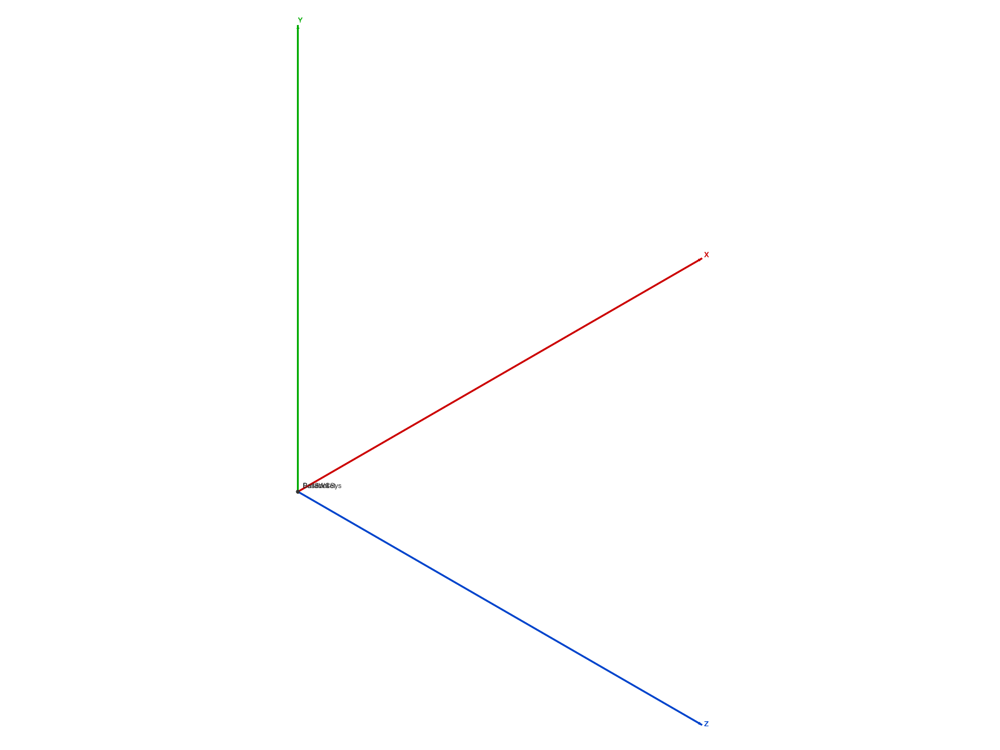
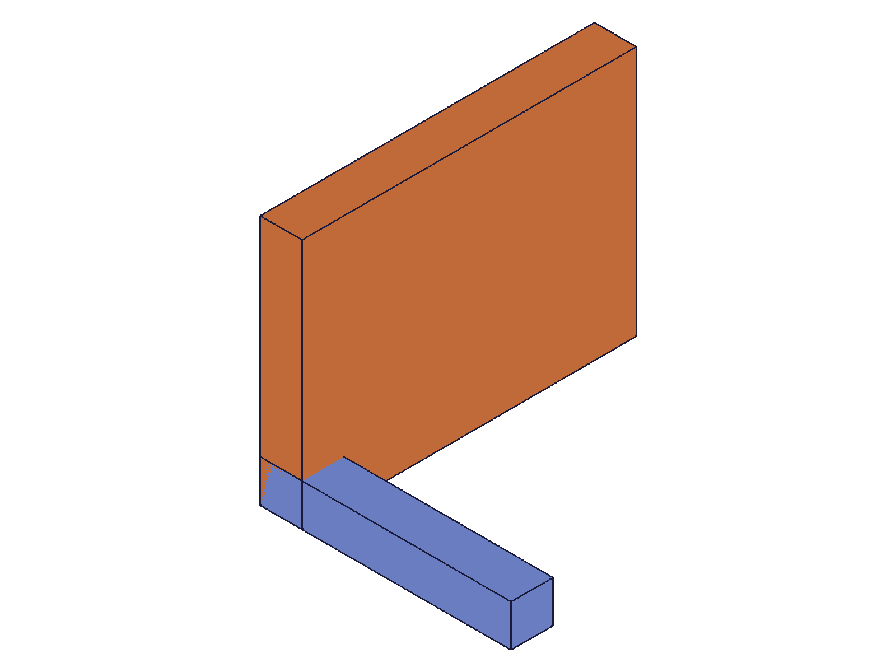
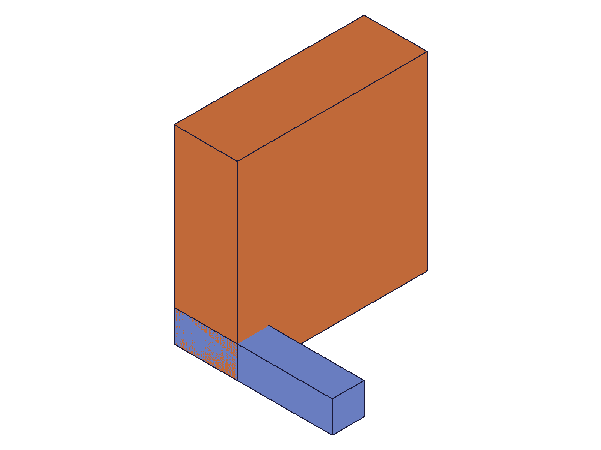

# Training: assembly.spherical / updateSpherical / getSpherical

**Date:** 2026-04-29

## Goal

Testing `v1.assembly.spherical`, `v1.assembly.updateSpherical`, and `v1.assembly.getSpherical`.

**Methods to cover:**

- `spherical` — basic creation with mate1/mate2
- `spherical` params: id, name, mate1 (path, csys, flip, reorient), mate2 (path, csys, flip, reorient), yRotationLimits
- `updateSpherical` — change name, mates, yRotationLimits, remove limits
- `getSpherical` — retrieve by name, verify returned structure
- Batch creation (array param)
- Error cases: self-constraint, missing params, invalid flip/reorient

## 01 — basic spherical

Script: `scripts/01-basic-spherical.mjs` — ✅ Basic creation with mate1/mate2 works. Returns constraint ID 216, maxLevel 31.

|  |  |
|---|---|

**Data:** `result: 216`, `maxLevel: 31`, no error messages. See `files/01-basic-spherical-create-response.json`.

## 02 — yRotationLimits

Script: `scripts/02-yRotationLimits.mjs` — ✅ Both degree expressions and radian values work for yRotationLimits.max.

|  |
|---|

**Data:**
- `yRotationLimits: { max: '45deg' }` → created ID 216, maxLevel 31
- `yRotationLimits: { max: Math.PI/4 }` (radians) → created ID 220, maxLevel 31
- No limits → created ID 224, maxLevel 31

All three variants succeed. The parameter only has `max` — no `min` property exists (unlike revolute/cylindrical zRotationLimits which have both min and max).

📌 LLM doc: spherical only has yRotationLimits.max, not min — unlike other kinematic constraints.

## 03 — getSpherical

Script: `scripts/03-getSpherical.mjs` — ✅ Retrieval works correctly.

**Data (from `files/03-getSpherical-get-response.json`):**
- Returns: `{ id, name, mate1: { csys, flip, path, reorient }, mate2: { csys, flip, path, reorient }, yRotationLimits: { max } }`
- flip/reorient stored as requested (`"Y"`, `"90"`, `"-Z"`, `"180"`)
- `'60deg'` stored as `1.0471975511965976` radians (π/3)
- No limits → `yRotationLimits: { max: null }`
- Nonexistent name → `null`, maxLevel 51

📌 LLM doc: getSpherical return structure — yRotationLimits only has max, stored as radians.

## 04 — updateSpherical

Script: `scripts/04-updateSpherical.mjs` — ✅ All update operations work.

**Data:**
- Name update: `updateSpherical({ id: cId, name: 'RenamedBall' })` → result 224, maxLevel 31. Verified via getSpherical.
- Add limits: `{ yRotationLimits: { max: '90deg' } }` → stored as `1.5707963267948966` (π/2)
- Change limits: `{ yRotationLimits: { max: 1.57 } }` → stored as `1.57`
- Remove limits: `{ yRotationLimits: null }` → `max` becomes `null`
- Retarget mate2 csys: works, maxLevel 31

📌 LLM doc: null removes limits, partial limits ok (max-only is the only option anyway).

## 05 — error cases

Script: `scripts/05-errors.mjs` — ✅ All expected errors triggered.

**Data (from `files/05-errors-all-errors.json`):**

| Test | Result | maxLevel | Code | Message |
|---|---|---|---|---|
| self-constraint | null | 51 | 1014 | same rigid set |
| invalid flip | null | 51 | 1013 | "INVALID" not supported as flip type |
| invalid reorient | null | 51 | 1013 | "45" not supported as reorient type |
| template in path | null | 51 | 1001 | wrong id type, provide "instance" |
| empty yRotationLimits {} | null | 51 | 1003 | "yRotationLimits" is empty |
| negative max (-1) | **236** | **31** | — | **Succeeds!** |

**Learned:** Negative yRotationLimits.max is accepted without error. Semantically questionable but the server doesn't validate.

📌 LLM doc: negative yRotationLimits.max silently accepted — behavior undefined.

## 06 — batch creation

Script: `scripts/06-batch.mjs` — ✅ Batch creation with array param works.

|  |
|---|

**Data:** `result: [226, 230]`, maxLevel 31. Two constraints created in one call. Second constraint had yRotationLimits.

## 07 — flip and reorient values

Script: `scripts/07-flip-reorient.mjs` — ✅ All 6 flip values and all 4 reorient values accepted.

**Data (from `files/07-flip-reorient-flip-reorient-results.json`):**
- Flips: Z, -Z, X, -X, Y, -Y — all maxLevel 31
- Reorients: 0, 90, 180, 270 — all maxLevel 31

## 08 — delete constraint

Script: `scripts/08-delete.mjs` — ✅ Delete works with `ids` array, fails with singular `id`.

**Data:**
- `deleteConstraint({ ids: [cId] })` → result null, maxLevel 31 (success)
- After delete, `getSpherical` returns null, maxLevel 51 (not found)
- `deleteConstraint({ id: cId })` → result null, maxLevel 51 (error — wrong param name)

📌 LLM doc: delete uses `ids` array, not singular `id`.
