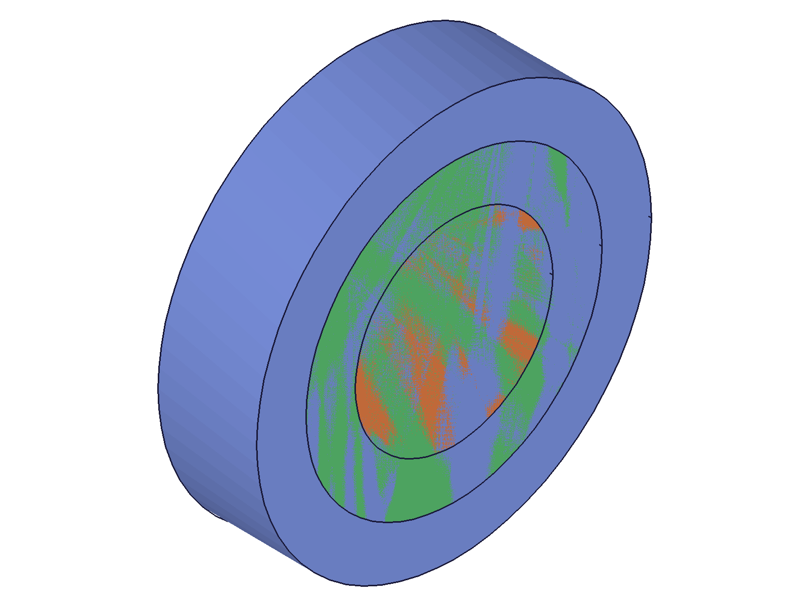
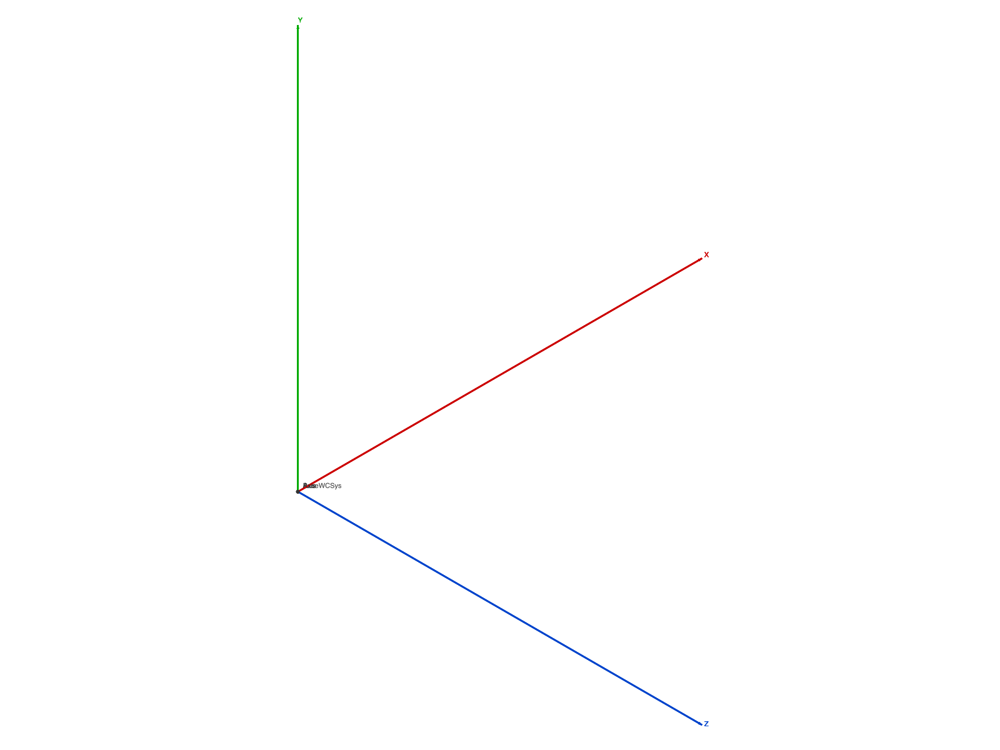

# Training: assembly.gear

**Date:** 2026-04-29

## Goal

Testing `v1.assembly.gear` — creates a gear relation linking the Z-rotation of two constraints in a fixed ratio.

**Methods to cover:**

- `gear` — basic creation with two revolute constraint IDs
- `gear` params: id (assembly), name, constr1Id, constr2Id, ratio, offset
- `gear` — ratio variations (0.5, 2, negative)
- `gear` — offset param (radians, degree expressions)
- `gear` — batch creation (array of params)
- `gear` — error cases (invalid IDs, same constraint twice, missing params)

**Questions:**

- Does the gear relation actually couple rotation between two revolute constraints?
- What happens with ratio=0 or negative ratios?
- Does the offset param accept both radians and degree strings?
- Can you create a gear between non-revolute constraints (e.g., cylindrical)?
- What does the return value look like?

## 01 — basic gear creation

Script: `scripts/01-basic-gear.mjs` — ✅ created assembly with 3 templates, revolute constraints, and a gear relation with ratio=2.

|  |  |
|---|---|

**Data:** gear result=263, maxLevel=31, empty messages array. Return value is a numeric constraint ID.

**Learned:** Gear creation is straightforward — needs assembly ID, two revolute constraint IDs, and optional ratio/offset.

## 02 — ratio and offset variations

Script: `scripts/02-ratio-offset.mjs` — ✅ all four variations succeed.

- ratio=0.5 → result=263, maxLevel=31
- default ratio (omitted) → result=425, maxLevel=31
- offset='60deg' → result=429, maxLevel=31
- offset=1.57 (radians) → result=433, maxLevel=31

**Data:** See `files/02-ratio-offset-gear-variations.json`. All succeed with empty messages.

**Learned:** Both ratio and offset are truly optional. Offset accepts both numeric radians and degree expression strings like `'60deg'`. Default ratio is 1, default offset is 0.

## 03 — edge cases

Script: `scripts/03-edge-cases.mjs` — mixed results, several error cases documented.

**Successful (accept silently):**
- ratio=-1 → ✅ result=263
- ratio=0 → ✅ result=267
- ratio=100 → ✅ result=271
- same constraint for both constr1Id/constr2Id → ✅ result=275 (no error!)

**Errors:**
- Invalid constraint ID (999999) → null, maxLevel=51, code 1006: "has an invalid id!"
- Missing constr1Id → null, maxLevel=51, code 1004: "must be provided"
- fastenedOrigin constraint → null, maxLevel=51, code 1001: **"has a wrong id type! Provide only following id types: [\"revoluteconstraint\"]"**

**Data:** See `files/03-edge-cases-edge-cases.json` for full error messages.

**Learned:** Gear relations ONLY accept revolute constraint IDs. Not cylindrical, not fastened, not fastenedOrigin. Negative and zero ratios are accepted without error. Same constraint for both IDs is also accepted (possibly a no-op).
**📌 LLM doc:** Gear relations only accept `revoluteconstraint` type — critical type restriction.
**📌 LLM doc:** Zero and negative ratios are accepted without error.
**📌 LLM doc:** Same constraint for both constr1Id/constr2Id is silently accepted.

## 04 — cylindrical constraints and batch creation

Script: `scripts/04-cylindrical-batch.mjs` — confirms cylindrical rejection, batch works.

- Cylindrical constraints in gear → null, maxLevel=51, same error as 03: only `revoluteconstraint` accepted
- Batch creation `gear([{...}, {...}])` → returns array [354, 358], both maxLevel=31

**Data:** See `files/04-cylindrical-batch-cylindrical-batch.json`.

**Learned:** Batch creation works — pass array of param objects, get array of IDs back. Confirms cylindrical constraints are rejected.
**📌 LLM doc:** Batch creation pattern.

## 05 — verify getGear and structure tree

Script: `scripts/05-verify-getgear.mjs` — ✅ getGear retrieves gear, structure tree analyzed.

**getGear result:** `{"constr1Id":255,"constr2Id":259,"id":263,"name":"TestGear","offset":0.5235987755982988,"ratio":2}`
- Offset passed as `'30deg'`, stored internally as 0.5236 radians (π/6)
- Returns: id, name, constr1Id, constr2Id, ratio, offset
- Not-found returns null + maxLevel 51

**Structure tree (CC_GearRelation):**
- Class: `CC_GearRelation`
- Lives in `CC_ConstraintSet` (parent=16, under assembly root)
- Members: ratio (real), offset (real, expression field preserves degree string), constr1Value (real), constr2Value (real), entities (array of 2 constraint IDs)
- `constr1Value`/`constr2Value` track current rotation values of the linked constraints

**Data:** See `files/05-verify-getgear-structure-with-gears.json` for full structure tree.

**Learned:** Internally, the two constraint IDs are stored in an `entities` array member. The `offset` expression field preserves the original degree expression string. Structure tree includes `constr1Value`/`constr2Value` tracking rotation state.
**📌 LLM doc:** getGear return shape, internal structure details.

## 06 — delete gear and cascade behavior

Script: `scripts/06-delete-gear.mjs` — ✅ deletion works, cascade behavior confirmed.

- `deleteConstraint({ ids: [gearId] })` → null, maxLevel=31 (success)
- After deletion, `getGear` returns null + maxLevel 51 (not found)
- **Cascade deletion:** deleting an underlying revolute constraint also deletes the gear relation. After `deleteConstraint({ ids: [rev1] })`, `getGear({ name: 'GearWithDeletedRev' })` returns null + maxLevel 51.

**Data:** See `files/06-delete-gear-delete-result.json` and `files/06-delete-gear-gear-after-rev-delete.json`.

**Learned:** Gear relations are deleted via `deleteConstraint({ ids: [...] })` — same `ids` array pattern as other constraints. Deleting a linked revolute cascade-deletes the gear relation.
**📌 LLM doc:** Deletion via deleteConstraint, cascade behavior when underlying constraint is deleted.

## Coverage Check

- [x] gear called successfully
- [x] All required params tested (id, constr1Id, constr2Id)
- [x] Optional params exercised (name, ratio, offset)
- [x] Ratio variations: 0.5, 2, -1, 0, 100, default
- [x] Offset: radians (1.57), degree string ('60deg', '30deg'), default
- [x] Batch creation
- [x] Error cases: invalid IDs, missing params, wrong constraint types
- [x] Deletion with deleteConstraint
- [x] Cascade deletion behavior
- [x] Structure tree presence
- [x] getGear verification
