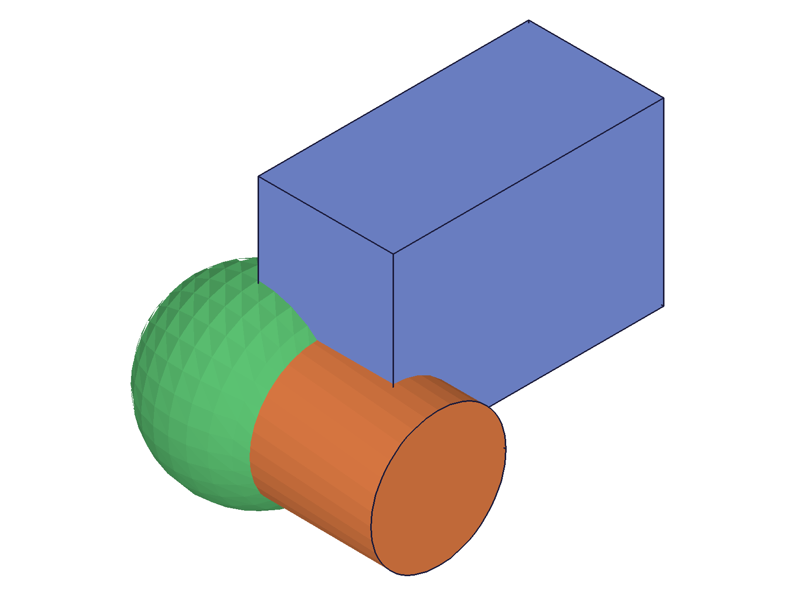

# Training: assembly.group / updateGroup / getGroup

**Date:** 2026-05-01

## Goal

Testing `v1.assembly.group`, `v1.assembly.updateGroup`, and `v1.assembly.getGroup` — the group relation that binds instances together in an assembly.

**Methods to cover:**

- `group` — create a group constraint with `id` (assembly), `instanceIds`, optional `name`
- `updateGroup` — update `instanceIds` and/or `name` on an existing group
- `getGroup` — retrieve group constraint by name from assembly/product

**Questions:**

- What does `group` return? (ID, VOID, array?)
- What is the minimum number of instances required? Can you group 0 or 1 instance?
- Can the same instance appear in multiple groups?
- What happens when you group instances that don't exist?
- Does `updateGroup` require open/close feature? (relations usually don't)
- Does `getGroup` return instanceIds? What shape is the return object?
- How does `deleteConstraint` work with groups?
- Does deleting an instance cascade-delete the group?
- Batch create/update/get patterns
- Default name behavior

---

## 01 — basic group creation

Script: `scripts/01-basic-group.mjs` — ✅ group creates successfully, returns numeric ID.

|  |
|---|

**Data:** `group({ id: asmId, name: 'TestGroup', instanceIds: [inst1, inst2, inst3] })` → result 269, maxLevel 31. Second group with default name → result 273, maxLevel 31. Both return numeric IDs with empty messages array.

**Learned:** `group` returns a numeric group constraint ID. Default name is `"Group"`. Multiple groups can coexist in one assembly.

---

## 02 — getGroup retrieval

Script: `scripts/02-get-group.mjs` — ✅ getGroup returns `{ id, instanceIds, name }`.

**Data:**
- Found: `{ id: 178, instanceIds: [170, 172], name: 'MyGroup' }`, maxLevel 31
- Not-found: `null`, maxLevel 51
- Case-wrong (`'mygroup'` instead of `'MyGroup'`): `null`, maxLevel 51
- Default name `'Group'`: works, returns `{ id: 182, instanceIds: [170], name: 'Group' }`
- Instance ID as `id` param: `null`, maxLevel 51

**Learned:** Return object is `{ id, instanceIds, name }` — simpler than gear (no ratio/offset). Case-sensitive lookup. Must use assembly/product ID, not instance ID.
**📌 LLM doc:** getGroup return shape, case sensitivity, must use assembly ID.

---

## 03 — updateGroup

Script: `scripts/03-update-group.mjs` — ✅ all update operations succeed.

**Data:**
- Add inst3: `updateGroup({ id: groupId, instanceIds: [inst1, inst2, inst3] })` → result 180, maxLevel 31. getGroup confirms 3 instances.
- Rename: old name returns null, new name returns full object with instanceIds preserved.
- Both at once: atomic — name and instanceIds both change.
- Name-only update: instanceIds preserved as `[170]` (didn't revert to original `[170, 172]`).

**Learned:** Partial updates work — only specified params change. Returns the group ID (same as input). No openFeature/closeFeature required. Rename makes old name inaccessible.
**📌 LLM doc:** Partial update behavior, no open/close needed, rename invalidates old name.

---

## 04 — edge cases

Script: `scripts/04-edge-cases.mjs` — mixed results, several important findings.

**Data:**
- Empty `instanceIds: []` → returns ID 113 but **maxLevel 61 (FATAL)**: "No instances were provided for the Group constraint". Group is created but empty.
- Single instance → result 119, maxLevel 31. Works fine.
- Duplicate IDs `[inst1, inst1, inst1]` → accepted silently! getGroup returns `{ instanceIds: [105, 105, 105] }`. No dedup.
- Nonexistent ID `[99999]` → `null`, maxLevel 51, code 1006.
- Mixed valid/invalid `[inst1, 99999]` → `null`, maxLevel 51. Entire call fails.
- Same instance in multiple groups → both succeed. Instance 105 appears in both GroupA and GroupB.
- Missing `instanceIds` param entirely → `null`, maxLevel 51, code 1004.

**Learned:** Empty array creates group but with FATAL error. Duplicates are accepted without dedup. Mixed valid/invalid fails entirely. Instances can belong to multiple groups.
**📌 LLM doc:** Empty array FATAL, duplicates accepted, no exclusivity between groups, mixed valid/invalid fails atomically.

---

## 05 — delete and cascade behavior

Script: `scripts/05-delete-cascade.mjs` — ✅ deleteConstraint works, **NO cascade on instance deletion**.

**Data:**
- `deleteConstraint({ ids: [groupId] })` → null, maxLevel 31. getGroup confirms deletion.
- Delete one grouped instance (inst2): group **survives**. getGroup returns original instanceIds `[105, 107]` — still lists the deleted instance!
- Delete ALL grouped instances: group **still survives**. getGroup returns `{ instanceIds: [105, 109] }` — stale IDs.

**Learned:** Groups do NOT cascade-delete when instances are deleted. The group persists with stale (deleted) instance IDs. This is different from gear relations (which cascade-delete when revolute constraints are deleted).
**📌 LLM doc:** No cascade deletion — groups survive instance deletion with stale IDs. Use deleteConstraint to remove groups explicitly.

---

## 06 — batch operations

Script: `scripts/06-batch-ops.mjs` — ✅ all batch patterns work.

**Data:**
- Batch create `group([{...}, {...}])` → `[115, 119]`, maxLevel 31.
- Batch get `getGroup([{...}, {...}, {...}])` → array of objects/null. maxLevel 51 when any entry not-found.
- Batch update `updateGroup([{...}, {...}])` → `[115, 119]`, maxLevel 31.

**Learned:** Standard batch pattern consistent with gear and other constraints.
**📌 LLM doc:** Batch create/get/update patterns.

---

## 07 — error cases

Script: `scripts/07-error-cases.mjs` — ✅ clear error messages.

**Data:**
- updateGroup with assembly ID → code 1007 "not a constraint or relation"
- updateGroup with instance ID → code 1007 (same)
- updateGroup with nonexistent ID → code 1006 "does not exist"
- group with template ID in instanceIds → code 1001 "wrong id type! Only instance"
- group with group ID in instanceIds → code 1001 (same — groups can't nest)
- group with instance ID as assembly param → code 1007 "not an assembly id"

**Learned:** instanceIds ONLY accepts instance IDs. id param for group() must be assembly, for updateGroup must be group constraint ID. No group nesting.
**📌 LLM doc:** Error codes table, instanceIds only accepts instances, no nesting.

---

## 08 — structure tree and open/close

Script: `scripts/08-structure.mjs` — ✅ internal structure revealed, no open/close needed.

**Data:**
- Structure tree class: `CC_GroupConstraint` under `CC_ConstraintSet` (parent).
- Members: `instances` (array of `{ value: id, type: 'id' }` objects), `_VERSION`.
- updateGroup without openFeature → result 113, maxLevel 31. Verified update persists.

**Learned:** Internal class is `CC_GroupConstraint`. No openFeature/closeFeature required for updates (same as gear relations).
**📌 LLM doc:** Internal structure, no open/close needed.
