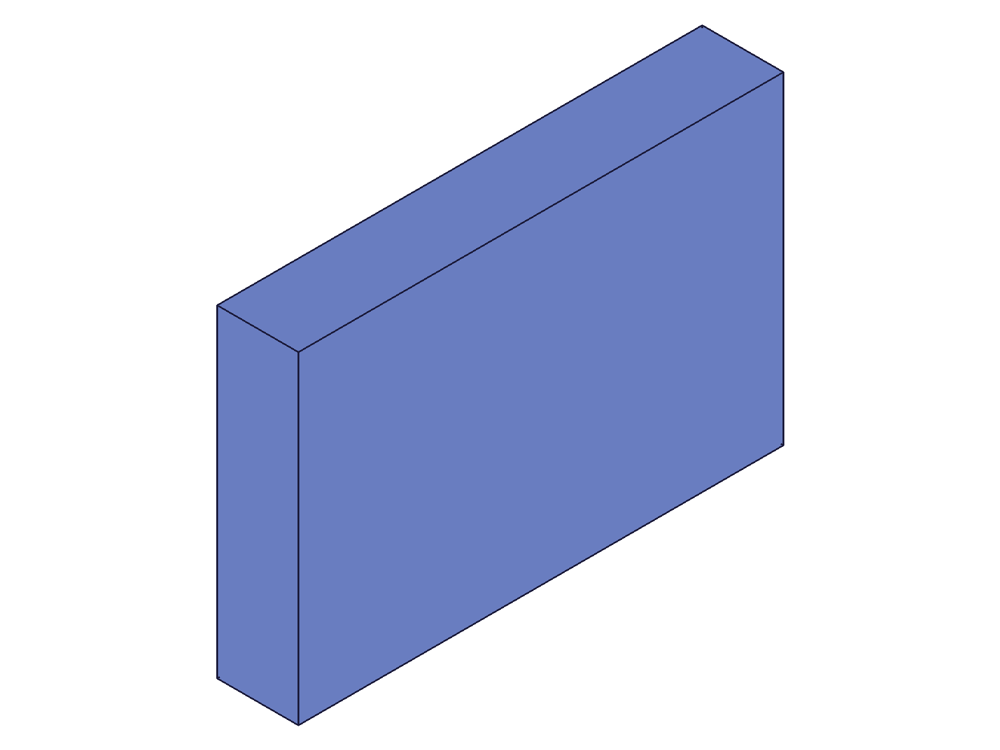

# Training: assembly.create

**Date:** 2026-05-05

## Goal

Testing `v1.assembly.create` — the top-level assembly root creation API.

**Methods to cover:**

- `assembly.create` — no params (defaults)
- `assembly.create` — with `name` param
- `assembly.create` — with `ident` param
- `assembly.create` — both `name` and `ident`
- Return value: what ID comes back, what type of node is it in the structure tree
- Relationship to `setCurrentProduct`: does `create` auto-switch context?
- What happens if you call `create` twice (second assembly replaces first?)
- Can you use the returned ID with `partTemplate`, `instance`, etc.?

**Questions:**

- What is the returned ID's role in the structure tree?
- Does `assembly.create` clear the drawing like `part.create` does?
- Can multiple root assemblies coexist?
- What does the structure tree look like after `create`?
- What does `calculateMassProperties` return on an empty assembly?

---

## 01 — basic create (no params)

Script: `scripts/01-basic-create.mjs` — ✅ `assembly.create({})` returns ID 12, maxLevel=31 (info, no error).

**Data:** `result: 12`, `messages: []`. Snapshot produced only a workgeo PNG (empty assembly, BaseWCSys only).

|  |
|---|

---

## 02 — named create

Script: `scripts/02-named-create.mjs` — ✅ `assembly.create({ name: 'MyAssembly', ident: 'ASM-001' })` returns ID 12, maxLevel=31.

**Data:** Structure tree shows node 12 is `CC_AssemblyRoot` with `name: "MyAssembly"`. Ident is stored in child `IdentToIdMap` (id=22) as a map entry `"ASM-001" → 12`. Structure fields: `root: 12, currentProduct: 12, currentInstance: 12`.

**📌 LLM doc:** Document structure tree layout after create — CC_AssemblyRoot with children [ExpressionSet, ConstraintSet, GeometrySet(BaseWCSys), IdentMap].

---

## 03 — double create (error)

Script: `scripts/03-double-create.mjs` — Second `assembly.create` returns `null` with maxLevel=51 (error).

**Data:** First create returns 12 (success). Second returns null. Structure tree still shows only the first assembly (id=12).

---

## 04 — create after part.create

Script: `scripts/04-create-vs-part.mjs` — `assembly.create` after `part.create` returns `null`, maxLevel=51.

**Data:** Part+box created (partId=4, boxId=61). Then assembly.create fails. Structure retains the part.

**Learned:** `assembly.create` does NOT clear existing content. It requires an empty drawing. Only one root entity (part OR assembly) allowed.

---

## 05 — create then template + instance

Script: `scripts/05-create-then-template.mjs` — ✅ Full workflow: create → partTemplate → box → setCurrentProduct → instance → calculateMassProperties.

**Data:** asmId=12, tplId=22, boxId=70, inst1=105. Mass properties: `{ cog: {x:30, y:20, z:5}, volume: 24000 }`. Box is 60×40×10 at origin, COG confirms part.box is corner-aligned (+X/+Y/+Z quadrant).

|  |
|---|

---

## 06 — calculateMassProperties on empty assembly

Script: `scripts/06-empty-mass-props.mjs` — ❌ `calculateMassProperties({ id: asmId })` errors on empty assembly.

**Data:** result=null, maxLevel=51, error message: "Evaluation error in PartAPI_v1.calculateMassProperties... NullMem". Code=0.

**Learned:** Cannot calculate mass properties when assembly has no geometry (no instances with solids).
**📌 LLM doc:** Document that calculateMassProperties errors on empty assemblies.

---

## 07 — structure tree detail

Script: `scripts/07-structure-tree-detail.mjs` — ✅ Full structure tree analyzed.

**Data:** After `assembly.create({ name: 'StructureTest', ident: 'ST-001' })`:
- `AllObjects` (id=1) → children: [4, 6, 8, 10, 12]
- `CC_PartContainer` (id=8) → empty
- `CC_AssemblyContainer` (id=10) → empty
- `CC_AssemblyRoot` (id=12) "StructureTest" → children: [14, 16, 18, 22]
  - `CC_ExpressionSet` (id=14) — assembly-level expressions
  - `CC_ConstraintSet` (id=16) — assembly constraints
  - `CC_GeometrySet` (id=18) → child: CC_WorkCSys "BaseWCSys" (id=20)
  - `IdentToIdMap` (id=22) — stores ident→id mappings

---

## 08 — clear then create

Script: `scripts/08-clear-then-create.mjs` — ✅ After `common.clear({})`, `assembly.create` succeeds.

**Data:** Part created (id=4), cleared, then assembly.create returns 12 with maxLevel=31. Confirms clear removes the root entity and allows a fresh create.

---

## 09 — error messages (double create)

Script: `scripts/09-error-messages.mjs` — Error message captured.

**Data:** Error code=1200, level=51, message: "There is already a root assembly or part which must be removed first."

**📌 LLM doc:** Document error code 1200 and the one-root-entity constraint.

---

## 10 — no-params default

Script: `scripts/10-no-params.mjs` — ✅ `assembly.create()` (no args) works, default name is "AssemblyRoot".

**Data:** result=12, default name confirmed from structure tree.

---

## 11 — ident lookup

Script: `scripts/11-ident-lookup.mjs` — ✅ Ident stored in IdentToIdMap, templates findable via `getPartTemplate`.

**Data:** IdentToIdMap member shows `{ "ROOT-001": 12 }` mapping. `getPartTemplate({ name: 'PartA' })` returns the template ID correctly.

---

## 12 — ident/name as productId in instance()

Script: `scripts/12-ident-as-productId.mjs` — ✅ Both string name and numeric ID work for `productId` param.

**Data:** `instance({ productId: 'Bracket', ownerId: asmId })` → result=107. `instance({ productId: tplId, ownerId: asmId })` → result=109. Both succeed with maxLevel=31.

**📌 LLM doc:** Document that productId accepts template name strings in addition to numeric IDs.

---

## 13 — currentProduct after create

Script: `scripts/13-current-product-after-create.mjs` — ✅ After `assembly.create`, currentProduct is already the assembly. `partTemplate` works immediately.

**Data:** asmId=12, tplId=22. `getPartTemplate({ name: 'DirectAfterCreate' })` returns 22. No `setCurrentProduct` needed between create and partTemplate.

**Learned:** `assembly.create` auto-sets currentProduct. `partTemplate` then switches context to the new part (for building geometry). You only need `setCurrentProduct({ id: asmId })` to return to assembly context AFTER building geometry in a template.
**📌 LLM doc:** Document the context-switching behavior.

