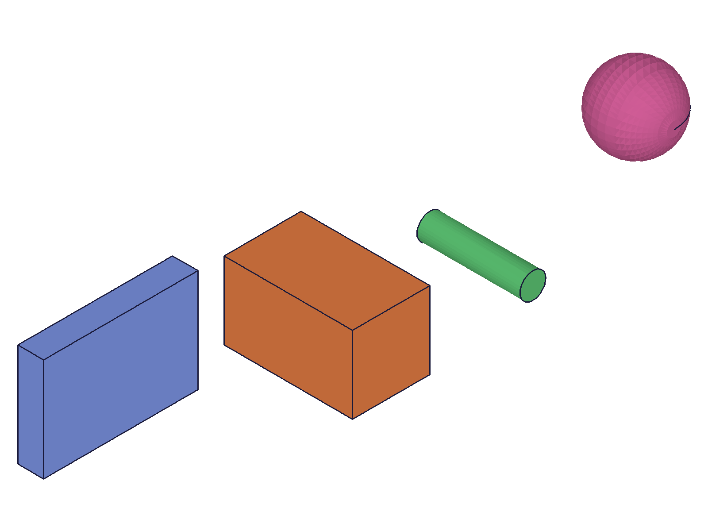

# Training: assembly.partTemplate

**Date:** 2026-05-05

## Goal

Testing `v1.assembly.partTemplate` — creates a new part and adds it as template to the product container.

**Methods to cover:**

- `partTemplate` — basic creation, naming
- `partTemplate` — what context it switches to (does it auto-set currentProduct?)
- `partTemplate` — building geometry inside the template (box, workCSys)
- `partTemplate` — returning to assembly context with `setCurrentProduct`
- `partTemplate` — multiple templates in the same assembly
- `getPartTemplate` — retrieve by name and retrieve all (covered lightly, full training in task #4)

**Questions:**

- What ID does `partTemplate` return? Is it the same as a `part.create` ID?
- Does calling `partTemplate` switch context away from the assembly?
- Can you call `part.*` APIs using the returned template ID?
- Where does the template appear in the structure tree?
- What happens if you call `partTemplate` without first calling `assembly.create`?
- Can you create multiple templates? How are they indexed?
- What is the COG of a template vs an instance of that template? (spatial verification)

---

## 01 — basic creation

Script: `scripts/01-basic-creation.mjs` — ✅ `partTemplate({ name: 'Plate' })` returns ID 22. maxLevel=31 (success). `currentProduct` stays at 12 (assembly root) — **no context switch**.

**Data:** `result: 22`, `structure.currentProduct: 12` (assembly), `structure.root: 12`.

---

## 02 — build geometry inside template

Script: `scripts/02-build-geometry.mjs` — ✅ `part.box` and `part.workCSys` work with template ID. Instance creation succeeds.

|  |
|---|

**Data:** `part.box` returns feature ID 70. After calling `part.box({ id: tplId })`, `currentProduct` switches to 22 (template). `workCSys` returns ID 107. Template mass: `{cog:{x:30,y:20,z:5}, volume:24000}` — correct for 60×40×10 box. Instance (id=113) created successfully (maxLevel=31).

**📌 LLM doc:** `partTemplate` does NOT switch context, but `part.*` calls with the template ID DO switch `currentProduct` to the template.

---

## 03 — context switch behavior

Script: `scripts/03-context-behavior.mjs` — ✅ Detailed context tracking confirms:
1. After `partTemplate`, currentProduct = 12 (assembly) — NO switch
2. `assembly.instance` works without `setCurrentProduct` — context is still assembly
3. After `part.box({ id: tplId })`, currentProduct switches to 22 (template)
4. `assembly.instance` STILL works even after context switches to template

**Data:** Instance creation works regardless of currentProduct state — assembly calls accept explicit IDs independently of context.

**📌 LLM doc:** Context switch is caused by `part.*` calls, not `partTemplate`. Assembly operations (`instance`, etc.) work regardless of `currentProduct` because they use explicit ID params.

---

## 04 — without assembly.create

Script: `scripts/04-without-assembly.mjs` — ✅ Fails with clear error.

**Data:** `result: null`, `maxLevel: 51`, error: "Assembly building is not initialized!" + "[Evaluation error in AssemblyAPI_v1.partTemplate::PROC:[CCVM::lcm: objId not found]]"

**📌 LLM doc:** Must call `assembly.create` first. Error is clear and descriptive.

---

## 05 — multiple templates

Script: `scripts/05-multiple-templates.mjs` — ✅ Multiple templates work. Default naming adds numeric suffix.

**Data:** Template IDs: 22, 68, 114, 160. `getPartTemplate({})` returns all: `[22,68,114,160]`. `getPartTemplate({ name: 'Plate' })` returns 68.

COG verification with instances at different offsets:
- i1 (box 60×40×10 at origin): COG=(30,20,5) ✓
- i2 (box 30×30×50 at x=80): COG=(95,15,25) ✓ (80+15, 15, 25)
- i3 (cyl d=10 h=40 at x=160): COG≈(160,0,20) ✓
- i4 (sphere r=15 at x=240): COG≈(240,0,0) ✓

|  |
|---|

**📌 LLM doc:** Multiple templates supported. Default name is "Part", subsequent defaults get "Part0", "Part1", etc.

---

## 06 — structure tree

Script: `scripts/06-structure-tree.mjs` — ✅ Templates live in `CC_PartContainer` (id=8) as `CC_Part` nodes.

**Data:** `partTemplate()` with no args works (result: 22). `partTemplate({})` works (result: 68). Structure: `CC_PartContainer` children: [22 "Part", 68 "Part0", 114 "NamedPart"]. Instances are `CC_ProductReference` nodes under `CC_AssemblyRoot` with `link` pointing to template ID.

**📌 LLM doc:** Templates stored in CC_PartContainer. Instances are CC_ProductReference nodes with `link` = template ID.

---

## 07 — duplicate names

Script: `scripts/07-duplicate-names.mjs` — ✅ Duplicate names allowed, creates separate templates.

**Data:** Two templates named "Widget" → IDs 22, 68 (different). `getPartTemplate({ name: 'Widget' })` returns only the FIRST (22). Volume verification confirms different geometry (8000 vs 512000).

**📌 LLM doc:** Duplicate template names are allowed but `getPartTemplate` by name only returns the first match. Use unique names or track IDs.

---

## 08 — instantiate by name

Script: `scripts/08-instantiate-by-name.mjs` — ✅ `instance({ productId: 'Bracket', ... })` works with template name string.

**Data:** Both by-ID and by-name instances work. COGs correct: by-ID=(25,15,10), by-name at x=60 → (85,15,10). Same volume (30000).

**📌 LLM doc:** `productId` in `assembly.instance` accepts both numeric ID and template name string.

---

## 09-11, 13-15 — template update propagation

Scripts: `scripts/09-template-update-propagation.mjs` through `scripts/15-reproduce-script12.mjs` — Testing whether modifying a template's geometry propagates to existing instances.

**Consistent finding across 5+ scripts:** Existing instances do NOT auto-update when the template geometry changes. Template itself updates correctly (vol 24000→96000 via `updateBox` height 10→40). New instances created after the update get the new geometry (96000). Existing instances retain their creation-time geometry (24000). `recalc` (in either context) does not trigger propagation.

**Data (script 15, definitive):**
- iBefore vol at creation: 24000
- Template vol after update: 96000
- iBefore vol after update + recalc: 24000 (unchanged)
- iAfter vol (created post-update): 96000 (new geometry)

**📌 LLM doc:** Template updates do NOT propagate to existing instances. Instances snapshot template geometry at creation time. To apply template changes to existing instances, delete and re-create them.
