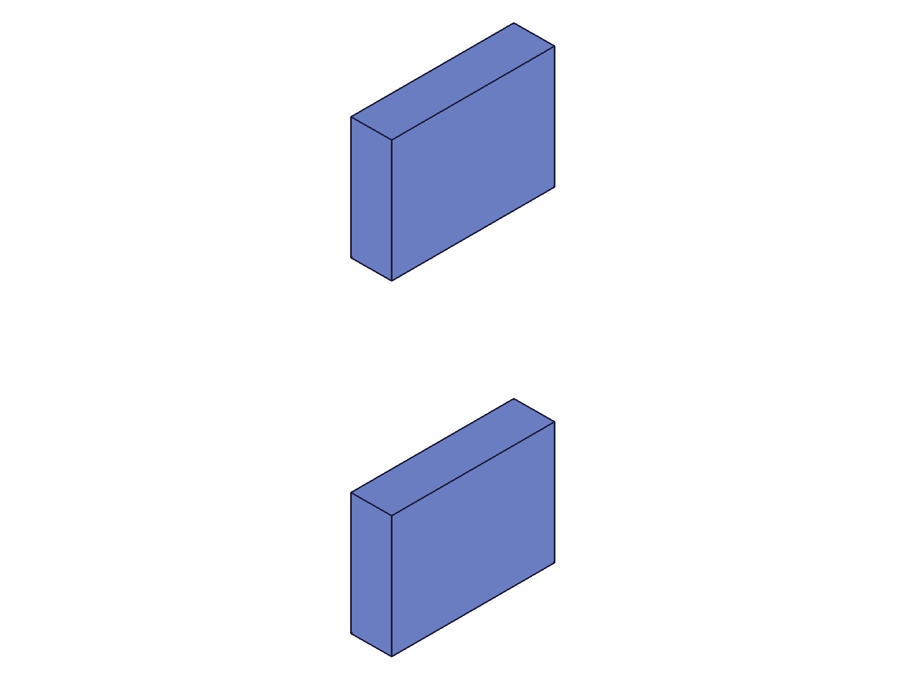
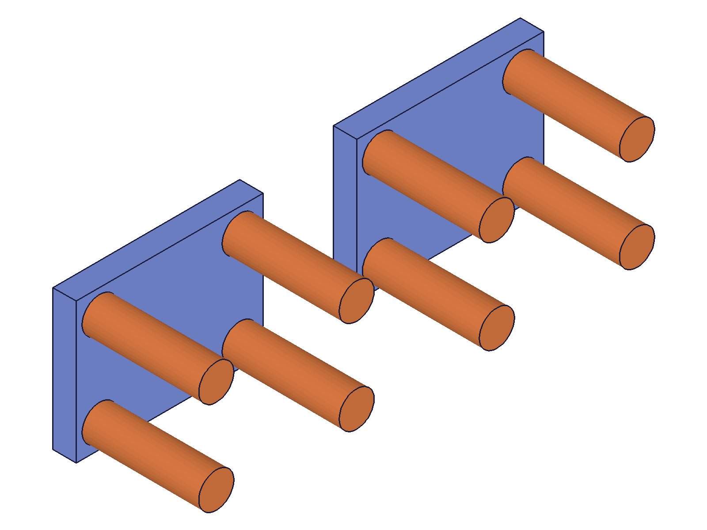
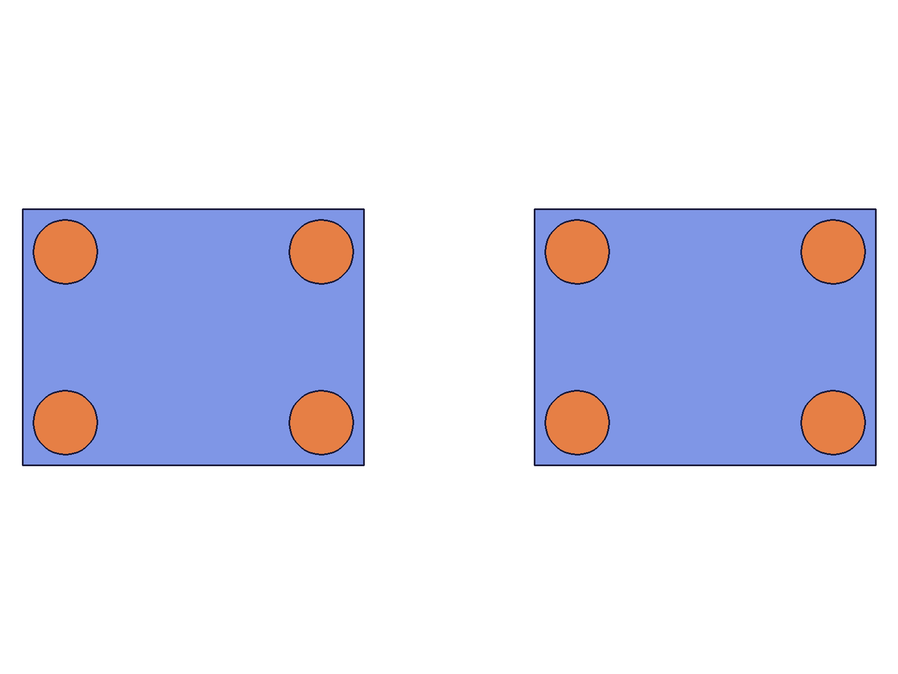

# Training: assembly.assemblyTemplate

**Date:** 2026-05-05

## Goal

Testing `v1.assembly.assemblyTemplate` — creates a new assembly and adds it as template to the assembly container. This is for nested (sub-assembly) structures.

**Methods to cover:**

- `assemblyTemplate` — basic creation, naming, return value
- `assemblyTemplate` — where it lives in the structure tree (CC_AssemblyContainer)
- `assemblyTemplate` — building a sub-assembly: adding part templates and instances inside it
- `assemblyTemplate` — instantiating the sub-assembly template from the root assembly
- `assemblyTemplate` — context/currentProduct behavior
- `assemblyTemplate` — spatial verification: COG of sub-assembly instances

**Questions:**

- What ID does `assemblyTemplate` return? What node type?
- Where does it appear in the structure tree vs `partTemplate`?
- Can you add part templates inside an assembly template? How?
- Can you add instances inside an assembly template?
- How do you instantiate a sub-assembly from the root?
- What happens if you call it without `assembly.create` first?
- Does it switch `currentProduct`?
- What is the COG of an instantiated sub-assembly with geometry?

---

## 01 — basic creation

Script: `scripts/01-basic-creation.mjs` — ✅ `assemblyTemplate({ name: 'SubAsm1' })` returns ID 22. maxLevel=31 (success). `currentProduct` stays at 12 (root) — no context switch.

**Data:** `result: 22`, `structure.currentProduct: 12`. Node 22 is class `CC_Assembly` in `CC_AssemblyContainer` (id=10). Multiple templates work: second returns 32, unnamed returns 42 (default name "Assembly"). Structure confirms `CC_AssemblyContainer` child list = `[22]` after first template.

---

## 02 — build sub-assembly with geometry

Script: `scripts/02-build-sub-assembly.mjs` — ✅ Full workflow: create sub-assembly template → setCurrentProduct to it → partTemplate (creates Plate in global PartContainer) → build geometry → instance plate inside sub-assembly → return to root → instance sub-assembly at two positions.

|  |
|---|

**Data:** Sub-assembly instances created (125, 128). COG inst1 = (30, 20, 5) — matches 60×40×10 plate local COG. COG inst2 = (130, 20, 5) — offset by exactly 100 in X as expected from transformation `[[100,0,0],...]`. Structure tree: `CC_ProductReference` nodes (125, 128) are children of `CC_AssemblyRoot` (12). Sub-assembly template (22) has `CC_ProductReference` (123) as child (the plate instance inside it).

**📌 LLM doc:** assemblyTemplate workflow: create template → setCurrentProduct → add parts/instances → return to root → instance the template. Part templates are always global (CC_PartContainer), not local to the sub-assembly.

---

## 03 — error without assembly.create

Script: `scripts/03-no-create-error.mjs` — ✅ Same error as `partTemplate`: "Assembly building is not initialized!" (maxLevel=51, code=0). `result: null`.

---

## 04 — context and PartContainer behavior

Script: `scripts/04-context-and-partcontainer.mjs` — ✅ Critical findings:

1. **assemblyTemplate does NOT switch currentProduct.** `setCurrentProduct` after calling it returns 12 (root), confirming context stayed at root.
2. **Part templates are GLOBAL.** `partTemplate` called while context is on a sub-assembly still creates the part in `CC_PartContainer`. `getPartTemplate({})` returns the same list `[22, 78]` regardless of whether called from root or sub-assembly context.
3. **Cross-template instancing works.** A root-level part template can be instanced inside a sub-assembly, and vice versa. The ownerId determines where the instance lives, not where the template was created.

**📌 LLM doc:** Part templates are global — always in CC_PartContainer. Context doesn't affect template storage. Any part template can be instanced in any assembly/sub-assembly.

---

## 05 — nested sub-assemblies

Script: `scripts/05-nested-sub-assemblies.mjs` — ✅ Three levels: root → outer sub-assembly → inner sub-assembly → plate. Inner sub-assembly instanced inside outer with X+20 offset, outer instanced in root at origin and Y+80.

|  |
|---|

**Data:** COG outerInst1 = (40, 15, 5) — matches prediction: plate COG (20,15,5) + inner offset (20,0,0) + outer offset (0,0,0) = (40,15,5). COG outerInst2 = (40, 95, 5) — matches: (40,15,5) + (0,80,0) = (40,95,5). Volume = 12000 both (40×30×10 plate). Transform composition verified at 3 nesting levels.

**📌 LLM doc:** Assembly templates can be nested arbitrarily deep. Transform composition is additive across nesting levels. COG = sum of all parent transform origins + local template COG.

---

## 06 — multi-part sub-assembly

Script: `scripts/06-multi-part-sub-assembly.mjs` — ✅ "Table" sub-assembly with 5 parts: 1 base (80×60×10 box) + 4 pillars (h=50, d=15 cylinders at corners, offset Z+10). Two table instances in root, offset 120 in X.

|  |  |
|---|---|

**Data:** COG table1 ≈ (40, 30, 17.7), volume ≈ 83342.7. COG table2 ≈ (160, 30, 17.7) — X offset exactly 120 from table1. Volume matches for both (weighted COG of base plate + 4 cylinders). Renderer colors: blue for base template, orange for pillar template — same-template instances share colors across sub-assembly instances.

---

## 07 — getAssemblyTemplate and duplicate names

Script: `scripts/07-get-and-duplicate-names.mjs` — ✅ Tested `getAssemblyTemplate` in tandem with `assemblyTemplate`.

**Data:**
- `getAssemblyTemplate({})` (no args) returns all: `[22, 32, 42]`
- `getAssemblyTemplate({ name: 'Module' })` with duplicate name returns first match only: `22` (not an array)
- Non-existent name: `result: null`, `maxLevel: 51`, error message
- Duplicate names allowed — two "Module" templates with IDs 22 and 32

**📌 LLM doc:** Same duplicate-name behavior as partTemplate. Use unique names or track IDs.

---

## 08 — template internal structure

Script: `scripts/08-template-internals.mjs` — ✅ Assembly template has identical internal structure to root assembly.

**Data:** Template node (class=CC_Assembly, id=22) children: `CC_ExpressionSet` (24), `CC_ConstraintSet` (26), `CC_GeometrySet` (28). Root node (class=CC_AssemblyRoot, id=12) children: `CC_ExpressionSet` (14), `CC_ConstraintSet` (16), `CC_GeometrySet` (18). Same child structure — a sub-assembly is a full assembly context that can hold its own constraints, expressions, and work geometry.

**📌 LLM doc:** Assembly template (CC_Assembly) has same internal structure as root (CC_AssemblyRoot): ExpressionSet + ConstraintSet + GeometrySet. It's a complete assembly context.
