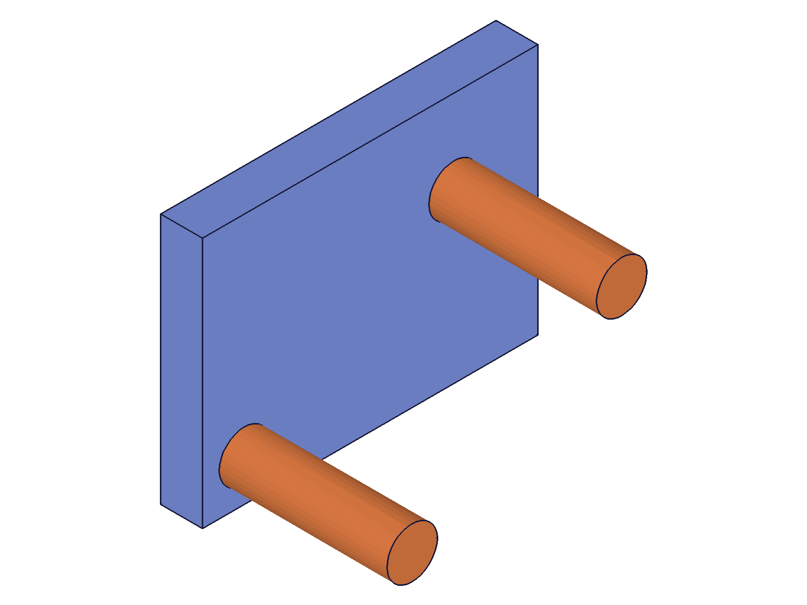

# Training: assembly.getPartTemplate

**Date:** 2026-05-05

## Goal

Testing `v1.assembly.getPartTemplate` — query API for finding part templates by name or listing all.

**Methods to cover:**

- `getPartTemplate()` — no params, returns all part template IDs
- `getPartTemplate({})` — empty object equivalent
- `getPartTemplate({ name })` — lookup by name, returns single ID

**Questions:**

- Does no-name always return `Array<id>`? Does with-name return single `id`?
- Is name lookup case-sensitive and exact-match only?
- Does empty-string name `''` work?
- What happens with duplicate (auto-deduplicated) names?
- What happens after `deleteTemplate`?
- Does it work without `assembly.create`?
- What's the ordering of the returned array?
- Is there cross-contamination with assembly templates?

---

## 01 — list all variants

Script: `scripts/01-list-all.mjs` — ✅ All three invocations return identical `[22, 68, 114]`.

**Data:** `getPartTemplate()`, `getPartTemplate({})`, and `getPartTemplate({ name: undefined })` all return the same array. maxLevel=31 for all. All return `isArray: true`. See `files/01-list-all-list-all-results.json`.

**Learned:** No params, empty object, and explicit `undefined` name are equivalent — all return the full array.

## 02 — name lookup and case sensitivity

Script: `scripts/02-by-name.mjs` — ✅ Exact name match works. Case-insensitive and partial match both fail.

**Data:** `Alpha` → 22 (maxLevel=31, type=number, isArray=false). `alpha` → null (maxLevel=51). `ALPHA` → null (maxLevel=51). `Alp` → null (maxLevel=51). `Nonexistent` → null (maxLevel=51). `Beta` → 68 (maxLevel=31). See `files/02-by-name-by-name-results.json`.

**Learned:** Name lookup is **case-sensitive** and **exact match only**. Failures return null with maxLevel=51 (error level).
**📌 LLM doc:** Case sensitivity and exact match requirement.

## 03 — return type analysis

Script: `scripts/03-return-types.mjs` — ✅ Listing always returns array; name lookup returns single number.

**Data:** With 1 template: `getPartTemplate()` → `[22]` (isArray=true, length=1). `getPartTemplate({ name: 'Only' })` → `22` (type=number, isArray=false). With 2 templates: `[22, 68]` (isArray=true, length=2). See `files/03-return-types-return-types.json`.

**Learned:** **Critical type difference:** no-name → always `Array<id>` (even with 1 item), with-name → single `id` (number) or `null`. Never returns single ID wrapped in array.
**📌 LLM doc:** Return type depends on call mode — array vs single number.

## 04 — empty-string name

Script: `scripts/04-empty-name.mjs` — ✅ `getPartTemplate({ name: '' })` finds the empty-named template.

**Data:** Created empty-name template (id=22), then `getPartTemplate({ name: '' })` returned 22 with maxLevel=31. See `files/04-empty-name-empty-name-results.json`.

**Learned:** Empty-string name works — finds a template created with `partTemplate({ name: '' })`.
**📌 LLM doc:** Empty-string name lookup succeeds.

## 05 — duplicate/deduplicated names

Script: `scripts/05-duplicates.mjs` — ✅ Deduplicated names individually addressable.

**Data:** Three `partTemplate({ name: 'Bolt' })` calls created IDs 22, 68, 114. `getPartTemplate({ name: 'Bolt' })` → 22. `Bolt0` → 68. `Bolt1` → 114. All at maxLevel=31. See `files/05-duplicates-duplicate-results.json`.

**Learned:** Name deduplication creates distinct names ("Bolt", "Bolt0", "Bolt1"). `getPartTemplate` finds each by its actual (deduplicated) name, not the requested name.

## 06 — after deleteTemplate

Script: `scripts/06-after-delete.mjs` — ✅ Deletion immediately reflected.

**Data:** Before: `[22, 68, 114]`. Deleted id=68 (result=null, maxLevel=31). After: `[22, 114]`. Name lookup for "Remove" → null (maxLevel=51). "Keep" still found at 22. See `files/06-after-delete-after-delete.json`.

**Learned:** `getPartTemplate` is a live query — deleted templates disappear immediately from both listing and name lookup.

## 07 — no assembly context

Script: `scripts/07-no-assembly.mjs` — ✅ Works without `assembly.create`.

**Data:** `getPartTemplate()` → `[]` (empty array, maxLevel=31, isArray=true). `getPartTemplate({ name: 'Anything' })` → null (maxLevel=51). See `files/07-no-assembly-no-assembly.json`.

**Learned:** No assembly required for listing. Returns empty array gracefully (not an error). Name lookup still returns null with error level. This differs from `partTemplate()` which errors without an assembly.
**📌 LLM doc:** No assembly required — graceful empty result.

## 08 — ordering

Script: `scripts/08-ordering.mjs` — ✅ Results in creation order.

**Data:** Created Zeta(22), Alpha(68), Mu(114), Beta(160). `getPartTemplate()` → `[22, 68, 114, 160]` — matches creation order, not alphabetical. Two consecutive calls return identical results (stable). See `files/08-ordering-ordering.json`.

**Learned:** Array is ordered by creation order (ascending ID). Not alphabetical. Stable across repeated calls.

## 09 — cross-contamination

Script: `scripts/09-cross-contamination.mjs` — ✅ No cross-contamination.

**Data:** Part templates: [22, 68]. Assembly templates: [114]. `getPartTemplate({ name: 'SubAsm' })` → null (maxLevel=51). `getAssemblyTemplate({ name: 'PartA' })` → null (maxLevel=51). See `files/09-cross-contamination-cross-contamination.json`.

**Learned:** `getPartTemplate` and `getAssemblyTemplate` are strictly scoped to their respective containers. No leakage.
**📌 LLM doc:** Scoped to PartContainer only.

## 10 — realistic workflow with spatial verification

Script: `scripts/10-workflow.mjs` — ✅ Full workflow: create templates → find by name → instance → verify COG.

|  |
|---|

**Data:** Created Base (80×60×10 box, id=22) and Pillar (d=12, h=40 cylinder, id=105). `getPartTemplate({ name: 'Base' })` → 22. `getPartTemplate({ name: 'Pillar' })` → 105. Both match creation IDs. Used these IDs to create 3 instances. After instancing, `getPartTemplate()` still returns `[22, 105]` — templates persist. COG verification: Base COG=(40,30,5), Pillar1 COG≈(10,10,30), Pillar2 COG≈(60,40,30) — all match expected positions. See `files/10-workflow-workflow-results.json`.

**Learned:** `getPartTemplate` is the idiomatic way to look up template IDs by name for use with `assembly.instance`. Templates persist in the listing after instancing.

## Coverage Checklist

- [x] API called successfully
- [x] Every required parameter tested (none — all optional)
- [x] Key optional parameters exercised (name with various values)
- [x] N/A for enum values
- [x] N/A for update/delete (query API; tested interaction with deleteTemplate)
- [x] Realistic usage combining getPartTemplate with prerequisites (script 10)
- [x] Behavioral claims verified with filewrite data — return types, case sensitivity, ordering
- [x] Every question from Goal answered by named script
- [x] Spatial verification via COG in script 10 — confirms returned IDs are valid for instancing
