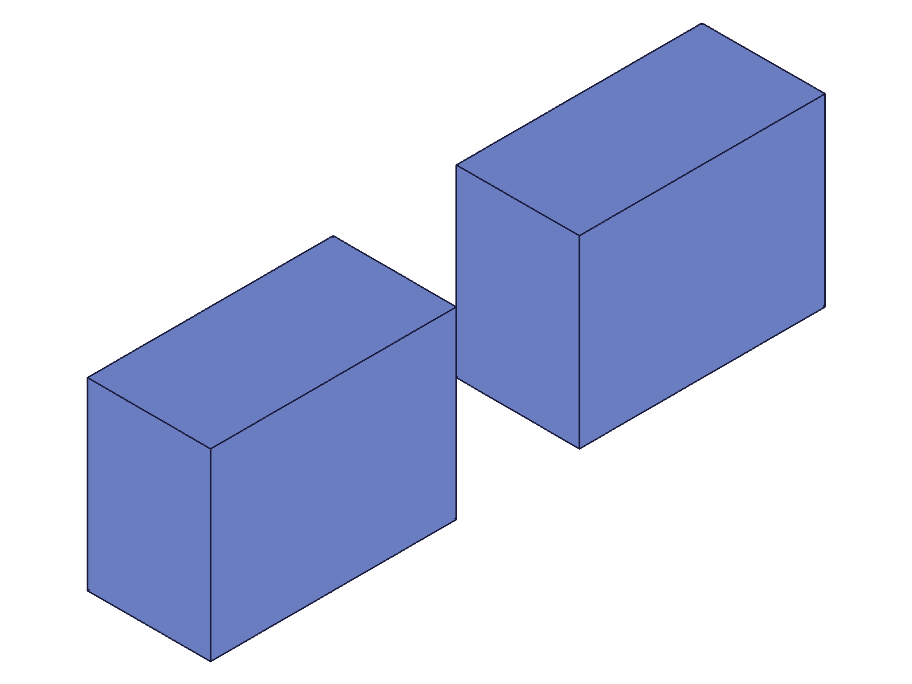
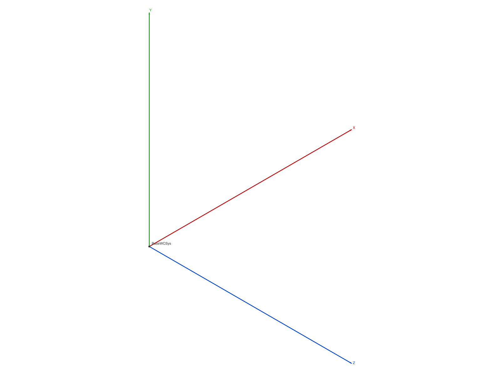
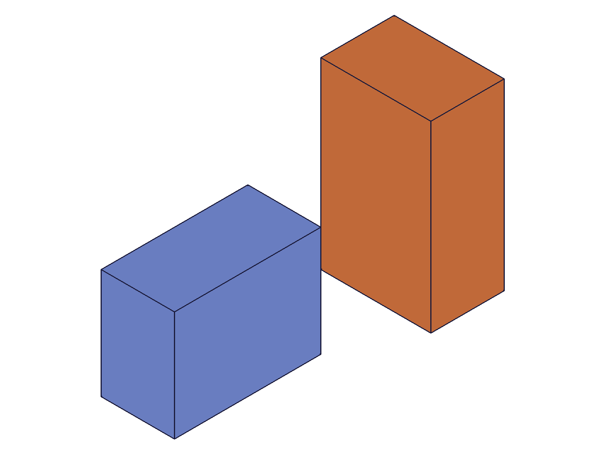
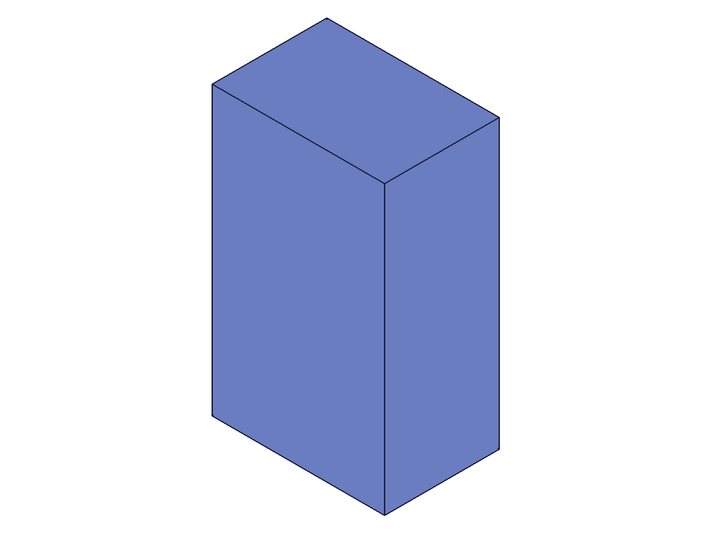

# Training: assembly.deleteTemplate

**Date:** 2026-05-05

## Goal

Testing `v1.assembly.deleteTemplate` — deletes part or assembly templates from the container.

**Methods to cover:**

- `deleteTemplate` — basic deletion of a single part template
- `deleteTemplate` — deletion of multiple templates at once (`ids` array)
- `deleteTemplate` — deleting an assembly template
- `deleteTemplate` — what happens to instances when template is deleted
- `deleteTemplate` — error cases: invalid ID, already-deleted template, non-template ID

**Questions:**

- Does deleting a template also delete all its instances? → **YES** (script 03)
- What happens to the structure tree after deletion? → Template removed from container, instances removed from tree (script 07)
- Can you delete a template that has active instances? → **YES**, cascades to instances (scripts 03, 10)
- What error code/message for invalid ID? → code 1006 "An element of parameter \"ids\" has an invalid id!" (script 04)
- Does it return VOID on success (per docs)? → **YES**, result=null maxLevel=31 (script 01)
- Can you pass a single ID or must it always be an array? → Always an array, single `[id]` works fine (script 01)

---

## 01 — basic deletion of a part template

Script: `scripts/01-basic-delete.mjs` — ✅ as documented. Created two part templates, deleted one.

**Data:** result=null, maxLevel=31, messages=[]. After deletion, `getPartTemplate({})` returns only the surviving template ID [105]. See `files/01-basic-delete-delete-result.json`.

---

## 02 — multi-template deletion

Script: `scripts/02-multi-delete.mjs` — ✅ as documented. Created three templates, deleted two in one call.

**Data:** result=null, maxLevel=31. Before: [22,105,188]. After: [105]. See `files/02-multi-delete-templates-before-after.json`.

---

## 03 — delete template with active instances (cascade)

Script: `scripts/03-delete-with-instances.mjs` — ✅ template deletion cascades to instances.

|  |  |
| ---------------------------------------------------------------- | --------------------------------------------------------------- |

**Data:** Before: template tpl=22, instances [105,107]. Deleted template 22. After: `getInstance` returns `[]`, `getPartTemplate` returns `[]`. Both instances removed along with the template. result=null, maxLevel=31. See `files/03-delete-with-instances-delete-with-instances.json`.

**Learned:** Deleting a template automatically deletes ALL instances of that template from the assembly tree. No error, no warning — clean cascade.
**📌 LLM doc:** Cascade behavior — template deletion removes all instances.

---

## 04 — error cases

Script: `scripts/04-error-cases.mjs` — mixed results.

**Data (from `files/04-error-cases-error-cases.json`):**

| Scenario | result | maxLevel | Error |
|---|---|---|---|
| Invalid ID (999999) | null | 51 | code 1006: "An element of parameter \"ids\" has an invalid id!" |
| Valid delete | null | 31 | none |
| Double-delete (already deleted) | null | 51 | code 1006: same as invalid ID |
| Non-template ID (assembly root) | null | 31 | **none — silent success!** |
| Empty array | null | 31 | none |

**Learned:** Invalid/already-deleted IDs produce error code 1006. But passing the assembly root ID produces NO error (maxLevel=31) — it appears to silently accept non-template IDs without complaint.
**📌 LLM doc:** Error code 1006 for invalid IDs. Non-template IDs silently accepted (dangerous — see script 08).

---

## 05 — assembly template deletion

Script: `scripts/05-assembly-template-delete.mjs` — ✅ assembly templates deletable just like part templates.

|  |  |
| ------------------------------------------------------------------- | ---------------------------------------------------------------- |

**Data:** Created assembly template (id=22) containing inner part template (id=32). Instantiated the assembly template. After deleting the assembly template: `getAssemblyTemplate` returns [], `getPartTemplate` returns [32] — **inner part template survives**. Assembly template instances removed.

**Learned:** Deleting an assembly template removes it from AssemblyContainer and cascades to its instances. But part templates referenced by the assembly template are NOT deleted — they remain in PartContainer.
**📌 LLM doc:** Assembly template deletion does NOT cascade to part templates used internally.

---

## 06 — non-template ID investigation

Script: `scripts/06-non-template-id.mjs` — ⚠️ dangerous behavior.

**Data (from `files/06-non-template-id-non-template-id-results.json`):**
- Delete assembly root ID (12): result=null, maxLevel=31, no messages. Silently accepted. Afterwards `getInstance` returns null (not []).
- Delete instance ID (105): result=null, maxLevel=51, error code 1006 "invalid id".

**Learned:** Instance IDs correctly rejected. But assembly root ID silently accepted — and afterwards `getInstance` fails (returns null). State appears corrupted.

---

## 07 — structure tree before/after

Script: `scripts/07-structure-after-delete.mjs` — ✅ structure tree correctly updated.

|  |  |
| ----------------------------------------------------------------- | --------------------------------------------------------------- |

**Data:** Before: two templates, two instances (blue + orange boxes). After deleting tpl1: structure tree drops from 50177 bytes to 28129 bytes. Only tpl2 (id=105) and its instance (id=190) remain. Visual confirms: single blue box after deletion.

---

## 08 — assembly root deletion corrupts state

Script: `scripts/08-delete-asmroot-effect.mjs` — ⚠️ **critical: passing assembly root to deleteTemplate corrupts the assembly.**

**Data (from `files/08-delete-asmroot-effect-asmroot-delete-effect.json`):**
- `deleteTemplate({ ids: [asmId] })` succeeds silently (maxLevel=31).
- After: `getInstance({ ownerId: asmId })` returns null (maxLevel=51) — broken.
- `getPartTemplate({})` still returns [22] — templates survive.
- Creating new instances fails (result=null, maxLevel=51).

**Learned:** Never pass non-template IDs (especially the assembly root) to `deleteTemplate`. The API does not validate that the ID is actually a template. It silently corrupts the assembly tree.
**📌 LLM doc:** CRITICAL warning: do not pass assembly root ID to deleteTemplate.

---

## 09 — mixed valid+invalid IDs (atomicity)

Script: `scripts/09-mixed-ids.mjs` — ✅ atomic behavior confirmed.

**Data (from `files/09-mixed-ids-mixed-ids-result.json`):** Passed [tpl2, 999999]. maxLevel=51, error code 1006. After: both templates [22,105] still present — tpl2 was NOT deleted.

**Learned:** The `ids` array is validated atomically. If any ID is invalid, the entire operation fails and no templates are deleted.
**📌 LLM doc:** Atomic — one bad ID aborts the entire call.

---

## 10 — delete template with constrained instances

Script: `scripts/10-delete-constrained.mjs` — ✅ clean cascade, constraints cleaned up.

**Data (from `files/10-delete-constrained-constrained-delete.json`):** Template tpl2 (Peg, id=113) had instance inst2 (id=188) with a fastened constraint to inst1. Deletion succeeded (maxLevel=31). After: tpl1 and inst1 survive. inst2 and its constraint removed.

**Learned:** Constraints referencing deleted instances are cleaned up silently. No error, no orphan constraints.
