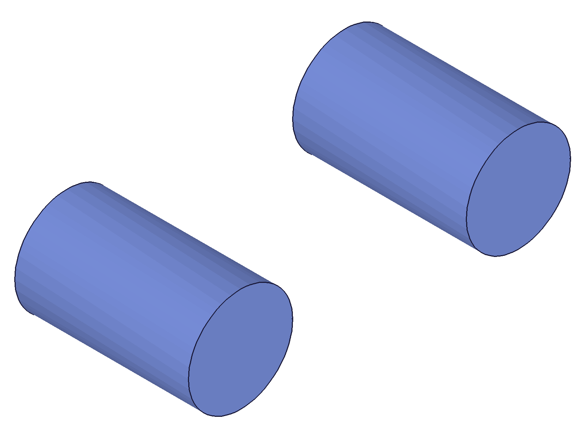
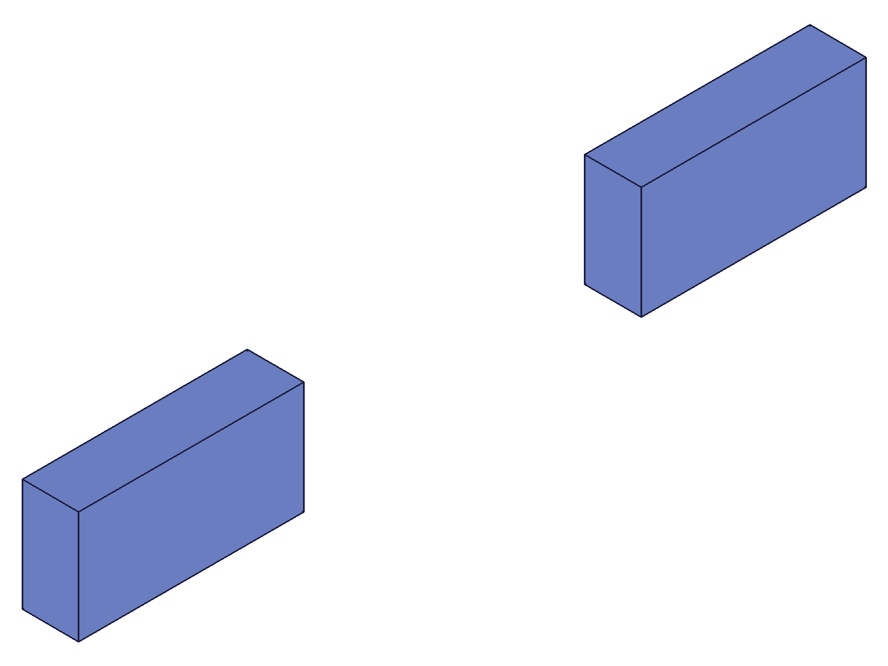
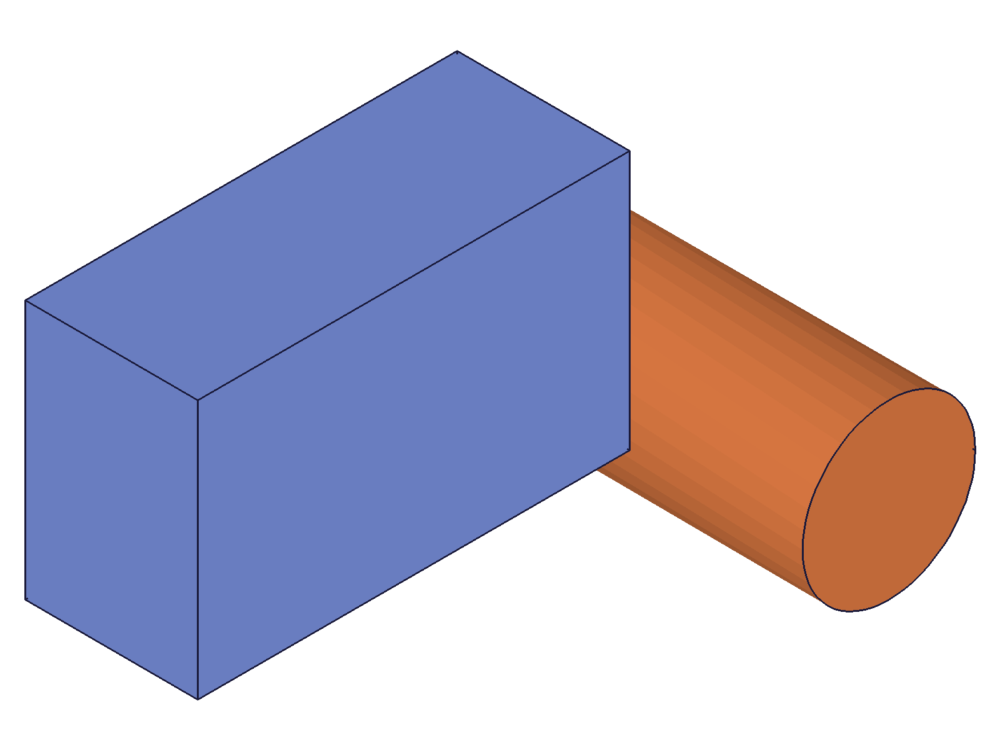

# Training: assembly.convertToTemplate

**Date:** 2026-05-05

## Goal

Testing `v1.assembly.convertToTemplate` — converts the current root assembly into an assembly template and creates a new root assembly above it.

**Methods to cover:**

- `convertToTemplate` — basic call (no params), verify return value
- `convertToTemplate` — with custom `name` param
- Structural verification: old root becomes CC_Assembly in AssemblyContainer, new CC_AssemblyRoot created
- Spatial verification: geometry positions unchanged after conversion (COG measurement)
- Instances inside old root survive as content of the new template
- Instance the converted template into the new root — verify spatial positioning
- Chained conversions — build hierarchy from bottom up
- Error cases: no assembly exists, empty assembly

**Questions:**

- Does `convertToTemplate` preserve instances and their transforms? → **YES** (scripts 01, 03 — COG identical before/after)
- What ID does the new root get? What happens to `currentProduct`? → New higher ID, both root and currentProduct update (script 01)
- Can you instance the converted template and verify it renders at the correct world position? → **YES** (script 03 — transform composition verified numerically)
- Can you chain multiple conversions to build nested hierarchy? → **YES** (script 02)
- What happens when no assembly exists? → Error maxLevel=51: "Assembly building is not initialized!" (script 04)

---

## 01 — basic convert with spatial verification

Script: `scripts/01-basic-convert.mjs` — ✅ Converts root to assembly template, preserves spatial positioning.

|  |  |
| --- | --- |

**Data:** Instance at offset [25,15,10] with box 60×40×30. COG before: {x:55, y:35, z:25}. After conversion + re-instancing converted template at origin: COG = {x:55, y:35, z:25} — identical. Volume=72000 unchanged. See `files/01-basic-convert-spatial-comparison.json`.

- Root before: 12 → Root after: 137
- currentProduct updates to 137
- Converted template accessible at ID 12 via `getAssemblyTemplate({ name: 'ConvertedAsm' })`
- Result: null (VOID), maxLevel: 31

**Learned:** Conversion is purely structural — geometry and instance transforms are preserved exactly. The old root ID becomes the template ID.
**📌 LLM doc:** Returns VOID (null), maxLevel=31. Old root ID becomes the converted template ID. New root gets a higher ID. Spatial positioning preserved exactly.

---

## 02 — structure verification + chained conversions + name variants

Script: `scripts/02-structure-verify.mjs` — ✅ Default name "Subassembly", custom name works, chaining works.

|  |
| --- |

**Data:**
- Two cylinder instances at x=0 and x=80. COG inst1: ~[0, 0, 25], inst2: ~[80, 0, 25] ✓
- 1st convert (no name): default "Subassembly", root 12→93
- 2nd convert (name "MyTopLevel"): root 93→109
- Both templates [12, 93] accessible via `getAssemblyTemplate({})`
- Part template "CylPart" survives both conversions (ID 22 unchanged)
- Final root COG: ~[40, 0, 25] = correct midpoint of 2 cylinders

**Learned:** Default name is "Subassembly". Part templates in PartContainer are unaffected by conversion. Chaining creates nested hierarchy from bottom up.
**📌 LLM doc:** Default name "Subassembly". Part templates unaffected. Can chain conversions for nested hierarchy.

---

## 03 — spatial offset composition (numeric proof)

Script: `scripts/03-spatial-offset.mjs` — ✅ Internal instance transforms compose correctly with external instance transform.

|  |
| --- |

**Data (from `files/03-spatial-offset-offset-verification.json`):**
- Box 40×20×10, local COG = [20, 10, 5]
- Instance inside root at offset [50, 30, 20] → world COG = [70, 40, 25] ✓
- After convert, instance converted template at [100, 0, 0]:
  - Nested COG = [170, 40, 25] = [20+50+100, 10+30+0, 5+20+0] ✓
- Instance converted template at origin:
  - COG = [70, 40, 25] = preserved internal offset ✓

**Learned:** Transforms compose additively. The converted template's internal instance offset is preserved and stacks with the new outer instance transform. This is the key spatial guarantee of `convertToTemplate`.
**📌 LLM doc:** Internal instance transforms are preserved and compose with the outer instance transform. Spatial positioning is numerically exact.

---

## 04 — error cases

Script: `scripts/04-error-cases.mjs` — mixed findings.

**Data (from `files/04-error-cases-error-cases.json`):**

| Scenario | maxLevel | Notes |
|---|---|---|
| No assembly (after part.create) | 51 | "Assembly building is not initialized!" |
| Empty asm (after part.create→asm.create) | 51 | Sequence issue — residual state from part.create |
| Subsequent converts | 31 | Works after state stabilizes |
| Empty name `''` | 31 | Allowed |
| No param (default) | 31 | Name defaults to "Subassembly" |

**Learned:** The "empty asm fails" result was a sequencing artifact from calling `part.create` then `assembly.create` in the same harness run — the initial `part.create` corrupts some internal state. See script 05 for clean empty-assembly test.
**📌 LLM doc:** Error with part context. Empty string allowed as name.

---

## 05 — empty assembly (clean)

Script: `scripts/05-empty-assembly.mjs` — ✅ Empty assembly converts successfully.

**Data:** `assembly.create` → `convertToTemplate({ name: 'EmptySub' })` → maxLevel=31 (success). New root=22, template found at ID 12. See `files/05-empty-assembly-empty-assembly.json`.

**Learned:** Empty assemblies (no templates, no instances) convert fine when the assembly is fresh (no prior `part.create` in the same session). The converted template is an empty assembly template — valid for adding instances later.
**📌 LLM doc:** Empty assemblies convert successfully. Can add instances to the empty converted template later.

---

## 06 — work inside converted template

Script: `scripts/06-work-inside-converted.mjs` — ✅ Can switch into converted template and modify it.

|  |
| --- |

**Data:**
- `setCurrentProduct({ id: convertedId })` succeeds
- Added cylinder instance (ID 182) inside the converted template
- Sub-assembly COG: {x:45.3, y:20.6, z:13.0} — weighted average of box (vol=30000 at [35,25,10]) and cylinder (vol≈12566 at [80,10,20])
- Total volume: 42566 ≈ 30000 + π×100×40 ✓

**Learned:** Converted templates are fully mutable via `setCurrentProduct`. Adding instances modifies the template for all current and future instances of it.
**📌 LLM doc:** Use `setCurrentProduct({ id: templateId })` to switch into and modify a converted template. Changes propagate to all instances.

---

## 07 — delete converted template

Script: `scripts/07-delete-converted.mjs` — ✅ `deleteTemplate` works on converted templates.

**Data:**
- Before: asmTpls=[12], partTpls=[22], instance=117
- After `deleteTemplate({ ids: [12] })`: asmTpls=[], partTpls=[22], instances=null
- Cascade: instance 117 removed along with the template

**Learned:** `deleteTemplate` treats converted templates identically to `assemblyTemplate`-created ones. Cascade deletes all instances. Part templates in PartContainer are unaffected.

---

## 08 — name collision

Script: `scripts/08-name-collision.mjs` — ✅ with gotcha.

**Data (from `files/08-name-collision-name-collision.json`):**
- Created `assemblyTemplate({ name: 'SubAsm' })` → ID 22
- Then `convertToTemplate({ name: 'SubAsm' })` → succeeds (maxLevel=31), converted at ID 12
- Both templates exist: `getAssemblyTemplate({})` → [22, 12]
- `getAssemblyTemplate({ name: 'SubAsm' })` → 22 (returns the FIRST match, not the converted one)

**Learned:** Duplicate names are allowed — no error, no uniqueness enforcement. But `getAssemblyTemplate` by name returns the first match, making the converted template unreachable by name. Use the ID (which is the old root ID) to access it directly.
**📌 LLM doc:** Duplicate template names are allowed but dangerous — `getAssemblyTemplate` by name returns the first match. Keep names unique or track IDs directly.

---
