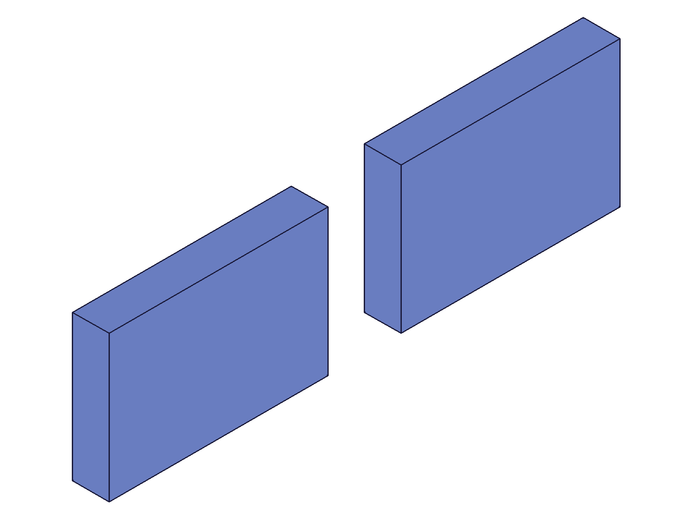
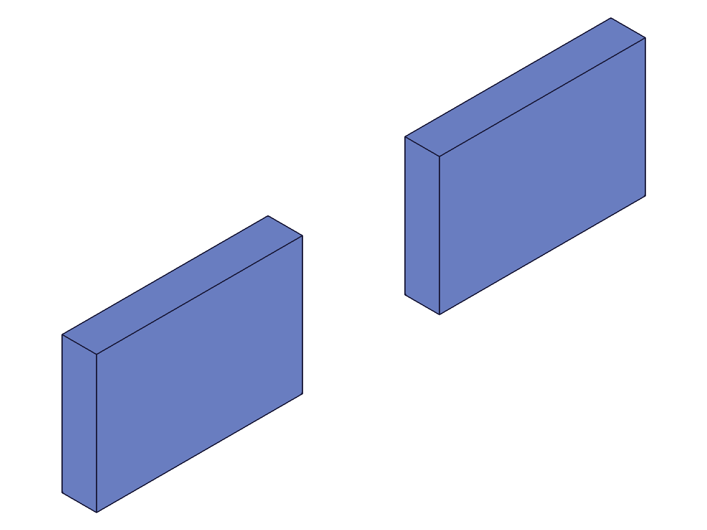
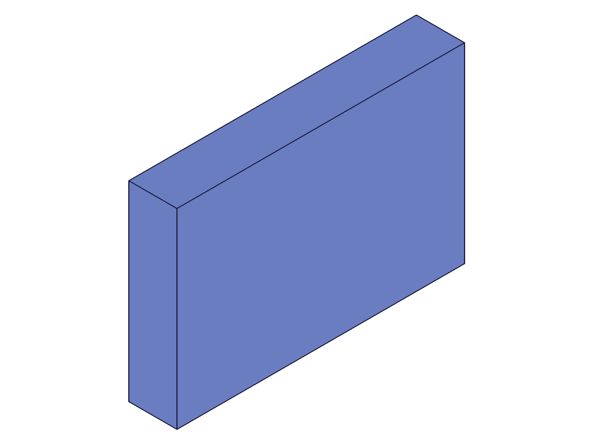
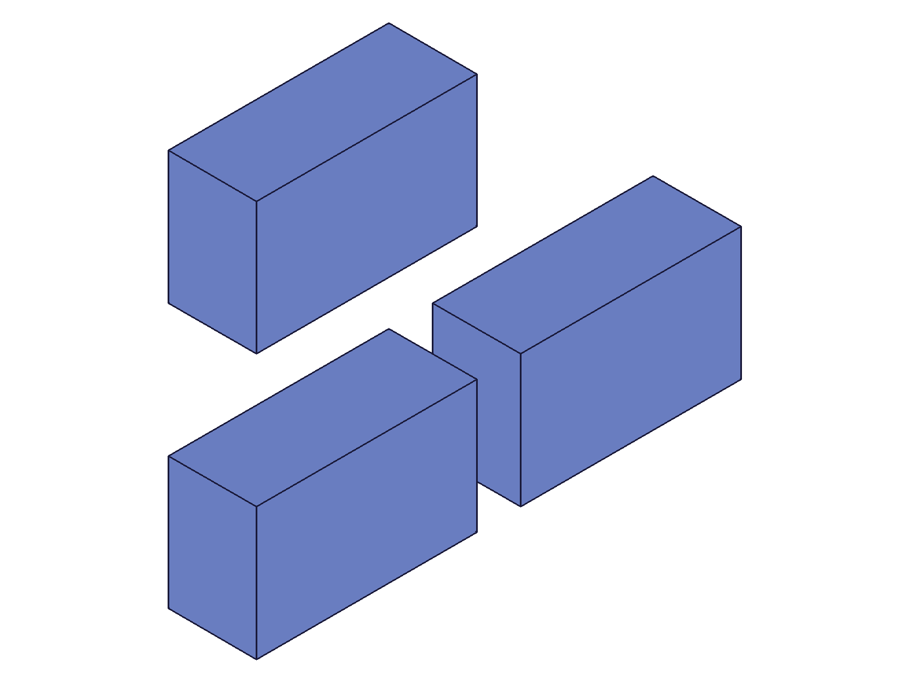
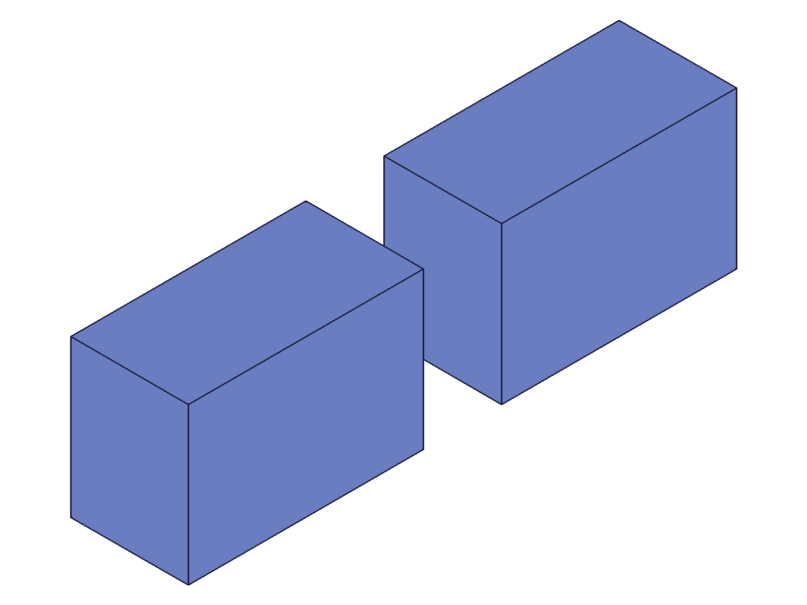
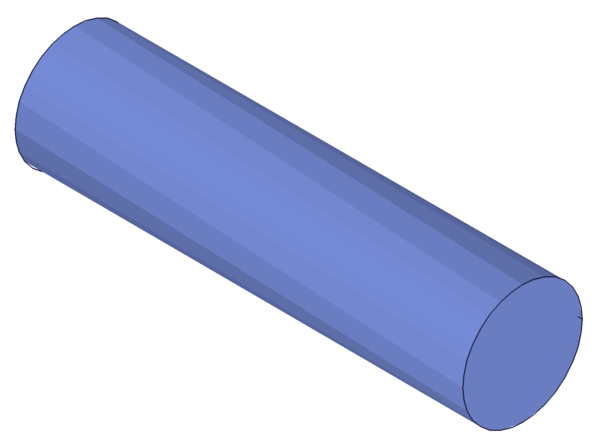
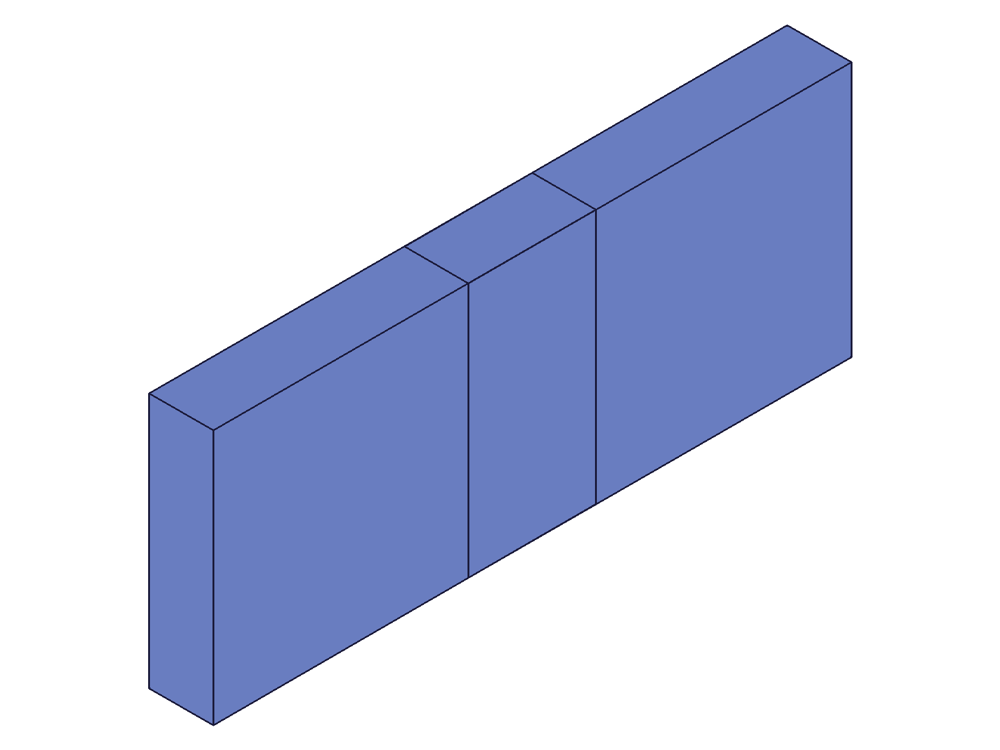

# Training: Template vs Instance Paradigm

**Date:** 2026-05-05

## Goal

Studying the template/instance paradigm in ClassCAD assemblies — how templates and instances relate, what's shared, what's independent, and how modifications propagate.

**Questions to answer:**

- Do instances share geometry with templates, or get independent copies?
- What happens to existing instances when a template is modified (e.g., box size changed)?
- Can you call `part.*` APIs (e.g., `calculateMassProperties`) on an instance ID directly?
- How does the structure tree encode the template→instance link? (CC_ProductReference.link field?)
- What's the difference in behavior between calling `calculateMassProperties` on a template ID vs an instance ID?
- Can you modify an instance's geometry independently of its template?
- How does `setCurrentProduct` interact with templates vs instances?
- Does deleting an instance affect the template? Does deleting a template affect instances?
- How do multiple instances of the same template appear in the structure tree?
- Can `instance` accept both numeric ID and string name for `productId`?

---

## 01 — structure tree link

Script: `scripts/01-structure-tree-link.mjs` — ✅ Created assembly + template + 2 instances, dumped structure tree.

**Data:** Structure tree reveals:
- Template (CC_Part, id=22) lives in `CC_PartContainer` with full geometry tree (GeometrySet, EntitySet, etc.)
- Instances (id=105, 107) are children of `CC_AssemblyRoot` with `link=22` (pointing to template ID)
- Instances carry `coordinateSystem: [[80,0,0],[1,0,0],[0,1,0],[0,0,1]]` — their world transform
- Instance nodes have NO children — they are lightweight references, not copies

|  |
|---|

**📌 LLM doc:** Document structure tree encoding: instances are CC_ProductReference nodes with `link=templateId` + `coordinateSystem`.

---

## 02 — calculateMassProperties on template vs instance vs root

Script: `scripts/02-mass-template-vs-instance.mjs` — ✅ `calculateMassProperties` works on all three ID types.

**Data:** Box 60×40×10, COG=(30,20,5):
- Template (id=22): vol=24000, COG=(30,20,5) — local coordinates
- Instance1 (at origin): vol=24000, COG=(30,20,5)
- Instance2 (offset 100 in X): vol=24000, COG=(130,20,5) — world coordinates (30+100=130)
- Root assembly: vol=48000, COG=(80,20,5) — weighted average of two equal instances

|  |
|---|

**📌 LLM doc:** Instance COG is reported in world/assembly coordinates: template_local_COG + instance_transform_origin.

---

## 03 — modify template after instance creation (with pre-query)

Script: `scripts/03-modify-template-after-instance.mjs` — `calculateMassProperties(inst1)` called BEFORE modification. Template updated to 120×80×20 (vol=192000). Existing instance stayed at vol=24000. New instance created AFTER got vol=192000.

**Data:**
- Before modify: inst1 vol=24000
- After modify: template vol=192000, inst1 vol=24000 (UNCHANGED), inst2 (new) vol=192000

|  |  |
|---|---|

**Learned:** When instance was queried (calculateMassProperties) before template modification, the modification did NOT propagate. But new instances get updated geometry.

---

## 04 — part.* APIs on instance IDs

Script: `scripts/04-part-api-on-instance.mjs` — Testing which part.* APIs work with instance IDs.

**Data:**
- `part.getFeature({ id: instId })` → FAILS (maxLevel=51)
- `part.box({ id: instId })` → FAILS: "The provided id for the part is not a part id."
- `setCurrentProduct({ id: instId })` → WORKS (returns previous product ID)
- `part.getWorkGeometry({ id: instId })` → WORKS (after setCurrentProduct set to instance)
- `part.getExpression({ id: instId })` → FAILS (maxLevel=51)

**📌 LLM doc:** Instance IDs cannot be used as part IDs for creation/query APIs. But `setCurrentProduct` accepts instance IDs, and some part.* APIs work after context is set to instance.

---

## 05 — productId and ownerId as string names

Script: `scripts/05-productId-by-name.mjs` — ✅ Both `productId` and `ownerId` accept template/assembly names as strings.

**Data:**
- `productId: tplId` (numeric) → works, inst=105
- `productId: 'Bracket'` (string name) → works, inst=109
- `productId: 'NonExistent'` → fails (code 1006, "invalid id")
- `ownerId: 'NameTest'` (string assembly name) → works, inst=111

|  |
|---|

**📌 LLM doc:** `instance()` accepts string names for both `productId` and `ownerId`.

---

## 06 — modify template via instance context

Script: `scripts/06-context-and-independence.mjs` — Set `currentProduct=inst1`, then modified template's box feature. BOTH instances updated.

**Data:**
- After updateBox(height=30): inst1 vol=72000, inst2 vol=72000 (both propagated)
- No instances were queried individually before modification

|  |
|---|

**Learned:** Without prior per-instance queries, template modifications propagate to all instances regardless of context target.

---

## 07 — delete independence

Script: `scripts/07-delete-independence.mjs` — ✅ Deleting instance doesn't affect template; deleting template cascades to all its instances.

**Data:**
- Before: instances [170, 172, 174] (Plate1, Plate2, Bolt1)
- After deleteInstance(Plate1): [172, 174]. Template still exists (getPartTemplate returns id=22)
- After deleteTemplate(Plate): [174] (only Bolt1 survives). Template gone (getPartTemplate → null)

|  |
|---|

**📌 LLM doc:** Delete cascade is one-directional: template deletion removes all instances. Instance deletion never affects templates.

---

## 08 — propagation comparison (same session, sequential)

Script: `scripts/08-propagation-comparison.mjs` — Two modifications in sequence. Step A (via template): all propagated. Step B (via instance, after step A queried instances): only template updated.

**Data:**
- Step A: template vol=48000, inst1=48000, inst2=48000 (ALL propagated)
- Step B: template vol=72000, inst1=48000, inst2=48000 (instances LOCKED from step A's queries)

**Learned:** The `calculateMassProperties(instanceId)` calls between steps A and B materialized the instances, preventing step B's propagation.

---

## 09 — clean propagation (no pre-query)

Script: `scripts/09-propagation-clean.mjs` — ✅ Template modified (120×80×20) with NO instance queries before. Both instances propagated to vol=192000.

**Data:**
- Template: vol=192000, COG=(60,40,10)
- Inst1: vol=192000, COG=(60,40,10)
- Inst2: vol=192000, COG=(140,40,10) [80+60=140]

|  |
|---|

**📌 LLM doc:** CORRECTS earlier claim. Template modifications DO propagate to instances by default. They only stop propagating after instances are materialized by per-instance `calculateMassProperties`.

---

## 10 — snapshot + mass query before modify

Script: `scripts/10-snapshot-before-modify.mjs` — Called `calculateMassProperties(inst1)` + `snapshot` before modification. Instance did NOT update (stayed at 24000). Even extra recalc at assembly level didn't help.

**Data:** inst1 vol stayed 24000 after template changed to vol=192000. Extra recalc didn't fix it.

---

## 11 — selective lock test

Script: `scripts/11-selective-lock.mjs` — Queried only inst1 before modify. BOTH inst1 AND inst2 stayed locked at 24000.

**Data:** inst1 vol=24000 (queried), inst2 vol=24000 (NOT queried, but still locked)

**Learned:** Materializing one instance of a template locks ALL instances of that template, not just the one queried.

---

## 12 — root assembly mass doesn't lock

Script: `scripts/12-root-mass-lock.mjs` — Called `calculateMassProperties(asmId)` (root assembly) before modify. Instances still propagated to vol=72000.

**Data:** root vol before=48000. After template modify: inst1=72000, inst2=72000 (propagated)

---

## 13 — snapshot alone doesn't lock

Script: `scripts/13-snapshot-only-lock.mjs` — Only took snapshot (no calculateMassProperties on instance) before modify. Instance propagated to vol=72000.

**Data:** inst1 vol=72000 after template modify. Snapshot alone doesn't lock.

---

## 14 — getInstance + requestVisualisation don't lock

Script: `scripts/14-getInstance-lock.mjs` — Called `getInstance` and `requestVisualisation({ ids: [inst1] })` before modify. Instance propagated to vol=72000.

**Data:** inst1 vol=72000 after template modify. Neither getInstance nor requestVisualisation lock instances.

---

## Summary of Propagation Rules (verified)

| Operation before template modify | Locks instances? | Scripts |
|---|---|---|
| `calculateMassProperties(instanceId)` | **YES** (all instances of same template) | 03, 10, 11 |
| `calculateMassProperties(rootAssemblyId)` | No | 12 |
| `snapshot()` | No | 13 |
| `getInstance()` | No | 14 |
| `requestVisualisation({ ids: [instId] })` | No | 14 |
| No operation (fresh instances) | No | 06, 08A, 09 |

**The materializing trigger is specifically `calculateMassProperties` called with an individual instance ID.**

---

## Answers to Goal Questions

1. **Shared vs copied?** Instances start as live references (link=templateId). They share the template geometry until materialized.
2. **Template modification propagation?** Propagates by default. Stops after `calculateMassProperties(instanceId)` materializes instances.
3. **part.* on instance ID?** `part.box`, `part.getFeature` fail. `setCurrentProduct(instId)` works, then some APIs like `getWorkGeometry` work.
4. **Structure tree encoding?** CC_ProductReference nodes with `link=templateId` and `coordinateSystem=[origin, xDir, yDir, zDir]`.
5. **calculateMassProperties difference?** Template: local coords. Instance: world coords (local + transform). Root: combined.
6. **Independent modification?** Not directly — instances are NOT parts. Modifying the template via instance context updates all instances.
7. **setCurrentProduct?** Works with instance IDs. Switches context to the instance's template.
8. **Delete behavior?** Instance deletion → template unaffected. Template deletion → cascades to all instances.
9. **Multiple instances?** Each gets a unique CC_ProductReference node with same `link` value.
10. **String names?** Yes — both `productId` and `ownerId` accept string template/assembly names.

