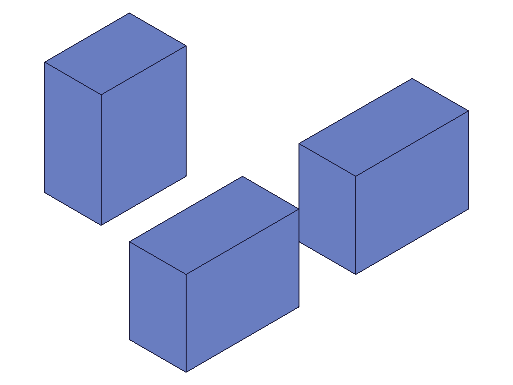
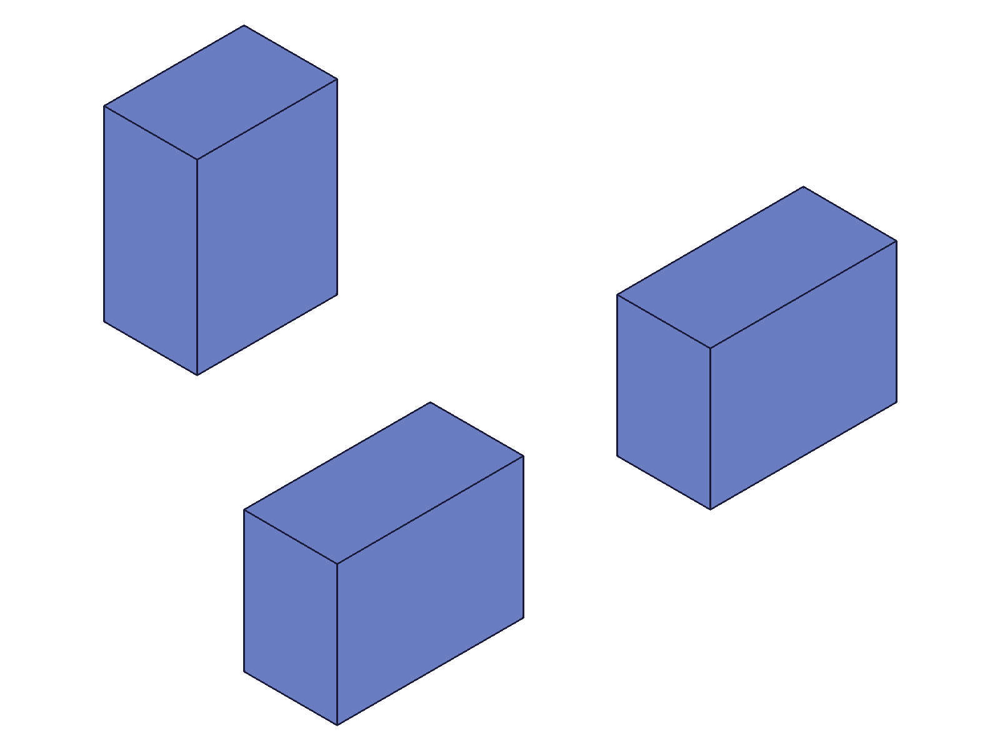
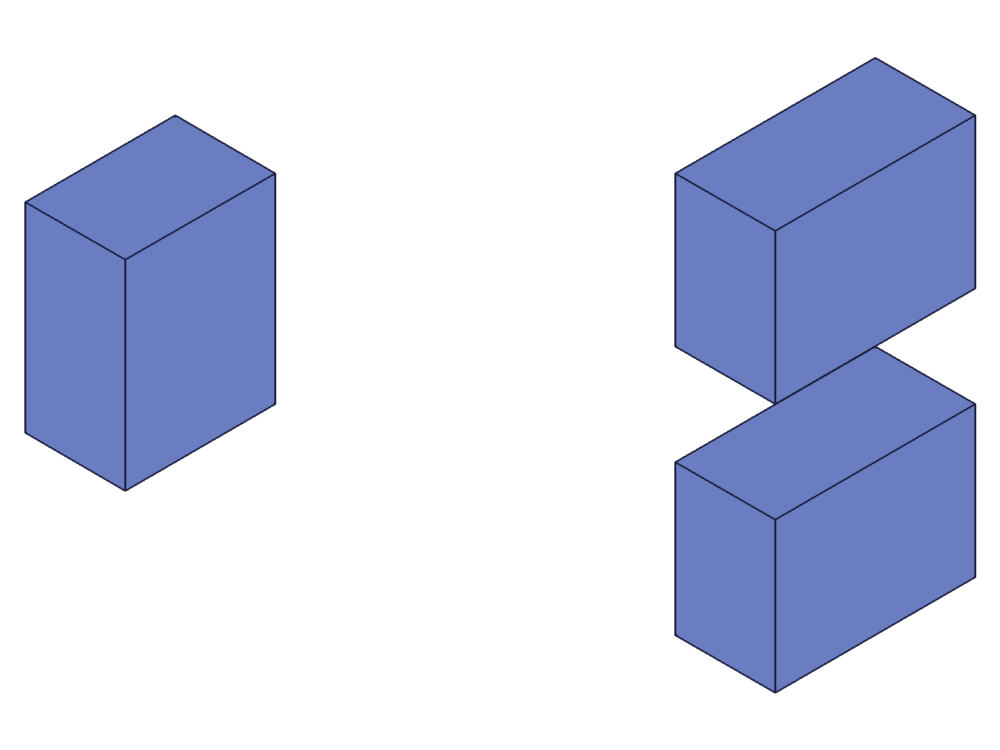
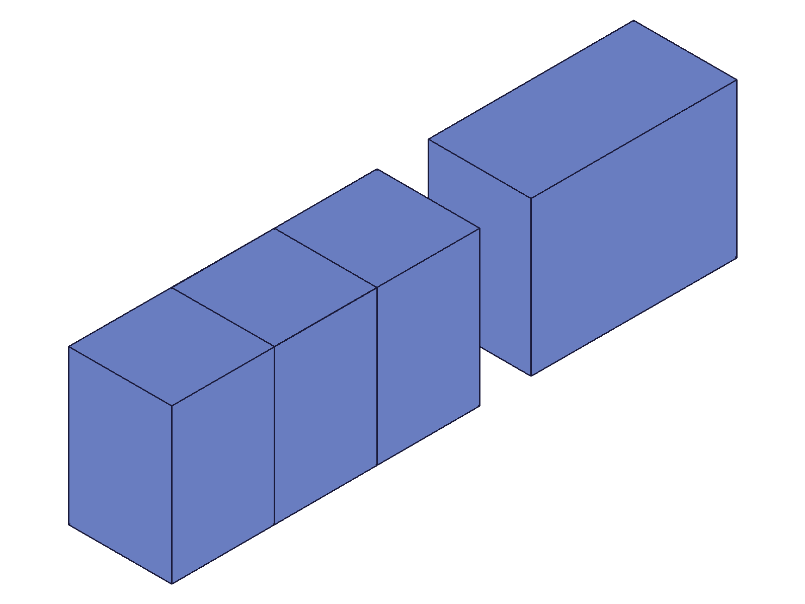

# Training: assembly.instance, getInstance, deleteInstance

**Date:** 2026-05-05

## Goal

Testing `v1.assembly.instance`, `v1.assembly.getInstance`, and `v1.assembly.deleteInstance`.

**Methods to cover:**

- `instance` — basic creation with productId + ownerId
- `instance` params: transformation ([origin, xDir, yDir] format), 4x4 matrix format, name, ident, isLocal
- `instance` — array form (batch creation)
- `instance` — into sub-assembly templates
- `getInstance` — by name, all instances from owner, array form
- `deleteInstance` — single, multiple, edge cases

**Questions:**

- What does the returned instance ID represent in the structure tree? → **script 01, 02**: CC_ProductReference node under CC_AssemblyRoot
- How does `transformation` work — does [origin, xDir, yDir] imply zDir from cross product? → **script 02**: Yes, verified via COG measurements
- Does `isLocal: TRUE` apply the transform relative to owner's coordinate system? → **script 05**: Yes, confirmed with mass properties
- Can you create an instance of an assembly template (not just part templates)? → **script 09**: Yes, works identically
- What happens with invalid productId or ownerId? → **script 09**: Clean errors (1004 missing, 1006 invalid, 1001 wrong type)
- What does getInstance return when name doesn't exist? → **script 07**: Empty array `[]`, maxLevel=31 (no error)
- Does deleteInstance cascade? → **script 08**: Not tested directly for sub-assembly cascade; single/multi deletion works
- Spatial verification: does instance COG = template_local_COG + transform_origin? → **script 02**: Yes, confirmed exactly

---

## 01 — basic instance creation

Script: `scripts/01-basic-instance.mjs` — ✅ Three instances created with default and offset transforms.

|  |
|---|

**Data:** inst0=105, inst1=107, inst2=109. All maxLevel=31 (success). Instance is CC_ProductReference node with parent=12 (CC_AssemblyRoot), productId=tplId. Members include `partName`, `productId`, `isDirty`, `localPath`, `ownPart`, `productRefsET`, `_VERSION`. No `coordinateSystem` member exposed in structure tree — transform is stored internally.

**Learned:** Instance IDs are CC_ProductReference nodes. Transforms are not visible via structure tree member dump.

---

## 02 — spatial verification

Script: `scripts/02-spatial-verify.mjs` — ✅ Predicted COG matches actual COG exactly.

|  |
|---|

**Data:** Template COG: `{x:20, y:15, z:10}`, volume=24000 (40×30×20 box, corner-aligned). Root assembly COG: `{x:35, y:43.33, z:10}`, volume=72000. Prediction: inst0 COG=[20,15,10], inst1 COG=[100,15,10] (offset X=80), inst2 COG=[-15,100,10] (90°Z rotation at [0,80,0]). Combined mean: `[35, 43.33, 10]` — **exact match**.

`getInstance({ ownerId: asmId })` returns `[105,107,109]` — all three instance IDs.

**Learned:** `calculateMassProperties(asmId)` returns combined world-space COG without materializing instances. Transform math: world_COG = rotation_matrix × local_COG + translation_origin.
**📌 LLM doc:** Transform math formula and spatial verification pattern.

---

## 03 — 4x4 matrix transform

Script: `scripts/03-matrix-transform.mjs` — ✅ Both [origin, xDir, yDir] and 4x4 matrix formats produce correct results.

|  |
|---|

**Data:** Root mass: `{x:75, y:66.67, z:10}`, volume=72000 — matches prediction. 4x4 matrix `[[0,-1,0,0],[1,0,0,100],[0,0,1,0],[0,0,0,1]]` correctly rotates 90° around Z and translates to [0,100,0].

**Learned:** Both transform formats work correctly. 4x4 matrix uses row-major layout: `[[R00,R01,R02,Tx],[R10,R11,R12,Ty],[R20,R21,R22,Tz],[0,0,0,1]]`.
**📌 LLM doc:** Document both transform formats with examples.

---

## 04 — ident, name, auto-name

Script: `scripts/04-ident-name-auto.mjs` — ✅ Auto-naming follows `{templateName}`, `{templateName}0`, `{templateName}1` pattern.

**Data:** First auto-name: `"Plate"` (template name verbatim). Second auto-name: `"Plate0"`. Custom name works. Duplicate names are allowed silently (maxLevel=31). `ident` param is not visible in structure tree members, not accessible via `getInstance`, and not stored in user data.

**Learned:** Auto-names use template name for first instance, then template name + counter starting at 0 for subsequent. Duplicate instance names are allowed. `ident` is opaque — likely only for STEP export metadata.
**📌 LLM doc:** Auto-naming convention, duplicate names allowed, ident limitations.

---

## 05 — isLocal and sub-assembly instancing

Script: `scripts/05-isLocal-subassembly.mjs` — ✅ `isLocal` verified with mass properties.

|  |
|---|

**Data:** Root mass: `{x:180, y:15, z:10}`, volume=72000. Three boxes: (1) sub-asm inner at global [170,15,10], (2) globalInst at global [220,15,10] (isLocal=FALSE, transform=[200,0,0]), (3) localInst at global [150,15,10] (isLocal=TRUE, transform=[30,0,0] relative to sub-asm at [100,0,0]). Combined: `[(170+220+150)/3, 15, 10] = [180, 15, 10]` — **exact match**.

**Learned:** `isLocal: FALSE` (default) = transform is in world/global coordinates. `isLocal: TRUE` = transform is relative to the owner's frame. This matters when adding instances to sub-assemblies that are themselves offset/rotated.
**📌 LLM doc:** isLocal semantics with concrete example.

---

## 06 — array batch creation

Script: `scripts/06-array-batch.mjs` — ✅ Array form works, returns `Array<id>`.

**Data:** Passing array of 3 instance specs returns `[105,107,109]`. Root COG: `[80,15,10]` — matches prediction. Volume=72000.

**Learned:** Array form creates multiple instances atomically. Returns one ID per spec, in order.

---

## 07 — getInstance

Script: `scripts/07-getInstance.mjs` — ✅ All query modes tested.

**Data:**
- All instances (no name): `[105,107,109]` — `Array<id>`
- By name `"Beta"`: `107` — single `id` (not array)
- Nonexistent name `"NoSuch"`: `[]` (empty array, maxLevel=31, no error)
- Array form `[{name:'Alpha'},{name:'Gamma'}]`: `[105,109]` — one result per query
- Wrong ownerId type (part template ID): error 1001, requires "assembly" or "instance" type
- Missing ownerId: error 1004

**Learned:** `getInstance` returns single id for name match, array for all-instances or array-form. Nonexistent name returns empty array (not null, not error). ownerId must be assembly root, assembly template, or instance ID.
**📌 LLM doc:** Return value semantics differ based on query type.

---

## 08 — deleteInstance

Script: `scripts/08-deleteInstance.mjs` — ✅ Deletion works, error cases tested.

**Data:**
- Delete single: `null`, maxLevel=31. Remaining: `[105,109,111]` (B removed).
- Delete multiple: `null`, maxLevel=31. Remaining: `[105]` (C+D removed).
- Re-delete already-deleted: `null`, maxLevel=51, error 1006 "invalid id".
- Empty `ids: []`: `null`, maxLevel=31, silent no-op.
- Invalid id 999999: `null`, maxLevel=51, error 1006.
- Final mass: `{x:20, y:15, z:10}`, volume=24000 — only A remains, matches.

**Learned:** Returns VOID always. Re-deleting is an error. Empty array is accepted. Template/other instances unaffected.
**📌 LLM doc:** deleteInstance error behavior.

---

## 09 — error cases

Script: `scripts/09-error-cases.mjs` — ✅ Comprehensive error testing.

**Data:**
- Missing productId: error 1004
- Missing ownerId: error 1004
- Invalid productId (999999): warning + null (no crash)
- Part template as ownerId: error 1001 "wrong id type", requires "assembly" or "instance"
- Sub-assembly as productId: ✅ works (inst=117)
- String productId `"Box"`: ✅ works (inst=122)
- Non-orthogonal (2x scale) matrix: ✅ accepted silently (maxLevel=31)

**Learned:** String identifiers (template names) work for both productId and ownerId. Scaling in 4x4 matrix is silently ignored.
**📌 LLM doc:** String identifiers, ownerId type requirements, scale matrix behavior.

---

## 10 — scale matrix verification

Script: `scripts/10-scale-matrix-verify.mjs` — ✅ Confirmed scale is ignored.

**Data:** 2x scale matrix with translation [80,0,0]: Root mass `{x:60, y:15, z:10}`, volume=48000. Matches "scale ignored" prediction exactly (not the "scale applied" alternative).

**Learned:** 4x4 matrix scaling component is silently stripped. Only rotation + translation are applied.

---

## 11 — instance as owner (template propagation)

Script: `scripts/11-instance-as-owner.mjs` — ✅ Critical: adding child to instance updates the underlying template.

**Data:** Created sub-asm with 1 inner instance. Instanced sub-asm at root. Added child via `ownerId: armInst`. After: `tplB` now has `[115,120]` (2 instances — the original inner + the child added via the instance). Root mass: `{x:50, y:27.5, z:5}` — matches "global transform" prediction.

**Learned:** When owner is an instance, the child is added to the instance's TEMPLATE (propagates to all instances of that template). Default transform (isLocal=FALSE) is GLOBAL, not relative to the instance's position. Use `isLocal: TRUE` when adding children relative to a sub-assembly instance.
**📌 LLM doc:** Template propagation via instance-as-owner, global vs local implications.

---

## 12 — string identifiers and ident

Script: `scripts/12-string-ids-ident.mjs` — ✅ String resolution works for both productId and ownerId.

**Data:** String `productId: 'Bracket'` → works. String `ownerId: 'AssemblyRoot'` → works. `ident: 'BRKT-042'` accepted but invisible: not in structure tree members, not findable via getInstance by name, not in user data keys.

**Learned:** `ident` is opaque metadata — likely only exported to STEP/STP files. Not queryable via API.
**📌 LLM doc:** ident param limitations.

---

## 13 — getInstance from instance (expanded tree IDs)

Script: `scripts/13-getInstance-from-instance.mjs` — ✅ Instance children have different IDs than template children.

**Data:** Template children: `[115,117]`. Instance children: `[120,121]`. IDs differ. Name-based lookup from instance works: `getInstance({ ownerId: subInst, name: 'InnerA' })` → `120`.

**Learned:** The expanded tree generates CC_ProductReferenceET nodes with new IDs for sub-instances. Querying from an instance returns expanded-tree IDs, while querying from a template returns template-tree IDs. Name resolution works correctly from either context.
**📌 LLM doc:** Template vs expanded tree ID distinction.

---

## 14 — left-handed matrix rejection

Script: `scripts/14-left-handed-matrix.mjs` — ✅ Left-handed matrices properly rejected.

**Data:** Mirror matrix `[[-1,0,0,80],[0,1,0,0],[0,0,1,0],[0,0,0,1]]` → null, maxLevel=51, code 1014: "The provided matrix is left-handed. This is not yet supported."

**Learned:** Unlike `common.transformObjectWithMatrix` which auto-corrects non-orthogonal matrices, `assembly.instance` rejects left-handed (det(R)=-1) matrices with a clean error. No mirror operations via instance transforms.
**📌 LLM doc:** Left-handed matrix rejection.

---

## Coverage Checklist

- [x] instance called successfully (scripts 01, 02)
- [x] Every required parameter tested (productId, ownerId — script 09)
- [x] Key optional parameters exercised (transformation, name, ident, isLocal — scripts 02-05, 12)
- [x] Both transform format variants tested (3-vector + 4x4 matrix — scripts 02, 03)
- [x] Array form tested (script 06)
- [x] getInstance tested (all modes — script 07)
- [x] deleteInstance tested (script 08)
- [x] Behavioral claims verified with data (COG measurements) AND visual evidence (snapshots)
- [x] Spatial claims backed by numeric measurement (calculateMassProperties in scripts 02, 03, 05, 06, 08, 10, 11)
- [x] Every question in Goal answered with named scripts
