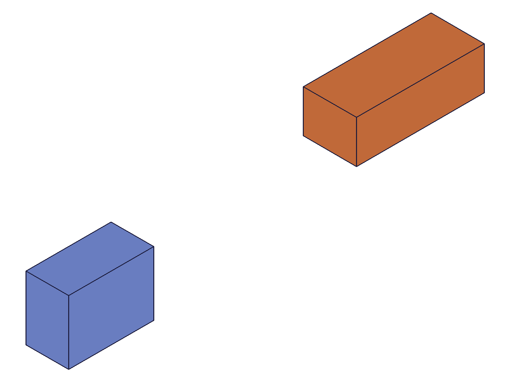
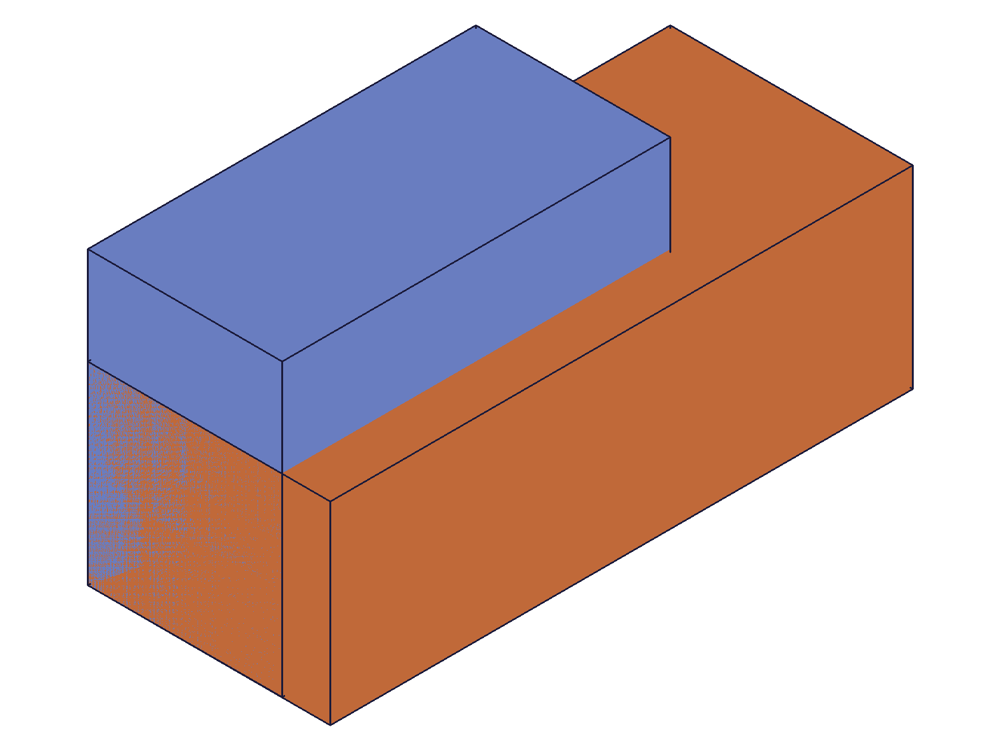

# Training: assembly.fastened

**Date:** 2026-05-05

## Goal

Testing `v1.assembly.fastened`, `v1.assembly.updateFastened`, and `v1.assembly.getFastened`.

**Methods to cover:**

- `fastened` — create a fastened constraint between two instances via mate1/mate2 with csys + path
- `fastened` params: id (assembly), name, mate1 (path, csys, flip, reorient), mate2 (path, csys, flip, reorient), xOffset/yOffset/zOffset, xRotation/yRotation/zRotation, useCurrentTransform
- `updateFastened` — modify offsets, rotations, mates after creation
- `getFastened` — query constraint by name

**Questions:**

- Does fastened actually reposition instance2 so its mate2 csys aligns with mate1 csys?
- How do flip and reorient affect the alignment?
- How do xOffset/yOffset/zOffset work (in which coordinate frame)?
- How do xRotation/yRotation/zRotation work (radians, "deg" strings)?
- Does useCurrentTransform lock the current relative position as the constraint?
- What happens with invalid mate paths or csys IDs?
- Can you fastened an instance to itself?
- Does getFastened return the full constraint state including offsets/rotations?
- Does updateFastened preserve unspecified params?
- Spatial verification: measure COG before/after fastened to confirm positioning

---

## 01 — basic fastened

Script: `scripts/01-basic-fastened.mjs` — ✅ Fastened constraint created successfully (ID 272, maxLevel 31).

|  |  |
|---|---|

**Data:** COG before: (81.1, 40.0, 28.1) with inst2 at (100,50,30). COG after: (25.6, 12.2, 11.4). Back-calculating: inst2 moved to origin (0,0,0), NOT to MateA csys position (40,15,10). Surprising — csys position doesn't determine alignment point.

**Learned:** Fastened constraint repositions inst2 but doesn't use csys origin for the base alignment position.

---

## 02 — simple alignment (same template, csys at origin)

Script: `scripts/02-simple-alignment.mjs` — ✅ Confirmed: inst2 moves to inst1's origin.

**Data:** Before COG (70,15,10) — inst1 at origin, inst2 at (100,0,0). After COG (20,15,10) — both boxes at origin, overlapping. Volume unchanged at 48000 (counted twice, not merged).

**Learned:** With csys at origin on both, fastened with zero offsets places inst2 at inst1's origin (perfect overlap).

---

## 03 — offsets

Script: `scripts/03-offsets.mjs` — ✅ xOffset=50 shifts inst2 to (50,0,0).

**Data:** COG after: (45, 15, 10). inst1 COG=(40,15,10), inst2 at (50,0,0) COG=(70,15,10). Combined x=(40+70)/2=45 ✓.

**Learned:** Offset parameters work as world-frame translations from inst1's origin.

---

## 04 — csys position effect (CRITICAL finding)

Script: `scripts/04-csys-position.mjs` — ✅ COG after: (20, 15, 10) = both at origin.

**Data:** MateA csys at (40,15,10), MateB csys at (0,15,10). If csys origins were used for alignment, inst2 should be at (40,0,0) with combined COG x=40. Actual: x=20 (both at origin).

**Learned:** **CSys POSITION does NOT affect fastened alignment.** With zero offsets, inst2 goes to inst1's origin regardless of where the csys origins are.
**📌 LLM doc:** Critical — csys position is NOT used for base alignment.

---

## 05 — csys rotation effect

Script: `scripts/05-csys-rotation.mjs` — ✅ COG after: (35, 17.5, 10) = NO rotation applied.

**Data:** wcsA default axes, wcsB rotated 90° CCW around Z. If csys axes determined alignment rotation, inst2 would be rotated and COG would differ. Actual: (35, 17.5, 10) matches inst2 at origin with identity rotation. Verified: 48000*(40+30)/(2*48000)=35, (15+20)/2=17.5 ✓.

**Learned:** **CSys AXES also do NOT affect fastened alignment.** Neither position nor orientation from the csys is used for the base constraint.
**📌 LLM doc:** The csys is purely a reference frame for offset/rotation parameter interpretation.

---

## 06 — offset coordinate frame

Script: `scripts/06-offset-in-csys-frame.mjs` — ✅ COG (45, 15, 10) matches world-frame offset.

**Data:** mate1 csys has X pointing along world Y. xOffset=50. If offset was in csys frame, inst2 would move along world Y (COG y≈40). Actual: COG x=45, y=15 — inst2 moved along world X, not csys X.

**Learned:** Offsets are in the world/assembly frame, NOT in the csys local frame.
**📌 LLM doc:** Offsets are always world-frame translations, csys axes don't remap them.

---

## 07 — rotation (zRotation pi/2)

Script: `scripts/07-rotation.mjs` — ✅ zRotation works, produces 90° CCW rotation.

**Data:** Box 80x30x20, COG local (40,15,10). With zRotation=pi/2 and xOffset=100: COG (62.5, 27.5, 10). Verified: rotated COG (-15,40,10) + offset (100,0,0) = (85,40,10). Combined (40+85)/2=62.5, (15+40)/2=27.5 ✓.

**Learned:** zRotation in radians, standard CCW convention. Rotation applied at inst1's origin, offset added after.

---

## 08 — getFastened

Script: `scripts/08-getFastened.mjs` — ✅ Returns complete constraint state.

**Data:** `getFastened({ id: asmId, name: 'MyFastened' })` returns: `{ id, name, mate1: { csys, flip, path, reorient }, mate2: { ... }, xOffset, yOffset, zOffset, xRotation, yRotation, zRotation }`. flip='-Z' and reorient='90' stored as set. yRotation='30deg' stored as 0.5236 radians.

Non-existent name: maxLevel=51, result=null, error code 0: "couldn't find constraint with name X".

**Learned:** getFastened returns all params. "deg" strings are converted to radians on storage. Name lookup is exact-match on the assembly.
**📌 LLM doc:** getFastened return shape, non-existent name behavior.

---

## 09 — deg string syntax

Script: `scripts/09-deg-string.mjs` — ✅ "90deg" equivalent to pi/2.

**Data:** COG (62.5, 27.5, 10) — identical to script 07 which used Math.PI/2. getFastened shows stored zRotation=1.5708 (radians).

**Learned:** "Ndeg" syntax works for all rotation params. Internally stored as radians.

---

## 10 — updateFastened

Script: `scripts/10-updateFastened.mjs` — ✅ Partial updates preserve unmodified params.

**Data:**
- Create xOffset=50 → COG (65, 15, 10) ✓
- Update xOffset=100 → COG (90, 15, 10) ✓, yOffset=0 preserved
- Update yOffset=30 → xOffset=100 preserved, COG (90, 30, 10) ✓
- Update zRotation='45deg' → stored as 0.7854 rad ✓

Final state: xOffset=100, yOffset=30, zOffset=0, zRotation=0.7854. All unmodified params preserved.

**Learned:** updateFastened is a true partial update — only specified params change.
**📌 LLM doc:** updateFastened preserves unspecified params.

---

## 12 — clean flip and reorient measurement

Script: `scripts/12-clean-flip.mjs` — ✅ flip and reorient produce specific rotations.

**Data (2 instances each, box 80x30x20, COG local (40,15,10)):**

**flip='-Z', xOffset=100:** COG (90, ~0, ~0). inst2 COG = (140, -15, -10). Local (40,15,10) → (40,-15,-10). This is 180° around X axis.

**flip='X', xOffset=100:** COG (65, 15, 25). inst2 COG = (90, 15, 40). Local (40,15,10) → (-10, 15, 40). This is 90° around Y axis: (x,y,z)→(-z,y,x).

**reorient='90', xOffset=100:** COG (77.5, -12.5, 10). inst2 COG = (115, -40, 10). Local (40,15,10) → (15,-40,10). This is -90° (CW) around Z: (x,y,z)→(y,-x,z).

**Learned:**
| Parameter | Rotation |
|---|---|
| flip='Z' (default) | Identity |
| flip='-Z' | 180° around X → flips Y,Z |
| flip='X' | 90° around Y → X becomes main axis |
| reorient='90' | -90° CW around main axis (Z) |

**📌 LLM doc:** flip/reorient rotation semantics with measured examples.

---

## 13 — useCurrentTransform

Script: `scripts/13-useCurrentTransform.mjs` — ✅ Preserves current position, computes equivalent offsets.

**Data:** inst2 placed at (75,20,10). COG before: (57.5, 25, 15). After fastened with useCurrentTransform=1: COG identical (57.5, 25, 15). getFastened shows: xOffset=75, yOffset=20, zOffset=10 — exactly the instance transform.

**Learned:** useCurrentTransform=TRUE calculates offsets to preserve the current relative position. Does not move the instance.
**📌 LLM doc:** useCurrentTransform back-computes offsets from current instance transform.

---

## 14 — error cases

Script: `scripts/14-error-cases.mjs` — ✅ All error cases properly handled.

**Data:**
| Case | Result | maxLevel | Error |
|---|---|---|---|
| Missing id | null | 51 | code 1004: "id must be provided" |
| Missing mate1 | null | 51 | code 1004: "mate1 must be provided" |
| Missing mate2 | null | 51 | code 1004: "mate2 must be provided" |
| Self-fastened | null | 51 | code 1014: "paths belong to same rigid set" |
| Invalid csys (999999) | null | 51 | code 1006: "invalid id" |
| Invalid flip ('INVALID') | null | 51 | code 1013: "not supported as flip type" |
| Duplicate name | 147 | 31 | **No error** — duplicates allowed |

**Learned:** Self-fastened is properly rejected (NOT a hang like solid booleans). Duplicate constraint names silently allowed. All required params validate with clear error messages.
**📌 LLM doc:** Error table, duplicate names allowed, self-fastened rejected.

---

## Coverage Checklist

- [x] fastened called successfully with basic params
- [x] Every required parameter tested (id, mate1, mate2 with path + csys)
- [x] Key optional parameters exercised (name, offsets, rotations, flip, reorient, useCurrentTransform)
- [x] "deg" string syntax verified
- [x] updateFastened tested — partial updates work
- [x] getFastened tested — returns full state
- [x] Behavioral claims verified with numeric data (COG measurements) AND visual evidence (snapshots)
- [x] Every question from Goal answered with named scripts
- [x] Spatial claims backed by numeric measurements
- [x] Error cases documented
