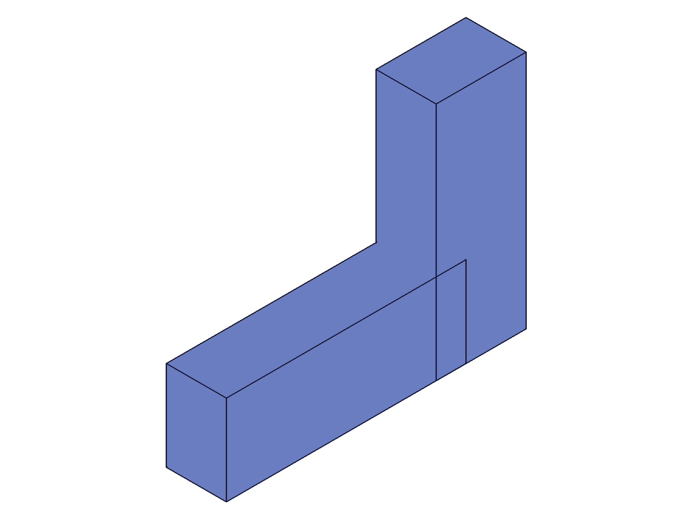
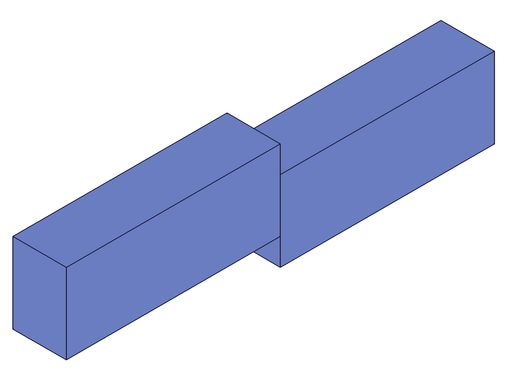
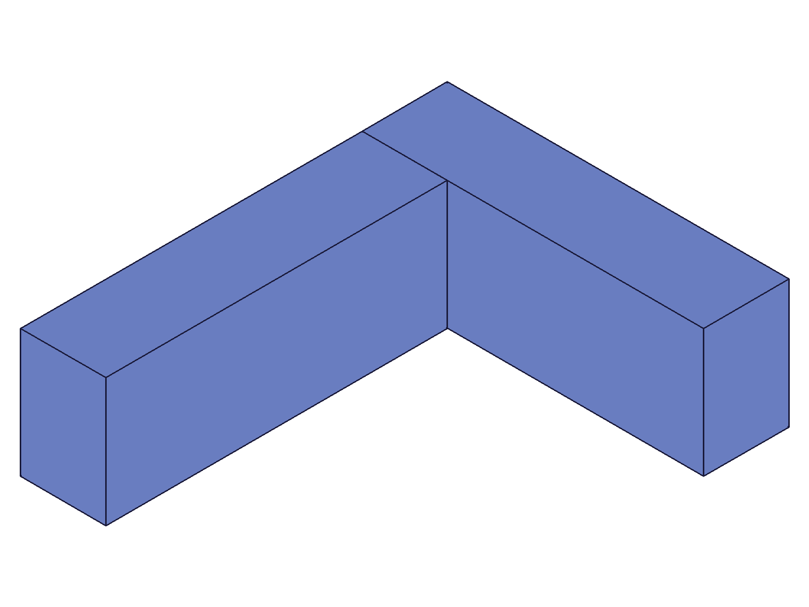
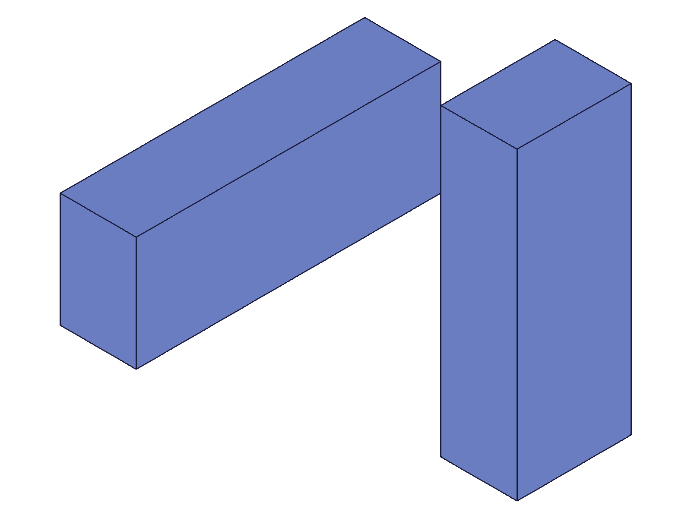
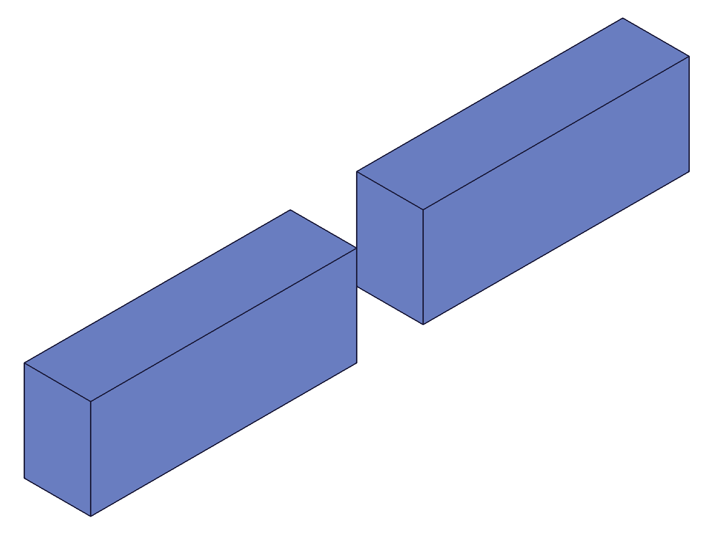
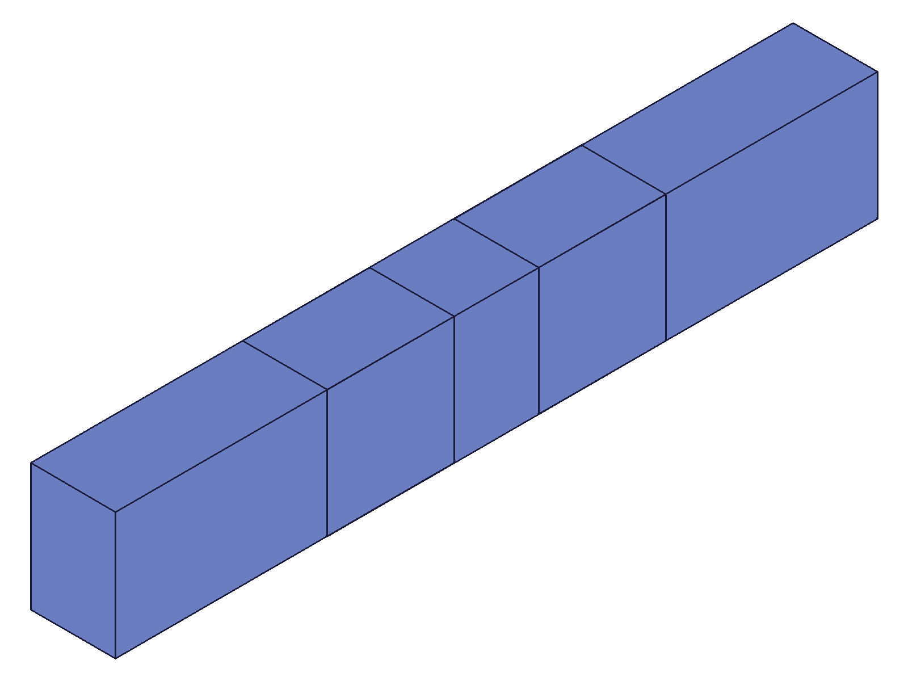
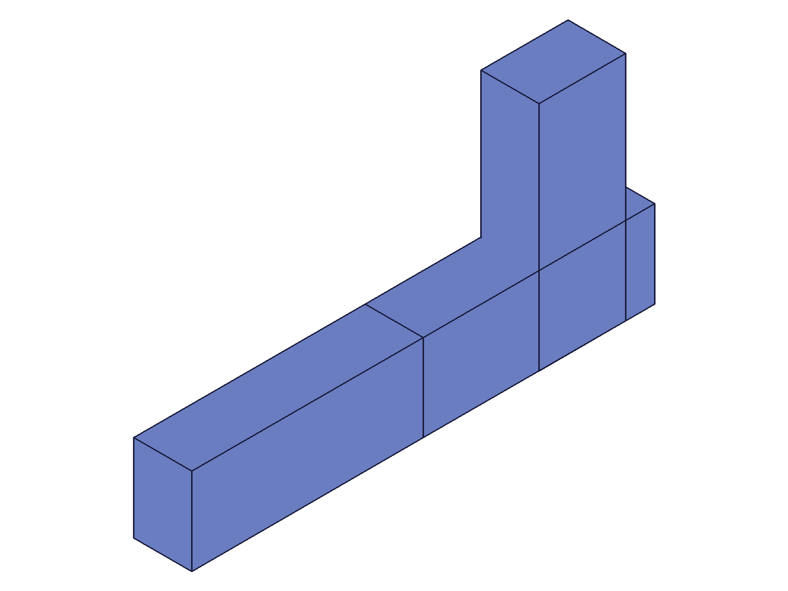

# Training: assembly.updateFastened

**Date:** 2026-05-05

## Goal

Deep study of `v1.assembly.updateFastened` — the update API for fastened constraints.

**Methods to cover:**

- `updateFastened` — change offsets, rotations, mates, flip, reorient, name, useCurrentTransform on existing constraint
- Verify spatial effect of each update type via COG measurement

**Questions:**

- Can you swap mate1/mate2 csys to a different workCSys via update?
- Can you swap mate1/mate2 path to different instances?
- Does updating flip/reorient produce the same rotation effect as creation?
- Does `useCurrentTransform: 1` in update context recompute offsets from current positions?
- Does updating `name` rename the constraint (findable via getFastened with new name)?
- What happens when you update a constraint with an invalid ID?
- What happens when you update with invalid csys or path?
- Can you zero out offsets/rotations by setting them to 0 explicitly?
- What's the effect of multiple consecutive updates?

---

## 02 — basic offset update with spatial verification

Script: `scripts/02-update-offset-spatial.mjs` — ✅ Offset updates verified with COG.

|  |  |
|---|---|

**Data:** Box 80x30x20, local COG (40,15,10). Two instances.
- After creation (xOffset=50): COG x=65. inst2 at x=50, COGs (40+90)/2=65 ✓
- After update (xOffset=100): COG x=90. inst2 at x=100, COGs (40+140)/2=90 ✓
- `calculateMassProperties` on assembly root returns `{ cog: { x, y, z }, volume }` (NOT `centerOfGravity`)

**Learned:** updateFastened immediately repositions the constrained instance. COG measurement via `assembly.calculateMassProperties` uses `.result.cog.x/y/z` shape.

---

## 03 — rotation updates (radians, deg string, zeroing)

Script: `scripts/03-update-rotation.mjs` — ✅ All rotation variants work in update.

|  |
|---|

**Data:**
- No rotation: COG (90, 15, 10) ✓
- zRotation=pi/2: COG (62.5, 27.5, 10) ✓ — rotation applied, offset preserved
- zRotation='45deg': COG (78.84, 26.95, 10) ✓ — deg string works in update
- zRotation=0: COG back to (90, 15, 10) ✓ — zeroing rotation restores original position

getFastened shows zRotation stored as radians (0.785 for '45deg').

**Learned:** Rotations can be added, changed, or zeroed out via update. "Ndeg" string syntax works. Setting to 0 removes the rotation effect.
**📌 LLM doc:** Zeroing rotation via `zRotation: 0` confirmed to restore unrotated position.

---

## 04 — flip and reorient via update

Script: `scripts/04-update-flip-reorient.mjs` — ✅ Same rotation semantics as creation.

|  |  |  |
|---|---|---|

**Data:**
- flip='-Z': COG (90, 0, 0) ✓ — 180° around X flips Y,Z
- flip='X': COG (65, 15, 25) ✓ — 90° around Y
- reorient='90': COG (77.5, -12.5, 10) ✓ — -90° CW around main Z axis

**Note:** When updating flip/reorient, you must include `path` and `csys` in the mate object. Can't pass flip alone.

**Learned:** Updating flip/reorient produces identical spatial effects as creation. mate2 object requires path+csys alongside flip/reorient.

---

## 05 — csys swap via update

Script: `scripts/05-update-mate-csys.mjs` — ✅ Csys swap has NO spatial effect.

|  |
|---|

**Data:** Two workCSys: origin (0,0,0) and corner (80,30,20). Swapping mate1 csys, then mate2 csys — COG unchanged at (90, 15, 10) throughout. Final state confirms csys IDs were updated (wcsA=107→wcsB=115).

**Learned:** Changing the csys reference via update stores the new ID but has ZERO spatial effect. Confirms the creation-time finding that csys position/orientation is irrelevant to constraint alignment.

---

## 06 — useCurrentTransform in update context

Script: `scripts/06-update-useCurrentTransform.mjs` — ✅ Recomputes offsets, no movement.

**Data:**
- Create with xOffset=50, yOffset=20: COG (65, 25, 10) ✓
- useCurrentTransform=1: COG unchanged (65, 25, 10). Offsets preserved as (50, 20, 0) — already at constraint position
- Update to (120, 60, 30): COG (100, 45, 25) ✓
- useCurrentTransform=1 again: COG unchanged. Offsets re-computed as (120, 60, 30)

**Learned:** `useCurrentTransform: 1` in update context behaves identically to creation: it back-computes offsets from the current relative position without moving anything. If the instance is already at the constraint position, offsets stay the same.
**📌 LLM doc:** useCurrentTransform in update is a no-op when instance is already at constraint position; it recalculates when position was changed externally.

---

## 07 — name update

Script: `scripts/07-update-name.mjs` — ✅ Rename works and is immediately searchable.

**Data:**
- Created as "OriginalName", found by getFastened ✓
- updateFastened with `name: 'RenamedConstraint'`: returns 121, maxLevel=31
- Old name: getFastened returns null, maxLevel=51
- New name: getFastened finds it, xOffset=50 preserved

**Learned:** Name update works. The old name immediately becomes unfindable. All other params preserved.
**📌 LLM doc:** Rename via updateFastened, old name becomes invalid immediately.

---

## 08 — error cases

Script: `scripts/08-error-cases.mjs` — ✅ Clean error handling, constraint survives.

**Data:**

| Case | maxLevel | Code | Error |
|---|---|---|---|
| Invalid ID (999999) | 51 | 1006 | "The provided constraint id does not exist." |
| Assembly root as id | 51 | 1007 | "not a constraint or relation" |
| Instance ID as id | 51 | 1007 | "not a constraint or relation" |
| Invalid csys (999999) | 51 | 1006 | "invalid id" in csys |
| Invalid flip ('INVALID') | 51 | 1013 | "not supported as flip type" |
| Empty update (only id) | 31 | — | **No error — valid no-op** |

Constraint survives all failed updates (xOffset=50 intact).

**Learned:** All invalid updates return maxLevel=51 with specific error codes. The constraint is not corrupted by failed updates. Empty update (no params specified) is a valid no-op.
**📌 LLM doc:** Error table for updateFastened. Empty update = no-op success.

---

## 09 — mate path swap (reassign instances)

Script: `scripts/09-update-mate-path.mjs` — ✅ Path swap works, repositions new target.

|  |  |
|---|---|

**Data:** 3 instances A/B/C. Initial: A→B fastened with xOffset=50.
- Swap mate2 from B to C: COG (73.3). C moved to x=50 (constrained). B stays at x=50 (released, not restored).
  Calc: (40+90+90)/3=73.3 ✓
- Swap mate1 from A to B: COG (90). Constraint now B→C, so C at B_origin+50=100.
  Calc: (40+90+140)/3=90 ✓

**Learned:** Swapping mate paths immediately repositions the new constrained instance. The previously constrained instance stays at its current position (no "snap-back"). xOffset is preserved through path swaps.
**📌 LLM doc:** Mate path swap behavior — old target stays in place, new target immediately repositioned.

---

## 10 — array (batch) form update

Script: `scripts/10-batch-update.mjs` — ✅ Array form works, returns array of IDs.

|  |
|---|

**Data:** Two constraints F1 (xOffset=50) and F2 (xOffset=100). Batch update: F1→xOffset=80, F2→xOffset=150 + zRotation='90deg'.
- Result: `[123, 127]` (array of constraint IDs)
- COG: (98.3, 23.3, 10) ✓ — both updates applied
- F1 xOffset=80 ✓, F2 xOffset=150 + zRotation=1.5708 ✓

**Learned:** Array form `updateFastened([{...}, {...}])` updates multiple constraints at once, returns array of IDs.

---

## Coverage Checklist

- [x] updateFastened offset changes verified with COG (script 02)
- [x] Rotation updates — radians, "deg" strings, zeroing (script 03)
- [x] Flip/reorient updates via mate objects (script 04)
- [x] Csys swap — changes stored but NO spatial effect (script 05)
- [x] useCurrentTransform in update context — back-computes offsets (script 06)
- [x] Name update — renames constraint, immediately searchable by new name (script 07)
- [x] Error cases — invalid IDs/params handled cleanly, constraint survives (script 08)
- [x] Mate path swap — reassign constrained instances (script 09)
- [x] Array/batch form works (script 10)
- [x] Every question from Goal answered with named scripts
- [x] All spatial claims backed by COG measurements
