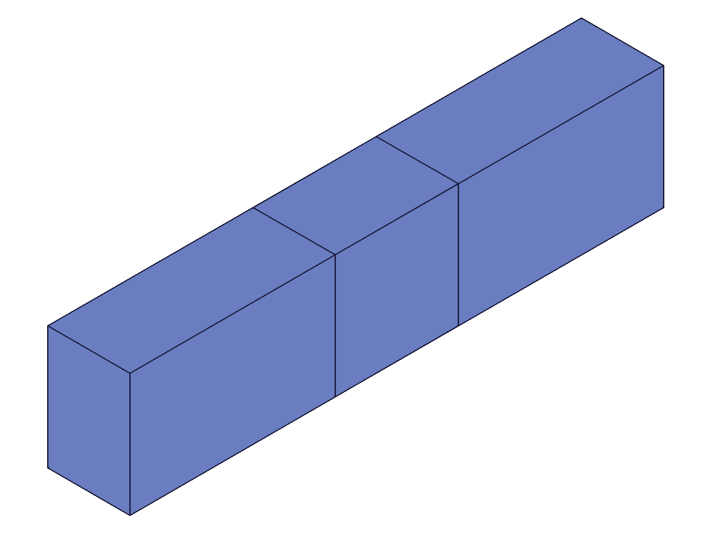

# Training: assembly.getFastened

**Date:** 2026-05-05

## Goal

Deep study of `v1.assembly.getFastened` — query API for fastened constraints by name.

**Methods to cover:**

- `getFastened` — single query by name
- `getFastened` — array form (batch query)
- Return value structure: id, name, mate1, mate2, offsets, rotations

**Questions:**

- What is the exact return shape? (id, name, mate1/mate2 with path/csys/flip/reorient, offsets, rotations)
- Are rotations always returned in radians even when created with "deg" strings?
- Are default flip/reorient values included in the result or omitted?
- What happens when querying a non-existent name?
- Can you query by instance ID instead of assembly root ID?
- Does the array form work? What does it return?
- Does `getFastened` after `updateFastened` reflect updated values?
- After renaming via `updateFastened`, can `getFastened` find it by the new name?
- What happens with duplicate constraint names — which one does `getFastened` return?
- Are offset/rotation values returned as 0 when not set, or are they omitted?

---

## 01 — basic getFastened return shape

Script: `scripts/01-basic-getFastened.mjs` — ✅ Returns full constraint state.

|  |
|---|

**Data:** Created fastened with xOffset=50. `getFastened({ id: asmId, name: 'Joint1' })` returns:
```json
{ id: 121, name: "Joint1",
  mate1: { csys: 107, flip: "Z", path: [113], reorient: "0" },
  mate2: { csys: 107, flip: "Z", path: [115], reorient: "0" },
  xOffset: 50, yOffset: 0, zOffset: 0,
  xRotation: 0, yRotation: 0, zRotation: 0 }
```
maxLevel=31 (info). All fields always present — offsets/rotations default to 0, flip defaults to "Z", reorient defaults to "0".

**📌 LLM doc:** Document exact return shape, all fields always present (no omissions), default values.

---

## 02 — non-existent constraint name

Script: `scripts/02-nonexistent-name.mjs` — ✅ Returns null with error.

**Data:** `getFastened({ id: asmId, name: 'DoesNotExist' })` → `result: null`, maxLevel=51 (ERROR), message: `"There couldn't be found a constraint with name \"DoesNotExist\" on product or product reference with id $12"`, code=0.

**📌 LLM doc:** Non-existent name returns null, maxLevel 51, error code 0.

---

## 03 — rotation values returned in radians

Script: `scripts/03-rotation-radians.mjs` — ✅ "deg" strings are converted to radians in the result.

**Data:** Created with `zRotation: '90deg'` → getFastened returns `zRotation: 1.5707963267948966` (exactly π/2). Created with `zRotation: 1.5708` → returns `1.5708` (stored as-is). Type is always `number`.

**📌 LLM doc:** Rotations always returned as radians (number). "deg" strings converted at creation time.

---

## 04 — array form batch query

Script: `scripts/04-array-form.mjs` — ✅ Array form works, returns array of results.

**Data:** `getFastened([{ id, name: 'F1' }, { id, name: 'F2' }])` → `result: [{...F1 data}, {...F2 data}]`, maxLevel=31. Mixed query with one non-existent: result array has full object for found entry and `null` for not-found, maxLevel=51.

**📌 LLM doc:** Array form returns array. Not-found entries are null within the array. maxLevel reflects worst case.

---

## 05 — query by instance or template ID

Script: `scripts/05-query-by-instance-id.mjs` — ✅ Only assembly root ID works.

**Data:** Despite docs saying `param.id` is "id of the assembly or instance", querying with instance IDs (inst1, inst2) or template ID all fail: `result: null`, maxLevel=51, message: `"The provided product or product reference id is not a Assembly."`.

**📌 LLM doc:** Doc discrepancy — docs claim instance ID works but it does NOT. Only assembly root ID accepted.

---

## 06 — flip and reorient in results

Script: `scripts/06-flip-reorient.mjs` — ✅ Non-default flip/reorient correctly reflected.

**Data:** Created with `mate2: { ..., flip: '-Z', reorient: '90' }` → getFastened returns `mate2.flip: "-Z"`, `mate2.reorient: "90"`. mate1 (no explicit flip/reorient) shows defaults: `flip: "Z"`, `reorient: "0"`. Default values always present — never omitted.

---

## 07 — duplicate constraint names

Script: `scripts/07-duplicate-names.mjs` — ✅ Returns first match.

**Data:** Two constraints both named "Dupe" (ids 123 and 127). `getFastened({ name: 'Dupe' })` returns id 123 (the first created) with its xOffset=80. The second (yOffset=80) is unreachable by name.

**📌 LLM doc:** Duplicate names — getFastened returns first match. Second constraint unreachable by name.

---

## 08 — post-update reflects changes, rename works

Script: `scripts/08-post-update-query.mjs` — ✅ Updated values immediately visible.

**Data:** Before update: xOffset=50, zRotation=0. After `updateFastened({ id, xOffset: 100, zRotation: '45deg' })`: xOffset=100, zRotation=0.7853981633974483 (π/4). After `updateFastened({ id, name: 'Renamed' })`: old name "Updatable" → null/maxLevel 51. New name "Renamed" → found, all params preserved (xOffset=100, zRotation=0.785...).

---

## 09 — useCurrentTransform back-computed offsets

Script: `scripts/09-useCurrentTransform-query.mjs` — ✅ Back-computed offsets visible in result.

**Data:** Instance2 placed at [75, 40, 25]. Created with `useCurrentTransform: 1`. getFastened returns xOffset=75, yOffset=40, zOffset=25 — exactly the instance's position. The back-computed offsets are stored and queryable, not hidden.

---

## Coverage Summary

All 10 questions from the Goal section answered:

1. **Return shape** → `{ id, name, mate1, mate2, xOffset, yOffset, zOffset, xRotation, yRotation, zRotation }` with mate having `{ csys, flip, path, reorient }` (script 01)
2. **Radians** → Yes, always radians even for "deg" input (script 03)
3. **Default flip/reorient** → Always included: flip="Z", reorient="0" (scripts 01, 06)
4. **Non-existent name** → null, maxLevel 51, error code 0 (script 02)
5. **Instance ID** → Does NOT work despite docs (script 05)
6. **Array form** → Works, returns array with nulls for not-found (script 04)
7. **Post-update** → Reflects updated values immediately (script 08)
8. **Post-rename** → Old name not found, new name works (script 08)
9. **Duplicate names** → Returns first match (script 07)
10. **Default offsets/rotations** → Always present as 0 (script 01)
