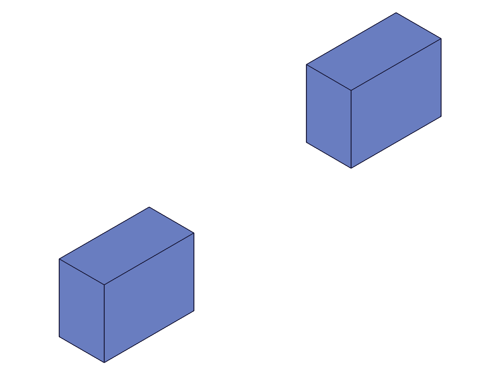
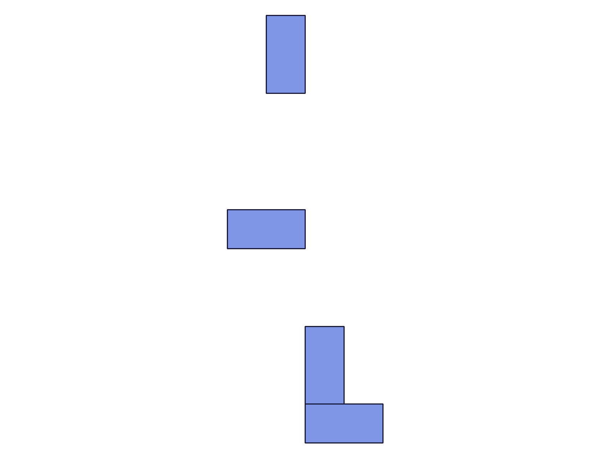

# Training: assembly.fastenedOrigin

**Date:** 2026-05-05

## Goal

Testing `v1.assembly.fastenedOrigin`, `v1.assembly.updateFastenedOrigin`, and `v1.assembly.getFastenedOrigin`.

**Methods to cover:**

- `fastenedOrigin` — basic creation with mate1 only (no mate2 unlike fastened)
- `fastenedOrigin` params: id, name, mate1 (path, csys, flip, reorient), xOffset/yOffset/zOffset, xRotation/yRotation/zRotation, useCurrentTransform
- `updateFastenedOrigin` — change offsets, rotations, mate1, flip, reorient, useCurrentTransform
- `getFastenedOrigin` — query by name, verify returned structure

**Questions:**

- How does fastenedOrigin differ from fastened? (Only mate1, locks to assembly origin instead of to another instance?)
- Does the csys position matter for positioning, or is it ignored like in fastened?
- What happens with offsets — do they translate the instance FROM the assembly origin?
- Does flip/reorient work the same as in fastened?
- Does useCurrentTransform back-compute offsets from the current instance position?
- Can you have multiple fastenedOrigin constraints on different instances?
- What happens if you apply two fastenedOrigin constraints to the same instance?
- Does getFastenedOrigin only accept assembly root ID (like getFastened)?
- Spatial verification: measure COG before/after fastenedOrigin to confirm positioning

---

## 01 — basic fastenedOrigin (no offsets)

Script: `scripts/01-basic.mjs` — ✅ fastenedOrigin created successfully (ID 149, maxLevel 31).

**Data:** `calculateMassProperties(instanceId)` returned undefined COG — per-instance mass triggers materialization bug (TODO #126). Single-instance snapshot with auto-scale doesn't help verify position.

**Learned:** Basic creation works. Need assembly-root-level mass properties for spatial verification.

---

## 02 — spatial verification with two instances

Script: `scripts/02-spatial-verify.mjs` — ✅ fastenedOrigin moves instance to assembly origin.

|  |  |
|---|---|

**Data:** Combined COG before: `{x: 60, y: 40, z: 25}` (two boxes: instA at origin [COG 20,15,10] + instB at [80,50,30] [COG 100,65,40], average = [60,40,25]). After fastenedOrigin on instB: COG `{x: 20, y: 15, z: 10}` — both at origin, overlapping. Volume 48000 in both cases (2 × 24000). See `files/02-spatial-verify-mass-before.json` and `files/02-spatial-verify-mass-after.json`.

`getInstance` on constrained instance returned null — interesting but not blocking.

**Learned:** Zero-offset fastenedOrigin moves the instance to [0,0,0] (assembly origin). The "before" snapshot shows two separated boxes; "after" shows them overlapping.

**📌 LLM doc:** Zero offsets → instance placed at assembly origin.

---

## 03 — offsets

Script: `scripts/03-offsets.mjs` — ✅ offsets translate the instance from the assembly origin.

**Data:** `fastenedOrigin` with `xOffset: 60, yOffset: 40, zOffset: 25`. COG: `{x: 80, y: 55, z: 35}` = offset [60,40,25] + box COG [20,15,10]. Exact match. See `files/03-offsets-mass-with-offset.json`.

**Learned:** Offsets work as absolute world-frame translation from the assembly origin. Instance position = [xOffset, yOffset, zOffset].

**📌 LLM doc:** Offsets are world-frame, from assembly origin.

---

## 04 — rotation (deg string)

Script: `scripts/04-rotations.mjs` — ✅ `zRotation: '90deg'` works. Second assembly in same harness run failed (multi-assembly limitation).

**Data:** COG with 90° Z rotation: `{x: -15, y: 20, z: 10}`. Original box COG [20,15,10]. After 90° CCW around Z: cos90·20 − sin90·15 = −15, sin90·20 + cos90·15 = 20, z=10. Exact match.

**Learned:** Deg strings work. Rotation is applied before offsets (at origin). Cannot create multiple assemblies in one harness run.

---

## 04b — rotation (radians)

Script: `scripts/04b-radians.mjs` — ✅ radians work when isolated in own session.

**Data:** `zRotation: Math.PI/2`. COG: `{x: -15, y: 20, z: 10}`. Same as deg string result.

**Learned:** Both radians (number) and deg strings work identically.

**📌 LLM doc:** Rotations accept radians (number) or deg strings (e.g., `'90deg'`).

---

## 05b — csys origin has no spatial effect

Script: `scripts/05b-csys-center.mjs` — ✅ csys at [20,15,10] produces same result as csys at origin.

**Data:** COG: `{x: 20, y: 15, z: 10}` — identical to wcsOrigin result.

---

## 05c — csys rotated axes have no spatial effect

Script: `scripts/05c-csys-rotated.mjs` — ✅ csys with rotated axes produces same result.

**Data:** COG: `{x: 20, y: 15, z: 10}` — identical.

**Learned:** CSys position AND orientation are completely irrelevant to positioning, same as in `fastened`. The csys is required by the API but has no spatial effect.

**📌 LLM doc:** CSys has no spatial effect — position and orientation both irrelevant.

---

## 06 — flip values

Script: `scripts/06-flip.mjs` — ✅ all 6 flip values accepted.

**Data:** All flip values ('Z', '-Z', 'X', '-X', 'Y', '-Y') created successfully (maxLevel 31). `getFastenedOrigin` stores flip correctly for each. Combined COG of 6 differently-flipped instances at origin: `{x: 13.33, y: 5.0, z: ~0}`. See `files/06-flip-flip-results.json`.

**Learned:** Flip works the same as in `fastened` — rotates the instance orientation before offsets.

---

## 07 — useCurrentTransform

Script: `scripts/07-useCurrentTransform.mjs` — ✅ back-computes offsets, no movement.

**Data:** Instance at [75,45,20], COG before: `{x: 95, y: 60, z: 30}`. After fastenedOrigin with `useCurrentTransform: 1`: COG `{x: 95, y: 60, z: 30}` — unchanged. `getFastenedOrigin` shows `xOffset: 75, yOffset: 45, zOffset: 20` — exactly the instance transformation. See `files/07-useCurrentTransform-uct-state.json`.

**Learned:** useCurrentTransform freezes the current position by back-computing equivalent offsets. Exact match with instance transformation.

**📌 LLM doc:** useCurrentTransform back-computes offsets from current transform.

---

## 08 — getFastenedOrigin

Script: `scripts/08-getFastenedOrigin.mjs` — ✅ returns full state; rejects bad inputs.

**Data:** Created with `flip: '-Z', reorient: '90', xOffset: 10, yOffset: 20, zOffset: 30, xRotation: '45deg', yRotation: 0.5, zRotation: '90deg'`. getFastenedOrigin returns: `{id: 119, mate1: {csys: 107, flip: "-Z", path: [113], reorient: "90"}, name: "TestFO", xOffset: 10, yOffset: 20, zOffset: 30, xRotation: 0.785398..., yRotation: 0.5, zRotation: 1.570796...}`. Deg strings converted to radians. See `files/08-getFastenedOrigin-get-fo-state.json`.

- Nonexistent name: result=null, maxLevel=51, code 0: `"couldn't find constraint with name NoSuchFO in the given product"`. See `files/08-getFastenedOrigin-get-fo-bad-name.json`.
- Instance ID as param.id: result=null, maxLevel=51, code 1007: `"The provided product or product reference id is not a Assembly."` See `files/08-getFastenedOrigin-get-fo-instance-id.json`.

**Learned:** getFastenedOrigin only accepts assembly root ID (like getFastened). Deg strings stored internally as radians.

**📌 LLM doc:** Only assembly root ID accepted. Deg strings → radians in storage.

---

## 09 — updateFastenedOrigin

Script: `scripts/09-updateFO.mjs` — ✅ partial update, rename, useCurrentTransform, zeroing all work.

**Data:**
- Initial (xOffset=50): COG `{x: 70, y: 15, z: 10}` ✓
- After update (xOffset=100, yOffset=30): COG `{x: 120, y: 45, z: 10}` ✓. State shows `zOffset: 0` preserved (true partial update).
- After adding zRotation='90deg': COG `{x: 85, y: 50, z: 10}` ✓ (rotated then translated).
- Rename: old name returns null, new name returns correct state ✓
- useCurrentTransform in update: back-computes and preserves current position. State shows `xOffset: 100, yOffset: 30, zRotation: 1.570796` ✓
- Zero all: COG `{x: 20, y: 15, z: 10}` (back at origin) ✓

See `files/09-updateFO-update-state.json`, `files/09-updateFO-update-uct-state.json`, `files/09-updateFO-update-cog-progression.json`.

**Learned:** updateFastenedOrigin is a true partial update. Only specified params change. Zeroing works. Rename immediately takes effect. useCurrentTransform back-computes from current.

**📌 LLM doc:** True partial update, rename, useCurrentTransform all work same as updateFastened.

---

## 10 — error cases

Script: `scripts/10-errors.mjs` — ✅ all errors are clean and descriptive.

**Data:** See `files/10-errors-error-results.json` for full error messages.

| Condition | Code | Message |
|---|---|---|
| Missing id | 1004 | `"id" must be provided to create CC_FastenedOriginConstraint` |
| Missing mate1 | 1004 | `The parameter "mate1" must be provided` |
| Bad csys | 1006 | `An element of parameter "csys" has an invalid id!` |
| Bad flip | 1013 | `Type "INVALID" is not supported to use as flip type.` |
| Instance as id | 1007 | `The provided id for the assembly is not an assembly id.` |
| Template in path | 1001 | `The parameter "path" has a wrong id type!` |
| Bad update ID | 1006 | `The provided constraint id does not exist.` |

**Duplicate constraint on same instance:** Second fastenedOrigin on the same instance SUCCEEDS (no error, maxLevel 31). COG `{x: 70, y: 15, z: 10}` = xOffset 50 (first constraint). The first constraint wins; second is ignored for positioning.

**Learned:** All errors are clean (no hangs, no crashes). Duplicate constraints silently accepted — first one wins.

**📌 LLM doc:** Duplicate constraints silently accepted, first wins.

---

## 11 — reorient values

Script: `scripts/11-reorient.mjs` — ✅ all 4 reorient values stored correctly.

|  |
|---|

**Data:** reorient '0', '90', '180', '270' all accepted and stored via getFastenedOrigin. Top-down view shows boxes at different Y offsets with different orientations (portrait vs landscape), confirming reorient rotates around the Z main axis. See `files/11-reorient-reorient-results.json`.

**Learned:** Reorient works same as in fastened — CW rotation around the main axis in 90° steps.

---

## Coverage Checklist

- [x] fastenedOrigin called successfully
- [x] Every required parameter tested (id, mate1.path, mate1.csys)
- [x] All optional parameters exercised (name, flip, reorient, offsets, rotations, useCurrentTransform)
- [x] updateFastenedOrigin tested (partial update, rename, useCurrentTransform, zeroing)
- [x] getFastenedOrigin tested (query by name, nonexistent name, instance ID rejection)
- [x] Realistic usage combining offset + rotation
- [x] Behavioral claims verified with COG data AND visual snapshots
- [x] Error cases comprehensively tested (7 error conditions + duplicate constraint)
- [x] Spatial claims backed by numeric measurement (all COG values match predictions)
- [x] Every goal question answered (see below)

## Answers to Goal Questions

1. **How does fastenedOrigin differ from fastened?** Only one mate (mate1). Locks the instance to the assembly origin (world origin [0,0,0]) instead of relative to another instance. No mate2 parameter.
2. **Does csys position matter?** No. CSys position and orientation are both irrelevant to positioning (scripts 05b, 05c). Same as fastened.
3. **What do offsets do?** Translate the instance from the assembly origin in world-frame coordinates (script 03).
4. **Does flip/reorient work the same?** Yes, same behavior as fastened (scripts 06, 11).
5. **Does useCurrentTransform back-compute?** Yes, exactly — back-computes offsets from current instance transform (script 07).
6. **Multiple fastenedOrigin on different instances?** Yes, works fine (script 06 created 6 separate instances with constraints).
7. **Two constraints on same instance?** Silently accepted, first constraint wins (script 10).
8. **getFastenedOrigin accepts only assembly root ID?** Yes, instance IDs rejected with code 1007 (script 08).
9. **Spatial verification?** All COG measurements match predictions exactly.
