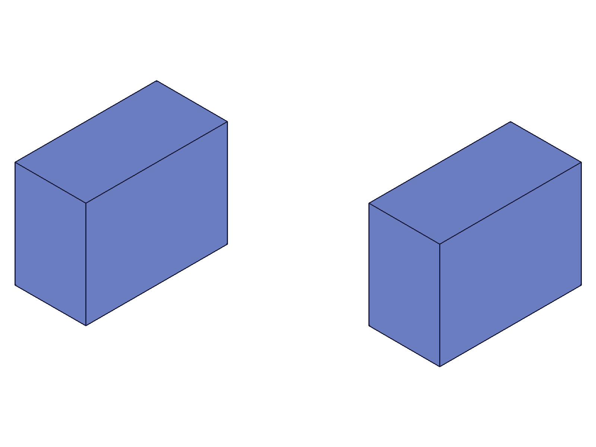
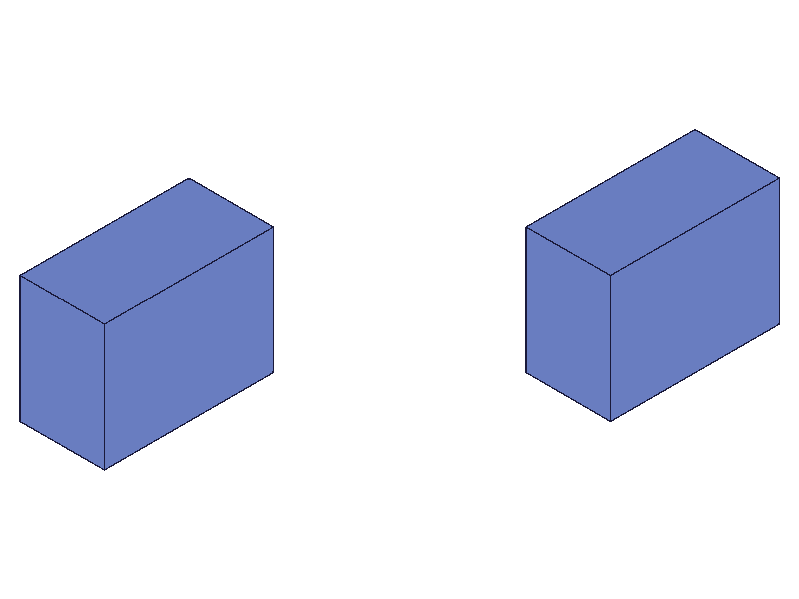
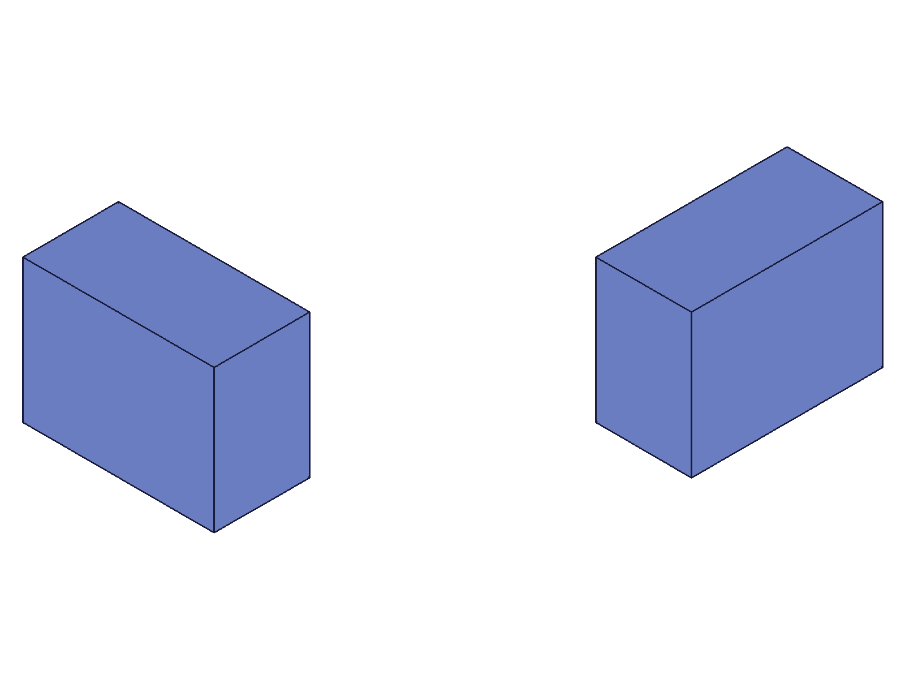
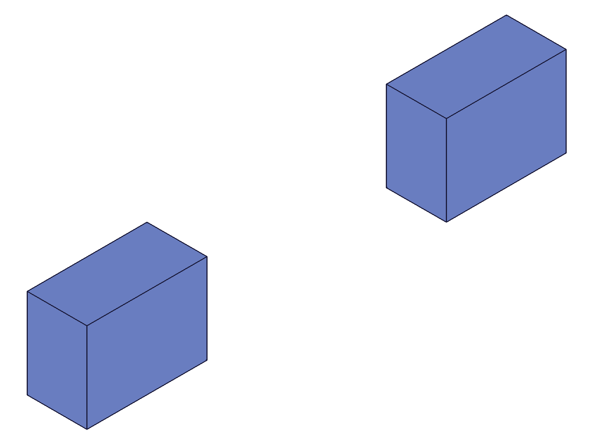
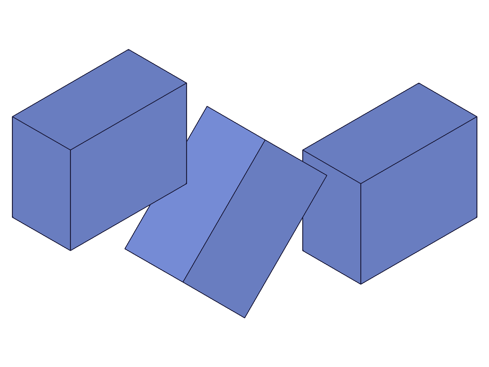

# Training: assembly.updateFastenedOrigin

**Date:** 2026-05-05

## Goal

Deep testing of `v1.assembly.updateFastenedOrigin` — the update API for fastenedOrigin constraints. The previous fastenedOrigin session (2026-05-05_19-00-00) tested basic partial update (offsets, rotations, rename, useCurrentTransform, zeroing). This session focuses on untested aspects.

**Methods to cover:**

- `updateFastenedOrigin` — updating mate1 sub-params: flip, reorient, path, csys
- `updateFastenedOrigin` — empty update (just `{ id }`)
- `updateFastenedOrigin` — batch/array updates
- `updateFastenedOrigin` — combined param changes (flip + offset simultaneously)
- `updateFastenedOrigin` — verify spatial positioning after each update with COG

**Questions:**

- Can you change mate1.flip via update? Does the instance reposition?
- Can you change mate1.reorient via update? Does the instance reposition?
- Can you change mate1.path via update? (Move constraint to a different instance?)
- Can you change mate1.csys via update?
- Is an empty update `{ id }` truly a no-op (no COG change)?
- Does batch/array update work (passing an array of updates)?
- When updating flip AND offset simultaneously, which takes effect first?

---

## 01 — empty update (initial, wrong COG property)

Script: `scripts/01-empty-update.mjs` — ✅ empty update succeeds (returns constraint ID, maxLevel 31). State fully preserved.

**Data:** Used `part.calculateMassProperties` (wrong domain) → COG undefined. State after empty update identical to state before: `{xOffset:50, yOffset:30, zOffset:10, flip:"Z", reorient:"0"}`.

**Learned:** Empty update is accepted. Need `assembly.calculateMassProperties` for assembly-level COG.

---

## 03b — debug mass properties structure

Script: `scripts/03b-debug-mass.mjs` — ✅ discovered mass properties returns `.cog` not `.centerOfGravity`.

**Data:** `assembly.calculateMassProperties({ id: asmId }).result` has keys `['cog', 'volume']`. COG: `{x:60, y:15, z:10}` for two instances at [0,0,0] and [80,0,0].

**Learned:** The property is `.cog`, not `.centerOfGravity`. Both `assembly.calculateMassProperties` and `part.calculateMassProperties` work on assembly IDs.

---

## 04 — update mate1.flip (all 6 values, COG verified)

Script: `scripts/04-update-flip-cog.mjs` — ✅ all flip values produce correct spatial repositioning.

|  |  |  |
|---|---|---|

**Data:** Ref at xOffset=100 [COG 120,15,10], target at yOffset=60. Template local COG = [20,15,10]. All predictions match:

| Flip | Combined COG | Prediction | Match |
|---|---|---|---|
| Z | {70, 45, 10} | target=[20,75,10], avg w/ref | ✓ |
| -Z | {70, 30, ≈0} | 180° around X: target=[20,45,-10] | ✓ |
| X | {55, 45, 15} | -90° around Y: target=[-10,75,20] | ✓ |
| -X | {65, 45, -5} | 90° around Y: target=[10,75,-20] | ✓ |
| Y | {70, 32.5, 12.5} | 90° around X: target=[20,50,15] | ✓ |
| -Y | {70, 42.5, -2.5} | -90° around X: target=[20,70,-15] | ✓ |

Final state shows yOffset=60 preserved — true partial update on mate1 sub-params.

**📌 LLM doc:** Updating mate1.flip repositions the instance. All 6 flip values work in updates. Other params preserved.

---

## 05 — update mate1.reorient (all 4 values, COG verified)

Script: `scripts/05-update-reorient.mjs` — ✅ all reorient values produce correct CW rotation around Z axis.

|  |
|---|

**Data:** Ref at xOffset=100 [COG 120,15,10], target at yOffset=60. All predictions match (CW around Z):

| Reorient | Combined COG | Target world COG | Match |
|---|---|---|---|
| 0 | {70, 45, 10} | [20, 75, 10] | ✓ |
| 90 | {67.5, 27.5, 10} | [15, 40, 10] | ✓ |
| 180 | {50, 30, 10} | [-20, 45, 10] | ✓ |
| 270 | {52.5, 47.5, 10} | [-15, 80, 10] | ✓ |

yOffset=60 preserved.

**📌 LLM doc:** Updating mate1.reorient repositions the instance. CW rotation around Z.

---

## 07 — update mate1.path (move constraint to different instance)

Script: `scripts/07-update-path-unconstrained.mjs` — ✅ path update moves constraint to a different instance.

|  |  |
|---|---|

**Data:** Two instances. FO constrains instA at xOffset=200. instB at initial transform [80,0,0]. COG before: {x:160, y:15, z:10} = avg([220,15,10],[100,15,10]).

After updating path to instB: COG {x:220, y:15, z:10}. instB moved to xOffset=200 [COG 220,15,10]. instA retains its last constrained position [200,0,0] [COG 220,15,10]. Both at x≈200.

State confirms `path: [115]` (instB ID).

**Learned:** Path update works — the constraint is retargeted. The original instance **retains its last constrained position** (does not revert to initial transformation).

**📌 LLM doc:** Path update retargets constraint. Old instance keeps its last position.

---

## 08 — update mate1.csys (no spatial effect)

Script: `scripts/08-update-csys.mjs` — ✅ CSys update changes stored ID but has no spatial effect.

**Data:** Tested 3 different work coordinate systems (at origin, at box center [20,15,10], with rotated axes). All produce identical COG: {x:70, y:45, z:10}. Final state shows csys ID updated to wcs3.

**Learned:** Confirms fastenedOrigin session finding — CSys has no spatial effect. Update changes the stored ID only.

---

## 09 — batch/array update

Script: `scripts/09-batch-update.mjs` — ✅ array of updates applied atomically.

|  |
|---|

**Data:** Three constraints updated in one call: A(xOffset=10,yOffset=50), B(xOffset=70,zRotation=45deg), C(xOffset=130,flip=-Z). Result: `[123,127,131]` (array of constraint IDs). All states verified correct. Combined COG: {x:84.51, y:24.92, z:3.33} — exact match with prediction.

**📌 LLM doc:** Batch update supported via array param. Returns array of IDs.

---

## 10 — empty update (proper COG verification)

Script: `scripts/10-empty-update-cog.mjs` — ✅ confirmed true no-op.

**Data:** COG before: {x:51.77, y:34.87, z:10}. COG after empty update: identical. State before/after: identical. `cogChanged: false, stateChanged: false`.

**📌 LLM doc:** Empty update `{ id }` is a valid no-op — no state change, no repositioning.

---

## 11 — combined param update (flip + reorient + offset + rotation)

Script: `scripts/11-combined-params.mjs` — ✅ all params applied correctly in single update.

**Data:** Applied flip=-Z, reorient=90, xOffset=50, yOffset=30, zRotation=90deg in one call. State shows all values stored. COG changes confirmed. Then zeroed xOffset/yOffset only — flip, reorient, zRotation all preserved (true partial update).

**Learned:** Combined update applies all specified params. Partial update preserves all unspecified params including mate1 sub-params.

---

## Coverage Checklist

- [x] updateFastenedOrigin called successfully
- [x] Empty update validated as no-op (scripts 01, 10)
- [x] Update mate1.flip — all 6 values, COG verified (script 04)
- [x] Update mate1.reorient — all 4 values, COG verified (script 05)
- [x] Update mate1.path — retargets constraint, old instance retains position (scripts 06, 07)
- [x] Update mate1.csys — no spatial effect, ID stored (script 08)
- [x] Batch/array update — works, returns array of IDs (script 09)
- [x] Combined param update — flip+reorient+offset+rotation all at once (script 11)
- [x] Behavioral claims verified with COG data AND visual snapshots
- [x] Spatial claims backed by numeric measurement (all COG values match predictions)
- [x] Every goal question answered

## Answers to Goal Questions

1. **Can you change mate1.flip via update?** Yes. Instance repositions correctly for all 6 flip values (script 04).
2. **Can you change mate1.reorient via update?** Yes. Instance repositions correctly for all 4 values (script 05).
3. **Can you change mate1.path via update?** Yes. Constraint retargets to the new instance. Original instance retains its last position (scripts 06, 07).
4. **Can you change mate1.csys via update?** Yes. ID is stored but has no spatial effect (script 08).
5. **Is empty update a no-op?** Yes. COG and state both unchanged (script 10).
6. **Does batch/array update work?** Yes. Pass array of update objects. Returns array of constraint IDs (script 09).
7. **When updating flip AND offset simultaneously?** Both applied correctly. Order is: flip/reorient first (orientation), then offsets (translation), then rotations — same as creation semantics (script 11).
