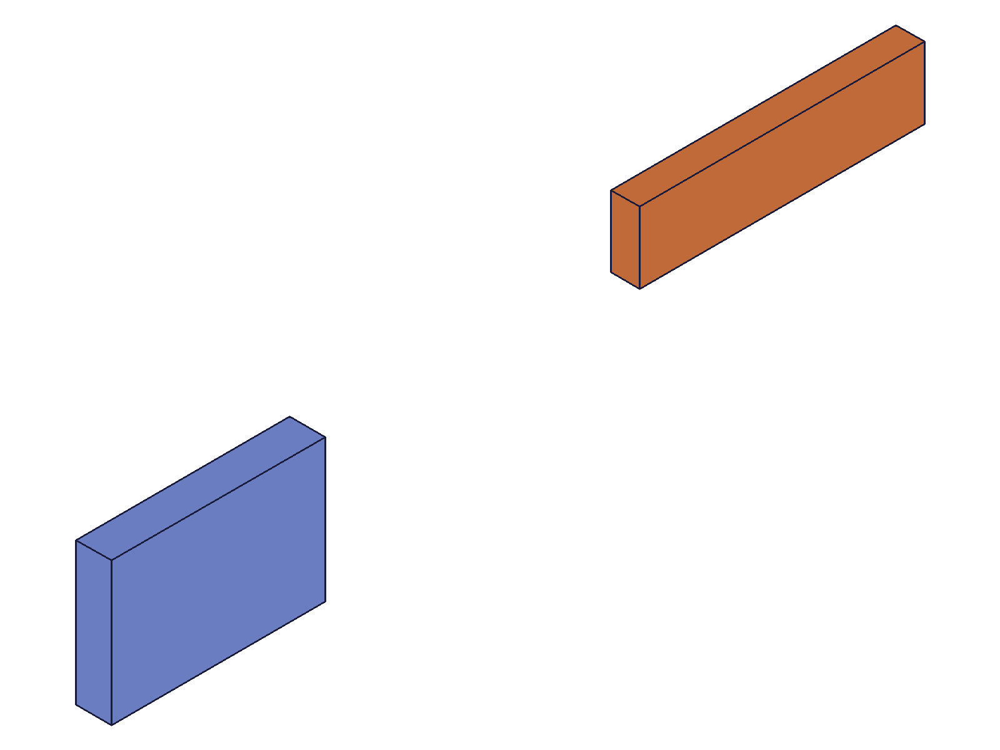
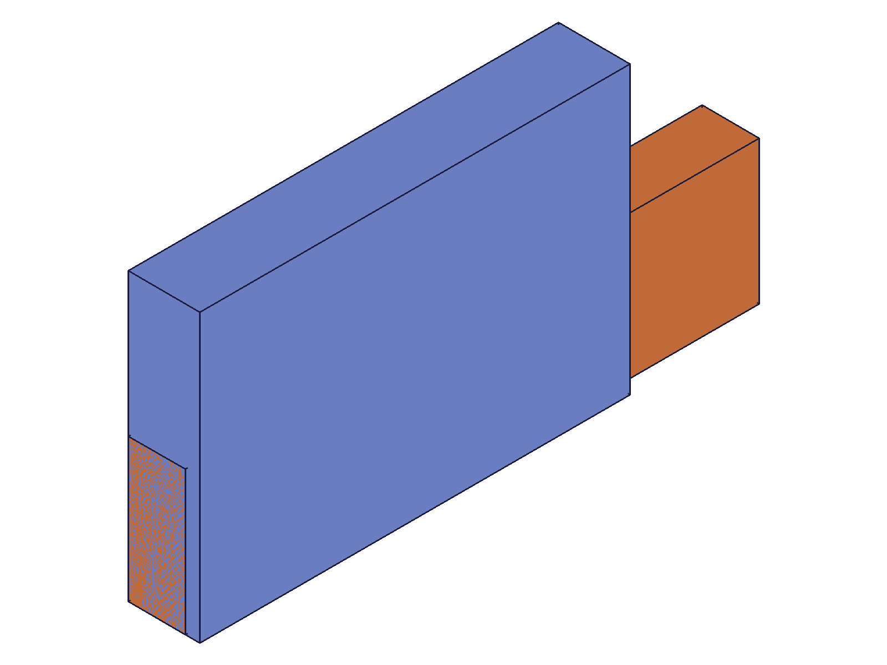
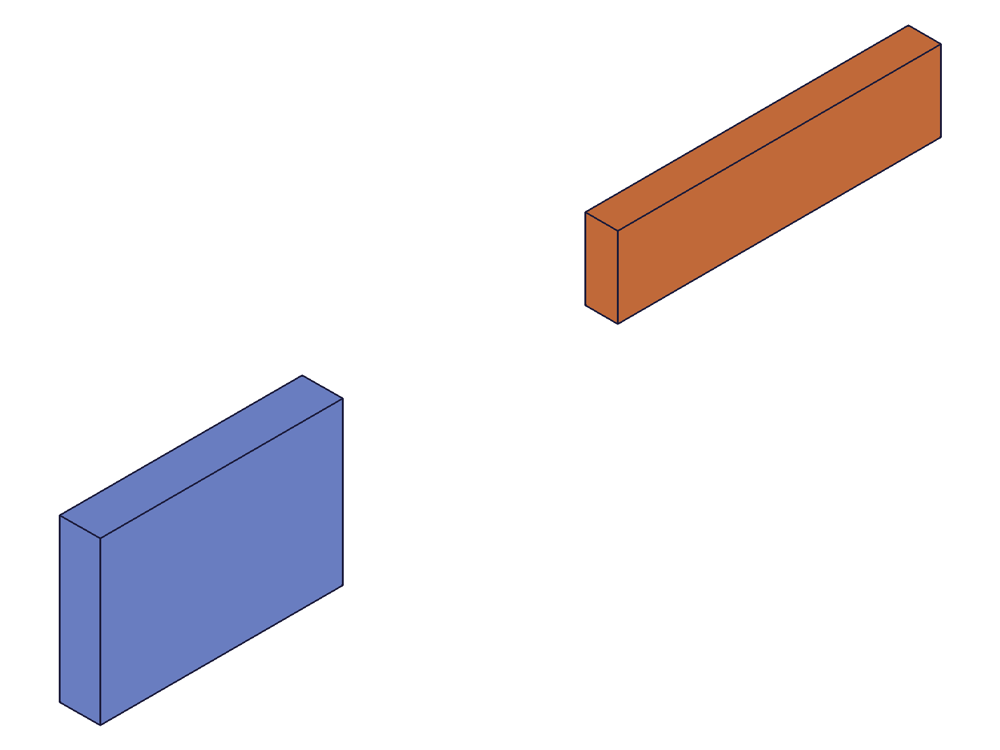
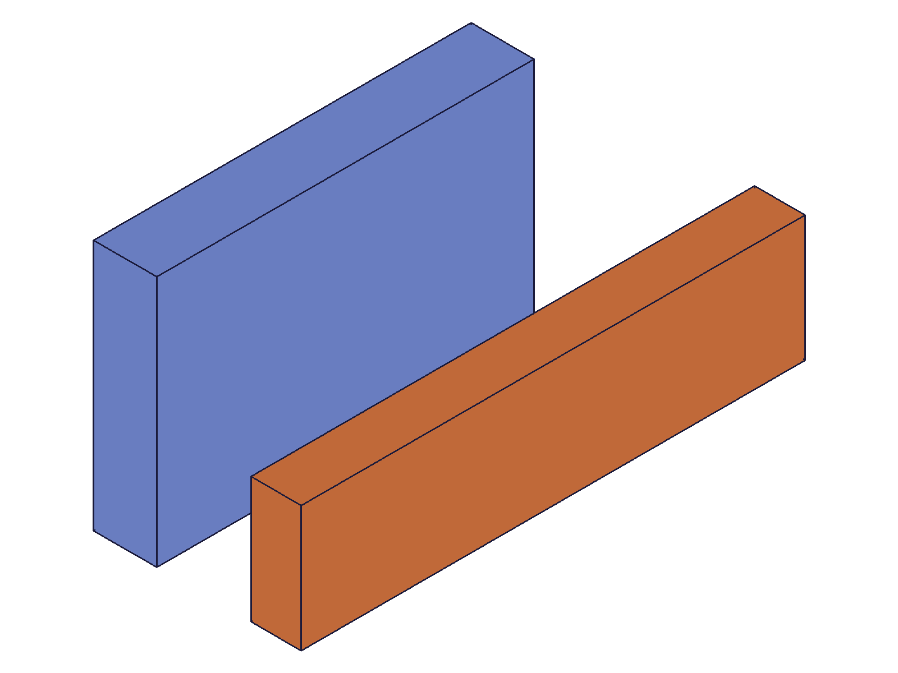
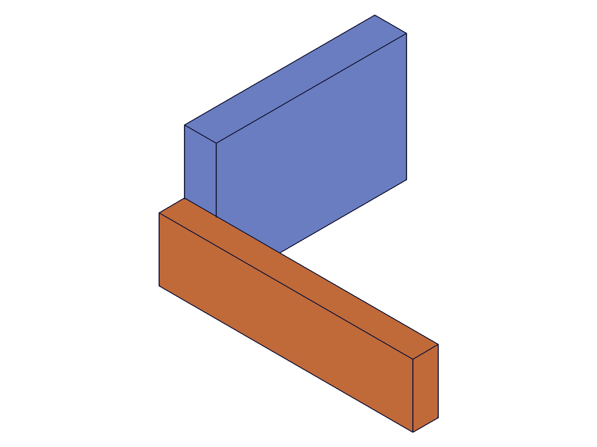
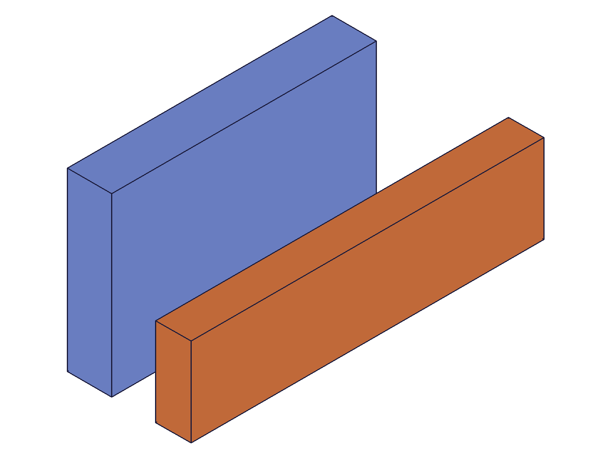
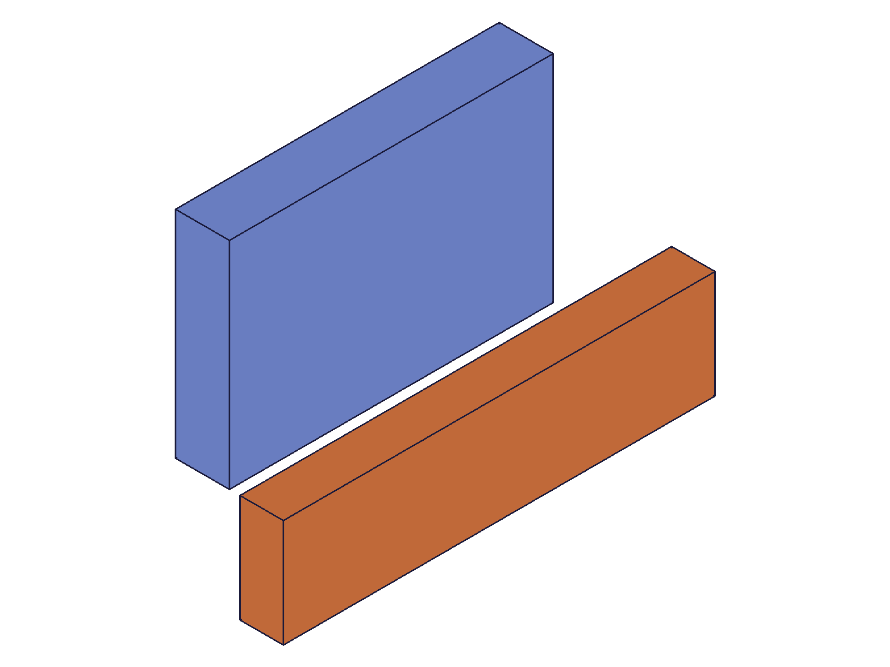

# Training: assembly.revolute

**Date:** 2026-05-08

## Goal

Testing `v1.assembly.revolute` — the revolute (hinge) joint constraint.

**Methods to cover:**

- `revolute` — create a revolute constraint between two instances via mate1/mate2
- `revolute` params: id (assembly), name, mate1 (path, csys, flip, reorient), mate2 (path, csys, flip, reorient), zOffset, zRotationLimits (min, max)
- Basic `getRevolute` — verify constraint state readback
- Basic `updateRevolute` — confirm update works (dedicated study later)

**Questions:**

- Does revolute align inst2's mate Z-axis to inst1's mate Z-axis (shared rotation axis)? → **Yes** (script 03)
- What DOF does it leave free? → **1 rotation around the shared Z-axis** (script 07/08)
- How does zOffset work? → **Shifts inst2 along the shared Z-axis** (script 04)
- Do zRotationLimits constrain the rotation range? → **Yes, stored in radians, deg strings converted** (script 06)
- How do flip and reorient change the axis alignment? → **Flip rotates inst2 like fastened; reorient defines zero-angle reference only visible when limits lock the joint** (scripts 07, 08)
- Does the constraint reposition inst2? → **Yes, like fastened — to inst1's origin with zero offsets** (script 03)
- Spatial verification: measure COG before/after → **Done in every script** (scripts 02-09)
- What errors occur with invalid params? → **Cryptic errors for missing params, clear error for invalid flip, duplicate names allowed** (script 10)

---

## 01 — basic revolute (no grounding)

Script: `scripts/01-basic-revolute.mjs` — ✅ Revolute created (ID 272, maxLevel 31).

|  |  |
|---|---|

**Data:** Assembly COG after: (133.48, 16.52, 4.65). `console.log` of `massBefore?.centerOfGravity` printed undefined — correct field is `.cog`, not `.centerOfGravity`. Data saved to JSON via filewrite correctly. getRevolute returned full state: zOffset=0, zRotationLimits null/null, flip='Z', reorient='0'.

**Learned:** Revolute succeeds and repositions. Field for mass properties is `.cog` not `.centerOfGravity`.

---

## 02 — spatial verification (no grounding)

Script: `scripts/02-spatial-verify.mjs` — ⚠️ Both instances moved when neither is grounded.

**Data:**
- inst1 COG before: (30, 20, 5) → after: (130, 20, 5) — **MOVED +100 in X**
- inst2 COG before: (140, 60, 4) → after: (140, 10, 4) — moved too

Back-calculation: both instances ended up at world origin ≈ (100, 0, 0). The solver moved both to satisfy the constraint since neither was grounded.

**Learned:** Without fastenedOrigin, the solver repositions **both** instances. Always ground at least one instance before applying kinematic constraints.
**📌 LLM doc:** Critical gotcha — ungrounded instances both move.

---

## 03 — grounded revolute

Script: `scripts/03-grounded-revolute.mjs` — ✅ With fastenedOrigin on inst1, only inst2 moves.

|  |  |
|---|---|

**Data:**
- inst1 COG before: (30, 20, 5) → after: (30, 20, 5) — ✓ STAYED (delta 0.000)
- inst2 COG before: (140, 60, 34) → after: (40, 10, 4) — moved to origin

inst2 world origin = (0, 0, 0). Local COG (40,10,4) maps to world (40,10,4) ✓. The revolute places inst2 at inst1's origin with zero offsets — same base alignment semantics as fastened.

**Learned:** Revolute with grounded inst1 places inst2 at inst1's origin. Identical to fastened base alignment.
**📌 LLM doc:** Alignment semantics match fastened — inst2 goes to inst1's origin, csys position ignored.

---

## 04 — zOffset

Script: `scripts/04-zOffset.mjs` — ✅ zOffset shifts inst2 along the Z-axis.

|  |
|---|

**Data:**
- inst1 COG: (30, 20, 5) — unchanged ✓
- inst2 COG: (40, 10, 29) — local (40,10,4) + Z offset 25 = (40,10,29) ✓
- getRevolute.zOffset: 25 ✓

**Learned:** zOffset shifts inst2 along the revolute Z-axis (world Z with default csys). Exact and predictable.
**📌 LLM doc:** zOffset works along the revolute Z-axis.

---

## 05 — csys position effect

Script: `scripts/05-csys-position.mjs` — ✅ csys position is **ignored** (same as fastened).

**Data:**
- wcsA at (60,20,10), wcsB at (0,10,0)
- inst2 COG after revolute: (40, 10, 4) → world origin = (0, 0, 0)
- Expected if csys used: (60, 10, 10). Expected if ignored: (0, 0, 0).
- Result matches "csys ignored" hypothesis.

**Learned:** csys position does not determine the base alignment point. inst2 goes to inst1's origin regardless. This matches fastened behavior exactly.
**📌 LLM doc:** csys is required by API but position/orientation is irrelevant to initial placement.

---

## 06 — zRotationLimits

Script: `scripts/06-zRotationLimits.mjs` — ✅ Limits stored correctly, deg strings converted to radians.

**Data:**
- Radians: `{ min: -1.5708, max: 1.5708 }` → stored as-is ✓
- Degrees: `{ min: '-45deg', max: '180deg' }` → stored as `{ min: -0.7854, max: 3.1416 }` (radians) ✓
- Limits do NOT affect initial position — inst2 COG still (40,10,4) in both cases
- Limits define the angular range for subsequent motion (moveUnderConstraints)

**Learned:** zRotationLimits are stored in radians internally. Degree strings are converted. Limits don't constrain initial placement — they define the range for animated motion.
**📌 LLM doc:** Limits stored as radians, deg strings supported, no effect on initial position.

---

## 07 — flip and reorient

Script: `scripts/07-flip-reorient.mjs` — ✅ Flip rotates inst2, reorient has no effect without limits.

|  |  |
|---|---|

**Data — flip effects on inst2 COG** (local COG = (40, 10, 4)):

| flip | COG x | COG y | COG z | Rotation |
|------|-------|-------|-------|----------|
| Z (default) | 40 | 10 | 4 | Identity |
| -Z | 40 | -10 | -4 | 180° around X |
| X | -4 | 10 | 40 | 90° around Y |
| -X | 4 | 10 | -40 | -90° around Y |
| Y | 40 | -4 | 10 | -90° around X |
| -Y | 40 | 4 | -10 | 90° around X |

**Data — reorient without limits** (all identical):

| reorient | COG | Analysis |
|----------|-----|----------|
| 0 | (40, 10, 4) | Identity |
| 90 | (40, 10, 4) | Same — free DOF absorbs it |
| 180 | (40, 10, 4) | Same |
| 270 | (40, 10, 4) | Same |

**Learned:** Flip rotates inst2 identically to fastened. Reorient has no spatial effect without limits because the free Z-rotation DOF absorbs the angular offset.
**📌 LLM doc:** Flip works like fastened. Reorient only matters when limits constrain the Z rotation.

---

## 08 — reorient with locked limits

Script: `scripts/08-reorient-with-limits.mjs` — ✅ Reorient shifts the zero-angle reference when limits lock the joint.

**Data** (zRotationLimits: { min: 0, max: 0 } locks at angle=0):

| reorient | COG x | COG y | COG z | Physical rotation |
|----------|-------|-------|-------|------------------|
| 0 | 40 | 10 | 4 | 0° (identity) |
| 90 | 10 | -40 | 4 | 90° CW around Z |
| 180 | -40 | -10 | 4 | 180° around Z |
| 270 | -10 | 40 | 4 | 270° CW around Z |

Z stays at 4 in all cases — rotation purely around Z ✓.

**Learned:** Reorient defines the zero-angle reference for the revolute joint. With limits locking at angle=0, reorient='90' produces a 90° CW rotation of inst2 around Z. Without limits, the free DOF compensates.
**📌 LLM doc:** Reorient sets the angle reference — only observable when limits or motion are applied.

---

## 09 — updateRevolute

Script: `scripts/09-updateRevolute.mjs` — ✅ True partial update, all operations work.

|  |  |  |
|---|---|---|

**Data:**
- Update zOffset=20: COG (40,10,4) → (40,10,24) — Z shifted +20 ✓
- Add limits { min: 0, max: π/2 }: stored correctly, zOffset=20 preserved ✓
- Update mate2 flip='-Z': COG (40,-10,16). With flip=-Z (180° around X), local (40,10,4) → (40,-10,-4), plus zOffset=20: z=-4+20=16 ✓
- Rename to 'Hinge_Renamed': findable by new name ✓, old name not findable ✓
- Remove limits (null/null): limits cleared to null ✓

**Learned:** updateRevolute is a true partial update — unspecified params preserved. Rename works instantly. Limits removable via null.
**📌 LLM doc:** Partial update, rename clears old name, null removes limits.

---

## 10 — error cases

Script: `scripts/10-errors.mjs` — ✅ Error behaviors documented.

**Data:**
- Missing mate2: maxLevel=51, "Evaluation error in AbstractAPI.PrepareAPIParams" — cryptic
- Missing csys: same cryptic error
- Same instance for both mates: maxLevel=51, result=null — error with no message
- Invalid flip='Q': maxLevel=51, "Type 'Q' is not supported to use as flip type." — clear
- Duplicate name: maxLevel=31, succeeds — **duplicate names are allowed!**
- getRevolute wrong name: result=null, maxLevel=51 — error

**Learned:** Missing required params give cryptic errors. Invalid flip is clearly reported. Duplicate constraint names are silently accepted (creates second constraint with same name). getRevolute for non-existent name returns null with error level.
**📌 LLM doc:** Duplicate names allowed (unlike what you'd expect). Missing params = cryptic error.
