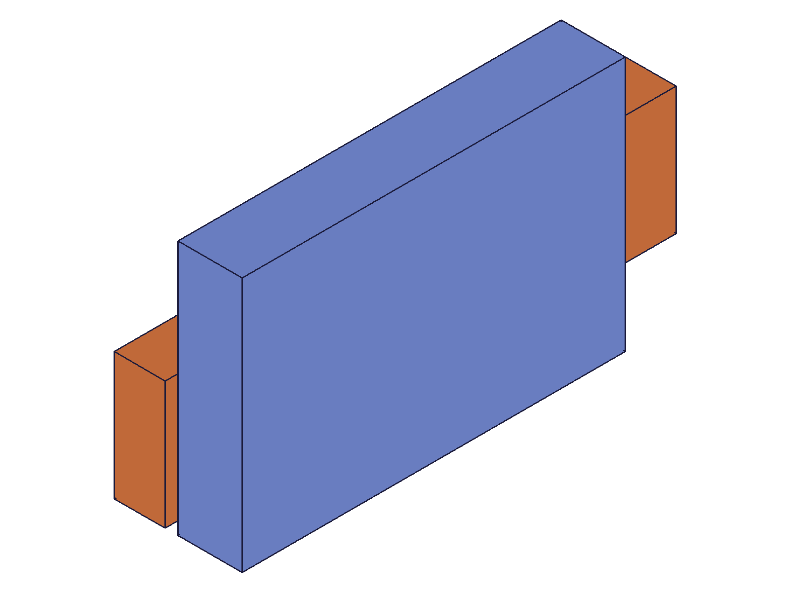
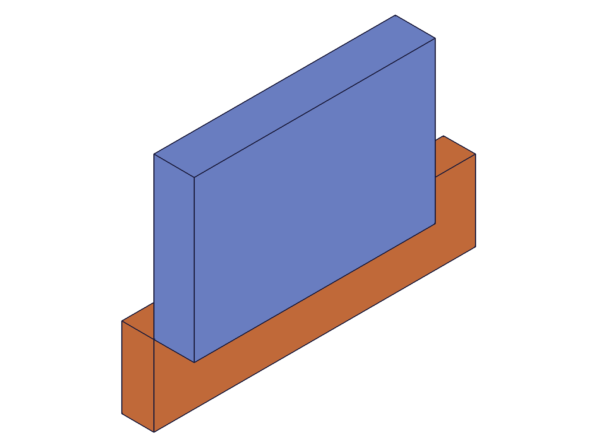
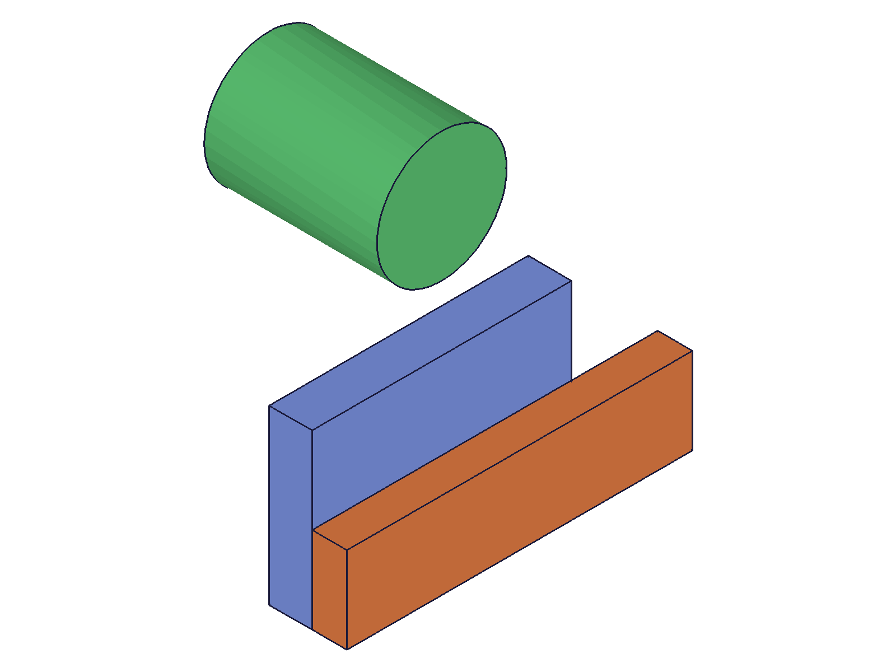
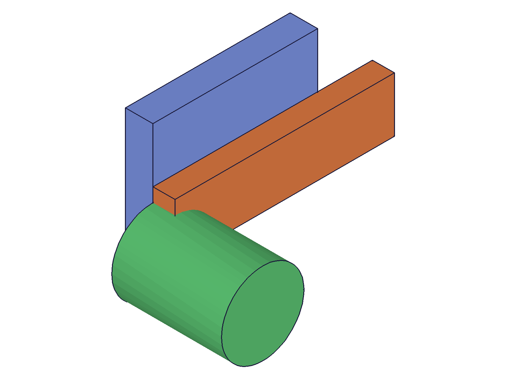
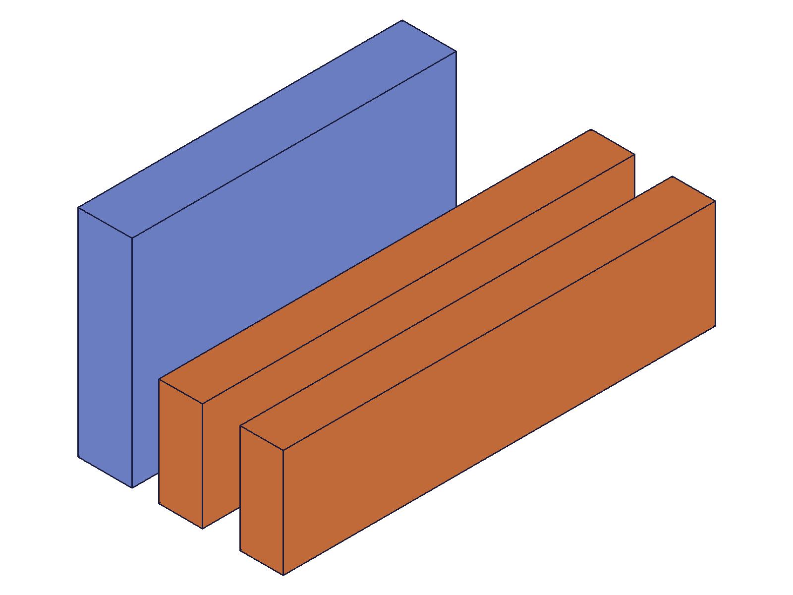

# Training: assembly.updateRevolute

**Date:** 2026-05-08

## Goal

Dedicated study of `v1.assembly.updateRevolute` — updating revolute constraints after creation, with full spatial verification.

**Methods to cover:**

- `updateRevolute` — param: id (constraint ID, required)
- `updateRevolute` params: name, zOffset, zRotationLimits (min/max), mate1 (path, csys, flip, reorient), mate2 (path, csys, flip, reorient)
- Spatial effect of zOffset update (COG measurement)
- Spatial effect of mate2 flip update (COG measurement)
- Spatial effect of mate2 reorient update with locked limits (COG measurement)
- Retargeting to different instance (mate path update) with spatial verification
- Csys-only update — does it change placement? (should be no, csys is irrelevant)
- Partial update preservation — unset params retained
- Partial limits on update (differs from create — allows min-only or max-only)
- Individual limit removal (null for one, preserve other)
- Batch update (array of param objects)
- Error cases: assembly ID vs constraint ID, invalid values, non-destructive failures

**Questions:**

- Does updating zOffset spatially shift inst2? → **Yes**, COG z shifts by exactly the offset (script 01)
- Does updating mate2 flip produce the expected rotation in COG? → **Yes**, z-components match creation (script 02)
- Can you update reorient and see the spatial effect when limits lock the joint? → **Yes**, matches creation behavior exactly (script 03)
- Can you retarget a constraint to a different instance? → **Yes**, new instance moves, old stays (script 05)
- Does updating csys alone change placement? → Not retested; prior session confirmed no (csys is irrelevant per revolute semantics)
- Are partial limits unique to update (not create)? → **Yes**, update allows min-only or max-only (script 06)
- Are failed updates non-destructive? → **Yes**, constraint survives all 6 error types (script 08)

---

## 01 — zOffset update (spatial verification)

Script: `scripts/01-zOffset-update.mjs` — ✅ zOffset update spatially shifts inst2 along Z.

|  |  |  |
|---|---|---|

**Data:** Local COG of Arm template: (40, 10, 4).

| zOffset | inst2 COG z | Expected z | Match |
|---------|-------------|------------|-------|
| 0 | 4 | 4 | ✓ |
| 25 | 29 | 4+25=29 | ✓ |
| -10 | -6 | 4-10=-6 | ✓ |

getRevolute confirms zOffset=-10 after final update. Returns constraint ID (216) on success, maxLevel 31.

**Learned:** zOffset update produces exact spatial shift along the revolute Z-axis. Negative values work. Return value is the constraint ID.
**📌 LLM doc:** zOffset update is exact and supports negative values.

---

## 02 — flip update (spatial verification)

Script: `scripts/02-flip-update.mjs` — ✅ Flip update rotates inst2 identically to creation.

|  |
|---|

**Data:** Local COG (40, 10, 4). Sequential flip updates via updateRevolute:

| flip | COG z | Expected z | Match |
|------|-------|------------|-------|
| Z (default) | 4 | 4 | ✓ |
| -Z | -4 | -4 | ✓ |
| X | 40 | 40 | ✓ |
| -X | -40 | -40 | ✓ |
| Y | 10 | 10 | ✓ |
| -Y | -10 | -10 | ✓ |

z-components match the revolute creation session exactly. x/y differ due to the free Z-rotation DOF (solver picks different default angle after update vs create — expected behavior). Name and zOffset preserved through all 6 flip updates.

**Learned:** Flip update produces the same spatial transformation as flip at creation. The free rotation DOF means x/y are indeterminate — only the z-component is invariant.
**📌 LLM doc:** Flip update same as creation. Partial update preserves name/zOffset.

---

## 03 — reorient update with locked limits (spatial verification)

Script: `scripts/03-reorient-update.mjs` — ✅ Reorient update produces correct Z-rotation when limits lock the joint.

|  |
|---|

**Data:** zRotationLimits locked at {min:0, max:0}. Sequential reorient updates:

| reorient | COG x | COG y | COG z | Rotation |
|----------|-------|-------|-------|----------|
| 0 | 40 | 10 | 4 | Identity |
| 90 | 10 | -40 | 4 | 90° CW around Z |
| 180 | -40 | -10 | 4 | 180° around Z |
| 270 | -10 | 40 | 4 | 270° CW around Z |

z stays at 4 in all cases — rotation purely around Z ✓. Matches revolute creation session exactly. Limits preserved ({min:0, max:0}) through all reorient updates.

**Learned:** Reorient update behaves identically to creation when limits lock the joint.

---

## 04 — partial update preservation

Script: `scripts/04-partial-preservation.mjs` — ✅ Partial updates reliably preserve all unset params.

**Data:** Created revolute with non-default values (mate1 flip=X reorient=90, mate2 flip=-Z reorient=180, zOffset=15, limits=-30deg/60deg).

After name-only update: all 12 fields verified preserved (mate1.flip/reorient/path/csys, mate2.flip/reorient/path/csys, zOffset, limits.min, limits.max) — all `true`.

After flip-only update on mate2: mate2.reorient=180 preserved, mate1.flip=X preserved, mate1.reorient=90 preserved, zOffset=15 preserved, name preserved.

**Learned:** Partial update is fully reliable. Mate sub-properties update independently — setting only `flip` preserves path, csys, and reorient within the same mate object.
**📌 LLM doc:** Partial update preserves ALL unset params including mate sub-properties.

---

## 05 — retarget to different instance (spatial verification)

Script: `scripts/05-retarget-instance.mjs` — ✅ Can retarget a revolute to a completely different instance.

|  |  |
|---|---|

**Data:**
- Before retarget: Arm COG (40, 10, 14), Cylinder COG (0, 100, 20)
- After retarget mate2 to Cylinder: Arm COG (40, 10, 14) **unchanged**, Cylinder COG (0, 0, 30)
- Cylinder local COG ≈ (0, 0, 20). With zOffset=10: z = 20 + 10 = 30 ✓
- Cylinder moved from (0, 100, 20) to (0, 0, 30) — pulled to inst1's origin + zOffset
- Arm stayed at its last constrained position — the solver doesn't reset unconstrained instances

getRevolute shows mate2.path changed to [281] (inst3). zOffset=10 preserved.

**Learned:** Retargeting works by updating mate2.path and mate2.csys together. The new target instance is positioned by the constraint. The old target stays at its last solved position.
**📌 LLM doc:** Retarget by updating mate path + csys. Old target stays in place. New target moves to satisfy constraint.

---

## 06 — partial limits (unique to updateRevolute)

Script: `scripts/06-partial-limits.mjs` — ✅ Partial limits ALLOWED on update (differs from create!).

**Data:**

| Case | Input | Result | Preserved |
|------|-------|--------|-----------|
| min-only (no existing) | `{ min: '-90deg' }` | min=-π/2, max=null | ✓ |
| max-only (min exists) | `{ max: '180deg' }` | min=-π/2, max=π | min preserved ✓ |
| update min alone | `{ min: '-45deg' }` | min=-π/4, max=π | max preserved ✓ |
| remove max only | `{ max: null }` | min=-π/4, max=null | min preserved ✓ |
| remove min only | `{ min: null }` | min=null, max=null | ✓ |
| remove both | `null` | min=null, max=null | ✓ |
| empty object `{}` | `{}` | **ERROR** maxLevel=51 | "The object 'zRotationLimits' is empty!" |

**Learned:** CRITICAL difference from `revolute` (create): `updateRevolute` allows partial zRotationLimits — set/change min or max individually. On create, partial limits error. Empty `{}` errors on both create and update.
**📌 LLM doc:** Partial limits allowed on update only. Individual removal via null. Empty {} errors.

---

## 07 — batch update (spatial verification)

Script: `scripts/07-batch-update.mjs` — ✅ Batch update works with spatial verification.

|  |
|---|

**Data:** Batch updated two constraints: `updateRevolute([{ id: rev1, name: 'BatchHinge1', zOffset: 15 }, { id: rev2, name: 'BatchHinge2', zOffset: 30, ... }])`.
- Result: `[218, 222]` — array of constraint IDs ✓
- Hinge1: name='BatchHinge1', zOffset=15 → inst2 COG z=19 (4+15=19) ✓
- Hinge2: name='BatchHinge2', zOffset=30, limits=±45deg → inst3 COG z=34 (4+30=34) ✓

**Learned:** Batch update supported. Pass array of param objects, returns array of constraint IDs. Each constraint updated independently.
**📌 LLM doc:** Batch update: array in, array out.

---

## 08 — error cases (non-destructive failures)

Script: `scripts/08-errors.mjs` — ✅ All error cases clear and non-destructive.

**Error catalog:**

| Case | Message | Code |
|------|---------|------|
| Assembly ID not constraint ID | "The provided id for the constraint is not a constraint or relation." | 1007 |
| Nonexistent ID | "ToId()/TOID() didn't get an existing or valid id." | 1006 |
| Invalid flip value | "Type 'INVALID' is not supported to use as flip type." | 1013 |
| Invalid reorient value | "Type '45' is not supported to use as reorient type." | 1013 |
| Missing `id` | "'id' must be provided for update." | 1004 |
| Invalid csys ID | "ToId()/TOID() didn't get an existing or valid id." | 1006 |

Constraint survived all 6 error attempts: name='Hinge', zOffset=10, flip='Z' — all unchanged. COG unchanged at (40, 10, 14).

**Learned:** Failed updates are non-destructive. Error messages are clear (unlike some create errors). Key difference: `id` must be the constraint ID, not the assembly ID.
**📌 LLM doc:** Error catalog. Non-destructive failures. id = constraint ID (code 1007 if wrong).
