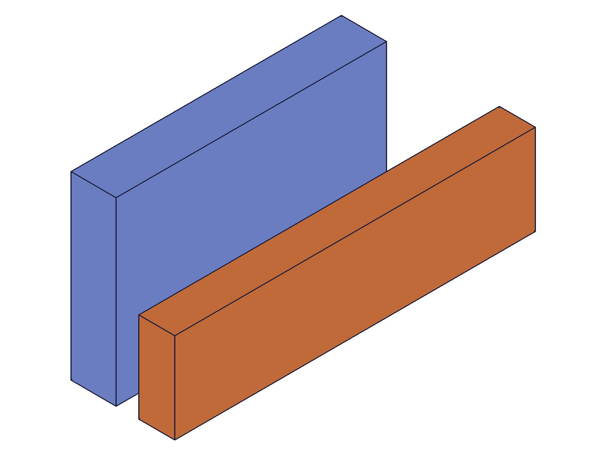

# Training: assembly.getRevolute

**Date:** 2026-05-08

## Goal

Testing `v1.assembly.getRevolute` — querying revolute constraints by name.

**Methods to cover:**

- `getRevolute` — params: id (assembly or instance), name (constraint name)
- Return structure: id, name, mate1/mate2 (path, csys, flip, reorient), zOffset, zRotationLimits
- Batch query: pass array of params

**Questions:**

- Does getRevolute return all fields from the created constraint accurately?
- What happens when querying a non-existent name? (expected: result=null, maxLevel=51)
- Does the return reflect updates made via updateRevolute?
- Can you query by instance ID in addition to assembly ID?
- What does a batch query (array of params) return?
- How are degree string zRotationLimits returned? (expected: as radians)
- What happens with duplicate-named constraints?

---

## 01 — basic getRevolute

Script: `scripts/01-basic-get.mjs` — ✅ All fields returned correctly.

|  |
|---|

**Data:** Created revolute with zOffset=15, zRotationLimits min=-45deg/max=90deg. getRevolute returned:
- `id: 216` (matches created ID ✓)
- `name: 'Hinge1'` ✓
- `zOffset: 15` ✓
- `zRotationLimits: { min: -0.7854, max: 1.5708 }` — degree strings converted to radians ✓
- `mate1/mate2: { path: [instId], csys: wcsId, flip: 'Z', reorient: '0' }` — defaults filled ✓
- `maxLevel: 31` (info, success)

See `files/01-basic-get-getRevolute-result.json`.

**Learned:** getRevolute returns the complete constraint state. Degree strings are stored as radians. Default flip/reorient are 'Z'/'0'.

---

## 02 — non-existent name

Script: `scripts/02-nonexistent-name.mjs` — ✅ As expected, all failures return null/51.

**Data:** Tested three failure cases:
- Non-existent name `'DoesNotExist'`: result=null, maxLevel=51, error: "There couldn't be found a constraint with name..."
- Empty name `''`: result=null, maxLevel=51
- Wrong constraint type (fastenedOrigin named `'Ground'`): result=null, maxLevel=51

See `files/02-nonexistent-name-nonexistent.json`, `-empty-name.json`, `-wrong-type.json`.

**Learned:** getRevolute only finds revolute constraints. A fastenedOrigin with the queried name is NOT returned — it's type-specific.

---

## 03 — after update

Script: `scripts/03-after-update.mjs` — ✅ getRevolute reflects all update changes.

**Data:**
- Before: zOffset=0, limits={min:null,max:null}, flip='Z'
- After updateRevolute (name='RenamedRev', zOffset=25, limits=-30deg/60deg, flip='-Z'): all reflected in getRevolute
- Old name `'MyRev'` → result=null, maxLevel=51 (immediately unfindable)

See `files/03-after-update-before-after-update.json`.

**Learned:** getRevolute is a live view of the constraint state. Rename takes effect immediately — old name cannot be queried.

---

## 04 — batch query

Script: `scripts/04-batch-query.mjs` — ✅ Batch returns array of results.

**Data:**
- Passed array of 3 queries: [Rev1, Rev2, NonExistent]
- result: array of 3 entries. First two are full constraint objects, third is null.
- maxLevel: 51 (worst-of-all — one failure contaminates the envelope)
- batch[0]: name=Rev1, zOffset=10; batch[1]: name=Rev2, zOffset=20; batch[2]: undefined (null)

See `files/04-batch-query-batch-query-full.json`.

**Learned:** Batch query works as expected. Returns Array<result|null>. maxLevel is the worst across all items.
**📌 LLM doc:** Document batch query behavior.

---

## 05 — query by instance ID

Script: `scripts/05-query-by-instance.mjs` — ⚠️ Doc discrepancy: only assembly root ID works.

**Data:**
- By assembly ID (asmId): result.id=216, maxLevel=31 ✓
- By inst1 ID (mate1 instance): result=null, maxLevel=51 ❌
- By inst2 ID (mate2 instance): result=null, maxLevel=51 ❌
- By template ID: result=null, maxLevel=51 ❌

See `files/05-query-by-instance-id-variants.json`.

**Learned:** Despite docs saying "id of the product or instance", only the assembly root ID works. Instance IDs and template IDs return null/error.
**📌 LLM doc:** Document that only assembly root ID works for `id` param, despite docs suggesting instance/product IDs.

---

## 06 — duplicate names

Script: `scripts/06-duplicate-names.mjs` — ✅ Returns the first constraint with that name.

**Data:**
- Created rev1 (id=309, zOffset=10) and rev2 (id=313, zOffset=20), both named 'SameName'
- getRevolute returned rev1 (id=309, zOffset=10)

See `files/06-duplicate-names-duplicate-names.json`.

**Learned:** Duplicate names silently succeed. getRevolute returns the first-created constraint with that name. No error or warning.

---

## 07 — no limits and flip/reorient

Script: `scripts/07-no-limits-returned.mjs` — ✅ No limits returns `{ min: null, max: null }`, not null.

**Data:**
- No limits: `zRotationLimits: { min: null, max: null }` — the object exists but both values are null
- `limits === null` → false — it's NOT null itself, it's an object with null fields
- With flip='-Z', reorient='180', limits locked at 0/0: correctly returned as `-Z`, `180`, `{ min: 0, max: 0 }`

See `files/07-no-limits-returned-no-limits.json`, `-with-flip-reorient.json`.

**Learned:** No-limits is `{ min: null, max: null }` not null. Flip/reorient strings returned as-is.
**📌 LLM doc:** Document no-limits representation.
