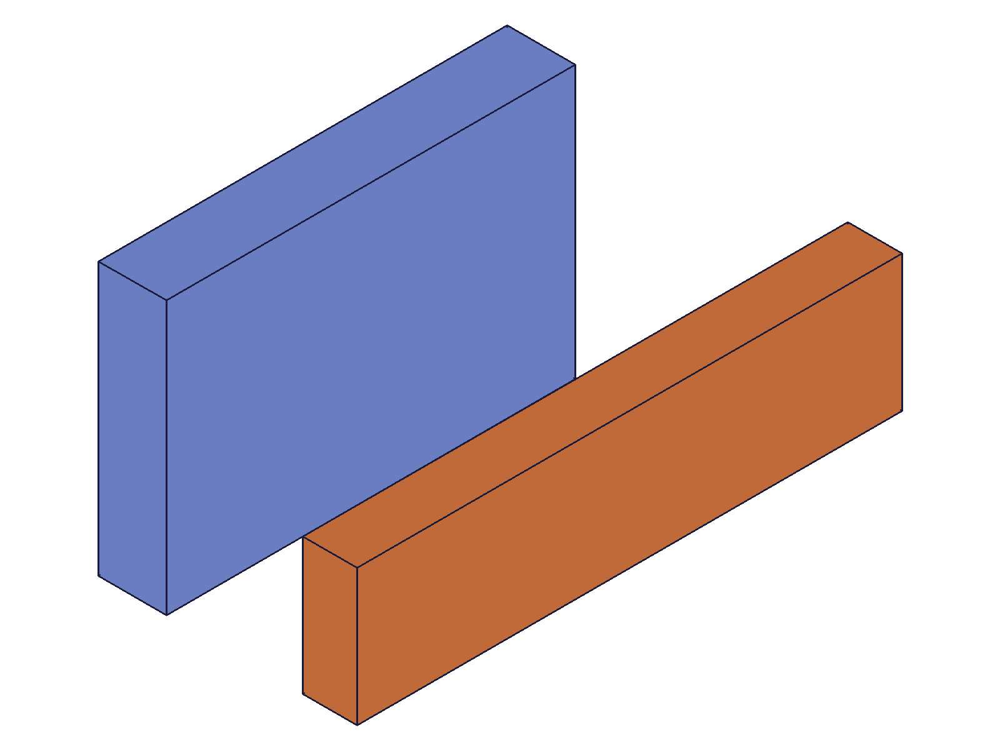

# Training: assembly.cylindrical

**Date:** 2026-05-08

## Goal

Testing `v1.assembly.cylindrical` — the cylindrical joint constraint (2 DOF: rotation + translation along shared Z-axis).

**Methods to cover:**

- `cylindrical` — create a cylindrical constraint between two instances via mate1/mate2
- `cylindrical` params: id (assembly), name, mate1 (path, csys, flip, reorient), mate2 (path, csys, flip, reorient), zOffsetLimits (min, max), zRotationLimits (min, max)
- Basic `getCylindrical` — verify constraint state readback
- Basic `updateCylindrical` — confirm update works (dedicated study later)

**Questions:**

- Does cylindrical align inst2 to inst1's origin like revolute/fastened? → **Yes for X,Y; Z is a free DOF and preserves initial position** (script 01)
- What 2 DOF does it leave free? → **Rotation around Z + translation along Z** (scripts 01, 11)
- How do zOffsetLimits constrain the translation range? → **Clamps initial z-position to [min, max]. Below min → clamped to min, above max → clamped to max, within → preserved** (script 08)
- How do zRotationLimits constrain the rotation range? → **Same as revolute — stored in radians, degree strings accepted** (scripts 03, 04)
- How do flip and reorient work? → **Identical to revolute/fastened** (scripts 05, 06)
- Do degree strings work for zRotationLimits like in revolute? → **Yes** (script 04)
- What errors occur with invalid params? → **Same error patterns as revolute** (script 07)
- Spatial verification: measure COG before/after constraint → **Done in every script**

---

## 01 — basic cylindrical (grounded)

Script: `scripts/01-basic-cylindrical.mjs` — ✅ Cylindrical created (ID 276, maxLevel 31).

|  |  |
|---|---|

**Data:**
- inst1 COG: (30, 20, 5) → (30, 20, 5) — grounded, unchanged ✓
- inst2 COG: (140, 60, 34) → (40, 10, 34) — X,Y moved to inst1's origin, **Z stayed at 34**

inst2 started at transformation [100, 50, 30]. After cylindrical, X,Y were constrained (moved to 0, 0), but Z preserved the initial offset of 30 (COG 30+4=34). This is the 2 DOF behavior: X,Y locked (shared axis), Z-translation free.

getCylindrical returns: `zOffsetLimits: { min: null, max: null }, zRotationLimits: { min: null, max: null }` — both DOFs unconstrained.

**Learned:** Cylindrical aligns X,Y like fastened/revolute but preserves the initial Z-offset because Z-translation is a free DOF.
**📌 LLM doc:** Alignment semantics differ from revolute — Z is free, not locked. Initial Z position comes from instance transformation.

---

## 02 — zOffsetLimits clamping

Script: `scripts/02-zOffsetLimits.mjs` — ✅ zOffsetLimits constrain Z-translation.

**Data:** inst2 started at z=50, limits {min:10, max:30}. COG z after: 34 ≈ 30(clamped to max) + 4(local). Clamped correctly.

getCylindrical confirms: `zOffsetLimits: { min: 10, max: 30 }`.

**Learned:** zOffsetLimits clamp the instance's z-offset to the specified range.
**📌 LLM doc:** zOffsetLimits clamping behavior.

---

## 03 — zRotationLimits + degree strings (partial failure)

Script: `scripts/03-zRotationLimits.mjs` — ⚠️ First test passed, second test failed due to calling `assembly.create()` twice in same script (invalidates first drawing).

**Data:** First cylindrical with both limits succeeded (maxLevel 31). inst2 at z=20, within 15..25 range → preserved (COG z=24). Second test with degree strings failed because `assembly.create()` cleared the drawing context.

**Learned:** Don't call `assembly.create()` twice in the same script — it clears the drawing.

---

## 04 — degree strings (dedicated test)

Script: `scripts/04-deg-strings.mjs` — ✅ Degree strings work for zRotationLimits.

**Data:** `{ min: '-45deg', max: '90deg' }` → getCylindrical returns `{ min: -0.7854, max: 1.5708 }` (radians).

**Learned:** Degree strings are converted to radians on storage, same as revolute.

---

## 05 — flip values

Script: `scripts/05-flip.mjs` — ✅ All 6 flip values work, COGs match revolute pattern.

**Data (all at zOffsetLimits locked at 20, local COG is (40, 10, 4)):**

| flip | COG | Effect |
|------|-----|--------|
| `Z` | (40, 10, 24) | Identity |
| `-Z` | (40, -10, 16) | 180° around X |
| `X` | (-4, 10, 60) | 90° around Y |
| `-X` | (4, 10, -20) | -90° around Y |
| `Y` | (40, -4, 30) | -90° around X |
| `-Y` | (40, 4, 10) | 90° around X |

**Learned:** Flip behavior identical to revolute/fastened. The flip determines which local axis aligns with the constraint Z-axis.

---

## 06 — reorient values

Script: `scripts/06-reorient.mjs` — ✅ Reorient invisible with free rotation, visible with locked rotation.

**Data (free rotation):** All reorient values give identical COG (40, 10, 24). Free rotation DOF absorbs the offset.

**Data (locked zRotationLimits: {min:0, max:0}):**

| reorient | COG |
|----------|-----|
| `'0'` | (40, 10, 24) |
| `'90'` | (10, -40, 24) |
| `'180'` | (-40, -10, 24) |
| `'270'` | (-10, 40, 24) |

Z stays at 24 in all cases — reorient only affects rotation, not Z-offset.

**Learned:** Identical to revolute. Reorient only observable when zRotationLimits lock the joint.

---

## 07 — error cases

Script: `scripts/07-errors.mjs` — ✅ All error patterns match revolute.

| Error | maxLevel | Code | Message |
|-------|----------|------|---------|
| Missing mate2 | 51 | 0 | PrepareAPIParams error |
| Missing csys | 51 | 0 | PrepareAPIParams error |
| Invalid flip `'Q'` | 51 | 1013 | "not supported to use as flip type" |
| Invalid reorient `'45'` | 51 | 1013 | "not supported to use as reorient type" |
| Missing id | 51 | 1004 | "'id' must be provided to create CC_CylindricalConstraint" |
| Duplicate name | 31 | — | Silently succeeds (two separate IDs) |
| Same instance both mates | 51 | 1014 | "mate1 and mate2 cannot be used in this combination...probably belong to the same rigid set" |

**Learned:** Same-instance error (1014) gives helpful message about rigid sets.
**📌 LLM doc:** Error codes and messages.

---

## 08 — zOffsetLimits clamping edge cases

Script: `scripts/08-zOffset-clamping.mjs` — ✅ All clamping scenarios verified.

**Data:**

| Scenario | Start z | Limits | Result COG z | Expected |
|----------|---------|--------|-------------|----------|
| Below min | 5 | 20..40 | 24.001 | 24 (20+4) ✓ |
| Within range | 30 | 20..40 | 34 | 34 (30+4) ✓ |
| Above max | 60 | 20..40 | 43.999 | 44 (40+4) ✓ |
| Min-only | 5 | min=20 | 24.001 | 24 (20+4) ✓ |
| Negative | -30 | -20..-10 | -16 | -16 (-20+4) ✓ |

**Learned:** Partial limits work on create (omitting max). Negative limits work. Clamping is precise to ≈0.001.
**📌 LLM doc:** Clamping behavior, partial limits, negative limits.

---

## 09 — basic updateCylindrical

Script: `scripts/09-basic-update.mjs` — ✅ Update works identically to updateRevolute.

**Data:**
- Added zOffsetLimits {30, 50}: inst2 z moved from 20 to 30 (clamped to min) → COG z 34 ✓
- Added zRotationLimits: success ✓
- Renamed: getCylindrical finds new name, old name returns null ✓
- Removed limits with `{min: null, max: null}`: both cleared ✓
- Wrong ID (assembly not constraint): error 1007 + 1004 ✓

**Learned:** True partial update. Uses constraint ID, not assembly ID. Rename immediately takes effect.
**📌 LLM doc:** Basic update behavior.

---

## 10 — getCylindrical edge cases

Script: `scripts/10-getCylindrical.mjs` — ✅ Same behavior as getRevolute.

**Data:**

| Query by | Result |
|----------|--------|
| Assembly root ID | found ✓ |
| Instance ID | NOT FOUND (maxLevel 51) |
| Template ID | NOT FOUND (maxLevel 51) |
| Non-existent name | null (maxLevel 51) |
| Empty name | null (maxLevel 51) |
| Wrong constraint type | NOT FOUND (maxLevel 51) |
| Batch (1 valid + 1 invalid) | [found, null], maxLevel 51 |

**Learned:** Assembly root ID only. Instance/template IDs fail despite docs saying "product or instance." Batch contamination: one null makes maxLevel 51.
**📌 LLM doc:** ID requirement, failure cases, batch behavior.

---

## 11 — free DOF verification + zOffset param

Script: `scripts/11-free-dof-verify.mjs` — ✅ Two key findings.

**Data:**
1. `zOffset: 25` passed to cylindrical → silently ignored (no error, no effect). getCylindrical returns no `zOffset` field, only `zOffsetLimits`. COG unchanged at z=24 (initial z=20+4).
2. Free DOF: inst3 at z=35 → COG z=39 (35+4). Z-offset fully preserved with no limits.

**Learned:** Cylindrical does NOT have a `zOffset` parameter (unlike revolute). The `zOffset` param is silently ignored. The Z-translation DOF is free — initial position from transformation is preserved.
**📌 LLM doc:** CRITICAL — no zOffset, only zOffsetLimits. Key structural difference from revolute.

---

## 12 — batch create

Script: `scripts/12-batch-create.mjs` — ✅ Batch create works, returns array of IDs.

**Data:** Batch of 2 cylindrical constraints → [218, 222]. Both instances correctly positioned within their zOffsetLimits ranges.

---

## Coverage Checklist

- [x] API called successfully (script 01)
- [x] Every required parameter tested (id, mate1, mate2)
- [x] Key optional parameters: name, zOffsetLimits, zRotationLimits, flip, reorient
- [x] Every flip value exercised (script 05)
- [x] Every reorient value exercised (script 06)
- [x] updateCylindrical tested (script 09)
- [x] getCylindrical tested (script 10)
- [x] Realistic usage with grounding + spatial verification (all scripts)
- [x] Behavioral claims verified with COG data AND snapshots
- [x] Every goal question answered with named script
- [x] Spatial claims backed by calculateMassProperties
