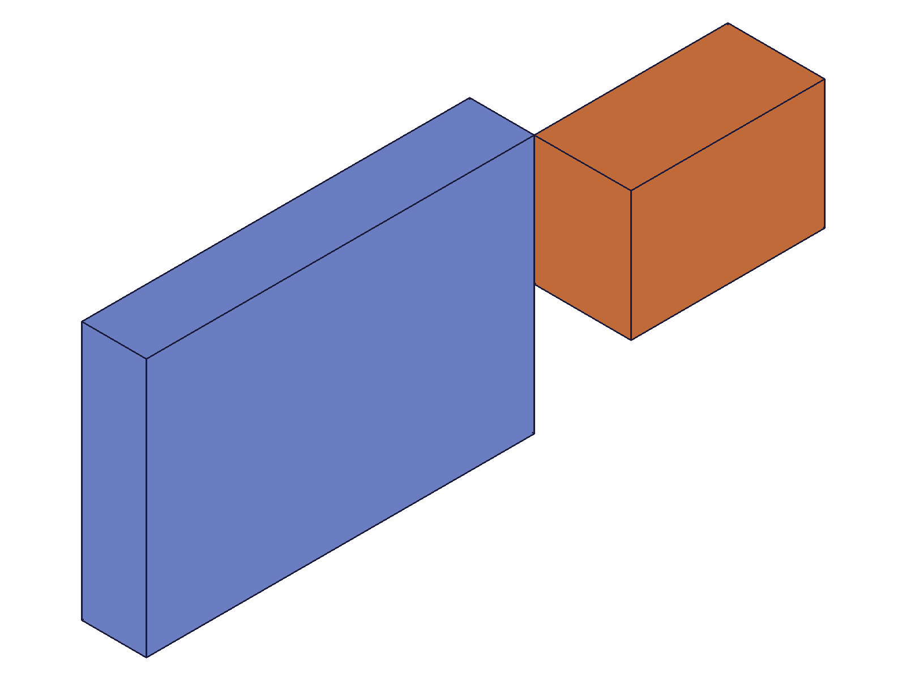
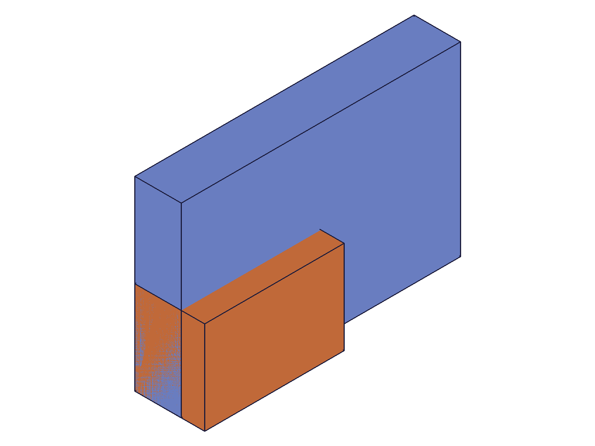

# Training: assembly.planar

**Date:** 2026-05-08

## Goal

Testing `v1.assembly.planar` — the planar constraint (3 DOF: X-translation, Y-translation, Z-rotation).

**Methods to cover:**

- `planar` — basic creation with mate1/mate2 pattern
- `planar` params: id, name, mate1, mate2, zOffset, xOffsetLimits, yOffsetLimits, zRotationLimits
- mate sub-params: path, csys, flip, reorient
- Spatial verification: COG measurements before/after constraint application

**Questions:**

- What are the 3 free DOFs? Does the solver preserve initial X/Y offsets like cylindrical preserves Z? → **No. Script 10: initial placement x=25,y=30 within limits [10,50]x[5,60] → solver reset to x≈10,y≈5 (min). Free DOFs default to 0, not preserved.**
- How does zOffset work — fixed like revolute, or is it a limit? → **Fixed, like revolute. Script 02: zOffset=25 → inst2 z=25 exactly.**
- How do xOffsetLimits and yOffsetLimits interact with initial instance placement? → **Scripts 03,04,10,11: solver defaults free DOF to 0, then clamps to [min,max]. Initial position irrelevant.**
- Does flip work identically to revolute/fastened? → **Yes. Script 06: flip Z/-Z/X produce same orientation shifts as revolute.**
- Does reorient require locked limits to be visible (like revolute)? → **Yes. Script 07: reorient=90 invisible with free rotation, visible with locked zRotationLimits.**
- What happens with same-instance mate1/mate2? → **Script 09: error 1014 "same rigid set".**
- What happens with missing required params? → **Script 09: missing mate2 → PrepareAPIParams error; missing csys → error 1004; bad flip → error 1013; bad reorient → error 1013.**

---

## 01 — basic planar creation

Script: `scripts/01-basic-planar.mjs` — ✅ Creates constraint, moves inst2 to origin.

|  |  |
| --- | --- |

**Data:** inst2 COG before: (65, 40, 27.5) → after: (15, 10, 7.5). World origin moved from (50,30,20) to (0,0,0). Change: x=-50, y=-30, z=-20 (see `files/01-basic-planar-cog-comparison.json`).

**Learned:** With no offsets or limits, planar moves inst2 to inst1's origin — same as fastened/revolute. All 3 free DOFs (x, y, rotation) default to 0.
**📌 LLM doc:** Alignment semantics — free DOFs default to 0, not preserved from initial placement.

## 02 — zOffset

Script: `scripts/02-zOffset.mjs` — ✅ zOffset=25 places inst2 at z=25.

**Data:** inst2 COG (15, 10, 32.5) → world origin (0, 0, 25). z=25 exactly as specified (see `files/02-zOffset-zOffset-25.json`).

**Learned:** zOffset is a fixed Z constraint, same as revolute. X/Y still default to 0.
**📌 LLM doc:** zOffset is fixed, not a range.

## 03 — xOffsetLimits

Script: `scripts/03-xOffsetLimits.mjs` — ✅ xOffsetLimits {min:10, max:30} clamps x to min.

**Data:** inst2 world origin x≈10.001 (see `files/03-xOffsetLimits-xLimits-A.json`). Free DOF defaults to 0, clamped up to min=10.

**Learned:** xOffsetLimits clamp the default-0 position. Solver epsilon ~0.001.
**📌 LLM doc:** Limits clamp from default=0, not from initial placement.

## 04 — yOffsetLimits

Script: `scripts/04-yOffsetLimits.mjs` — ✅ yOffsetLimits {min:15, max:40} clamps y to min.

**Data:** inst2 world origin y≈15.001 (see `files/04-yOffsetLimits-yLimits.json`). Same clamping pattern as x.

## 05 — zRotationLimits locked at 45deg

Script: `scripts/05-zRotationLimits.mjs` — ✅ Locks rotation at 45°, verified by COG rotation.

**Data:** Template B (80x20x15) local COG = (40, 10, 7.5). At 45° rotation around Z + zOffset=15: expected COG = (40cos45-10sin45, 40sin45+10cos45, 7.5+15) = (21.21, 35.36, 22.5). Observed: (21.213, 35.355, 22.5) ✓ (see `files/05-zRotationLimits-rotation-locked-45.json`).

**Learned:** zRotationLimits work identically to revolute. Degree strings accepted.
**📌 LLM doc:** zRotationLimits — same as revolute, degree strings supported.

## 06 — flip

Script: `scripts/06-flip.mjs` — ✅ Flip values Z/-Z/X produce expected orientation shifts.

**Data:** Template B (40x25x30), local COG (20, 12.5, 15), zOffset=15.
- flip=Z: COG (20, 12.5, 30) → world origin (0,0,15) ✓
- flip=-Z: COG (20, -12.5, ~0) → 180° around X then zOffset ✓
- flip=X: COG (-15, 12.5, 35) → -90° around Y then zOffset ✓

(see `files/06-flip-flip-comparison.json`)

**Learned:** Flip behavior identical to revolute/fastened.

## 07 — reorient

Script: `scripts/07-reorient.mjs` — ✅ Reorient invisible with free rotation, visible with locked limits.

**Data:** Template B (80x20x15) local COG = (40, 10, 7.5), zOffset=15.
- Free rotation + reorient=90: COG (40, 10, 22.5) — identical to no-reorient baseline
- Locked rotation + reorient=90: COG (10, -40, 22.5) — 90° CW around Z applied
- Locked rotation + no reorient: COG (40, 10, 47.5) — no rotation, z=40+7.5

(see `files/07-reorient-reorient-comparison.json`)

**Learned:** Reorient behavior identical to revolute.

## 08 — combined limits

Script: `scripts/08-combined-limits.mjs` — ✅ All params work together correctly.

**Data:** xOffsetLimits=[20,60], yOffsetLimits=[10,50], zOffset=12, zRotationLimits=[0,0]. inst2 world origin: (20.001, 10.001, 12) — x/y clamped to min, z fixed at zOffset (see `files/08-combined-limits-combined.json`).

## 09 — error cases

Script: `scripts/09-error-cases.mjs` — ✅ All errors match revolute/cylindrical patterns.

**Data (see `files/09-error-cases-error-cases.json`):**
- Same instance: error 1014 "same rigid set"
- Missing mate2: "Evaluation error in AbstractAPI.PrepareAPIParams"
- Missing csys: error 1004 "'csys' must be provided"
- Invalid flip 'W': error 1013 "not supported as flip type"
- Invalid reorient '45': error 1013 "not supported as reorient type"

## 10 — initial placement within valid limits

Script: `scripts/10-limits-within-range.mjs` — ✅ (Surprising) Initial placement NOT preserved.

**Data:** inst2 placed at x=25, y=30 within limits [10,50]x[5,60]. After constraint: world origin x≈10.001, y≈5.001 → clamped to min, not preserved (see `files/10-limits-within-range-within-range.json`).

**Learned:** Unlike cylindrical (which preserves initial Z-offset), planar does NOT preserve initial X/Y position. All free DOFs default to 0 regardless of initial placement.
**📌 LLM doc:** Critical difference from cylindrical — planar free DOFs always default to 0.

## 11 — negative limits

Script: `scripts/11-negative-limits.mjs` — ✅ Negative limits work, clamps to nearest valid value.

**Data:** Limits x=[-30,-10], y=[-50,-20]. Default=0 > max, so clamped to max: x≈-10.001, y≈-20.001 (see `files/11-negative-limits-negative-limits.json`).

**Learned:** When default(0) exceeds max, clamps to max (nearest valid bound).

## 12 — batch creation and duplicate names

Script: `scripts/12-batch-and-dupes.mjs` — ✅ Batch returns array, duplicates silently allowed.

**Data:** Batch result [218, 222]. Both named 'Planar1'. getPlanar returns first (218). (see `files/12-batch-and-dupes-batch-dupes.json`)

**Learned:** Same pattern as revolute/cylindrical.
