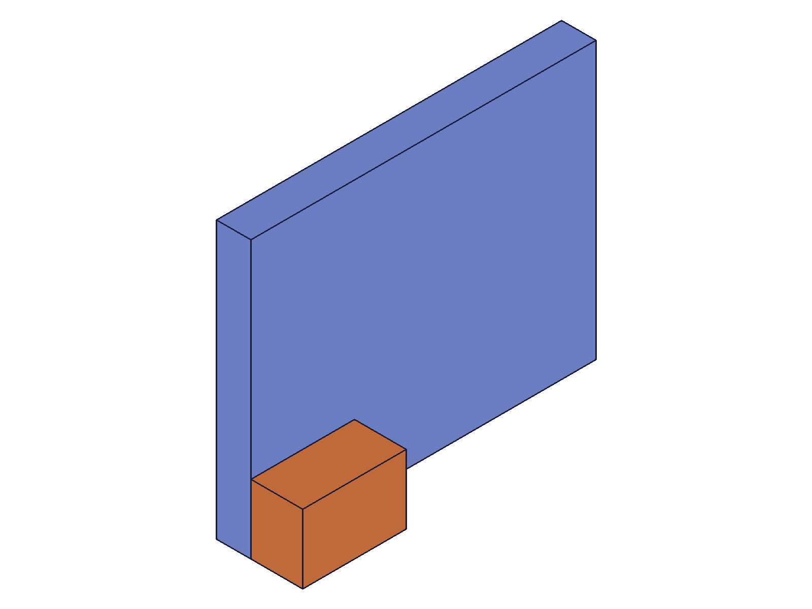
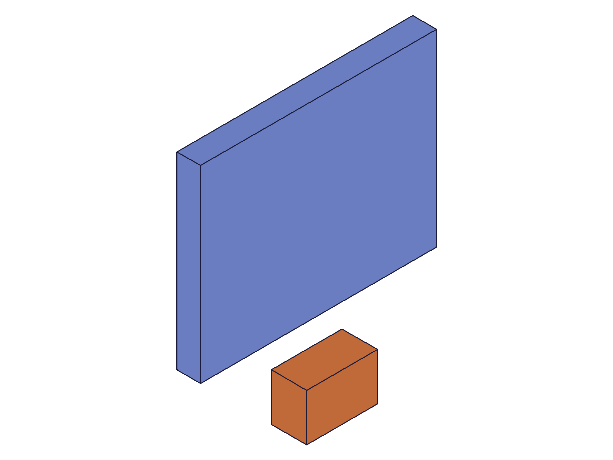
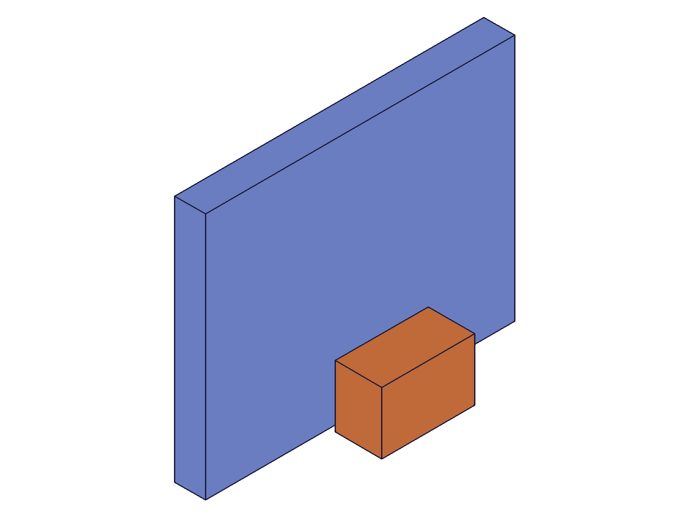
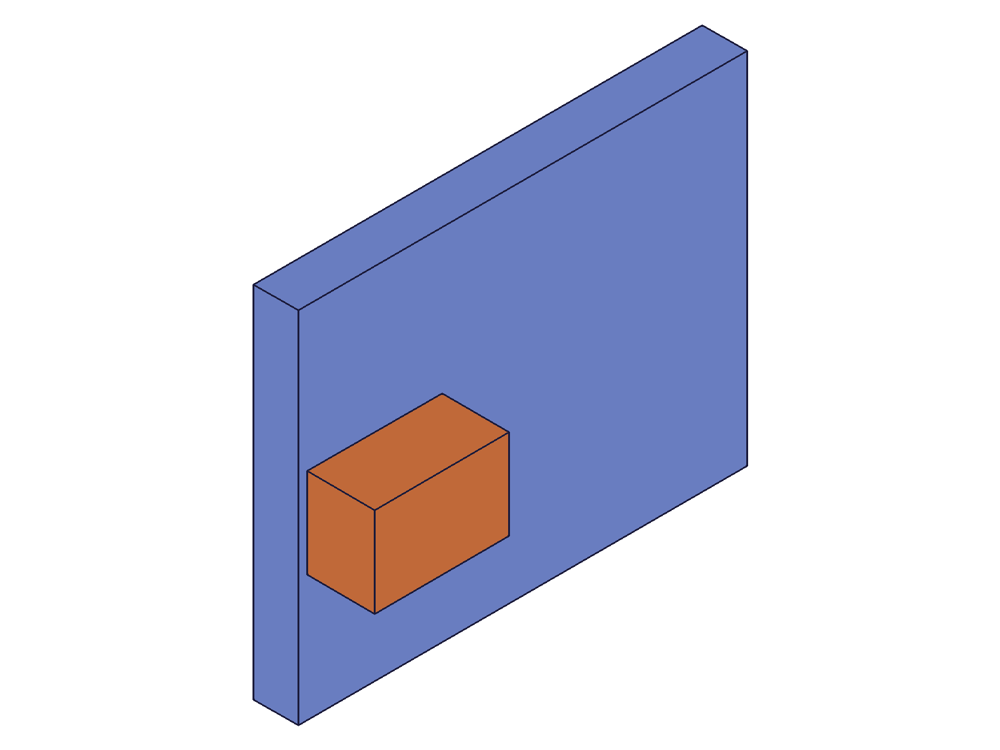
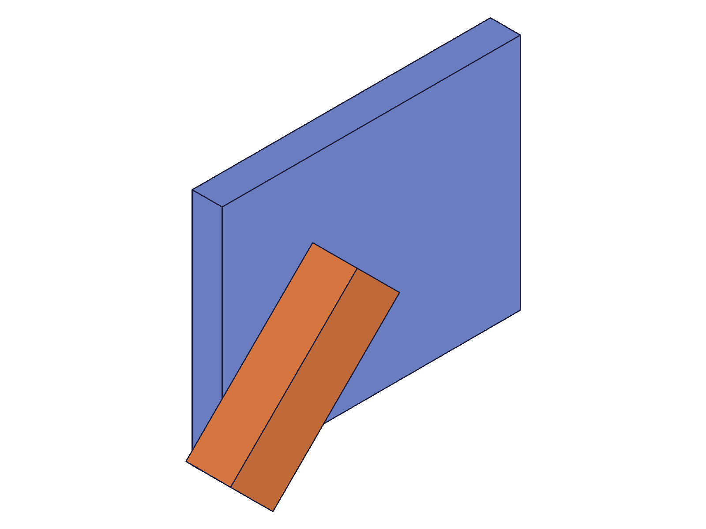
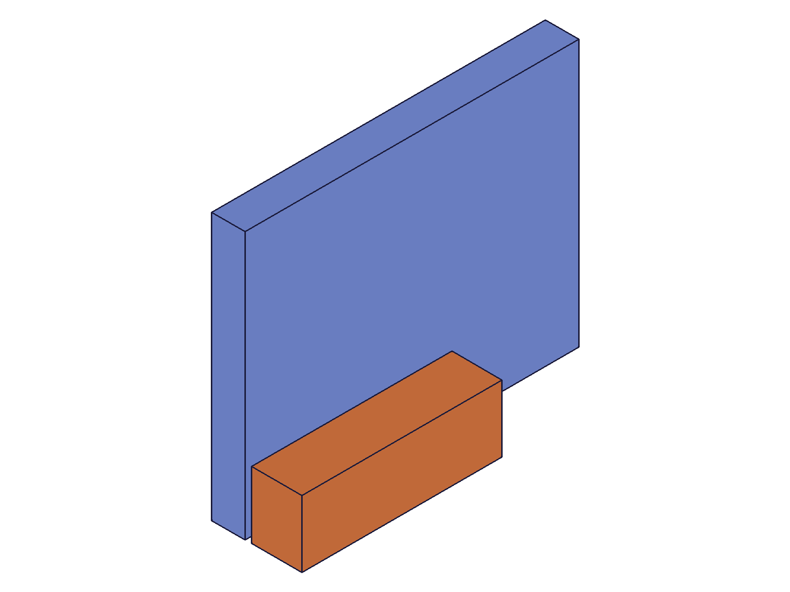
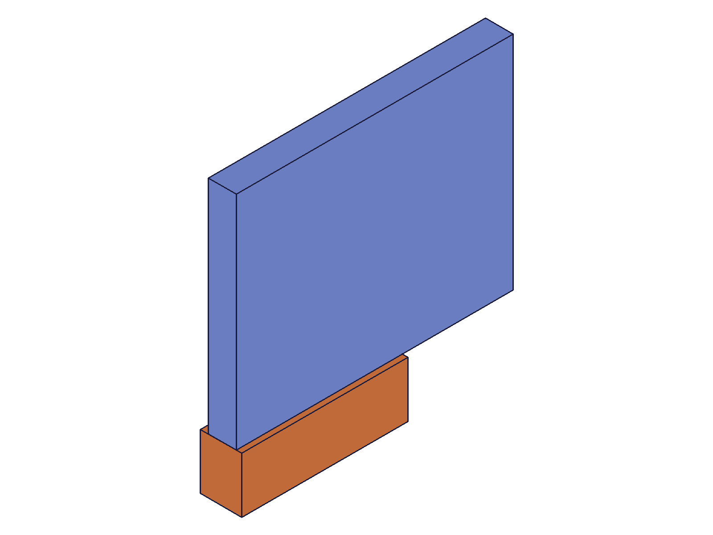
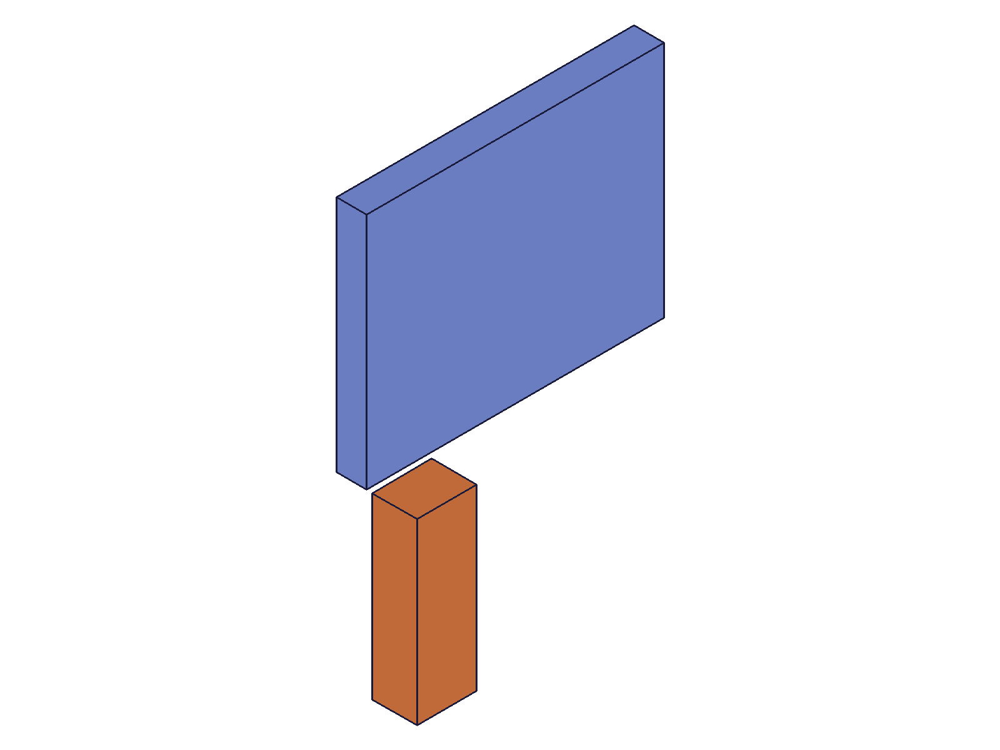
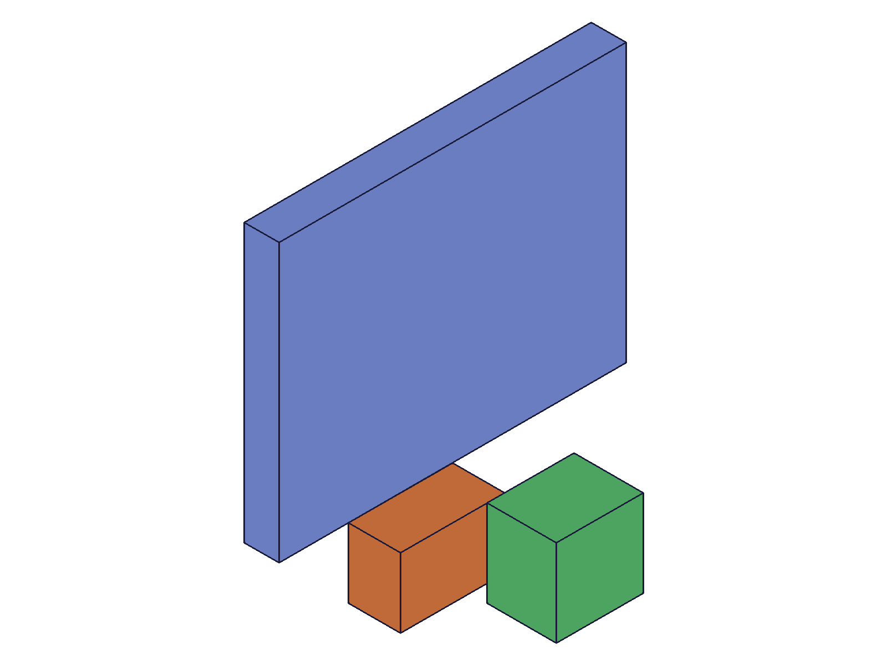

# Training: assembly.updatePlanar + assembly.getPlanar

**Date:** 2026-05-08

## Goal

Testing `v1.assembly.updatePlanar` and `v1.assembly.getPlanar` — modifying and querying planar constraints after creation.

**Methods to cover:**

- `updatePlanar` — partial update of an existing planar constraint
- `updatePlanar` params: id (constraint ID), name, mate1, mate2, zOffset, xOffsetLimits, yOffsetLimits, zRotationLimits
- `getPlanar` — query constraint by name
- `getPlanar` params: id (assembly/product ID), name

**Questions:**

- Does updatePlanar support true partial updates (unspecified params preserved)?
- Does `id` refer to the constraint ID (like updateRevolute) or the assembly ID?
- Can we update zOffset and see inst2 move along Z?
- Can we add/remove/change xOffsetLimits, yOffsetLimits, zRotationLimits?
- Can we remove limits by passing `{ min: null, max: null }`?
- Can we rename the constraint via updatePlanar?
- Can we swap mate1/mate2 mates?
- Does getPlanar return all fields (zOffset, limits, flip, reorient)?
- Does getPlanar reflect changes made by updatePlanar immediately?
- Does getPlanar return null for non-existent names?
- Does batch updatePlanar work (array of params)?
- What error do we get passing the assembly ID instead of constraint ID?

---

## 01 — basic updatePlanar (zOffset change)

Script: `scripts/01-basic-update-zOffset.mjs` — ✅ updatePlanar changes zOffset, inst2 moves along Z.

|  |  |
| --- | --- |

**Data:** inst2 COG z: 17.5 → 47.5 (delta=30, matching zOffset change from 10→40). x=15, y=10 unchanged. Result=216 (constraint ID returned), maxLevel=31. See `files/01-basic-update-zOffset-zOffset-update.json`.

**Learned:** `updatePlanar` takes the **constraint ID** (not assembly ID), returns the constraint ID on success. zOffset update immediately repositions inst2.

## 02 — update xOffsetLimits

Script: `scripts/02-update-xOffsetLimits.mjs` — ✅ Adding/changing xOffsetLimits works, solver re-clamps from default 0.

|  |
| --- |

**Data:** No limits → COG.x=15 (world x=0). Add xOffsetLimits [20,60] → COG.x≈35.001 (world x≈20.001, clamped to min). Change to [40,80] → COG.x≈55.001 (world x≈40.001, clamped to new min). See `files/02-update-xOffsetLimits-xOffsetLimits-update.json`.

**Learned:** xOffsetLimits can be added post-creation. Solver recalculates: default 0 < min → clamps to min (+epsilon ~0.001). Changing limits triggers re-solve.

## 03 — update yOffsetLimits + remove limits

Script: `scripts/03-update-yOffsetLimits.mjs` — ⚠️ Removing limits does NOT reset position to default 0.

|  |
| --- |

**Data:** yLimits [10,50] → COG.y≈20.001. Update to [30,70] → COG.y≈40.001. Remove with `{ min: null, max: null }` → COG.y **still** ≈40.001 (not reset to 0). See `files/03-update-yOffsetLimits-yOffsetLimits-update.json`.

**Learned:** Removing limits preserves the last solved position. Unlike creation (where free DOF starts at 0), removal via update does NOT re-default the position. The solver retains the current value once limits are removed.
**📌 LLM doc:** Critical difference: removing limits via `updatePlanar` preserves position; creating without limits defaults to 0.

## 04 — update zRotationLimits

Script: `scripts/04-update-zRotationLimits.mjs` — ✅ Rotation limits can be added, changed, and removed.

|  |  |
| --- | --- |

**Data:** Lock at 45deg → success. Change to range [-90deg, 90deg] → getPlanar returns `{ min: -1.5708, max: 1.5708 }` (radians). Remove with `{ min: null, max: null }` → getPlanar returns `{ min: null, max: null }`. See `files/04-update-zRotationLimits-zRotationLimits-update.json`.

**Learned:** zRotationLimits fully updatable: degree strings accepted, stored as radians, removable via null. getPlanar reflects changes immediately.

## 05 — partial update preserves unspecified params

Script: `scripts/05-partial-update-preserves.mjs` — ✅ True partial update — unspecified params preserved.

**Data:** Created with zOffset=25, xOffsetLimits=[10,50], yOffsetLimits=[5,40], zRotationLimits=[0,0]. Updated ONLY zOffset to 50. getPlanar shows: zOffset=50 (changed), xOffsetLimits/yOffsetLimits/zRotationLimits all unchanged. COG after: x≈25.001, y≈15.001, z=57.5. See `files/05-partial-update-preserves-partial-update.json`.

**Learned:** `updatePlanar` is a true partial update. Unspecified parameters are preserved (not reset to defaults).
**📌 LLM doc:** Partial update semantics — only specified fields are changed.

## 06 — rename via updatePlanar

Script: `scripts/06-update-rename.mjs` — ✅ Renaming works; old name no longer findable.

**Data:** Created as 'OldName'. `updatePlanar({ id, name: 'NewName' })` → success. getPlanar('OldName') → null. getPlanar('NewName') → found, name='NewName'. See `files/06-update-rename-rename.json`.

**Learned:** Renaming via `updatePlanar` works. After rename, the constraint is only findable under the new name. Old name returns null from getPlanar.
**📌 LLM doc:** Rename support and getPlanar behavior after rename.

## 07 — update flip and reorient

Script: `scripts/07-update-flip-reorient.mjs` — ✅ Flip and reorient updatable via mate2 sub-object.

|  |  |  |
| --- | --- | --- |

**Data:** Default flip='Z': COG (30,10,19.5). Update to flip='-Z': COG (30,-10,4.5) — flipped Y and Z shifted. Update to flip='Z' reorient='90': COG (10,-30,19.5) — rotated 90°. getPlanar confirms mate2: flip='Z', reorient='90'. See `files/07-update-flip-reorient-flip-reorient-update.json`.

**Learned:** Flip and reorient are updatable via mate2 parameter in updatePlanar. Must pass full mate2 object (path, csys, flip, reorient). getPlanar reflects the change immediately.
**📌 LLM doc:** Mate sub-object updates — must pass full mate2 with path+csys.

## 08 — getPlanar full return structure

Script: `scripts/08-getPlanar-full.mjs` — ✅ Returns all fields; non-existent name returns null.

**Data:** getPlanar returns: `{ id, name, mate1: { csys, flip, path, reorient }, mate2: { csys, flip, path, reorient }, xOffsetLimits: { max, min }, yOffsetLimits: { max, min }, zOffset, zRotationLimits: { min, max } }`. zRotationLimits stored in radians (min=-0.7854 for '-45deg', max=1.5708 for '90deg'). Non-existent name → result=null, maxLevel=51. See `files/08-getPlanar-full-getPlanar-full.json`.

**Learned:** getPlanar is a complete live query. Returns all constraint parameters. Rotation limits stored as radians. Non-existent name returns null with error-level maxLevel.
**📌 LLM doc:** Full getPlanar return structure and field types.

## 09 — error cases

Script: `scripts/09-error-cases.mjs` — ✅ Error codes match updateRevolute pattern.

**Data:**
- Assembly ID as constraint ID → result=null, maxLevel=51, code 1007: "The provided id for the constraint is not a constraint or relation."
- Bogus ID (99999) → result=null, maxLevel=51, code 1006: "The provided constraint id does not exist."
- getPlanar bogus assembly ID → result=null, maxLevel=51, code 1006
- Constraint intact after all errors. See `files/09-error-cases-error-cases.json`.

**Learned:** Error codes: 1007=wrong ID type, 1006=ID doesn't exist. Identical pattern to updateRevolute. Errors don't corrupt existing constraints.
**📌 LLM doc:** Error codes for updatePlanar and getPlanar.

## 10 — batch updatePlanar

Script: `scripts/10-batch-update.mjs` — ✅ Batch update works — pass array, returns array.

|  |
| --- |

**Data:** Two planar constraints (p1, p2). Batch update: `[{ id: p1, zOffset: 30 }, { id: p2, zOffset: 50, xOffsetLimits: { min: 20, max: 60 } }]`. Result: `[309, 313]` (array of constraint IDs). inst2 COG z≈37.5, inst3 COG z≈60, x≈32.501. All correct. See `files/10-batch-update-batch-update.json`.

**Learned:** Batch mode works. Pass array of update objects, get array of constraint IDs back. Each update is independent — different params per item.
**📌 LLM doc:** Batch update syntax.

---

## Coverage Checklist

- [x] updatePlanar called successfully (scripts 01-07, 10)
- [x] Every key parameter tested: zOffset (01), xOffsetLimits (02), yOffsetLimits (03), zRotationLimits (04), name (06), mate2.flip/reorient (07)
- [x] Partial update semantics verified (05)
- [x] Limit removal via `{ min: null, max: null }` tested (03, 04)
- [x] Rename tested (06)
- [x] getPlanar full return structure documented (08)
- [x] getPlanar non-existent name returns null (08)
- [x] Error cases: wrong ID type (1007), bogus ID (1006) (09)
- [x] Batch update tested (10)
- [x] Behavioral claims verified with COG measurements and snapshots
- [x] Every goal question answered with named script
- [ ] ~~Swap mate1/mate2~~ — not tested, lower priority (would require restructuring mates which is risky)
