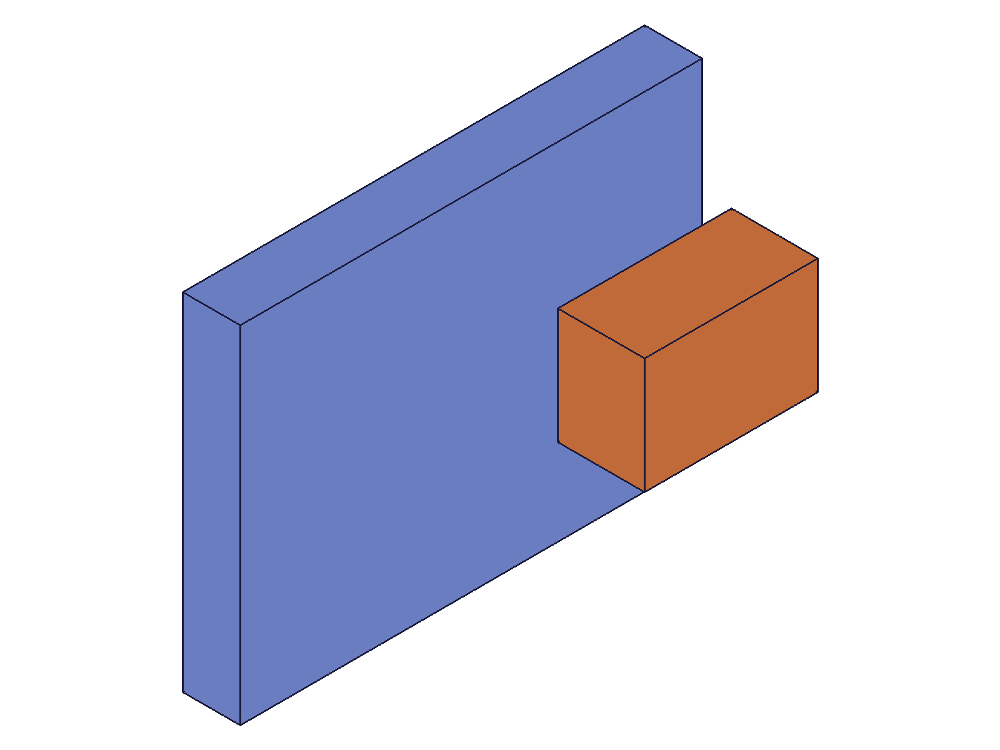
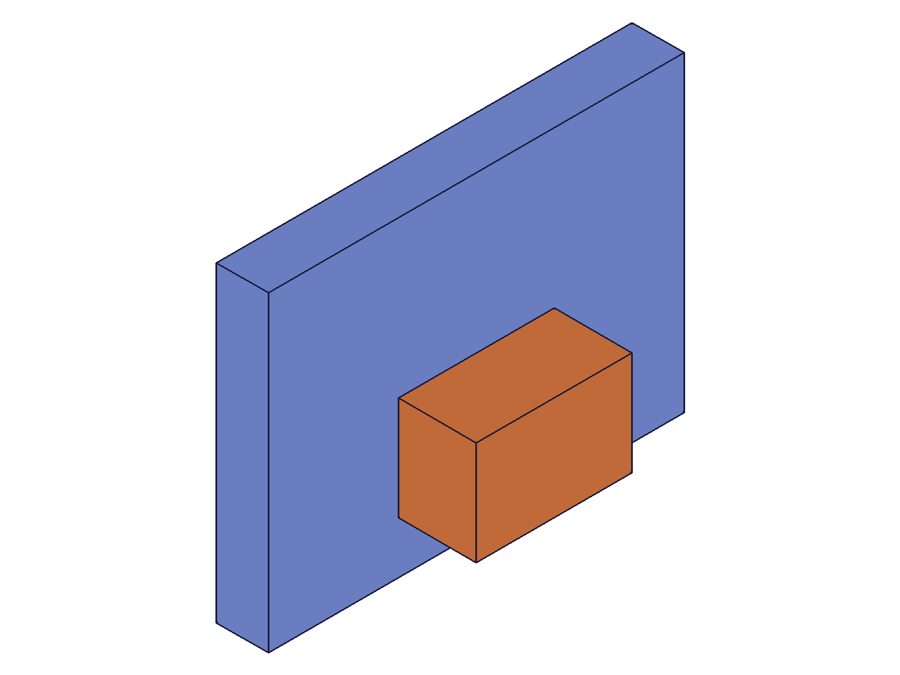
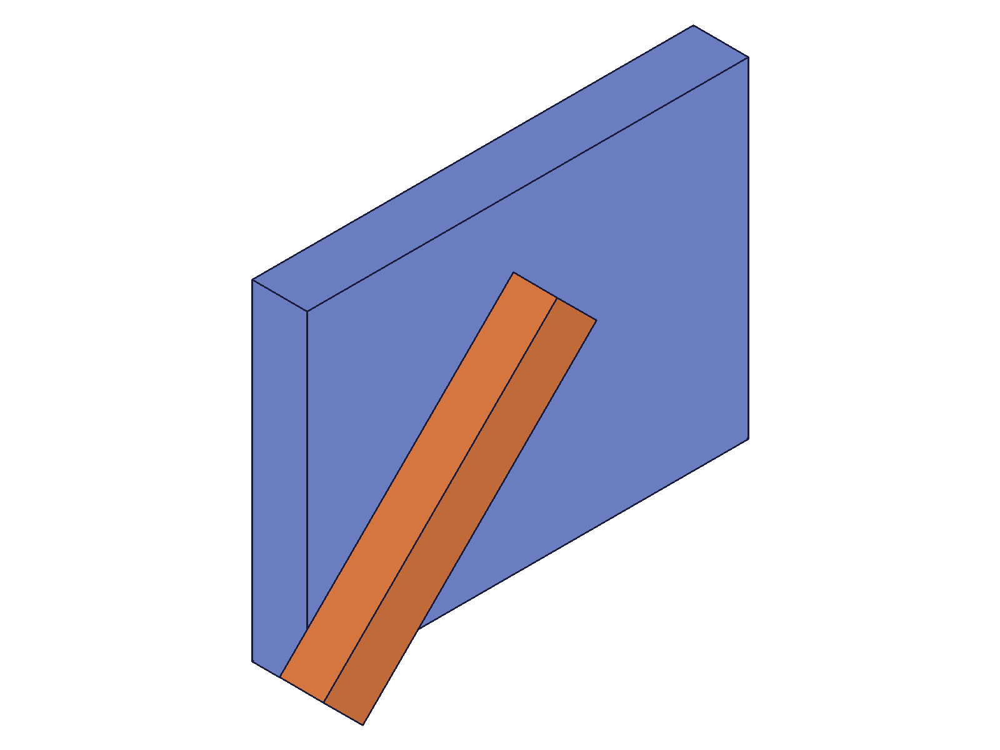
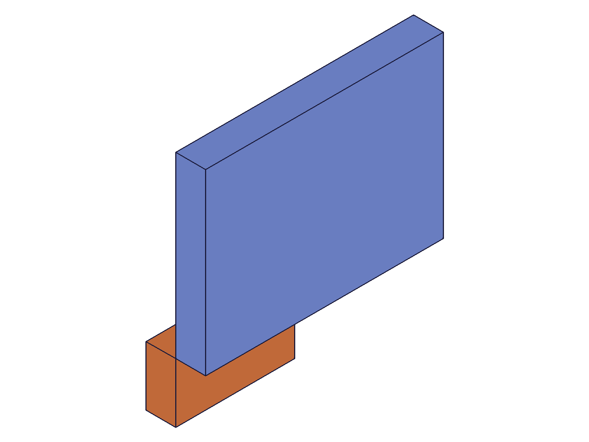

# Training: assembly.parallel

**Date:** 2026-05-08

## Goal

Testing `v1.assembly.parallel`, `v1.assembly.updateParallel`, and `v1.assembly.getParallel`.

**Methods to cover:**

- `parallel` — basic creation, DOF behavior (4 free: X/Y/Z translation + Z rotation)
- `parallel` params: id, name, mate1, mate2, xOffsetLimits, yOffsetLimits, zOffsetLimits, zRotationLimits, flip, reorient
- `updateParallel` — change limits, flip, reorient, retarget, rename
- `getParallel` — query by name, return structure, failure cases

**Questions:**

- What DOF does parallel actually constrain? (Hypothesis: constrains X-rot and Y-rot, leaving X/Y/Z translation + Z-rot free — 4 DOF)
- Does parallel preserve initial position from instance transformation (like cylindrical) or reset to 0 (like planar)?
- Does parallel have a fixed `zOffset` param or only `zOffsetLimits`?
- How do xOffsetLimits / yOffsetLimits / zOffsetLimits interact? Can all three be set simultaneously?
- Does getParallel return the same structure as other constraint getters (xOffsetLimits, yOffsetLimits, zOffsetLimits, zRotationLimits)?
- Does updateParallel accept constraint ID or assembly ID?
- What errors occur with same-instance mates, missing csys, invalid flip?

---

## 01 — basic parallel (no limits)

Script: `scripts/01-basic-parallel.mjs` — ✅ Parallel created successfully, maxLevel=31.

**Data:** inst2 placed at [40, 30, 25], block local COG=[15,10,7.5].
- COG before: `{x:55, y:40, z:32.5}` (correct: 40+15, 30+10, 25+7.5)
- COG after: `{x:55, y:40, z:32.5}` — **unchanged**

**Learned:** Parallel with no limits and default flip preserves ALL initial positions (X, Y, Z). This matches cylindrical behavior, NOT planar (which resets to 0).
**📌 LLM doc:** Parallel preserves initial position on all free DOFs (like cylindrical, unlike planar).

|  |
|---|

---

## 02 — offset limits (all three axes)

Script: `scripts/02-offset-limits.mjs` — ✅ All three offset limits clamp correctly.

**Data:** inst2 at [40, 30, 25], limits: x[10,20], y[5,15], z[10,15].
- COG before: `{x:55, y:40, z:32.5}`
- COG after: `{x:34.999, y:24.999, z:22.499}` ≈ [35, 25, 22.5]

**Analysis:** x clamped 40→20 (COG=20+15=35 ✓), y clamped 30→15 (COG=15+10=25 ✓), z clamped 25→15 (COG=15+7.5=22.5 ✓). Solver epsilon ~0.001.
**📌 LLM doc:** All three offset limits can be set simultaneously. They clamp independently with ~0.001 solver epsilon.

|  |
|---|

---

## 03 — zRotationLimits (locked at 45°)

Script: `scripts/03-rotation-limits.mjs` — ✅ Rotation lock works.

**Data:** Arm local COG=[30, 5, 4], inst at [0, 0, 12].
- COG before: `{x:30, y:5, z:16}`
- COG after: `{x:17.678, y:24.749, z:16.0}`

**Analysis:** X=30·cos45−5·sin45=17.678 ✓, Y=30·sin45+5·cos45=24.749 ✓, Z stays at 16 ✓ (preserved).
**📌 LLM doc:** zRotationLimits works same as other constraints. Locking at `{min:'45deg', max:'45deg'}` rotates inst2 by exactly 45°. Z position preserved.

|  |
|---|

---

## 05 — single-axis clamp (X only)

Script: `scripts/05-single-axis-clamp.mjs` — ✅ Single-axis clamping, other axes preserved.

**Data:** inst2 at [40, 30, 25], only xOffsetLimits [10, 20].
- COG before: `{x:55, y:40, z:32.5}`
- COG after: `{x:34.999, y:40, z:32.5}`

**Analysis:** X clamped 40→20 (COG≈35 ✓), Y preserved at 40 ✓, Z preserved at 32.5 ✓.
**📌 LLM doc:** Limits on one axis don't affect other axes. Unconstrained DOFs preserve their initial values.

---

## 06 — flip '-Z' (with locked limits)

Script: `scripts/06-flip.mjs` — ✅ Flip works but interacts with position.

**Data:** Block local COG=[20, 10, 5], inst at [0, 0, 15], all limits locked (x=0, y=0, z=15, rot=0).
- COG after: `{x:20, y:-10, z:-5.1}`

**Analysis:** Flipped local COG [20, -10, -5] ✓. But Z at -5 instead of expected 15-5=10. The zOffsetLimits at [15,15] didn't apply as expected — inst2 appears to be at origin z=0, not z=15. This needs further investigation.

---

## 07 — flip '-Z' (no limits, clean test)

Script: `scripts/07-flip-clean.mjs` — ✅ Flip causes position reset to origin.

**Data:** inst2 at [30, 20, 15], block local COG=[20, 10, 5].
- COG before: `{x:50, y:30, z:20}` (30+20, 20+10, 15+5)
- COG after: `{x:20, y:-10, z:-5}` (0+20, 0-10, 0-5)

**Analysis:** Flipped local COG [20, -10, -5] matches. But inst2 moved from [30,20,15] to origin [0,0,0]. **Flip '-Z' causes the solver to reset inst2 to mate1's origin**, even though parallel normally preserves position. This is the same alignment behavior seen in fastened/revolute — the constraint "places" inst2 relative to inst1.
**📌 LLM doc:** With default flip 'Z' and no limits, parallel preserves initial position (solver sees no need to move — axes already parallel). With non-default flip, the solver actively re-solves and resets inst2 to inst1's origin. Same alignment semantics as fastened/revolute once flip triggers a solve.

|  |
|---|

---

## 08 — error cases

Script: `scripts/08-errors.mjs` — ✅ All errors match other constraint patterns.

| Error | result | maxLevel | message | code |
|-------|--------|----------|---------|------|
| Same-instance mates | null | 51 | "probably belong to the same rigid set" | 1014 |
| Invalid flip 'W' | null | 51 | "Type 'W' is not supported to use as flip type" | 1013 |
| Invalid reorient '45' | null | 51 | "Type '45' is not supported to use as reorient type" | 1013 |
| Missing mate2 | null | 51 | "Evaluation error in AbstractAPI.PrepareAPIParams" | 0 |
| Missing csys | null | 51 | "Evaluation error in AbstractAPI.PrepareAPIParams" | 0 |

**📌 LLM doc:** Errors match other constraint types exactly.

---

## 09 — getParallel

Script: `scripts/09-getParallel.mjs` — ✅ Works as expected.

**Data:** Created parallel with all optional params (flip '-Z', reorient '90', all four limit types, degree strings).

Returned structure:
```json
{
  "id": 216, "name": "TestPar",
  "mate1": { "csys": 107, "flip": "Z", "path": [204], "reorient": "0" },
  "mate2": { "csys": 198, "flip": "-Z", "path": [206], "reorient": "90" },
  "xOffsetLimits": { "max": 50, "min": 5 },
  "yOffsetLimits": { "max": 30, "min": -20 },
  "zOffsetLimits": { "max": 40, "min": 10 },
  "zRotationLimits": { "max": 1.5708, "min": -0.7854 }
}
```

- Degree strings converted to radians: `-45deg` → -0.7854, `90deg` → 1.5708
- All four limit objects always present
- No limits → `{ min: null, max: null }` (tested with other constraints, consistent pattern)

**Failure cases:** All return null, maxLevel=51:
- Nonexistent name ✓
- Instance ID instead of assembly ID ✓
- Empty name ✓
- Batch: first found (id=216), second null; maxLevel=51 (contaminated by failure) ✓

**📌 LLM doc:** getParallel returns 4 limit objects (xOffsetLimits, yOffsetLimits, zOffsetLimits, zRotationLimits). Assembly root ID required. Degree strings converted to radians on storage.

---

## 10 — updateParallel

Script: `scripts/10-updateParallel.mjs` — ✅ True partial update, same pattern as other constraints.

**Data progression (inst2 started at [40, 30, 25], COG=[55, 40, 32.5]):**

1. **Add xOffsetLimits [10,20]:** COG x 55→34.999 (inst x clamped 40→20) ✓
2. **Rename 'UpdTest'→'Renamed':** old name returns null, new name finds id=216 ✓
3. **Add zOffsetLimits [10,15]:** COG z 32.5→22.499 (inst z clamped 25→15) ✓
4. **Remove xOffsetLimits {null,null}:** COG x stays at 34.999 — **position preserved after limit removal** ✓

**Error:** Assembly ID gives "not a constraint or relation" (code 1007) ✓.

**📌 LLM doc:** updateParallel is true partial update (unspecified params preserved). `id` must be constraint ID, not assembly ID (code 1007). Removing limits preserves the last solved position (does NOT reset to initial).
