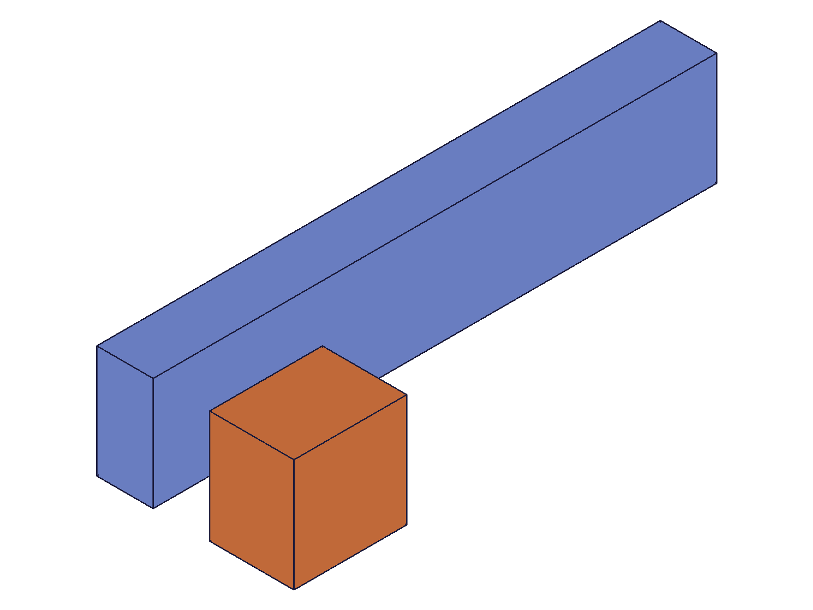
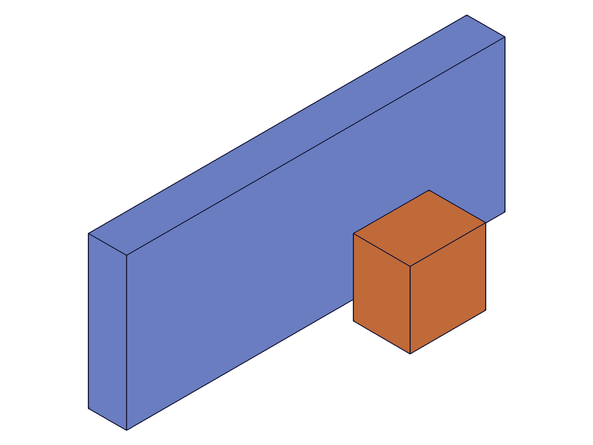
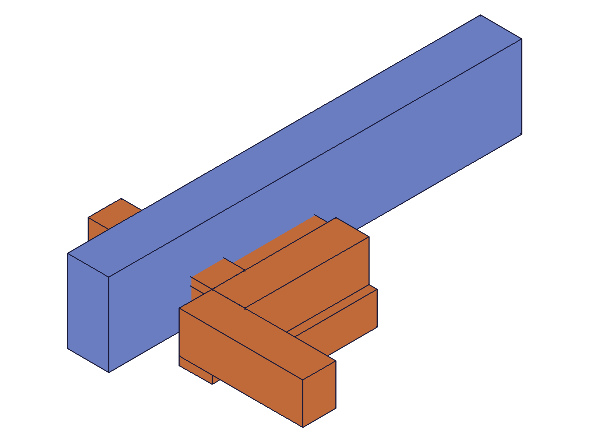
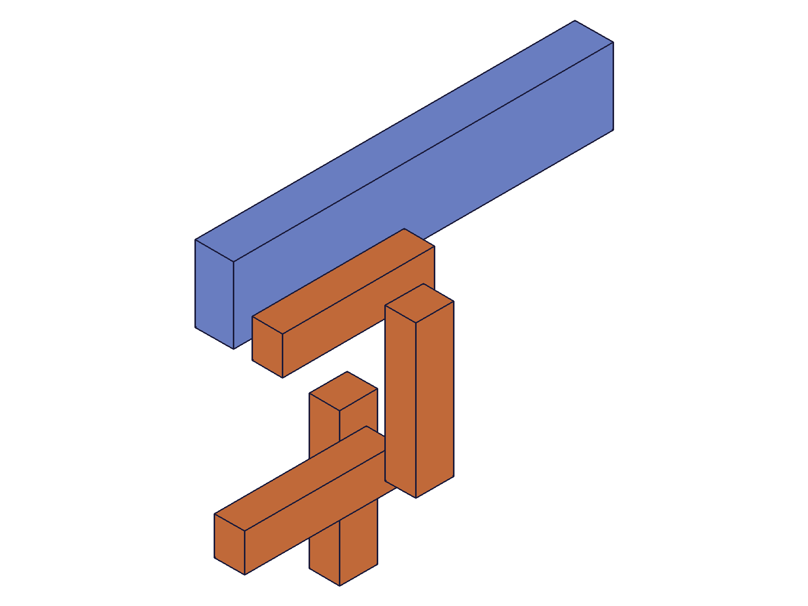

# Training: assembly.slider

**Date:** 2026-05-08

## Goal

Testing `v1.assembly.slider`, `v1.assembly.updateSlider`, and `v1.assembly.getSlider`.

**Methods to cover:**

- `slider` — basic creation, DOF behavior (1 free: Z-translation only)
- `slider` params: id, name, mate1, mate2, xOffset, yOffset, zOffsetLimits, flip, reorient
- `updateSlider` — change offsets, limits, flip, reorient, rename
- `getSlider` — query by name, return structure, failure cases

**Questions:**

- What DOF does slider actually constrain? (Hypothesis: 5 DOF locked — X/Y translation, X/Y/Z rotation; leaving only Z-translation free)
- Does slider preserve initial Z position from instance transformation, or reset to 0?
- How do fixed xOffset / yOffset work? Do they reposition inst2, and do they combine with the mate csys?
- Does zOffsetLimits clamp the initial Z or is the free DOF unbounded by default?
- Does getSlider return xOffset, yOffset, and zOffsetLimits in its result object?
- Does updateSlider accept constraint ID or assembly ID?
- What happens with flip/reorient on a slider (rotation DOFs are locked)?
- Errors: same-instance mates, missing csys, invalid flip

---

## 01 — basic slider (no offsets, no limits)

Script: `scripts/01-basic-slider.mjs` — ✅ Slider created successfully, maxLevel=31.

**Data:** Block (20×20×15) placed at [30, 0, 20], local COG=[10, 10, 7.5].
- COG before: `{x:40, y:10, z:27.5}` (correct: 30+10, 0+10, 20+7.5)
- COG after: `{x:10, y:10, z:27.5}` — X reset from 40 to 10, Y unchanged, Z unchanged

**Analysis:** X was reset: 30→0 (xOffset=0 default), so COG.x=0+10=10. Y was already at 0 so no change. Z=20 preserved (free DOF), COG.z=20+7.5=27.5.
**Learned:** Slider resets X and Y to xOffset/yOffset values (default 0). Z (the free DOF) is preserved from initial transformation.
**📌 LLM doc:** Slider has 1 DOF (Z-translation). X/Y are fixed by xOffset/yOffset params. Initial Z position is preserved.

|  |
|---|

---

## 02 — fixed offsets (xOffset=40, yOffset=15)

Script: `scripts/02-fixed-offsets.mjs` — ✅ Fixed offsets position inst2 correctly.

**Data:** Block at [50, 25, 30], local COG=[10, 10, 7.5].
- COG before: `{x:60, y:35, z:37.5}`
- COG after: `{x:50, y:25, z:37.5}`

**Analysis:** xOffset=40 → inst2 X=40, COG.x=40+10=50 ✓. yOffset=15 → inst2 Y=15, COG.y=15+10=25 ✓. Z preserved at 30, COG.z=30+7.5=37.5 ✓.
**📌 LLM doc:** xOffset and yOffset are fixed positional offsets that set inst2's X/Y position relative to mate1's csys.

|  |
|---|

---

## 03 — zOffsetLimits (Z above max, clamped down)

Script: `scripts/03-zoffset-limits.mjs` — ✅ Z clamped to max.

**Data:** Block at [0, 0, 50], zOffsetLimits [10, 30].
- COG before: `{x:10, y:10, z:57.5}`
- COG after: `{x:10, y:10, z:37.499}` ≈ [10, 10, 37.5]

**Analysis:** Z clamped from 50 to 30 (max), COG.z=30+7.5=37.5 ✓. Solver epsilon ~0.001. X/Y unchanged (already at 0).
**📌 LLM doc:** zOffsetLimits clamp the free Z DOF. Same solver epsilon (~0.001) as other constraints.

---

## 04 — zOffsetLimits (Z below min, clamped up)

Script: `scripts/04-z-below-min.mjs` — ✅ Z clamped to min.

**Data:** Block at [0, 0, 5], zOffsetLimits [20, 40].
- COG before: `{x:10, y:10, z:12.5}`
- COG after: `{x:10, y:10, z:27.501}` ≈ [10, 10, 27.5]

**Analysis:** Z clamped from 5 to 20 (min), COG.z=20+7.5=27.5 ✓. Confirms bidirectional clamping.

---

## 05 — flip effects (all 6 values)

Script: `scripts/05-flip-effects.mjs` — ✅ All flips work, each reorients inst2 differently.

**Data:** Arm (30×10×8), local COG=[15, 5, 4]. Each at [20, 0, 15], xOffset=20.

| flip | COG x | COG y | COG z |
|------|-------|-------|-------|
| Z (default) | 35 | 5 | 19 |
| -Z | 35 | -5 | 11 |
| X | 16 | 5 | 30 |
| -X | 24 | 5 | ~0 |
| Y | 35 | -4 | 20 |
| -Y | 35 | 4 | 10 |

**Analysis:** flip=Z (default) preserves orientation: inst2 at [20, 0, 15], COG=[20+15, 0+5, 15+4]=[35, 5, 19] ✓. Non-default flips actively reorient the instance, changing which body axis maps to which world axis. Z (the free DOF) still preserves its initial value but since the body is reoriented, the COG shifts.
**📌 LLM doc:** Flip works identically to other kinematic constraints. All flips succeed. Non-default flips actively reorient inst2.

|  |
|---|

---

## 06 — getSlider (all params set)

Script: `scripts/06-getSlider.mjs` — ✅ Full structure returned.

**Data:** Created slider with flip=-Z, reorient=90 on mate1; flip=X, reorient=180 on mate2; xOffset=25, yOffset=10, zOffsetLimits [5, 50].

Returned structure (see `files/06-getSlider-getSlider-result.json`):
```
{ id, name, mate1: { path, csys, flip: '-Z', reorient: '90' },
  mate2: { path, csys, flip: 'X', reorient: '180' },
  xOffset: 25, yOffset: 10, zOffsetLimits: { min: 5, max: 50 } }
```

**Failure cases (all return `result: null, maxLevel: 51`):**
- Non-existent name ✓
- Empty name `''` ✓
- Template ID ✓
- Instance ID ✓

**📌 LLM doc:** getSlider returns full structure including flip/reorient strings, numeric xOffset/yOffset, and zOffsetLimits object. Assembly root ID only.

---

## 07 — updateSlider (partial updates, rename, remove limits, error)

Script: `scripts/07-updateSlider.mjs` — ✅ All updates work as expected.

**Data:** Block at [30, 15, 25], local COG=[10, 10, 7.5].

| Step | Update | COG result | Analysis |
|------|--------|------------|----------|
| Create | default | {10, 10, 32.5} | X/Y reset to 0, Z=25 preserved |
| xOffset=40 | partial | {50, 10, 32.5} | X moved to 40, Y/Z unchanged |
| yOffset=20 | partial | {50, 30, 32.5} | Y moved to 20, X/Z unchanged |
| zLimits [10,20] | partial | {50, 30, 27.499} | Z clamped 25→20 |
| Remove limits | null/null | {50, 30, 27.499} | Z stays at 20 (NOT reset) |

**Rename:** Old name returns null, new name returns the constraint ID ✓.
**Error (asm ID):** null, maxLevel=51, code 1007: "not a constraint or relation" ✓.
**📌 LLM doc:** updateSlider accepts constraint ID (not asm ID). True partial update. Removing limits preserves last position (does NOT reset).

---

## 08 — error cases

Script: `scripts/08-errors.mjs` — ✅ All expected errors confirmed.

| Error | maxLevel | Message | Code |
|-------|----------|---------|------|
| Same instance both mates | 51 | "probably belong to the same rigid set" | 1014 |
| Invalid flip 'W' | 51 | "Type 'W' is not supported" | 1013 |
| Invalid reorient '45' | 51 | "Type '45' is not supported" | 1013 |
| Missing mate2 | 51 | "Evaluation error in AbstractAPI.PrepareAPIParams" | 0 |
| Missing csys | 51 | "Evaluation error in AbstractAPI.PrepareAPIParams" | 0 |

**📌 LLM doc:** Same error pattern as all other kinematic constraints.

---

## 09 — getSlider without limits + batch

Script: `scripts/09-getSlider-no-limits.mjs` — ✅ zOffsetLimits returns `{ min: null, max: null }` when not set.

**Data:** Slider with xOffset=10, yOffset=5, no zOffsetLimits.
- `getSlider` result keys: id, mate1, mate2, name, xOffset, yOffset, zOffsetLimits
- zOffsetLimits: `{ min: null, max: null }`
- xOffset: 10, yOffset: 5

**Batch:** `[{ id, name: 'Slide1' }, { id, name: 'NonExistent' }]` → `[216, null]`, maxLevel=51 (contaminated by null).
**📌 LLM doc:** zOffsetLimits always present in getSlider result. No limits → `{ min: null, max: null }`. Batch supported with null contamination.

---

## 10 — reorient effects (all 4 values)

Script: `scripts/10-reorient.mjs` — ✅ Reorient always visible (rotation DOF is locked).

**Data:** Arm (40×10×8), local COG=[20, 5, 4]. Instances stacked at Z=15, 30, 45, 60.

| reorient | COG x | COG y | COG z |
|----------|-------|-------|-------|
| 0 | 20 | 5 | 19 |
| 90 | 5 | -20 | 34 |
| 180 | -20 | -5 | 49 |
| 270 | -5 | 20 | 64 |

**Analysis:** Each reorient step rotates inst2 by 90° around Z. With reorient=0 and inst2 at Z=15: COG=[0+20, 0+5, 15+4]=[20, 5, 19] ✓. With reorient=90 at Z=30: rotated [20,5]→[5,-20], COG=[5, -20, 34] ✓. Z is always preserved (free DOF).
**📌 LLM doc:** Reorient is always visible on slider (unlike parallel where free rotation absorbs it). Each step = 90° around Z.

|  |
|---|

---

## Coverage Checklist

- [x] slider called successfully (01)
- [x] All required params tested: id, mate1/mate2 with path+csys (01-10)
- [x] Key optional params: name (01), xOffset (02), yOffset (02), zOffsetLimits (03, 04), flip (05), reorient (10)
- [x] All flip enum values exercised (05): Z, -Z, X, -X, Y, -Y
- [x] All reorient values exercised (10): 0, 90, 180, 270
- [x] updateSlider tested (07): xOffset, yOffset, zOffsetLimits, rename, remove limits
- [x] getSlider tested (06, 09): full params, no limits, batch, failure cases
- [x] Error cases (08): same-instance, invalid flip/reorient, missing mate2, missing csys
- [x] All behavioral claims verified with COG measurements + snapshots
- [x] All Goal questions answered by named scripts
