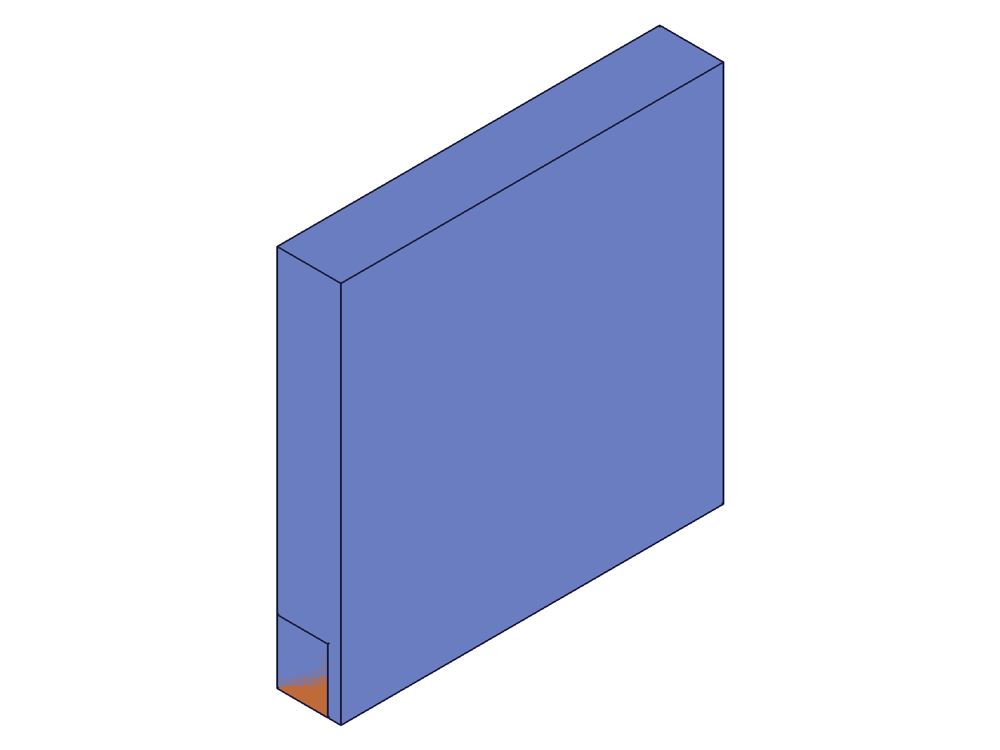
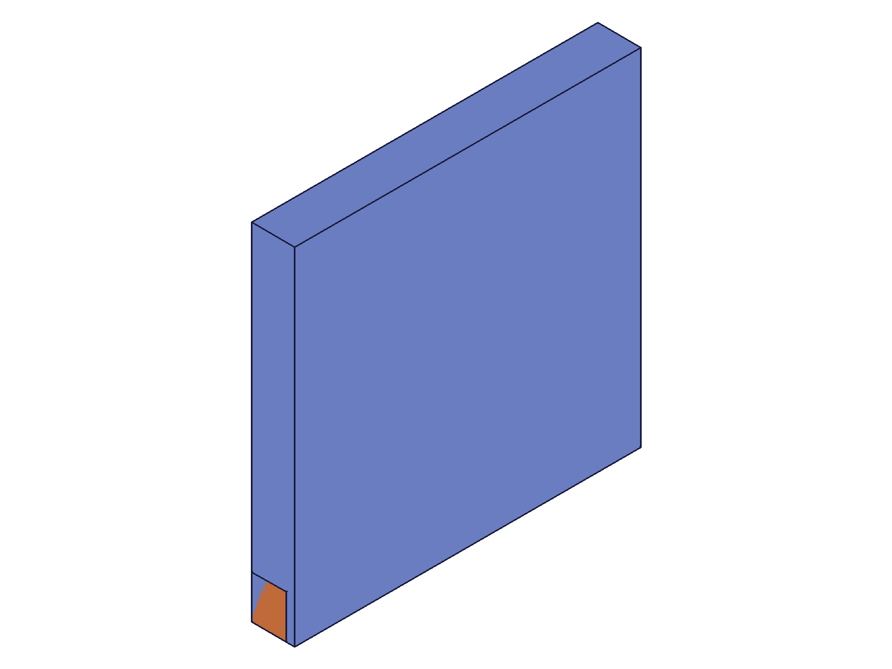

# Training: assembly.spherical

**Date:** 2026-05-08

## Goal

Testing `v1.assembly.spherical`, `v1.assembly.updateSpherical`, and `v1.assembly.getSpherical`.

**Methods to cover:**

- `spherical` — basic creation, DOF behavior (ball-joint: origins coincide, all rotations free)
- `spherical` params: id, name, mate1, mate2, yRotationLimits, flip, reorient
- `updateSpherical` — change mates, yRotationLimits, rename
- `getSpherical` — query by name, return structure, failure cases

**Questions:**

- What DOF does spherical actually constrain? (Hypothesis: 3 DOF locked — X/Y/Z translation locked so origins coincide; 3 DOF free — X/Y/Z rotation)
- Does the solver reposition inst2 so its mate csys origin aligns with inst1's mate csys origin?
- How does yRotationLimits.max work — does it clamp the half-angle of Y rotation? What units?
- Can yRotationLimits be removed (pass VOID)?
- Does getSpherical return yRotationLimits in its result?
- Does updateSpherical accept constraint ID or assembly ID?
- Does flip/reorient affect the initial orientation of inst2?
- Errors: same-instance mates, missing csys, invalid params

---

## 01 — basic spherical (origins coincide)

Script: `scripts/01-basic-spherical.mjs` — ✅ Spherical created, maxLevel=31.

**Data:** Arm (40×10×8) at [80, 0, 20], local COG=[20, 5, 4]. Base plate (60×60×10) grounded at origin.
- COG before: `{x:100, y:5, z:24}` — [80+20, 0+5, 20+4] ✓
- COG after: `{x:20, y:5, z:4}` — inst2 moved to origin [0,0,0]

**Analysis:** Spherical locked all 3 translations. inst2 origin reset from [80, 0, 20] to [0, 0, 0] (coincident with inst1 origin). COG after = template COG [20, 5, 4] confirms inst2 at identity.
**📌 LLM doc:** Spherical locks 3 translational DOF (origins coincide), leaves 3 rotational DOF free. With no motion commands, solver keeps default rotation.

|  |
|---|

---

## 02 — csys position has no spatial effect

Script: `scripts/02-offset-csys.mjs` — ✅ Same behavior regardless of csys location.

**Data:** wcsA at [30, 30, 5] in tplA, wcsB at [40, 5, 4] in tplB. Arm at [80, 30, 20].
- COG before: `{x:100, y:35, z:24}`
- COG after: `{x:20, y:5, z:4}` — same as template COG

**Analysis:** If csys had spatial effect, we'd expect COG ≈ [10, 30, 5] (prediction_spatial). Instead COG = [20, 5, 4] (prediction_no_spatial). Confirms: **csys position is a dummy identifier with no spatial effect** — same as fastened, fastenedOrigin, revolute, and all other assembly constraints.
**📌 LLM doc:** csys has no spatial effect on spherical — same as all other assembly constraints.

|  |
|---|

---

## 03 — yRotationLimits (radians, degrees, no limits)

Script: `scripts/03-yRotationLimits.mjs` — ✅ All variants work.

**Data:**
- Radians `max: 0.785` → stored as `0.785` in getSpherical
- Degrees `max: '45deg'` → stored as `0.7853981633974483` (π/4 radians)
- No limits (omitted) → `yRotationLimits: { max: null }` — key always present, max is null

**Learned:** yRotationLimits.max accepts radians (number) or degree strings (`'45deg'`). Stored internally as radians. The `yRotationLimits` key is always returned by getSpherical, with `max: null` when not set.
**📌 LLM doc:** yRotationLimits.max accepts radians or `'Ndeg'` strings. Stored as radians. Always present in getSpherical (null when not set).

---

## 04 — getSpherical (found, not found, by instance)

Script: `scripts/04-getSpherical.mjs` — ✅ as expected.

**Data:**
- Found: returns `{id, name, mate1, mate2, yRotationLimits}` with full mate details (path, csys, flip, reorient)
- `'30deg'` → stored as `0.5235987755982988` (π/6) ✓
- Not found: `result: null`, maxLevel=51, error message: "There couldn't be found a constraint with name..."
- By instance ID: `result: null` — needs assembly/product ID, not instance ID

**📌 LLM doc:** getSpherical takes assembly ID (not instance ID). Returns null with error for not-found.

---

## 05 — updateSpherical (limits, rename, remate, remove limits)

Script: `scripts/05-updateSpherical.mjs` — ✅ All updates work. Takes constraint ID.

**Data:**
- Before: `yRotationLimits: {max: null}`
- After adding `'60deg'`: `yRotationLimits: {max: 1.0471975511965976}` (π/3) ✓
- Rename: old name unfindable (maxLevel=51), new name returns updated constraint ✓
- Remate (mate2 → inst3): inst3 COG moved from [~0, ~50, ~10] to [~0, ~0, ~10] — origin aligned ✓
- Remove limits (`yRotationLimits: null`): max reverts to null ✓

**Learned:** updateSpherical takes **constraint ID** (not assembly ID). True partial update — only specified params change. Passing `yRotationLimits: null` removes the limit. Remating to a different instance repositions the new instance.
**📌 LLM doc:** updateSpherical takes constraint ID. True partial update. `yRotationLimits: null` removes limit. Remate repositions new target.

---

## 06 — flip effects (all 6 values)

Script: `scripts/06-flip-effects.mjs` — ✅ All flips produce identical results.

**Data:** Arm (30×10×8), template COG=[15, 5, 4]. All 6 flips → COG = [15, 5, 4].

| flip | COG x | COG y | COG z |
|------|-------|-------|-------|
| Z | 15 | 5 | 4 |
| -Z | 15 | 5 | 4 |
| X | 15 | 5 | 4 |
| -X | 15 | 5 | 4 |
| Y | 15 | 5 | 4 |
| -Y | 15 | 5 | 4 |

**Analysis:** All rotation DOFs are free, so the solver absorbs any flip rotation. The flip has no observable effect because no rotation is constrained. Compare to slider (all rotation locked → flip visible) and revolute (1 rotation free, 2 locked → some flips visible).
**📌 LLM doc:** flip has NO effect on spherical — all rotations are free DOFs, so the solver absorbs any flip orientation.

|  |
|---|

---

## 07 — reorient (all 4 values)

Script: `scripts/07-reorient.mjs` — ✅ All reorients produce identical results.

**Data:** All 4 reorients → COG = [15, 5, 4]. Same as flip: free rotation DOFs absorb the reorientation.

**📌 LLM doc:** reorient has NO effect on spherical — same reason as flip.

---

## 08 — error cases

Script: `scripts/08-errors.mjs` — ✅ All expected errors triggered.

| Test | Code | Error |
|------|------|-------|
| Same instance | 1014 | "belong to the same rigid set" |
| Missing csys | 1004 | "csys must be provided" |
| Invalid flip | 1013 | "not supported as flip type" |
| Template in path | 1001 | "wrong id type, provide instance" |
| Instance as assembly ID | 1007 | "not an assembly id" |
| Assembly ID for update | 1007 | "not a constraint or relation" |

**📌 LLM doc:** Standard error pattern. updateSpherical requires constraint ID, not assembly ID.

---

## 09 — batch creation

Script: `scripts/09-batch-create.mjs` — ✅ Batch creation works.

**Data:** Passed array of 2 constraint configs → result: `[218, 222]`. Both constraints created correctly, both instances repositioned.
- Ball_A: no limits → `yRotationLimits: {max: null}`
- Ball_B: `'90deg'` → `yRotationLimits: {max: 1.5707963267948966}` (π/2) ✓
- Both inst2 and inst3 COG = [15, 5, 4] (at origin)

**📌 LLM doc:** Batch creation: pass array of param objects, returns array of constraint IDs.

|  |
|---|

---

## Coverage Checklist

- [x] spherical called successfully (scripts 01-07, 09)
- [x] Every required parameter tested: id, mate1, mate2
- [x] Key optional parameters: name, yRotationLimits, flip, reorient
- [x] yRotationLimits tested with radians, degree strings, null/omitted
- [x] updateSpherical tested: add limits, rename, remate, remove limits
- [x] getSpherical tested: found, not found, by instance ID (fails)
- [x] Realistic usage: grounded base + constrained arm
- [x] Behavioral claims verified with COG data and snapshots
- [x] All goal questions answered (see below)
- [x] Batch creation tested

## Answers to Goal Questions

1. **DOF:** Spherical constrains 3 translational DOF (origins coincide), leaves 3 rotational DOF free. Confirmed by scripts 01, 02, 06, 07.
2. **Csys alignment:** No — csys position has no spatial effect. inst2 origin is placed at inst1 origin regardless of csys. Confirmed by script 02.
3. **yRotationLimits.max:** Accepts radians (number) or degree strings. Stored as radians. Defines max Y-rotation half-angle. Confirmed by script 03.
4. **Remove yRotationLimits:** Pass `null` — works in both creation and updateSpherical. Confirmed by scripts 03, 05.
5. **getSpherical return:** Always includes `yRotationLimits: { max: ... }` where max is number or null. Confirmed by scripts 03, 04.
6. **updateSpherical ID:** Takes constraint ID, NOT assembly ID. Confirmed by scripts 05, 08.
7. **flip/reorient:** Have NO observable effect on spherical because all rotation DOFs are free. Confirmed by scripts 06, 07.
8. **Errors:** Standard pattern — same-instance (1014), missing csys (1004), bad flip (1013), template in path (1001), wrong ID type (1007). Confirmed by script 08.
