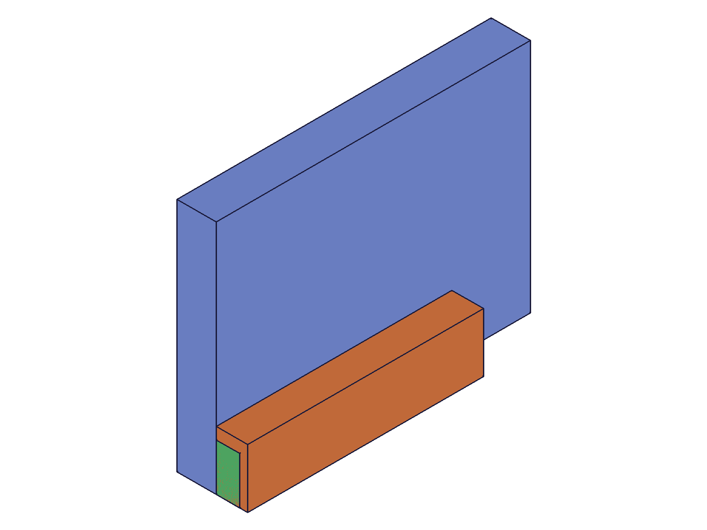
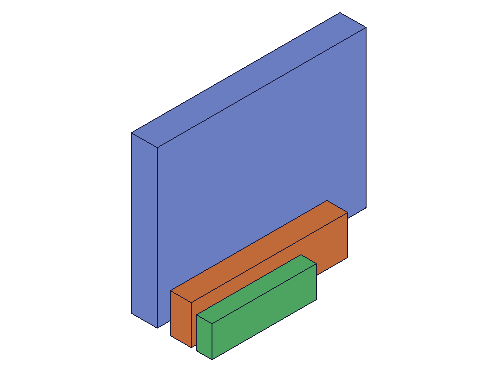
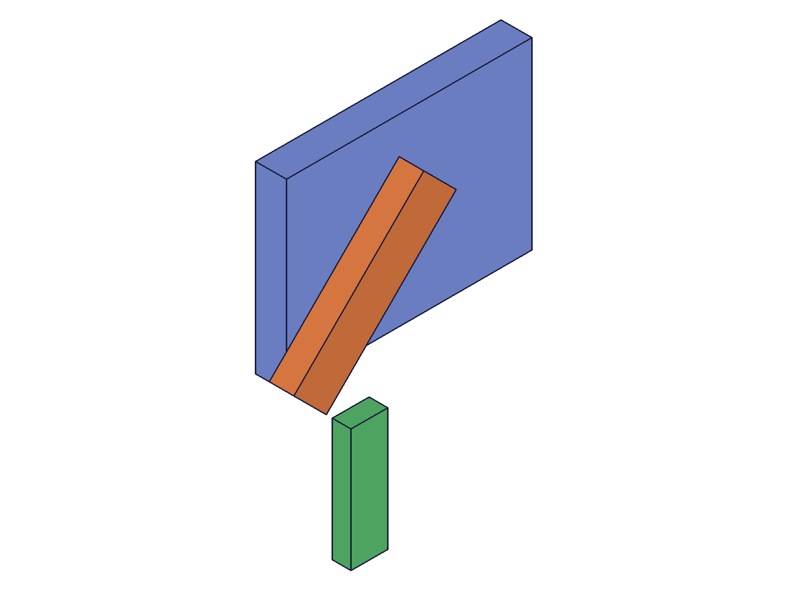
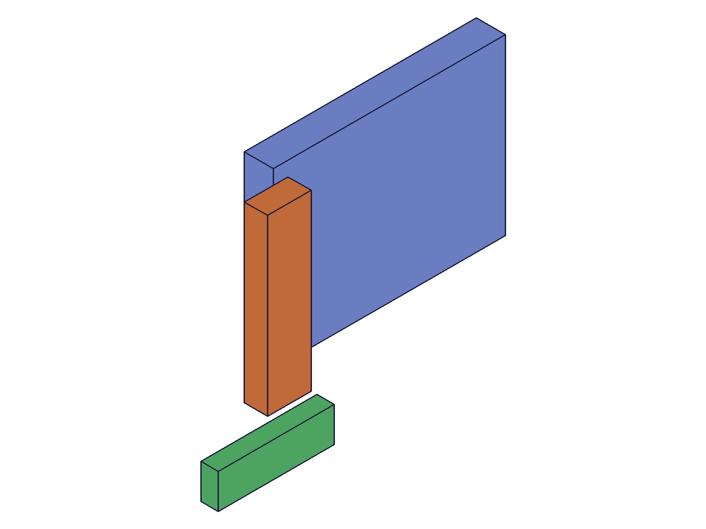
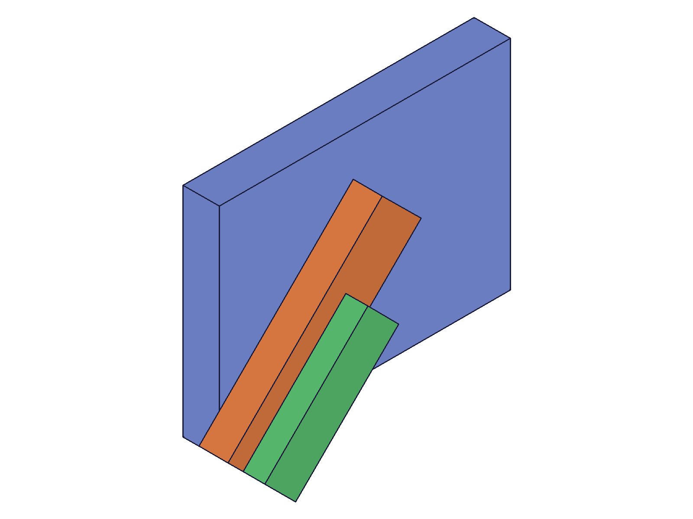

# Training: assembly.gear

**Date:** 2026-05-08

## Goal

Testing `v1.assembly.gear`, `v1.assembly.updateGear`, and `v1.assembly.getGear`.

**Methods to cover:**

- `gear` — create a gear relation linking two constraints (revolute)
- `gear` params: id, name, constr1Id, constr2Id, ratio, offset
- `updateGear` — change ratio, offset, constr1Id, constr2Id, name after creation
- `getGear` — query gear relation by name

**Questions:**

- What constraint types does gear work with? (revolute only, or also cylindrical?)
- How does ratio work in practice — if constr1 rotates 90°, does constr2 rotate ratio*90°?
- How does offset work — is it additive to constr2's angle?
- Can you observe gear coupling via `update3DConstraintValue` + `calculateMassProperties`?
- What happens with ratio=0? negative ratio?
- What happens when gear references a non-existent constraint ID?
- Does getGear work with assembly root ID only (like getRevolute)?
- What does getGear return — id, name, constr1Id, constr2Id, ratio, offset?

---

## 01 — basic gear creation

Script: `scripts/01-basic-gear.mjs` — ✅ gear creation succeeds, returns relation ID.

|  |
|---|

**Data:** `gear({ id: asmId, name: 'Gear1', constr1Id: rev1, constr2Id: rev2, ratio: 2.0 })` → result=404, maxLevel=31 (success). See `files/01-basic-gear-gear-create-response.json`.

**Learned:** Gear creation returns a relation ID (not VOID). Takes assembly root ID, two constraint IDs, ratio, optional offset/name.

---

## 03 — gear coupling with COG measurement (ratio=2)

Script: `scripts/03-gear-coupling-measured.mjs` — ✅ gear ratio verified numerically via COG.

|  |  |  |
|---|---|---|

**Data:** Arm1 local COG (30, 7.5), Arm2 local COG (20, 6). Gear ratio=2, offset=0. See `files/03-gear-coupling-measured-coupling-cog.json`.

| Drive | arm1 COG (x,y) | arm1 rotation | arm2 COG (x,y) | arm2 rotation |
|---|---|---|---|---|
| 0° | (30, 7.5) | 0° | (20, 6) | 0° |
| 45° | (15.91, 26.52) | +45° | (6, -20) | -90° |
| 90° | (-7.5, 30) | +90° | (-20, -6) | -180° |

**Learned:** The coupling formula is: **arm2_physical_rotation = -(ratio × drive_angle) + offset**. With ratio=2, driving constr1 by +45° causes arm2 to rotate -90° (counter-rotation, like meshing gears). The magnitude matches exactly (2×45°=90°), direction is reversed. At 90° drive, arm2 rotated -180° (2×90°). Both verified via COG coordinates.

**📌 LLM doc:** Document coupling formula: arm2 rotates -(ratio × angle) + offset. Counter-rotation is built-in.

---

## 04 — gear offset (ratio=1, offset=90deg)

Script: `scripts/04-gear-offset.mjs` — ⚠️ offset causes solver redistribution. `update3DConstraintValue` had no effect after initial measurement.

|  |
|---|

**Data:** At creation (no drive), arm1 COG was (15.91, 26.52) = +45° from initial, arm2 at (9.90, 18.38) = +45° from initial. The solver redistributed both arms to satisfy the gear constraint since both revolutes have free DOFs. Driving rev1 to 45° had NO effect — positions unchanged. See `files/04-gear-offset-offset-data.json`.

**Learned:** With offset≠0 and no drive, the solver finds an arbitrary equilibrium (both arms moved). `update3DConstraintValue` may not override this state after `calculateMassProperties` has materialized instances.

---

## 05 — getGear

Script: `scripts/05-getGear.mjs` — ✅ getGear works as expected.

**Data:** See `files/05-getGear-getGear-data.json`.

| Query | result | maxLevel |
|---|---|---|
| Assembly root + correct name | `{ id: 317, name: "MyGear", constr1Id: 309, constr2Id: 313, ratio: 2.5, offset: 0.5236 }` | 31 |
| Wrong name | null | 51 |
| Instance ID | null + "not a Assembly" | 51 |
| Empty name | null | 51 |

**Learned:** getGear returns `{ id, name, constr1Id, constr2Id, ratio, offset }`. Offset stored in radians (0.5236 ≈ π/6 = 30°). Assembly root ID only — instance/template IDs fail with "not a Assembly". Same pattern as getRevolute.

**📌 LLM doc:** Document getGear return value, assembly-root-only requirement, and offset in radians.

---

## 06 — updateGear

Script: `scripts/06-updateGear.mjs` — ✅ updateGear works: partial update, rename, errors.

**Data:** See `files/06-updateGear-updateGear-data.json` and `files/06-updateGear-update-asmId-error.json`.

- `updateGear({ id: gearId, ratio: 0.5 })` → returns gearId (317), maxLevel 31. True partial update — offset preserved.
- `updateGear({ id: gearId, offset: '45deg' })` → success. Degree strings accepted.
- `updateGear({ id: gearId, name: 'RenamedGear' })` → success. Old name returns null via getGear, new name works.
- `updateGear({ id: asmId, ratio: 3 })` → null, maxLevel 51 (assembly ID is not a gear relation).

**Learned:** updateGear takes gear relation ID (not assembly ID). True partial update — unspecified params preserved. Rename works same as updateRevolute. Error message for wrong ID: "The provided id for the constraint is not a constraint or relation." (code 1007).

**📌 LLM doc:** Document updateGear partial update, rename, ID requirement.

---

## 07 — negative ratio and ratio=0

Script: `scripts/07-negative-ratio.mjs` — ✅ negative ratio produces co-rotation, ratio=0 decouples.

**Data:** See `files/07-negative-ratio-negative-ratio-data.json`.

| Ratio | Drive | arm2 COG | arm2 rotation | Direction |
|---|---|---|---|---|
| -2.0 | 45° | (-6, 20) | +90° | Same direction as arm1 |
| 0 | 45° | (20, 6) | 0° | Decoupled |

**Learned:** Negative ratio → co-rotating (like belt/chain drive). arm2 rotates same direction as arm1 with magnitude |ratio|×drive. Ratio=0 → arm2 doesn't rotate (decoupled). Both verified via COG.

**📌 LLM doc:** Document ratio sign semantics.

---

## 08 — error cases

Script: `scripts/08-gear-errors.mjs` — ✅ errors well-documented.

**Data:** See `files/08-gear-errors-error-data.json`.

| Test | result | Error |
|---|---|---|
| Non-existent constraint ID | null | "invalid id!" (code 1006) |
| Instance ID as constraint | null | "wrong id type! Provide only: [\"revoluteconstraint\"]" (code 1001) |
| Same constraint for both | **321 (success!)** | No error |
| fastenedOrigin as constraint | null | "wrong id type! Provide only: [\"revoluteconstraint\"]" (code 1001) |
| Missing constr1Id | null | "must be provided" (code 1004) |

**Learned:** Gear ONLY accepts revolute constraint IDs. The server explicitly says `Provide only following id types: ["revoluteconstraint"]`. Self-linking (same constraint for both) is silently allowed. Missing params give code 1004 errors.

**📌 LLM doc:** CRITICAL: gear only works with revolute constraints. Document error codes.

---

## 09 — gear on cylindrical constraints

Script: `scripts/09-gear-cylindrical.mjs` — ✅ confirms gear is revolute-only.

**Data:** See `files/09-gear-cylindrical-cylindrical-gear-data.json`.

- Gear on two cylindrical → null, error "wrong id type! Provide only: [\"revoluteconstraint\"]"
- Mixed revolute+cylindrical → null (error about missing "id" — possibly context issue from second assembly.create)

**Learned:** Cylindrical constraints cannot be used with gear. Docs don't specify this — they say "constraint" generically — but the server enforces revolute-only.

**📌 LLM doc:** Document revolute-only restriction.

---

## 10 — clean offset measurement

Script: `scripts/10-clean-offset.mjs` — ✅ offset formula verified.

**Data:** See `files/10-clean-offset-offset-clean.json`. Gear with ratio=1, offset=90deg.

| State | arm1 (x,y) | arm1 angle | arm2 (x,y) | arm2 angle |
|---|---|---|---|---|
| No drive | (15.91, 26.52) | +45° | (9.90, 18.38) | +45° |
| Drive to 0° | (30, 7.5) | 0° | (-6, 20) | +90° |
| Drive to 45° | (15.91, 26.52) | +45° | (9.90, 18.38) | +45° |

**Verification of formula** (drive to 0°): arm2_rotation = -(1×0°) + 90° = +90°. From (20, 6), +90° gives (-6, 20). ✓

**Verification** (drive to 45°): arm2_rotation = -(1×45°) + 90° = +45°. From (20, 6), +45° gives (9.90, 18.38). ✓

**Learned:** Offset is additive to arm2's rotation after the counter-rotation. Formula confirmed: `arm2_rotation = -(ratio × drive) + offset`. Without explicit drive, solver distributes the gear constraint across both free revolute DOFs.
