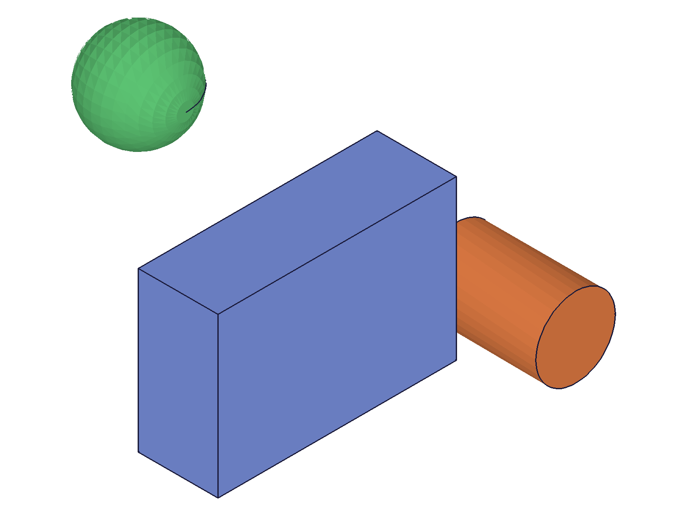
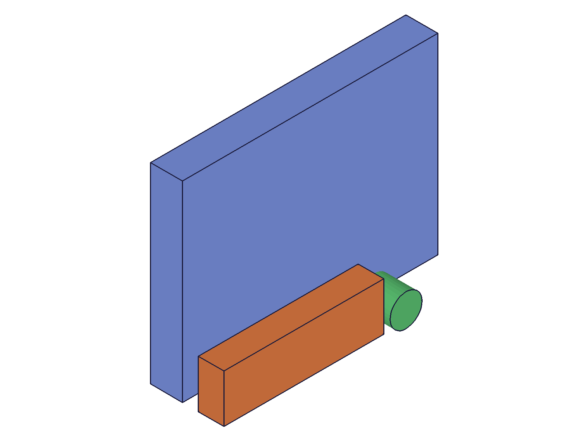
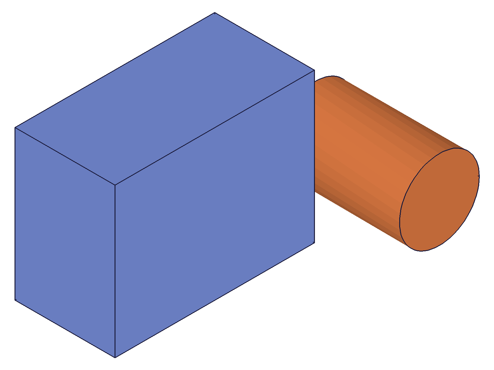
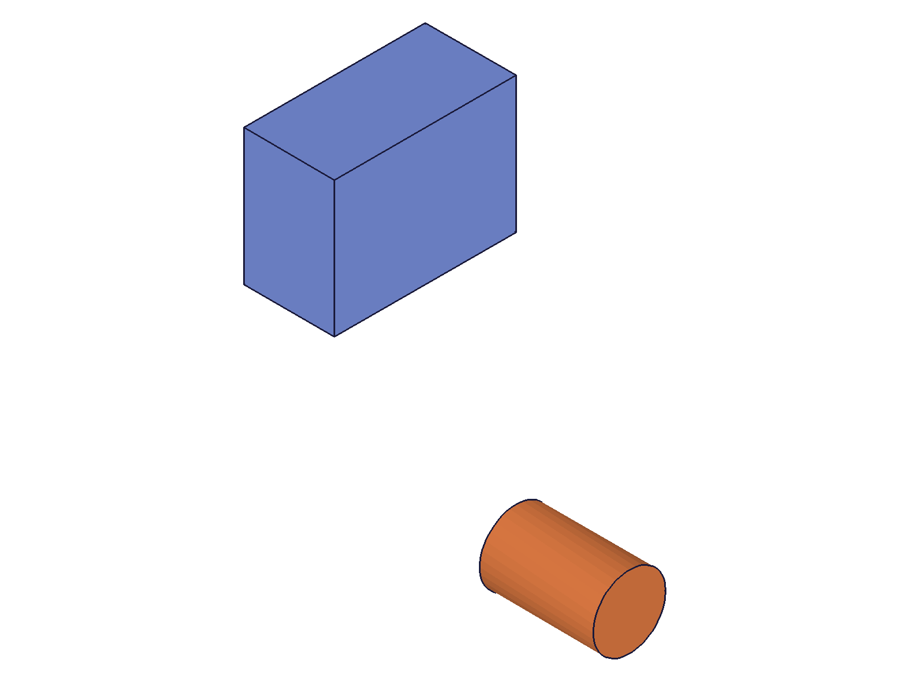

# Training: assembly.group / updateGroup / getGroup

**Date:** 2026-05-08

## Goal

Testing `v1.assembly.group`, `v1.assembly.updateGroup`, and `v1.assembly.getGroup`.

**Methods to cover:**

- `group` — create a group constraint linking multiple instances
- `group` params: id (assembly), name, instanceIds
- `updateGroup` — change name, change instanceIds
- `getGroup` — retrieve group by name
- Array/batch variants of group and updateGroup

**Questions:**

- What does grouping actually DO spatially? Do grouped instances move together?
- Can you group instances that already have other constraints (fastened, revolute)?
- What happens if you pass a single instance? Zero instances?
- Does deleting a grouped instance affect the group?
- Does updateGroup do a true partial update or require all params?
- Can you nest groups or group the same instance in multiple groups?
- What IDs work for getGroup — assembly root only, or also instance/template?

---

## 01 — basic group creation

Script: `scripts/01-basic-group.mjs` — ✅ group creates successfully, returns constraint ID.

|  |
|---|

**Data:** `group({ id: asmId, name: 'TestGroup', instanceIds: [inst1, inst2, inst3] })` → result: 265, maxLevel: 31, no error messages. All three instances visible at their placed positions (box at origin, cylinder at [80,0,0], sphere at [0,80,0]).

**Learned:** `group` returns a numeric constraint ID. maxLevel 31 (info) on success. Requires `id` (assembly root), `instanceIds` (array of instance IDs), and optional `name`.

---

## 02 — getGroup

Script: `scripts/02-getGroup.mjs` — ✅ getGroup returns full constraint data; error handling matches gear pattern.

**Data:**
- Success: `getGroup({ id: asmId, name: 'MyGroup' })` → `{ id: 178, instanceIds: [170, 172], name: "MyGroup" }`, maxLevel 31
- Bad name: result null, maxLevel 51, error "couldn't be found a constraint with name..."
- Empty name: result null, maxLevel 51
- Instance ID as `id`: result null, maxLevel 51, "not a Assembly"
- Template ID as `id`: result null, maxLevel 51, "not a Assembly"

**Learned:** getGroup only works with assembly root ID. Returns `{ id, instanceIds, name }`. Error behavior identical to getGear pattern.

📌 LLM doc: getGroup requires assembly root ID; instance/template IDs fail with "not a Assembly".

---

## 03 — updateGroup

Script: `scripts/03-updateGroup.mjs` — ✅ true partial update, rename works, wrong ID fails.

**Data:**
- `updateGroup({ id: groupId, instanceIds: [inst1, inst3] })` → result: 241, maxLevel 31. getGroup confirms instanceIds changed from [231, 233] to [231, 235], name preserved as "G1".
- `updateGroup({ id: groupId, name: 'RenamedGroup' })` → result: 241. Old name unfindable, new name works. instanceIds preserved.
- `updateGroup({ id: groupId, name: 'FinalName' })` — name-only update, instanceIds still [231, 235]. True partial update confirmed.
- `updateGroup({ id: asmId, ... })` → result null, maxLevel 51, error code 1007 "not a constraint or relation".

**Learned:** updateGroup does true partial update — unspecified params are preserved. `id` must be the group constraint ID, not assembly ID.

📌 LLM doc: updateGroup is true partial update. ID must be group ID, not assembly ID (error 1007).

---

## 04 — spatial behavior (initial)

Script: `scripts/04-spatial-behavior.mjs` — ⚠️ transformInstance failed for unrelated reason (needs 4x4 matrix, not [origin, xDir, yDir]).

**Data:**
- COG before and after grouping: identical for both instances. Grouping alone does NOT reposition anything.
- `transformInstance` returned maxLevel 51 — error "not a 4x4 matrix". This is an API format issue, not group-related.

**Learned:** Grouping does not change instance positions. transformInstance requires 4x4 matrix format. Inconclusive on whether group affects movement — retested in script 06 and 10.

---

## 05 — edge cases

Script: `scripts/05-edge-cases.mjs` — ✅ comprehensive edge case coverage.

**Data:**
- Single instance group: succeeds (ID 178, maxLevel 31)
- Empty instanceIds `[]`: returns an ID (182) BUT maxLevel **61 (FATAL)**, message "No instances were provided for the Group constraint". Creates a degenerate group.
- Duplicate instance: succeeds! getGroup returns `{ instanceIds: [170, 170, 172] }` — duplicates preserved, not deduplicated.
- Same instance in multiple groups: succeeds (ID 192, maxLevel 31). No exclusivity.
- Bad instance ID (99999): fails, maxLevel 51, error code 1006 "invalid id!"
- Missing instanceIds param: fails, maxLevel 51, error code 1004 "must be provided"

**Learned:** Groups are permissive — single instance, duplicates, overlapping groups all allowed. Empty array is degenerate (FATAL but still creates). Missing param or bad ID correctly rejected.

📌 LLM doc: empty instanceIds creates degenerate group at FATAL level. Duplicates not deduplicated. Overlapping groups allowed.

---

## 06 — transform vs materialize

Script: `scripts/06-transform-vs-materialize.mjs` — ✅ key finding: transformInstanceTo works on grouped instance, partner does NOT follow.

**Data:**
- `transformInstance` fails for BOTH grouped AND ungrouped instances (error: "not a 4x4 matrix"). Not group-related.
- `transformInstanceTo({ id: inst2, transformation: [[100, 50, 0], ...] })` → maxLevel 31 (success). inst2 moved.
- Post-move COGs: inst1 [20, 15, 10] (unmoved), inst2 [100, 50, 12.5] (moved to new transform), inst3 [20, 75, 10] (unmoved).

**Learned:** Moving a grouped instance with transformInstanceTo does NOT cause its group partners to follow. Group is NOT a kinematic coupling.

📌 LLM doc: group is organizational metadata, not a kinematic constraint. Moving one grouped instance does not move others.

---

## 07 — group with constraints

Script: `scripts/07-group-with-constraints.mjs` — ✅ grouping works on instances with existing constraints.

|  |  |
|---|---|

**Data:** inst2 (arm) has fastened constraint to inst1 (base). Grouping inst2 + inst3 succeeds (ID 364, maxLevel 31). COGs match expected positions: base [40, 30, 5], arm [25, 7.5, 19] (zOffset=15), pin [60, 0, 10].

**Learned:** Groups do not conflict with other constraints. Instances with fastened/revolute/etc. can be freely grouped.

---

## 08 — default name and batch

Script: `scripts/08-default-name-and-batch.mjs` — ✅ default name is "Group", all batch operations work.

**Data:**
- Default name: `group({ id: asmId, instanceIds: [...] })` → name is "Group"
- Batch create: `group([{...}, {...}])` → result `[121, 125]`, maxLevel 31
- Batch update: `updateGroup([{...}, {...}])` → result `[121, 125]`, maxLevel 31. Rename and instanceIds changes applied independently.
- Batch getGroup: `getGroup([{...}, {...}])` → result is array of group objects

**Learned:** All three APIs support array/batch variant. Default name is "Group" per docs.

📌 LLM doc: All three methods support batch (array) variant. Default name is "Group".

---

## 09 — delete instance from group

Script: `scripts/09-delete-instance-from-group.mjs` — ✅ deleted instances auto-removed from group; deleting all instances removes the group.

**Data:**
- Before: `instanceIds: [105, 107, 109]`
- After deleting inst2 (107): `instanceIds: [105, 109]` — auto-pruned
- After deleting all remaining: `getGroup` returns null, maxLevel 51 — group is gone

**Learned:** Deleting an instance automatically removes it from any groups it belongs to. When all grouped instances are deleted, the group constraint itself is deleted (or becomes unfindable).

📌 LLM doc: deleting instances auto-prunes them from groups. Deleting all members removes the group.

---

## 10 — spatial independence confirmation

Script: `scripts/10-group-spatial-independence.mjs` — ✅ definitive proof that group is organizational, not kinematic.

|  |  |
|---|---|

**Data:**
- `transformInstanceTo(inst1, [[0, 80, 0], ...])` succeeded (maxLevel 31)
- inst1 COG after: [20, 95, 10] ✓ (origin [0,80,0] + local COG [20,15,10])
- inst2 COG after: [60, ~0, 12.5] ✓ (unchanged)
- Snapshot confirms: box moved top-left, cylinder stayed bottom-right

**Learned:** Moving one grouped instance does NOT move the other. Confirmed with COG measurement + visual snapshot. Group is purely organizational metadata.

📌 LLM doc: Group is organizational (metadata tag for "these instances belong together"), NOT kinematic (does not constrain motion or link positions).
