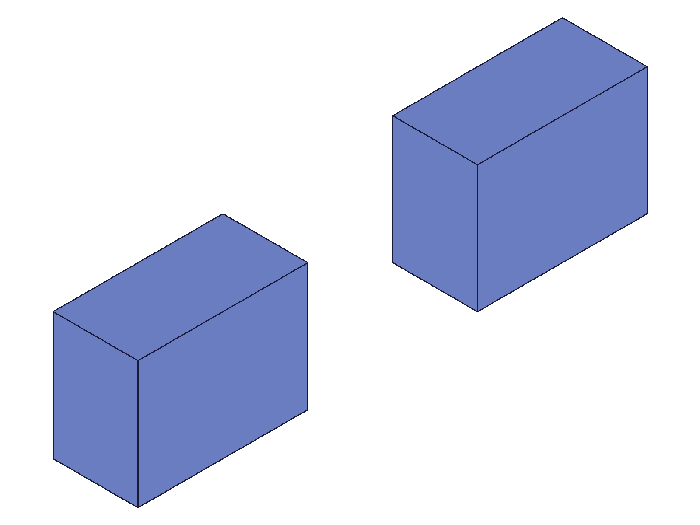

# Training: assembly.deleteConstraint

**Date:** 2026-05-08

## Goal

Testing `v1.assembly.deleteConstraint` — deleting constraints and relations from assemblies.

**Methods to cover:**

- `deleteConstraint` — single constraint deletion via `ids` array
- `deleteConstraint` — batch deletion (multiple IDs in one call)
- Deletion of different constraint types: fastenedOrigin, fastened, revolute, gear, group
- Deletion of non-existent or invalid IDs

**Questions:**

- Does deleting a constraint cause the constrained instance to snap back to its original position or stay put?
- What happens when you delete a fastenedOrigin (grounding constraint) — does the instance become free-floating?
- Can you delete multiple constraint types in a single call?
- What error codes / messages for invalid IDs (non-existent, wrong type like instance ID)?
- After deletion, is the constraint ID truly gone? (re-query with getFastened/getRevolute returns null?)
- Does deleting a constraint that other constraints depend on (e.g., grounding) cause cascading failures?
- What does the return value look like? (VOID per docs)

---

## 01 — basic delete of a fastened constraint

Script: `scripts/01-basic-delete.mjs` — ✅ basic deletion works.

- `deleteConstraint({ ids: [fId] })` → `result: null`, `maxLevel: 31` (info, no error)
- Messages array is empty on success
- `getFastened({ id: asmId, name: 'Joint' })` after delete → `result: null, maxLevel: 51` with error: "There couldn't be found a constraint with name 'Joint'"

**Data:** See `files/01-basic-delete-delete-response.json` and `files/01-basic-delete-get-after-delete.json`.

**📌 LLM doc:** Return value is VOID (null), maxLevel 31. Constraint is truly deleted — get-query returns null with error.

## 02 — position after delete (spatial verification)

Script: `scripts/02-position-after-delete.mjs` — ✅ instance stays at constraint-solved position.

|  |  |
|---|---|

**Data:** `calculateMassProperties({ id: inst2 })` — COG before delete: `{x:100, y:15, z:10}`, COG after delete: `{x:100, y:15, z:10}`. Unchanged. Box is 40x30x20 at xOffset=80, local COG is (20,15,10), world COG = (100,15,10). See `files/02-position-after-delete-before-delete.json` and `files/02-position-after-delete-after-delete.json`.

**Learned:** Deleting a constraint does NOT snap the instance back. It stays at its last solver-computed position. The instance becomes unconstrained but its transform is preserved.
**📌 LLM doc:** Instance position preserved after constraint deletion.

## 03 — batch delete of mixed constraint types

Script: `scripts/03-batch-mixed-types.mjs` — ✅ batch deletion of different types works.

- `deleteConstraint({ ids: [fastId, revId] })` → `result: null, maxLevel: 31`
- Both `getFastened('FastJoint')` and `getRevolute('RevJoint')` return null after deletion
- The undeleted `fastenedOrigin('Ground')` still exists

**Data:** See `files/03-batch-mixed-types-batch-delete-response.json`.

**Learned:** Single call can delete a mix of constraint types (fastened + revolute). Undeleted constraints are unaffected.
**📌 LLM doc:** Batch deletion supports mixed constraint types.

## 04 — error cases

Script: `scripts/04-error-cases.mjs` — ✅ comprehensive error handling.

| Test | Input | maxLevel | Error Code | Error Message |
|---|---|---|---|---|
| Non-existent ID (99999) | `ids: [99999]` | 51 | 1006 | "An element of parameter 'ids' has an invalid id!" |
| Instance ID | `ids: [inst1]` | 51 | 1001 | "The parameter 'ids' has a wrong id type! Provide only following id types: ['constraint','relation']" |
| Assembly root ID | `ids: [asmId]` | 51 | 1001 | Same wrong-type error |
| Template ID | `ids: [tpl]` | 51 | 1001 | Same wrong-type error |
| Empty array | `ids: []` | 31 | — | No error, no-op |
| Double delete | `ids: [deletedFId]` | 51 | 1006 | "invalid id!" (already gone) |
| Mixed valid+invalid | `ids: [foId, 99999]` | 51 | 1006 | Error on invalid ID |

**Data:** See `files/04-error-cases-test*.json`.

**Key finding:** Empty array is a silent no-op (maxLevel 31). Double delete after prior successful delete → same error as non-existent ID.
**📌 LLM doc:** Document error codes: 1006 (invalid ID), 1001 (wrong type), empty array is no-op.

## 05 — atomicity and grounding delete

Script: `scripts/05-atomicity-and-grounding.mjs` — ✅ critical finding: **atomic semantics**.

**Atomicity test:** `deleteConstraint({ ids: [validF1, 99999] })` → maxLevel 51 error. Then checked: `getFastened('Joint1')` → **still exists** (maxLevel 31). The valid constraint was NOT deleted despite appearing first in the array.

**Grounding delete test:** `deleteConstraint({ ids: [foId] })` → maxLevel 31 (success). inst1 COG before: `{x:20, y:15, z:10}`, after: `{x:20, y:15, z:10}`. Unchanged. Deleting the fastenedOrigin does not move the instance.

**Data:** See `files/05-atomicity-and-grounding-atomicity.json` and `files/05-atomicity-and-grounding-grounding-delete.json`.

**Learned:**
1. The call is **atomic**: if ANY id in the array is invalid, NOTHING is deleted. All-or-nothing.
2. Deleting a grounding constraint (fastenedOrigin) does not move the grounded instance.
**📌 LLM doc:** Atomic semantics (critical). Grounding delete is non-destructive to position.

## 07 — delete gear relation

Script: `scripts/07-delete-relations-fixed.mjs` — ✅ gear deletion works.

- Gear created (ID 317) linking two revolute constraints
- `deleteConstraint({ ids: [gearId] })` → maxLevel 31
- `getGear('GearRel')` after → null (gone)
- Both underlying revolute constraints still exist

**Learned:** Deleting a gear relation does NOT delete the underlying revolute constraints. Only the relation linkage is removed.
**📌 LLM doc:** Relation deletion preserves underlying constraints.

## 08 — delete group relation

Script: `scripts/08-delete-group.mjs` — ✅ group deletion works.

- Group created (ID 113) with instanceIds [105, 107]
- `deleteConstraint({ ids: [groupId] })` → maxLevel 31
- `getGroup('TestGroup')` after → null (gone)
- `getInstance({ ownerId: asmId })` → [105, 107] (both instances still exist)

**Learned:** Deleting a group does NOT delete the grouped instances. Only the organizational metadata is removed.
**📌 LLM doc:** Group deletion preserves instances.

---

## Coverage Checklist

- [x] API called successfully (scripts 01, 02)
- [x] Required parameter `ids` tested (all scripts)
- [x] Batch deletion exercised — mixed constraint types in one call (script 03)
- [x] Different constraint types: fastenedOrigin (05), fastened (01, 02), revolute (03)
- [x] Different relation types: gear (07), group (08)
- [x] Error cases: non-existent ID, wrong type, empty array, double delete (04)
- [x] Atomicity verified: mixed valid+invalid → nothing deleted (04, 05)
- [x] Instance position preserved after delete — verified with COG measurement (02, 05)
- [x] Underlying constraints preserved when deleting gear relation (07)
- [x] Underlying instances preserved when deleting group (08)
- [x] All goal questions answered with named scripts and numeric evidence
