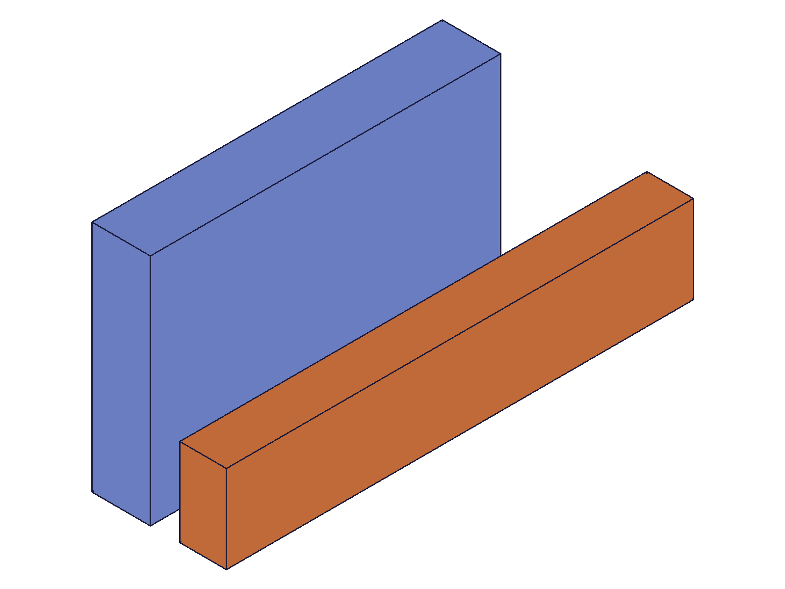
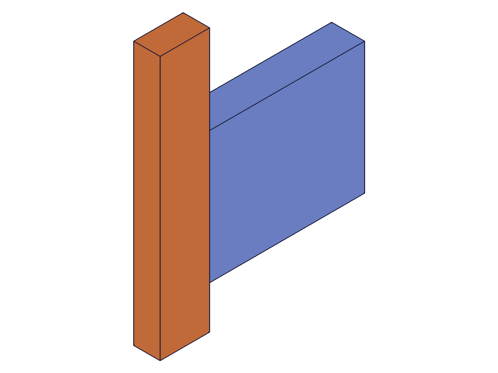

# Training: assembly.update3DConstraintValue

**Date:** 2026-05-08

## Goal

Testing `v1.assembly.update3DConstraintValue` — the generic API for updating constraint offset/rotation values by name.

**Methods to cover:**

- `update3DConstraintValue` — names: X_OFFSET, Y_OFFSET, Z_OFFSET, Z_ROTATION
- Numeric values vs expression strings (e.g., `'45deg'`)
- Array form (batch updates on multiple constraints)

**Questions:**

- Which constraint types accept which value names?
- Does it actually reposition instances? (verified with mass properties)
- Can it update fastenedOrigin offsets/rotations?
- Can it update fastened offsets/rotations?
- Can it update revolute zOffset? What about revolute Z_ROTATION?
- Can it update cylindrical constraint values?
- Does X_ROTATION / Y_ROTATION work (not listed in docs, but fastened/fastenedOrigin have these)?
- What errors for invalid name strings?
- What errors for constraint types that don't have a given DOF?
- Does array form work for batch updates?
- Does '45deg' string syntax work for Z_ROTATION?

---

## 01 — fastened X_OFFSET

Script: `scripts/01-fastened-xoffset.mjs` — ⚠️ API returns maxLevel=31 (success) but is a silent no-op on fastened constraints.

**Data:** update3DConstraintValue returned null, maxLevel=31, no messages. COG before: (65, 10, 7.5), COG after: (65, 10, 7.5) — unchanged. getFastened still reports xOffset=50 (original value, not 100).

**Learned:** Fastened constraints have no degrees of freedom — all 6 DOFs are locked. `update3DConstraintValue` is a silent no-op on rigid constraints.
**📌 LLM doc:** Document that this API only works on kinematic DOFs, not on rigid constraint offsets.

---

## 02 — fastenedOrigin all 4 names

Script: `scripts/02-fastenedOrigin-offsets.mjs` — ⚠️ All 4 names (X_OFFSET, Y_OFFSET, Z_OFFSET, Z_ROTATION) are silent no-ops on fastenedOrigin.

**Data:** All 4 calls returned maxLevel=31, no messages. COG unchanged: (40, 15, 10). getFastenedOrigin reports original values: xOffset=20, all others 0.

**Learned:** Same as fastened — fastenedOrigin is a rigid constraint with no free DOFs. The API silently ignores updates to rigid constraints.

---

## 03 — revolute Z_ROTATION (key finding)

Script: `scripts/03-revolute-zrotation.mjs` — ✅ Z_ROTATION works on revolute! Z_OFFSET and X_OFFSET are silent no-ops.

|  |  |
|---|---|

**Data:** Z_ROTATION=1.5708 (90°): inst2 COG moved from (40, 7.5, 19) to (-7.5, 40, 19) — correct 90° CCW rotation around Z. Z_OFFSET=30: COG unchanged (still -7.5, 40, 19). X_OFFSET=50: also unchanged. getRevolute still shows zOffset=15 and zRotationLimits {max: null, min: null} — the current DOF value is NOT reflected in the get* response.

**Learned:** `update3DConstraintValue` sets the **current position within the constraint's degrees of freedom**. Revolute has one DOF: Z rotation. Only Z_ROTATION works. The structural zOffset (joint spacing) cannot be changed via this API. The get* API does NOT report the current DOF value — only structural params.
**📌 LLM doc:** This is the core insight — document DOF-based behavior, not generic offset update.

---

## 04 — cylindrical Z_OFFSET + Z_ROTATION

Script: `scripts/04-cylindrical.mjs` — ✅ Both DOFs work: Z_OFFSET (translation) and Z_ROTATION (rotation).

**Data:** Z_OFFSET=50: COG z moved from 35 to 70 (20+50=70, correct). Z_ROTATION=0.7854 (45°): COG (x,y) changed from (10, 10) to (~0, 14.14) — correct 45° rotation. X_OFFSET=30: no effect.

**Learned:** Cylindrical constraint has 2 DOFs (Z translation + Z rotation). Both controllable via this API.

---

## 05 — slider + planar

Script: `scripts/05-slider-planar.mjs` — ✅ All DOF-matching names work.

**Data:**
- Slider Z_OFFSET=40: COG z moved from 30 to 55 (15+40=55). X_OFFSET: no effect.
- Planar X_OFFSET=60: COG x from 15 to 75. Y_OFFSET=80: COG y from 12.5 to 92.5. Z_ROTATION='45deg': COG changed to (61.8, 99.4) — correct rotation. Z_OFFSET: no effect (not a planar DOF).

**Learned:** Slider has 1 DOF (Z translation). Planar has 3 DOFs (X/Y translation + Z rotation). '45deg' string syntax confirmed working.

---

## 06 — parallel + spherical

Script: `scripts/06-parallel-spherical.mjs` — ✅ Parallel DOFs work. ⚠️ Spherical Z_ROTATION is a no-op (tested with symmetric sphere body).

**Data:**
- Parallel X_OFFSET=50: COG x from 12.5 to 62.5. Y_OFFSET=30: COG y from 10 to 40. Z_ROTATION='90deg': COG changed (rotation confirmed).
- Spherical Z_ROTATION=1.0: COG unchanged. But sphere is symmetric — inconclusive.

**Learned:** Parallel has same 3 DOFs as planar. Spherical needs asymmetric body to verify — tested in script 11.

---

## 07 — invalid names and error cases

Script: `scripts/07-invalid-names.mjs` — ✅ Proper error handling for invalid names and IDs.

**Data:**
- Invalid name "INVALID": maxLevel=51, code 1013, message lists valid values: `["X_OFFSET","Y_OFFSET","Z_OFFSET","Z_ROTATION"]`
- "X_ROTATION": rejected with same 1013 error — **NOT a valid name**
- "Y_ROTATION": rejected with same 1013 error — **NOT a valid name**
- Empty string "": rejected
- **Lowercase "z_rotation": maxLevel=31, no messages — accepted!** (verified it works in script 08)
- Assembly root ID: code 1001, "wrong id type — provide only 'constraint'"
- Instance ID: same 1001 error
- Non-existent ID: code 1006, "invalid id"

**Learned:** Only 4 valid names: X_OFFSET, Y_OFFSET, Z_OFFSET, Z_ROTATION. Case-insensitive. X_ROTATION and Y_ROTATION are NOT supported — this means spherical DOFs (x/y rotation) cannot be controlled via this API.
**📌 LLM doc:** Document the 4-name limitation and case-insensitivity. Document that spherical is NOT controllable.

---

## 08 — array form + lowercase verification

Script: `scripts/08-array-form.mjs` — ✅ Array form works. ✅ Lowercase confirmed working.

**Data:**
- Array: `[{ id: rev1, name: 'Z_ROTATION', value: '90deg' }, { id: rev2, name: 'Z_ROTATION', value: '45deg' }]` — both revolutes updated in one call. arm1 COG from (40, 7.5) to (-7.5, 40) (90° rotation). arm2 COG from (30, 6) to (17, 25.5) (45° rotation). Returns null, maxLevel=31.
- Lowercase `z_rotation: 0` on rev1: COG went from (-7.5, 40) back to (40, 7.5) — reset worked. Changed=true confirmed.

**Learned:** Array form updates multiple constraints in one call. Lowercase names are fully functional (case-insensitive matching).
**📌 LLM doc:** Document array form syntax and case-insensitivity.

---

## 09 — value types and expressions

Script: `scripts/09-values-and-expressions.mjs` — ✅ Multiple value types tested on cylindrical.

**Data:**
- Negative Z_OFFSET=-20: works, COG z from 35 to 0. Instance moved to z=-20.
- Zero Z_OFFSET=0: works, COG z reset to 20.
- '180deg' string: works, COG (10, 7.5) → (-10, -7.5) — correct 180° flip.
- '-45deg' string: works, COG changed as expected for -45° rotation.
- Large Z_OFFSET=1000: works, COG z=1020.
- Same-constraint array (Z_OFFSET=50 + Z_ROTATION='90deg' on same cyl): works, both applied.
- **@expr.DISP string**: REJECTED. maxLevel=51, code 1001: "value has the wrong type — should be (real)". Expression bindings are NOT supported despite docs saying `value: real | expression`.

**Learned:** The `expression` type in the docs means `'Ndeg'` string patterns for rotations, NOT `@expr.` bindings. Negative values, zero values, large values, and negative deg strings all work.
**📌 LLM doc:** Document that @expr is not supported. Document deg string format.

---

## 10 — get* readback after update

Script: `scripts/10-get-value-readback.mjs` — ⚠️ get* APIs do NOT reflect DOF value changes.

**Data:** After update3DConstraintValue on revolute (Z_ROTATION='45deg') and cylindrical (Z_OFFSET=50, Z_ROTATION='30deg'), getRevolute and getCylindrical return IDENTICAL state objects. The structural params (zOffset, zRotationLimits, mates) are unchanged. The current DOF position is NOT stored in the constraint state.

**Learned:** No readback API for the current DOF value. The get* APIs only return structural parameters (mates, limits, name). The DOF value can only be verified through spatial measurements (calculateMassProperties, getGeometryPositions).
**📌 LLM doc:** Document the lack of readback. This is critical for agents that need to verify the current joint position.

---

## 11 — spherical with asymmetric body

Script: `scripts/11-spherical-asymmetric.mjs` — ⚠️ Z_ROTATION confirmed as silent no-op on spherical even with asymmetric body.

**Data:** Used 80x15x8 box instead of sphere. Z_ROTATION='90deg': COG unchanged (40, 7.5, 4). X_OFFSET=50: also unchanged. `zRotChanged: false`.

**Learned:** Spherical constraint DOFs (x/y rotation) are completely inaccessible via update3DConstraintValue. The only rotation name available (Z_ROTATION) has no effect on spherical constraints. This API cannot drive spherical joints at all.

---

## Summary: DOF mapping

| Constraint | DOFs | Working names |
|---|---|---|
| fastened | None (rigid) | None — all 4 are silent no-ops |
| fastenedOrigin | None (rigid) | None — all 4 are silent no-ops |
| revolute | Z rotation | Z_ROTATION |
| cylindrical | Z translation + Z rotation | Z_OFFSET, Z_ROTATION |
| slider | Z translation | Z_OFFSET |
| planar | X/Y translation + Z rotation | X_OFFSET, Y_OFFSET, Z_ROTATION |
| parallel | X/Y translation + Z rotation | X_OFFSET, Y_OFFSET, Z_ROTATION |
| spherical | X/Y rotation | None — Z_ROTATION no-op, X/Y_ROTATION don't exist |

## Coverage checklist

- [x] API called successfully (scripts 03, 04, 05, 06, 08, 09)
- [x] Every required parameter tested (id, name, value)
- [x] All 4 name values tested (X_OFFSET, Y_OFFSET, Z_OFFSET, Z_ROTATION)
- [x] All 8 constraint types tested (fastened, fastenedOrigin, revolute, cylindrical, slider, planar, parallel, spherical)
- [x] Array form tested (script 08)
- [x] Deg string syntax tested ('45deg', '90deg', '180deg', '-45deg')
- [x] Numeric values tested (positive, negative, zero, large)
- [x] @expr binding tested (rejected — script 09)
- [x] Invalid names tested (script 07)
- [x] Invalid IDs tested (script 07)
- [x] Case sensitivity tested (lowercase works — scripts 07, 08)
- [x] Get* readback tested (not reflected — script 10)
- [x] Behavioral claims verified with COG data + visual snapshots
- [x] Every journal Goal question answered by a named script
